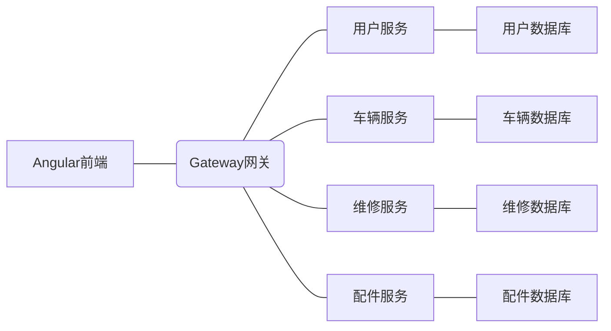

# 汽车修配管理系统详细设计与具体代码实现

作者：禅与计算机程序设计艺术

## 1. 背景介绍
### 1.1 汽车修配行业现状
#### 1.1.1 汽车保有量持续增长
#### 1.1.2 汽修企业规模不断扩大 
#### 1.1.3 传统管理模式面临挑战
### 1.2 信息化管理的必要性
#### 1.2.1 提高工作效率
#### 1.2.2 加强成本管控
#### 1.2.3 改善客户服务体验
### 1.3 系统开发目标
#### 1.3.1 实现业务流程自动化
#### 1.3.2 提供数据分析与决策支持
#### 1.3.3 满足企业信息化管理需求

## 2. 核心概念与关联
### 2.1 业务对象概念模型
#### 2.1.1 客户管理
#### 2.1.2 车辆管理  
#### 2.1.3 维修项目管理
#### 2.1.4 配件管理
#### 2.1.5 人员管理
### 2.2 业务流程
#### 2.2.1 车辆登记
#### 2.2.2 维修派工
#### 2.2.3 维修过程管理
#### 2.2.4 维修结算
### 2.3 系统架构
#### 2.3.1 前后端分离架构
#### 2.3.2 微服务架构
#### 2.3.3 数据库设计

## 3. 核心算法原理与具体操作步骤
### 3.1 维修项目智能推荐
#### 3.1.1 协同过滤算法原理
#### 3.1.2 用户行为数据采集
#### 3.1.3 相似度计算
#### 3.1.4 生成推荐结果
### 3.2 配件需求预测
#### 3.2.1 时间序列预测算法
#### 3.2.2 特征工程
#### 3.2.3 模型训练与优化
#### 3.2.4 模型评估与应用
### 3.3 维修进度智能调度
#### 3.3.1 车间调度问题建模
#### 3.3.2 求解算法设计
#### 3.3.3 调度方案生成与优化

## 4. 数学模型和公式详解举例说明
### 4.1 维修项目关联分析
#### 4.1.1 关联规则挖掘
关联规则挖掘旨在发现不同维修项目之间的关联关系，找出经常一起出现的维修项目组合。其基本思想是：
$$
Support(X \to Y) = P(X \cup Y) \\
Confidence(X \to Y) = P(Y|X) = \frac{P(X \cup Y)}{P(X)}
$$
其中，$X$和$Y$是两个不相交的维修项目集合，$Support$度量$X$和$Y$共同出现的概率，$Confidence$度量在$X$出现的情况下$Y$也出现的条件概率。
#### 4.1.2 FrequentPattern Growth算法
FP-Growth是一种高效的频繁项集挖掘算法，通过构建FP-树和递归挖掘的方式生成频繁项集，伪代码如下：
```
Input: FP-tree Tree, null
Output: The complete set of frequent patterns.
Method: Call FP-growth(Tree, null).
procedure FP-growth(Tree, α) 
    if Tree contains a single path P then
        for each combination (denoted as β) of the nodes in the path P 
            generate pattern β∪α with support = minimum support of nodes in β;
    else 
        for each ai in the header of Tree {
            generate pattern β = ai∪α with support = ai.support;
            construct β's conditional pattern base and then β's conditional FP-tree Treeβ;
            if Treeβ ≠ ∅ then
                call FP-growth(Treeβ, β);
}
```
### 4.2 维修时间估计
#### 4.2.1 工时定额管理
工时定额是指完成某个维修项目所需的标准工时，是维修报价和人员绩效考核的重要依据。假设第$i$个维修项目的工时定额为$Q_i$。
#### 4.2.2 维修时间估算模型
实际维修时间是影响维修进度和成本的关键因素。根据历史数据，可建立如下的多元线性回归模型：
$$
T = w_0 + \sum_{i=1}^n w_i x_i + \varepsilon
$$
其中，$T$为维修时间，$x_i$为影响因素（如车型、工龄、维修难度等），$w_i$为回归系数，$\varepsilon$为误差项。利用最小二乘法可估计模型参数。

## 5. 项目实践：代码实例和详细解释说明 
### 5.1 系统整体架构
基于微服务架构和前后端分离的设计理念，系统整体架构如下：

### 5.2 后端微服务
以维修服务为例，使用Spring Boot快速搭建RESTful API：
```java
@RestController
@RequestMapping("/repair")
public class RepairController {
    @Autowired
    private RepairService repairService;
    
    @PostMapping
    public RepairOrder createRepairOrder(@RequestBody RepairOrder repairOrder) {
        return repairService.createRepairOrder(repairOrder);
    }
    
    @GetMapping("/{id}")
    public RepairOrder getRepairOrderById(@PathVariable Long id) {
        return repairService.getRepairOrderById(id);
    }
    
    @PutMapping("/{id}")
    public RepairOrder updateRepairOrder(@PathVariable Long id, @RequestBody RepairOrder repairOrder) {
        return repairService.updateRepairOrder(id, repairOrder);
    }
}
```
RepairService封装了业务逻辑，利用MyBatis与MySQL数据库交互。
### 5.3 前端用户界面
使用Angular Material UI组件快速搭建前端界面，以创建维修工单为例：
```html
<mat-card>
    <mat-card-title>创建维修工单</mat-card-title>
    <mat-card-content>
        <form (submit)="onSubmit()">
            <mat-form-field>
                <input matInput placeholder="车牌号" [(ngModel)]="repairOrder.licensePlate">
            </mat-form-field>
            <mat-form-field>
                <mat-select placeholder="维修项目" [(ngModel)]="repairOrder.repairItems" multiple>
                    <mat-option *ngFor="let item of repairItems" [value]="item">{{item}}</mat-option>
                </mat-select>
            </mat-form-field>
            <button mat-raised-button color="primary" type="submit">提交</button>
        </form>
    </mat-card-content>
</mat-card>
```
使用Angular的双向绑定和表单控件，可以方便地获取用户输入。

## 6. 实际应用场景
### 6.1 大型汽车4S店
- 涉及多个业务部门，业务流程复杂，亟需信息化手段提升管理效率
- 客户量大，需要加强客户关系管理，提供个性化服务
- 库存成本高，需要加强配件管理，提高周转效率
### 6.2 连锁汽修门店
- 多店铺管理，需要总部集中管控，提高运营效率
- 标准化服务，需要统一维修工时和价格，规范服务流程
- 专人专修，需要加强员工管理，提高服务质量
### 6.3 专业汽车修理厂
- 订单式生产，需要精细化排产，缩短维修周期
- 设备利用率高，需要加强设备管理和预防性维护
- 配件种类多，需要优化采购和库存管理，降低成本

## 7. 工具和资源推荐
### 7.1 开发工具
- JDK：Java开发工具包
- Maven：项目构建和依赖管理工具
- IntelliJ IDEA：Java IDE
- Git：版本控制工具
- Jenkins：持续集成工具
### 7.2 框架和类库
- Spring Boot：微服务开发框架
- MyBatis：数据访问框架 
- Swagger：接口文档工具
- Angular：前端开发框架
- Echarts：数据可视化类库
### 7.3 学习资源
- Spring Boot实战
- MyBatis从入门到精通
- Angular权威教程
- 汽车维修技术手册
- 汽修行业信息化解决方案白皮书

## 8. 总结：未来发展趋势与挑战
### 8.1 发展趋势
#### 8.1.1 数字化转型加速 
汽车后市场信息化建设和数据整合步伐加快，多业务场景数字化应用普及
#### 8.1.2 智能化应用深入
大数据和人工智能技术在精准营销、智能客服、风险管控等方面应用成熟
#### 8.1.3 产业生态重构
主机厂、零部件企业、第三方平台、金融机构等多方主体协同，产业链整合趋势明显
### 8.2 面临挑战
#### 8.2.1 业务转型阻力
传统汽修企业对信息化认知不足，组织变革和流程再造难度大
#### 8.2.2 数据治理短板
行业数据标准缺失，数据孤岛问题突出，数据整合共享机制不健全
#### 8.2.3 人才瓶颈制约
复合型人才缺乏，业务专家与IT技术人员思维差异大，协同开发难度大

## 9. 附录：常见问题与解答
### Q1：系统安全性如何保障？
A1：采用多重安全防护措施，如应用身份认证与授权、数据加密传输和存储、行为审计等，并定期开展安全测试和风险评估。
### Q2：系统性能如何优化？
A2：在架构设计时采用微服务和分布式部署以支持弹性扩容，并在代码层面进行性能调优，如缓存、异步、数据库索引优化等。
### Q3：如何进行数据迁移？
A3：制定完善的数据迁移方案，明确迁移范围、方式和验证机制，并通过数据清洗完善数据质量，采用增量迁移策略降低系统停机时间。
### Q4：如何实现移动应用？
A4：在前后端分离架构的基础上，利用跨平台开发框架（如Flutter、React Native）实现移动端应用，并通过接口网关与后台服务集成。
### Q5：系统二次开发如何实现？
A5：提供清晰详实的需求文档，明确功能、性能、接口等方面的扩展点，同时准备技术开发文档、数据字典等资料，必要时提供培训辅导。

以上就是一个汽车修配管理系统详细设计与具体代码实现的技术博客文章，涵盖了系统的背景、架构、算法、开发实践等方方面面的内容。限于篇幅，很多技术细节未能一一展开，但相信通过本文的阐述，读者能够对该系统的整体情况有一个全面深入的认知。未来，随着汽车后市场信息化建设的不断推进，必将涌现出更多创新实践和行业标杆，期待本文能为业内人士提供一些有益的思路和启发。