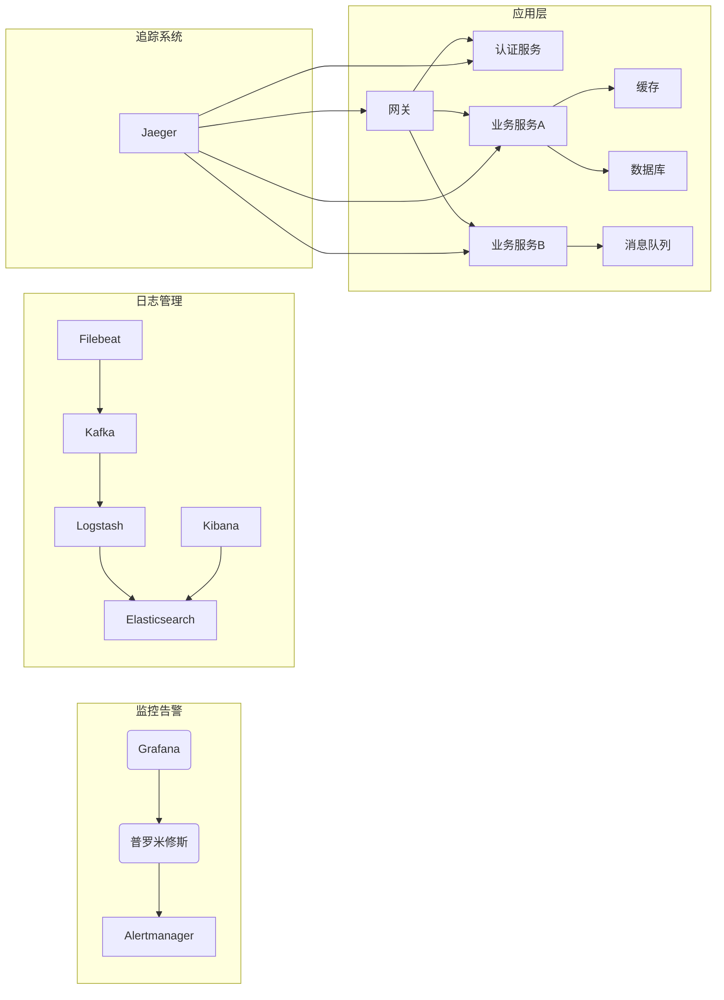

# "AI自动化监控的最佳实践"

作者：禅与计算机程序设计艺术

## 1.背景介绍

### 1.1 传统监控的局限性
#### 1.1.1 人工排查效率低下
#### 1.1.2 告警风暴信噪比低 
#### 1.1.3 静态阈值缺乏弹性

### 1.2 智能监控的必要性
#### 1.2.1 云原生时代系统的复杂性
#### 1.2.2 DevOps需要自动化
#### 1.2.3 AIOps是大势所趋

### 1.3 AI在智能监控中的应用
#### 1.3.1 异常检测
#### 1.3.2 根因分析
#### 1.3.3 容量预测

## 2.核心概念与联系

### 2.1 AIOps
#### 2.1.1 定义与内涵
AIOps（Artificial Intelligence for IT Operations）是指将人工智能应用于IT运维的实践，通过机器学习等技术从海量的监控数据中自动发现洞察，实现智能化的异常检测、根因分析、容量规划等。它是运维自动化与智能化的关键支撑。

#### 2.1.2 发展历程
2017年，Gartner首次提出AIOps概念，此后逐渐成为业界热点。从最初的异常检测，到智能决策、自动修复，AIOps正朝着更高阶的目标演进。

### 2.2 可观察性
#### 2.2.1 三大支柱
可观察性的三大支柱是日志、指标和分布式追踪。日志提供详尽的事件记录，指标提供系统性能视图，而分布式追踪揭示服务间的调用链路与依赖。

#### 2.2.2 可观察性与监控
可观察性是一种系统特性，使其内部状态可以通过外部输出推断。监控则是实现可观察性的具体手段。高度可观察的系统更容易实现自动化智能监控。

### 2.3 数据管道 
#### 2.3.1 数据采集
通过Agent、Probe、Tracing SDK等采集系统的日志、指标、Trace等可观测数据。需关注数据的标准化、语义化，为智能分析奠定基础。

#### 2.3.2 数据处理
将采集的数据经由消息队列、数据总线等载入流处理引擎，进行清洗、转换、富化、关联，并最终落入时序数据库、日志库等。

#### 2.3.3 数据分析
将处理后的数据输入机器学习Pipeline，进行特征工程、模型训练、知识萃取，实现异常检测等AIOps能力，并将洞察反馈给监控系统。

## 3.核心算法原理具体操作步骤

### 3.1 时间序列异常检测
#### 3.1.1 STL分解
将时间序列分解为季节性(Seasonality)、趋势(Trend)和残差(Residual)三个部分，可更好地刻画序列的内在规律。

```python
from statsmodels.tsa.seasonal import STL
stl = STL(ts_data, period=1440)
res = stl.fit()
seasonal, trend, resid = res.seasonal, res.trend, res.resid
```

#### 3.1.2 StatisticalThreshold
在残差上设置阈值，超出阈值即判定为异常。阈值通常根据残差的均值和标准差动态计算。

```python
def statistical_threshold(resid, num_sigma=3):
    mean, std = np.mean(resid), np.std(resid)
    upper, lower = mean + num_sigma * std, mean - num_sigma * std
    anomalies = (resid > upper) | (resid < lower)
    return anomalies
```

#### 3.1.3 Clustering
将多指标的残差构成特征向量，运用无监督聚类发现异常簇。常用DBSCAN、K-Means等。 

```python
from sklearn.cluster import DBSCAN
model = DBSCAN(eps=0.5, min_samples=5)
clusters = model.fit_predict(features)
```

### 3.2 日志异常检测
#### 3.2.1 日志解析
通过规则或NLP将非结构化日志解析为结构化特征，常用Drain、LogParse等，提取如Event、Level、Timestamp等关键字段。

```python
from logparser import Drain
log_format = '<Date> <Time> <Level> <Component>: <Content>'  
parser = Drain.LogParser(log_format)
event_dict = parser.parse(log_line) 
```

#### 3.2.2 日志嵌入
将日志事件、参数等转换为向量表示，可通过One-hot、Word2vec等将离散文本映射到连续空间。

```python
from gensim.models import Word2Vec
corpus = [['MMM', 'ALA34', 'FAIL'], ['FFF', 'BBB', 'SUCCESS']]
model = Word2Vec(corpus, vector_size=50, min_count=1)  
event_vec = model.wv['ALA34']
```

#### 3.2.3 深度学习
基于RNN、Transformer等深度学习模型，训练日志异常检测模型。模型可自动学习复杂的日志模式与依赖关系。

```python
import tensorflow as tf
model = tf.keras.Sequential([
    tf.keras.layers.Embedding(input_dim=n_words, output_dim=50),
    tf.keras.layers.LSTM(64),
    tf.keras.layers.Dense(1, activation='sigmoid')
])
model.compile(optimizer='adam', loss='binary_crossentropy', metrics=['accuracy'])
model.fit(X_train, y_train, epochs=5, batch_size=64)
```

### 3.3 根因定位
#### 3.3.1 相关分析
计算异常指标间的相关系数，高度相关的指标更可能同根同源。但相关不一定因果。

```python
import pandas as pd
corr_matrix = anomaly_df.corr()
pd.plotting.scatter_matrix(anomaly_df, diagonal='kde')
```

#### 3.3.2 因果推断
构建指标间的因果图，基于条件独立性检验等统计学方法，判断节点间的因果依赖。

```python
from causalnex.structure.notears import from_pandas
from causalnex.plots import plot_structure
sm = from_pandas(anomaly_df, tabu_parent_nodes=['event'])
plot_structure(sm)
```

#### 3.3.3 知识图谱
将系统拓扑、服务调用、资源依赖等信息构建为知识图谱，异常节点的共同上游节点往往是根因。

```python
from pyTigerGraph import TigerGraphConnection
conn = TigerGraphConnection(host="http://localhost", graphname="system")
seeds = conn.runInstalledQuery("abnormalComponents")[0]["result"]
result = conn.runInstalledQuery("findRCA", params={"seeds": seeds})
```

## 4.数学模型和公式详细讲解举例说明

### 4.1 STL分解的原理
STL分解假设时间序列可表示为：
$$y_t = \tau_t + s_t + \epsilon_t$$

其中$\tau_t$是趋势分量，反映序列长期变化趋势；$s_t$是季节分量，反映周期性规律；$\epsilon_t$是残差分量，反映随机波动。三个分量可通过Loess拟合迭代估计。

以某CPU使用率序列为例：
```python
from statsmodels.tsa.seasonal import STL
cpu_stl = STL(cpu_data, period=1440)
res = cpu_stl.fit()
res.plot()
plt.show()
```


分解后的残差更能反映序列的异常程度，异常检测的效果更好。

### 4.2 DBSCAN聚类算法

DBSCAN基于密度聚类思想，只考虑紧邻样本的密度，因此擅长发现任意形状的聚类。核心概念：
- $\epsilon$-邻域：样本$p$的$\epsilon$-邻域包含与$p$距离不大于$\epsilon$的所有样本
- 核心对象：若$p$的$\epsilon$-邻域至少包含$MinPts$个样本，则$p$为一个核心对象
- 直接密度可达：若$q$位于$p$的$\epsilon$-邻域内，且$p$是核心对象，则$q$由$p$直接密度可达
- 密度可达：存在样本链$p_1, p_2, ..., p_n$, $p_{i+1}$由$p_i$直接密度可达，则$p_n$由$p_1$密度可达
- 密度相连：存在$o$使得$p$和$q$均由$o$密度可达，则$p$和$q$密度相连

算法流程：
1. 标记所有样本为unvisited
2. 对每个unvisited的样本p：
   - 标记p为visited
   - 若p为核心对象：
     - 找出所有由p密度可达的样本，形成一个簇
     - 簇中所有样本标记为visited
3. unvisited的样本标记为噪音

以某系统KPI异常为例：

```python
from sklearn.cluster import DBSCAN
from sklearn.preprocessing import StandardScaler

X = anomaly_df[['cpu_usage', 'memory_usage', 'disk_io']] 
X = StandardScaler().fit_transform(X)

db = DBSCAN(eps=0.5, min_samples=5).fit(X)
labels = db.labels_

plt.scatter(X[:, 0], X[:, 1], c=labels, cmap='coolwarm')
plt.title('DBSCAN Clustering')
plt.show()
```


DBSCAN能自动发现不规则形状的异常簇，且对孤立的异常点不敏感。


### 4.3 因果推断的数理基础

因果推断常基于Judea Pearl的因果理论，核心概念包括：
- 有向无环图DAG：节点表示变量，箭头表示因果依赖
- do算子：$P(Y|do(X))$表示强制干预$X$对$Y$的影响
- 后门准则：对于因果图$X\rightarrow Y\leftarrow Z\rightarrow X$，调整集$Z$阻断了$X\leftarrow Z\rightarrow Y$后门路径,则:
$$P(Y|do(X))=\sum_zP(Y|X,Z=z)P(Z=z)$$

以检测请求延迟与CPU使用率的因果关系为例：

```python
from causalnex.structure.notears import from_pandas
from causalnex.estimation import InvertibleStructuralCausalModel
from causalnex.evaluation import plot_agnostic_causal_effect

data = pd.DataFrame({'cpu': cpu_data, 'latency': latency_data})
sm = from_pandas(data, tabu_parent_nodes=['latency'])

perf_iscm = InvertibleStructuralCausalModel(sm.copy(), 
                                           dist_type='ecdf')
perf_iscm.fit(data)

plot_agnostic_causal_effect(perf_iscm,
                           data,
                           treatment='cpu',
                           outcome='latency',
                           plot_treatment=True)
```


由图可以看出，CPU使用率升高会导致请求延迟的增大，但反向的因果影响很小。这有助于缩小根因范围。

## 4.项目实践：代码实例和详细解释说明

下面以一个Web服务管理系统为例，演示如何应用上述AI技术实现智能监控。系统架构如下：



### 数据采集
- 通过Node exporter收集主机指标,并配置Prometheus抓取:
```yaml
- job_name: 'node'
  static_configs:
    - targets: ['node_exporter:9100']
```

- 通过Micrometer收集服务JVM指标,配置Spring Boot应用:
```xml
<dependency>
  <groupId>io.micrometer</groupId>
  <artifactId>micrometer-registry-prometheus</artifactId>
</dependency>
```

- 通过OpenTelemetry Java Agent自动追踪分布式调用链:
```bash
java -javaagent:./opentelemetry-javaagent.jar \
     -Dotel.traces.exporter=jaeger \
     -jar myapp.jar
```

- 通过Filebeat采集服务日志,转发至Kafka:
```yaml
filebeat.inputs:
- type: log
  paths:
    - /var/log/myapp/*.log
output.kafka:
  hosts: ["localhost:9092"]
  topic: myapp_logs 
```

### 数据处理
- 使用Flink消费Kafka中的指标数据,分组聚合