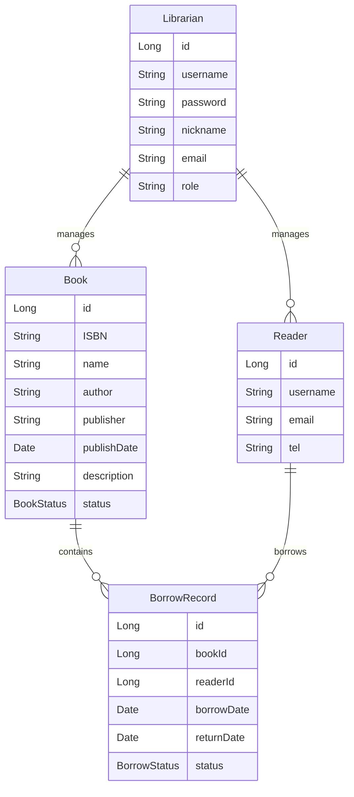
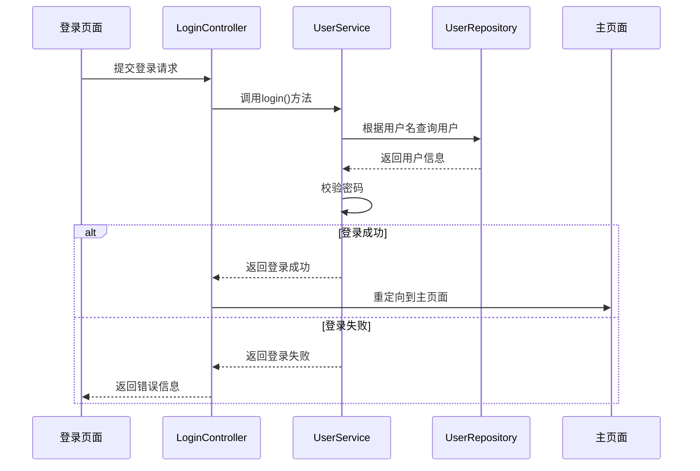

# 图书馆管理系统详细设计与具体代码实现

作者：禅与计算机程序设计艺术

## 1. 背景介绍

### 1.1 图书馆管理系统的意义
图书馆是知识的宝库,也是人类文明的重要标志之一。随着信息技术的飞速发展,传统的图书馆管理模式已经无法满足现代图书馆的管理需求。因此,开发一套功能完善、易于操作的图书馆管理系统就显得尤为重要。

### 1.2 图书馆管理系统的主要功能
一个完善的图书馆管理系统应该具备以下主要功能:

1. 图书管理:包括图书的录入、编目、检索、借阅、归还、销毁等
2. 读者管理:包括读者的注册、查询、权限管理等  
3. 借阅管理:包括借阅记录的生成、查询、超期提醒等
4. 统计分析:包括图书借阅量统计、读者借阅习惯分析等
5. 系统管理:包括用户管理、权限管理、系统日志管理等

### 1.3 本文的主要内容
本文将详细介绍一个图书馆管理系统的设计与实现过程,重点包括:

1. 需求分析与系统架构设计
2. 数据库设计
3. 关键业务流程设计
4. 系统实现与代码解读  
5. 系统测试与部署上线

通过学习本文,读者可以掌握开发一个完整的图书馆管理系统所需的知识和技能。

## 2. 核心概念与关系

### 2.1 实体与实体关系
在图书馆管理系统中,主要涉及以下几个核心实体:

- Book(图书):代表图书馆藏书的实体
- Reader(读者):代表图书馆读者的实体 
- BorrowRecord(借阅记录):代表每一次借阅的实体
- Librarian(图书管理员):代表系统的管理用户实体

这些实体之间存在着一定的关系,主要包括:

- Book 与 BorrowRecord 是一对多的关系(一本书可以有多条借阅记录)
- Reader 与 BorrowRecord 是一对多的关系(一位读者可以有多条借阅记录)
- Librarian 与 Book, Reader 是一对多的关系(一个管理员可以管理多本书和多个读者)

### 2.2 状态与状态转换
在整个系统中,图书和借阅记录有比较重要的状态概念和状态转换流程。

图书的主要状态包括:
- Available(可借):图书当前在馆可借
- Borrowed(已借出):图书已被读者借走
- Damaged(损坏):图书被损毁不可外借
- Lost(丢失):图书丢失

图书状态转换的触发条件:
- Available → Borrowed:读者借书
- Borrowed → Available:读者还书
- Available | Borrowed → Damaged:图书被损毁
- Available | Borrowed → Lost:图书丢失

借阅记录的主要状态包括:
- Borrowed(借阅中):读者已借书,尚未归还
- Returned(已归还):读者已归还图书
- Overdue(逾期):读者借阅后超过规定期限尚未归还

借阅记录状态的触发条件:
- Borrowed → Returned:读者还书
- Borrowed → Overdue:借阅时间超期

管理员可以通过相应的业务操作触发以上状态转换。

### 2.3 RBAC权限模型
系统采用RBAC(Role Based Access Control,基于角色的访问控制)权限模型。将用户按照角色进行分类,给不同角色赋予不同的权限,从而实现权限管理。

系统主要有以下角色:
- SuperAdmin:系统超级管理员,拥有所有权限
- NormalAdmin:普通管理员,拥有除了用户管理以外的权限
- Borrower:读者,只能进行图书查询、借阅等操作

不同角色拥有不同的功能操作权限,具体如下:

| 权限点 | SuperAdmin | NormalAdmin | Borrower | 
|:----:|:--------:|:---------:|:-------:|
| 图书录入 |    ✓     |     ✓    |         |
| 图书编目 |    ✓     |     ✓    |         |  
| 图书删除 |    ✓     |          |         |
| 图书查询 |    ✓     |     ✓    |    ✓    |
| 图书借阅 |    ✓     |     ✓    |    ✓    |
| 图书归还 |    ✓     |     ✓    |         |
| 借阅记录查询 |    ✓     |     ✓    |    ✓    |
| 借阅到期提醒 |    ✓     |     ✓    |         |
| 借阅量统计 |    ✓     |     ✓    |         |
| 读者注册 |    ✓     |     ✓    |         |
| 读者查询 |    ✓     |     ✓    |         |
| 读者信息修改 |    ✓     |     ✓    |         |
| 读者删除 |    ✓     |          |         |
| 用户管理 |    ✓     |          |         |   

## 3. 系统架构与关键技术

### 3.1 系统架构

系统采用经典的三层架构:表现层、业务逻辑层、数据访问层。

#### 3.1.1 表现层
表现层采用B/S架构,利用流行的Web框架如Spring MVC实现,提供用户界面和交互功能。表现层将用户请求传递给业务逻辑层处理,并将结果返回给用户。

#### 3.1.2 业务逻辑层
业务逻辑层是系统的核心,负责实现系统的各项业务功能。通过事务脚本模式,将不同的业务逻辑封装成一个个Service。

业务逻辑层引入Spring框架进行组件管理。使用AOP技术封装系统级服务,如日志、权限拦截、异常处理等。

#### 3.1.3 数据访问层
数据访问层负责与数据库进行交互,可基于ORM框架如MyBatis或Hibernate实现。将业务实体与数据库表进行映射,简化数据库访问。同时使用连接池进行数据库连接的管理,提高系统性能。

### 3.2 关键技术

#### 3.2.1 Spring Boot
Spring Boot是当前最流行的Java Web开发框架,集成了Web开发的各个组件,开箱即用,大大简化了系统开发。项目使用Spring Boot进行快速搭建。

#### 3.2.2 Spring Security
项目使用Spring Security框架实现身份认证和权限管理。Spring Security提供了完善的安全机制,支持多种认证方式。项目可基于此框架,快速实现RBAC权限模型。

#### 3.2.3 Redis
引入Redis作为缓存,可以有效提升系统性能,并降低数据库压力。借助Spring对Redis的支持,在项目中可以方便地使用Redis进行缓存。

#### 3.2.4 Ehcache
除了Redis,项目还引入了Ehcache作为JVM级缓存,缓存一些数据量小但访问频繁的数据。Ehcache配置简单,与Redis形成互补。

#### 3.2.5 Quartz
对于一些定时任务,如到期提醒、统计报表生成等,可以使用Quartz进行管理。通过Cron表达式灵活配置定时规则。同时Quartz支持集群模式,可根据需要进行横向扩展。

## 4. 数据库设计

### 4.1 E-R图设计 
根据需求分析,绘制系统的E-R图,确定核心实体与关系。



### 4.2 数据库表设计

根据E-R图,设计数据库表结构如下:

#### 4.2.1 book表

| 字段名 | 类型 | 非空 | 主键 | 外键 | 描述 |
|:----:|:----:|:----:|:----:|:----:|:----:|  
| id | BIGINT | 是 | 是 | | 图书ID |
| isbn | VARCHAR(13) | 是 | | | 图书ISBN编号 |
| name | VARCHAR(50) | 是 | | | 图书名称 |
| author | VARCHAR(50) | 是 | | | 图书作者 |
| publisher | VARCHAR(50) | 是 | | | 出版社 |
| publish_date | DATE | 是 | | | 出版日期 |
| description | VARCHAR(1000) | | | | 图书简介 |
| status | VARCHAR(20) | 是 | | | 图书状态 |

#### 4.2.2 reader表  

| 字段名 | 类型 | 非空 | 主键 | 外键 | 描述 |
|:----:|:----:|:----:|:----:|:----:|:----:|
| id | BIGINT | 是 | 是 | | 读者ID |
| username | VARCHAR(20) | 是 | | | 读者用户名 |
| password | VARCHAR(100) | 是 | | | 密码 |
| email | VARCHAR(50) | 是 | | | 邮箱 |
| tel | VARCHAR(20) | | | | 联系电话 |

#### 4.2.3 borrow_record表

| 字段名 | 类型 | 非空 | 主键 | 外键 | 描述 |  
|:----:|:----:|:----:|:----:|:----:|:----:| 
| id | BIGINT | 是 | 是 | | 借阅记录ID |
| book_id | BIGINT | 是 | | book.id | 图书ID |
| reader_id | BIGINT | 是 | | reader.id | 读者ID | 
| borrow_date | DATETIME | 是 | | | 借阅日期 |
| return_date | DATETIME | | | | 归还日期 |
| status | VARCHAR(20) | 是 | | | 借阅状态 |

#### 4.2.4 librarian表

| 字段名 | 类型 | 非空 | 主键 | 外键 | 描述 |
|:----:|:----:|:----:|:----:|:----:|:----:|
| id | BIGINT | 是 | 是 | | 管理员ID | 
| username | VARCHAR(20) | 是 | | | 用户名 |
| password | VARCHAR(100) | 是 | | | 密码 |
| nickname | VARCHAR(20) | | | | 昵称 |
| email | VARCHAR(50) | | | | 邮箱 | 
| role | VARCHAR(20) | 是 | | | 角色 |

## 5. 详细设计——用例实现

### 5.1 用户登录

#### 5.1.1 时序图



#### 5.1.2 核心代码

**LoginController.java**
```java
@Controller
public class LoginController {

    @Autowired
    private UserService userService;

    @PostMapping("/login")
    public String login(@RequestParam String username, 
                        @RequestParam String password,
                        Model model) {
        User user = userService.login(username, password);
        if (user != null) {
            // 登录成功,将用户信息存入session
            session.setAttribute("user", user);
            return "redirect:/index";
        } else {
            model.addAttribute("error", "用户名或密码错误");
            return "login";
        } 
    }
}
```

**UserService.java**
```java
@Service
public class UserService {

    @Autowired
    private UserRepository userRepository;
    
    public User login(String username, String password) {
        User user = userRepository.findByUsername(username);
        if (user != null && user.getPassword().equals(password)) {
            return user;
        }
        return null;
    }
}
```

### 5.2 图书查询

#### 5.2.1 时序图
```mermaid
sequenceDiagram
    participant 查询页面
    participant BookController