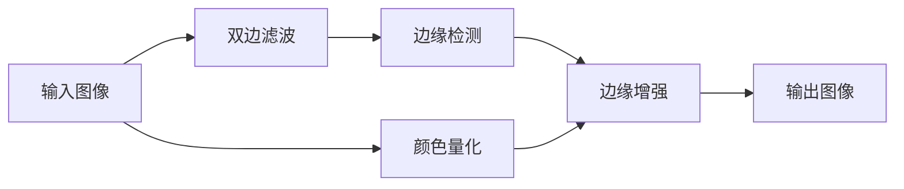

## 1. 背景介绍

### 1.1 图像卡通化的概念

图像卡通化是一种将自然图像转换为卡通风格图像的技术，其目标是保留原始图像的内容和结构，同时赋予其卡通化的视觉效果。卡通化图像通常具有以下特点：

-   **鲜明的色彩:** 卡通图像通常使用高饱和度和对比度的颜色，以增强视觉冲击力。
-   **简化的线条:** 卡通图像的线条通常比较简单，轮廓清晰，细节较少。
-   **夸张的特征:** 卡通图像的人物或物体特征通常会被夸张，例如眼睛、鼻子、嘴巴等。

### 1.2 图像卡通化的应用

图像卡通化技术在许多领域都有广泛的应用，例如：

-   **娱乐:** 用于制作卡通动画、漫画、游戏等。
-   **广告:** 用于制作吸引眼球的广告素材。
-   **教育:** 用于制作生动有趣的教材。
-   **艺术:** 用于创作独特的艺术作品。

### 1.3 OpenCV 简介

OpenCV (Open Source Computer Vision Library) 是一个开源的计算机视觉库，它提供了丰富的图像处理和计算机视觉算法，包括图像卡通化算法。OpenCV 支持多种编程语言，例如 C++、Python、Java 等，并且可以在 Windows、Linux、macOS 等多个平台上运行。

## 2. 核心概念与联系

### 2.1 图像滤波

图像滤波是一种用于增强图像或去除图像噪声的技术，它通过将图像与一个滤波器进行卷积操作来实现。常用的图像滤波器包括：

-   **高斯滤波器:** 用于平滑图像，去除高斯噪声。
-   **中值滤波器:** 用于去除椒盐噪声。
-   **双边滤波器:** 用于平滑图像，同时保留边缘信息。

### 2.2 边缘检测

边缘检测是一种用于识别图像中边缘的技术，它通过计算图像梯度来实现。常用的边缘检测算法包括：

-   **Sobel 算子:** 用于检测水平和垂直方向的边缘。
-   **Canny 算子:** 用于检测图像中的所有边缘。

### 2.3 颜色量化

颜色量化是一种用于减少图像颜色数量的技术，它通过将相似的颜色合并成一个颜色来实现。常用的颜色量化算法包括：

-   **K-means 聚类算法:** 用于将颜色空间划分为 K 个簇，每个簇对应一个颜色。
-   **中位切分算法:** 用于将颜色空间递归地划分为两个子空间，直到每个子空间只包含一种颜色。

## 3. 核心算法原理具体操作步骤

### 3.1 基于 OpenCV 的图像卡通化算法

OpenCV 提供了一种基于双边滤波器和边缘检测的图像卡通化算法，其具体操作步骤如下：

1.  **双边滤波:** 使用双边滤波器对输入图像进行平滑处理，同时保留边缘信息。
2.  **边缘检测:** 使用 Canny 算子对平滑后的图像进行边缘检测，得到图像的边缘信息。
3.  **颜色量化:** 使用 K-means 聚类算法对输入图像进行颜色量化，减少图像颜色数量。
4.  **边缘增强:** 将边缘信息与颜色量化后的图像进行融合，增强图像的卡通效果。

### 3.2 算法流程图



## 4. 数学模型和公式详细讲解举例说明

### 4.1 双边滤波器

双边滤波器是一种非线性滤波器，它考虑了像素的空间距离和颜色差异，其数学模型如下：

$$
g(i,j) = \frac{\sum_{k,l} f(k,l) w(i,j,k,l)}{\sum_{k,l} w(i,j,k,l)}
$$

其中，$g(i,j)$ 表示输出图像在像素 $(i,j)$ 处的像素值，$f(k,l)$ 表示输入图像在像素 $(k,l)$ 处的像素值，$w(i,j,k,l)$ 表示权重函数，它由空间距离和颜色差异两部分组成：

$$
w(i,j,k,l) = exp(-\frac{(i-k)^2 + (j-l)^2}{2\sigma_d^2}) exp(-\frac{(f(i,j)-f(k,l))^2}{2\sigma_r^2})
$$

其中，$\sigma_d$ 表示空间距离的标准差，$\sigma_r$ 表示颜色差异的标准差。

### 4.2 Canny 算子

Canny 算子是一种用于边缘检测的算法，它包括以下步骤：

1.  **高斯滤波:** 使用高斯滤波器对输入图像进行平滑处理，去除噪声。
2.  **计算梯度:** 计算图像的梯度幅值和方向。
3.  **非极大值抑制:** 抑制非边缘像素的梯度幅值。
4.  **双阈值检测:** 使用两个阈值来区分强边缘和弱边缘。
5.  **边缘连接:** 将弱边缘连接到强边缘。

### 4.3 K-means 聚类算法

K-means 聚类算法是一种用于颜色量化的算法，它将颜色空间划分为 K 个簇，每个簇对应一个颜色，其具体操作步骤如下：

1.  **初始化:** 随机选择 K 个颜色作为初始簇中心。
2.  **分配样本:** 将每个像素分配到距离其最近的簇中心所在的簇。
3.  **更新簇中心:** 计算每个簇中所有像素的平均颜色，作为新的簇中心。
4.  **重复步骤 2 和 3，直到簇中心不再发生变化。**

## 5. 项目实践：代码实例和详细解释说明

### 5.1 Python 代码实现

```python
import cv2

def cartoonize_image(image_path):
    """
    将图像卡通化

    Args:
        image_path: 图像路径

    Returns:
        卡通化后的图像
    """

    # 读取图像
    img = cv2.imread(image_path)

    # 双边滤波
    smooth = cv2.bilateralFilter(img, 9, 75, 75)

    # 边缘检测
    edges = cv2.Canny(smooth, 100, 200)

    # 颜色量化
    k = 8
    criteria = (cv2.TERM_CRITERIA_EPS + cv2.TERM_CRITERIA_MAX_ITER, 10, 1.0)
    data = img.reshape((-1, 3)).astype(np.float32)
    ret, label, center = cv2.kmeans(data, k, None, criteria, 10, cv2.KMEANS_RANDOM_CENTERS)
    center = np.uint8(center)
    result = center[label.flatten()]
    quantized = result.reshape(img.shape)

    # 边缘增强
    cartoonized = cv2.bitwise_and(quantized, quantized, mask=edges)

    return cartoonized

# 示例
image_path = "input.jpg"
cartoonized_image = cartoonize_image(image_path)
cv2.imwrite("output.jpg", cartoonized_image)
```

### 5.2 代码解释

-   **`cv2.bilateralFilter(img, 9, 75, 75)`:** 对输入图像 `img` 进行双边滤波，其中 `9` 表示滤波器大小，`75` 表示空间距离的标准差，`75` 表示颜色差异的标准差。
-   **`cv2.Canny(smooth, 100, 200)`:** 对平滑后的图像 `smooth` 进行边缘检测，其中 `100` 表示低阈值，`200` 表示高阈值。
-   **`cv2.kmeans(data, k, None, criteria, 10, cv2.KMEANS_RANDOM_CENTERS)`:** 对输入图像 `img` 进行颜色量化，其中 `k` 表示簇的数量，`criteria` 表示停止迭代的条件，`10` 表示最大迭代次数，`cv2.KMEANS_RANDOM_CENTERS` 表示随机初始化簇中心。
-   **`cv2.bitwise_and(quantized, quantized, mask=edges)`:** 将颜色量化后的图像 `quantized` 与边缘信息 `edges` 进行融合，增强图像的卡通效果。

## 6. 实际应用场景

### 6.1 卡通头像制作

图像卡通化技术可以用于制作卡通头像，用户可以上传自己的照片，然后使用卡通化算法将其转换为卡通风格的头像。

### 6.2 漫画创作

漫画家可以使用图像卡通化技术将真实场景或人物转换为漫画风格，从而提高创作效率。

### 6.3 游戏开发

游戏开发者可以使用图像卡通化技术为游戏角色或场景添加卡通效果，增强游戏的趣味性。

## 7. 工具和资源推荐

### 7.1 OpenCV

OpenCV 是一个开源的计算机视觉库，它提供了丰富的图像处理和计算机视觉算法，包括图像卡通化算法。

### 7.2 GIMP

GIMP (GNU Image Manipulation Program) 是一个免费的开源图像编辑器，它提供了许多图像处理工具，包括卡通化滤镜。

### 7.3 Photoshop

Photoshop 是一个商业图像编辑软件，它提供了强大的图像处理功能，包括卡通化滤镜。

## 8. 总结：未来发展趋势与挑战

### 8.1 未来发展趋势

-   **深度学习:** 深度学习技术可以用于开发更先进的图像卡通化算法，例如生成对抗网络 (GAN)。
-   **实时卡通化:** 随着计算能力的提高，实时图像卡通化将成为可能，例如视频通话中的卡通化效果。
-   **个性化卡通化:** 未来的图像卡通化算法将更加个性化，允许用户根据自己的喜好调整卡通风格。

### 8.2 挑战

-   **保留细节:** 图像卡通化算法需要在简化线条的同时保留图像的重要细节。
-   **风格迁移:** 将图像转换为不同卡通风格是一个挑战，需要开发更灵活的算法。
-   **计算效率:** 实时图像卡通化需要高效的算法和硬件支持。

## 9. 附录：常见问题与解答

### 9.1 如何选择合适的卡通化算法？

选择合适的卡通化算法取决于具体的应用场景和需求，例如：

-   如果需要保留较多细节，可以选择基于双边滤波器的算法。
-   如果需要更夸张的卡通效果，可以选择基于 GAN 的算法。

### 9.2 如何调整卡通化效果？

可以通过调整算法参数来调整卡通化效果，例如：

-   调整双边滤波器的空间距离和颜色差异标准差。
-   调整 Canny 算子的阈值。
-   调整 K-means 聚类算法的簇数量。

### 9.3 如何评估卡通化效果？

可以通过主观评价和客观指标来评估卡通化效果，例如：

-   主观评价：邀请用户对卡通化图像进行评分。
-   客观指标：使用图像质量评估指标，例如峰值信噪比 (PSNR)、结构相似性 (SSIM) 等。
