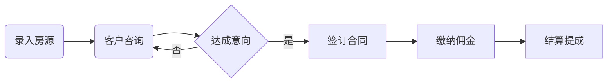
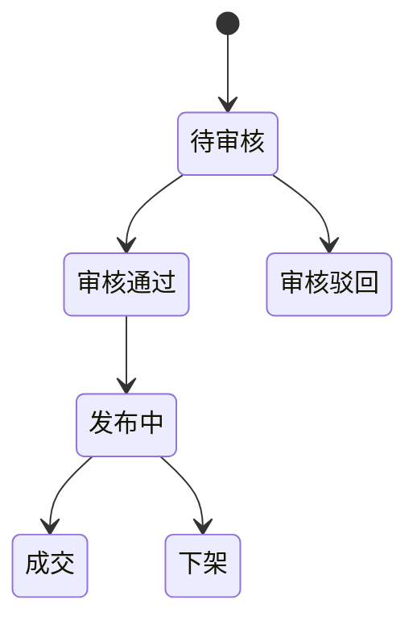

# 房产信息管理系统详细设计与具体代码实现

作者：禅与计算机程序设计艺术

## 1. 背景介绍
### 1.1 房产信息管理系统的重要性
在现代社会中,房地产行业是国民经济的重要组成部分。随着房地产行业的快速发展,房产信息数据量急剧增加,传统的人工管理方式已经无法满足日益增长的信息管理需求。因此,开发一个高效、可靠、安全的房产信息管理系统变得十分迫切和重要。
### 1.2 房产信息管理系统的主要功能
一个完善的房产信息管理系统需要具备以下主要功能:
1. 房源信息管理:包括增删改查、分类统计等
2. 客户信息管理:包括客户档案、客户需求、跟进记录等
3. 合同管理:包括合同模板、合同生成、审批流程等  
4. 佣金结算:包括业绩计算、提成方案、发放记录等
5. 统计报表:包括各类业务报表、经营分析图表等
### 1.3 系统架构与技术选型
探讨了房产信息管理系统的重要性和主要功能后,我们需要考虑系统的整体架构和技术选型。一个稳定高效的系统架构和合理的技术选型是成功开发项目的关键。本系统采用当前流行的前后端分离架构,前端使用 Vue.js,后端使用 Spring Boot + MySQL,同时会使用 Redis 缓存来提高系统性能。

## 2. 核心概念与联系
### 2.1 房源、客户、合同、佣金的关系
在房产信息管理中,房源、客户、合同、佣金是四个核心实体,它们之间有着错综复杂的联系,概括如下:
- 一个房源可以吸引多个客户,一个客户也可以咨询多个房源  
- 房源和客户的匹配最终可以达成交易并签订合同
- 一个合同对应一个房源和一个客户,是交易的凭证
- 合同达成后会产生一笔佣金,这笔佣金如何分配取决于公司的提成方案
### 2.2 业务流程图与状态变迁
为了更清晰地展示房产信息管理业务流程,我们绘制了业务流程图:

同时,房源、客户、合同都具有多种状态,在系统中都会有相应的状态字段来标识,下面以房源的状态变迁为例:


## 3. 核心算法原理具体操作步骤 
### 3.1 基于向量空间模型的搜房算法
搜索功能是房产信息管理系统的一个核心功能,我们使用向量空间模型构建搜索引擎。该算法的核心思想是将房源信息和用户查询都表示成向量,然后计算它们之间的相似度。具体步骤如下:
1. 将房源的各个属性值使用 TF-IDF 算法转化为向量
2. 对用户输入的查询条件进行分词、去停用词,也转化为向量
3. 使用余弦相似度公式计算两个向量的相似程度,取 Top N 作为搜索结果
### 3.2 基于业绩的智能提成算法
传统的提成方式通常是线性提成,比如成交金额的 20% 作为提成。这种方式不利于充分调动销售的积极性。我们可以设计一种智能非线性提成方案,根据业绩实现差异化分级提成:
1. 制定每个级别的业绩区间和对应提成比例,例如:
   - 0 ~ 100万,提成 20%
   - 100 ~ 500 万,提成 25%  
   - 500万以上,提成 35%
2. 每月初,计算上个月每个人的总业绩,判断属于哪个级别
3. 根据实际业绩和提成比例计算出每笔佣金对应的提成金额
4. 汇总提成明细,生成发放报表

## 4. 数学模型和公式详细讲解举例说明
### 4.1 向量空间模型中的tf-idf权重计算
TF-IDF 是一种基于向量空间模型的权重计算方法,全称为 Term Frequency – Inverse Document Frequency。在上文搜房算法中,需要使用 TF-IDF 将房源信息转为向量。现在我们详细解释一下其数学含义。
假设有 $N$ 条房源记录,第 $i$ 条记录中第 $j$ 个属性值的 TF-IDF 权重为:

$$
w_{i,j} = tf_{i,j} \cdot \log \frac{N}{df_j+1}
$$

其中:
- $tf_{i,j}$ 表示该属性值在第 $i$ 条房源信息中的频次
- $df_j$ 表示该属性值在所有房源信息中的文档频次
- $N$ 为总的房源记录数

举个例子,假设一条房源信息 A 的属性值向量为:
```
[三室两厅,137平米,中层,南北通透,精装修] 
```
经过分词、计算 TF 后得到初始特征矩阵如下:
```
    三室  两厅  137平米  中层  南北通透  精装修
A   1     1     1       1     1       1
```  
最终根据公式计算出各个分词的 TF-IDF 权重向量,得到一个 N 维的特征向量表示这个房源。

### 4.2 余弦相似度计算公式
对两个特征向量之间的相似度评估一般采用余弦相似度计算。给定用户查询特征向量 $Q$ 和某房源特征向量 $V_i$,它们的余弦相似度公式为:

$$
sim(Q,V_i) = \frac{Q \cdot V_i}{||Q||_2 ||V_i||_2 }=\frac{\sum_{j=1}^N q_j \times v_{ij}}{\sqrt{\sum_{j=1}^N q_j^2} \sqrt{\sum_{j=1}^N v_{ij}^2}}
$$

其中:
- $Q=(q_1,q_2,...,q_N)$ 表示经过 TF-IDF 处理的 N 维查询特征向量
- $V_i=(v_{i1},v_{i2},...,v_{iN})$ 表示房源 $i$ 的 N 维特征向量

相似度计算的取值范围在 $[-1,1]$ 之间,值越趋近于 1,说明两个特征向量越相似。在房产搜索场景中,一般取 Top N个相似度最高的房源作为搜索结果返回。

## 5.项目实践：代码实例和详细解释说明
接下来我们使用主流的编程语言和常用框架,实现房产信息管理系统的一些核心模块代码。
### 5.1 前端房源列表页面
使用 Vue.js + Element UI 框架:
```html
<!-- HouseList.vue -->
<template>
  <div>
   <el-form :inline="true" :model="filters">
     <el-form-item label="房型">
        <el-select v-model="filters.houseType" placeholder="全部">
          <el-option label="一室" value="1"></el-option>
          <el-option label="二室" value="2"></el-option>
          <!-- 省略更多选项 -->
        </el-select>
     </el-form-item>
     <el-form-item label="面积">
        <el-input v-model="filters.minArea" style="width: 100px;"></el-input>  - 
        <el-input v-model="filters.maxArea" style="width: 100px;"></el-input> 平米
     </el-form-item>
     <el-form-item>
       <el-button type="primary" @click="getHouseList">搜索</el-button>
     </el-form-item>
   </el-form>
   
   <el-table :data="houseList">
      <el-table-column prop="title" label="房源标题"></el-table-column>
      <el-table-column prop="houseType" label="房型"></el-table-column>
      <el-table-column prop="area" label="面积"></el-table-column>
      <!-- 省略更多字段 -->
      <el-table-column label="操作" width="180">
        <template slot-scope="scope">
          <el-button size="mini" @click="handleEdit(scope.row)">编辑</el-button>
          <el-button size="mini" type="danger" @click="handleDelete(scope.row)">删除</el-button>
        </template>
      </el-table-column>
   </el-table>
   
   <el-pagination
      @size-change="handleSizeChange"
      @current-change="handleCurrentChange"
      :current-page="currentPage"
      :page-sizes="[10, 20, 50]"
      :page-size="pageSize"
      layout="total, sizes, prev, pager, next, jumper"
      :total="total">
    </el-pagination>
  </div>
</template>

<script>
  export default {
    data() {
      return {
        filters: {
          houseType: '',
          minArea: '',
          maxArea: ''
        },
        houseList: [],
        currentPage: 1,
        pageSize: 10,
        total: 0
      }
    },
    methods: {
      getHouseList() {
        // 调用后台接口获取房源列表数据
        // 将返回数据赋值给houseList
        // 省略接口调用代码...
      },
      handleEdit(row) {
        // 跳转编辑页面
      },
      handleDelete(row){
        // 调用删除接口删除该条数据
      },
      handleSizeChange(val) {
        this.pageSize = val;
        this.getHouseList();
      },
      handleCurrentChange(val) {
        this.currentPage = val;
        this.getHouseList();
      }
    },
    mounted() {
      this.getHouseList();
    }
  }
</script>
```
以上代码实现了房源列表页面的基本布局,包括搜索栏、数据表格、分页组件。使用了 Vue 的基础语法如 v-model、v-for 等,Element UI 提供了现成的表单、表格、分页等常用组件。
关键点:
- 将搜索条件数据存储在 filters 对象中,供提交搜索时使用
- 分页组件绑定了 size-change 和 current-change 事件,分别处理页面大小和当前页变动
- 在 mounted 生命周期钩子中调用获取列表数据
- methods 中实现了搜索、编辑、删除、页码变更等常用功能

### 5.2 后端房源模糊搜索接口
使用 Spring Boot + MyBatis 框架:
```java
/**
 * 房源搜索Controller
 */
@RestController
@RequestMapping("/house")
public class HouseController {
    
    @Autowired
    private HouseSearchService houseSearchService;
     
    @GetMapping("/search")
    public BaseResponse<PageInfo<HouseDTO>> search(@RequestParam(value = "pageNum", defaultValue = "1") int pageNum,
                                                   @RequestParam(value = "pageSize", defaultValue = "10") int pageSize,
                                                   HouseSearchRequest request) {
        PageInfo<HouseDTO> pageInfo = houseSearchService.search(pageNum, pageSize, request);
        return BaseResponse.ok(pageInfo);
    }
}

/**
 * 房源搜索Request
 */
@Data
public class HouseSearchRequest {
    private String keyword; //关键词
    private String houseType; //房型 
    private Integer minArea; //最小面积
    private Integer maxArea; //最大面积
    // 省略其他查询条件...
}

/**
 * 房源搜索Service 
 */
@Service
public class HouseSearchServiceImpl implements HouseSearchService {
    
    @Autowired
    private HouseMapper houseMapper;
    
    @Override
    public PageInfo<HouseDTO> search(int pageNum, int pageSize, HouseSearchRequest request) {
        PageHelper.startPage(pageNum, pageSize);
        HouseExample example = new HouseExample();
        HouseExample.Criteria criteria = example.createCriteria();
        
        //构造查询条件
        if (StringUtils.isNotBlank(request.getKeyword())) {
            criteria.andTitleLike("%" + request.getKeyword() + "%");
        }
        if (StringUtils.isNotBlank(request.getHouseType())) {
            criteria.andHouseTypeEqualTo(request.getHouseType());
        }
        if (request.getMinArea() != null) {
            criteria.andAreaGreaterThanOrEqualTo(request.getMinArea());
        }
        if (request.getMaxArea() != null) {
            criteria.andAreaLessThanOrEqualTo(request.getMaxArea());
        }
        
        //执行查询
        List<House> houseList = houseMapper.selectByExample(example);
        
        //转换DTO
        List<H