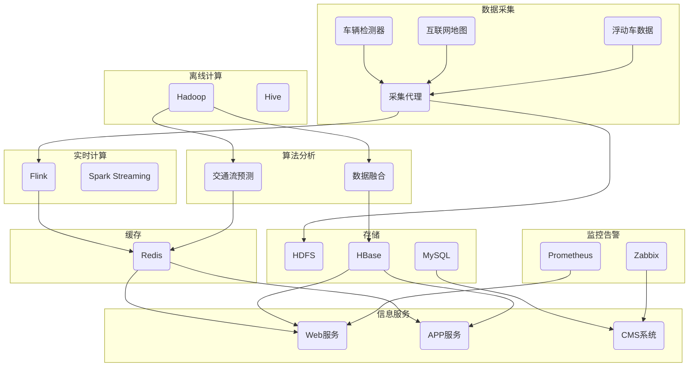
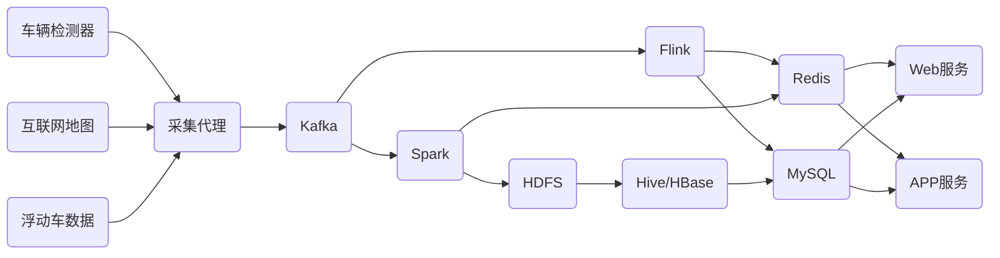

# 智能道路交通信息管理系统详细设计与具体代码实现

作者：禅与计算机程序设计艺术

## 1. 背景介绍

### 1.1 交通拥堵问题日益严峻

随着城市化进程的加快和机动车保有量的快速增长,道路交通拥堵问题日益突出,已成为制约城市可持续发展的瓶颈之一。传统的交通管理模式难以适应新形势下的交通需求,亟需引入先进的信息化手段来提升交通管理效率。

### 1.2 智能交通系统的兴起

智能交通系统(ITS)作为解决交通问题的新途径受到广泛关注。ITS 综合运用先进的信息技术、通信技术、控制技术、计算机技术等,对交通系统进行实时动态的监测、调度和管理,可有效缓解交通拥堵,提高道路通行效率。

### 1.3 道路交通信息管理的重要性

在 ITS 中,道路交通信息管理是其核心内容之一。通过对道路交通流量、车速、事故等信息的采集、处理、分析和发布,为交通管理部门优化交通组织、引导交通流提供数据支撑,同时为公众出行提供实时路况服务,从而实现交通资源的合理配置。

## 2. 核心概念与关联

### 2.1 交通流理论

交通流理论研究车辆在道路上运行时的规律和特性,是道路交通管理的理论基础。主要概念包括交通流量、密度、速度等参量之间的关系,以及交通流的稳定性、冲击波、排队论等。

### 2.2 交通信息采集技术

常见的交通信息采集手段有:

- 车辆检测器:如线圈检测器、视频检测、微波检测、声磁检测等
- 浮动车数据:出租车、公交车等载客车辆的 GPS 轨迹数据
- 互联网地图数据:百度地图、高德地图等利用海量用户数据估算路况
- 手机信令数据:通过分析移动用户位置变化推算路网通行状况

### 2.3 数据融合与挖掘

由于交通信息的复杂性和多源异构性,需要将不同来源、不同粒度的数据进行清洗、关联、融合,并运用数据挖掘方法发掘数据中蕴含的规律,如聚类分析、关联规则、时空序列预测等。

### 2.4 智能算法

人工智能技术在交通领域得到广泛应用,如:

- 机器学习:对历史交通数据进行建模学习,预测未来一段时间的交通状态
- 深度学习:用于交通流预测、ETC图像识别、自动驾驶等
- 启发式优化:遗传算法、蚁群算法等用于动态交通信号配时等

### 2.5 可视化与发布

为方便管理人员和公众直观了解交通运行状况,需要将交通信息以图表、地图、报告等形式直观呈现。常见的可视化手段有热力图、等值线图、密度图等。信息发布则一般通过网页、手机 APP、可变信息标志、电台广播等渠道进行。

## 3. 系统总体架构设计

### 3.1 业务架构

智能交通信息管理系统的主要业务可分为:数据采集、数据处理分析、信息服务三大块。


### 3.2 技术架构

系统采用微服务架构,包含数据采集服务、算法分析服务、信息发布服务等。同时配备实时计算、离线计算、缓存、存储、监控等基础组件。



### 3.3 数据流设计

原始数据经过采集代理实时汇聚到消息队列,再由流计算平台进行实时处理,存入缓存或数据库。离线数据则直接进入大数据平台进行批量分析挖掘,将结果写回数据库供应用调用。



## 4. 数据采集与处理 

### 4.1 数据源接入

#### 4.1.1 车辆检测器接口

对接不同厂商和型号的车辆检测器,定义统一的数据格式和上传协议,实现二次开发。主要字段包括:

- device_id:设备编号 
- time:通过时间
- speed:车速
- lane_id:车道号
- direction:方向
- vehicle_type:车型

样例数据:

```json
{
  "device_id": "DT001",
  "time": "2023-05-12 09:30:00",
  "speed": 40.5,
  "lane_id": 1,
  "direction": "东向西",
  "vehicle_type": "小客车"
}
```

#### 4.1.2 互联网地图API

对接百度地图、高德地图等互联网地图的 API,定期抓取重点路段的实时路况信息。主要字段包括:

- road_name:道路名称
- section:路段
- length:路段长度
- speed:路段平均车速
- status:拥堵等级
- time:更新时间

样例数据:

```json
{
  "road_name": "富翔路", 
  "section": "珠峰大街-华岩路",
  "length": 1.5,
  "speed": 25.0,
  "status": "缓行",
  "time": "2023-05-12 09:35:00"
}
```

#### 4.1.3 浮动车数据接口

与出租车、公交集团等签订数据合作协议,获取浮动车 GPS 轨迹数据。主要字段包括:

- vehicle_id:车辆编号
- lng:经度
- lat:纬度
- speed:瞬时速度
- angle:方位角
- time:时间

样例数据:

```json
{
  "vehicle_id": "粤B12345",
  "lng": 113.93083,
  "lat": 22.54425,
  "speed": 35.6,
  "angle": 127.3,
  "time": "2023-05-12 09:32:48"  
}
```

### 4.2 实时流处理

#### 4.2.1 Flink应用

使用 Flink 对车辆检测器等数据流进行实时 ETL,过滤异常值、统一时间窗口、聚合指标、关联维度等,代码示例:

```java
StreamExecutionEnvironment env = StreamExecutionEnvironment.getExecutionEnvironment();
env.setStreamTimeCharacteristic(TimeCharacteristic.EventTime);

DataStream<VehicleEvent> vehicleStream = env
  .addSource(new VehicleDetectorSource()) 
  .filter(e -> e.getSpeed() > 0 && e.getSpeed() < 150) 
  .assignTimestampsAndWatermarks(
    new BoundedOutOfOrdernessTimestampExtractor<VehicleEvent>(Time.seconds(5)) {
      @Override
      public long extractTimestamp(VehicleEvent element) {
        return element.getTime().getTime();
      }
  });

DataStream<TrafficFlow> trafficStream = vehicleStream
  .keyBy(VehicleEvent::getSectionId) 
  .timeWindow(Time.minutes(5)) 
  .aggregate(new TrafficFlowAggregator());

trafficStream.print();

env.execute("Vehicle Traffic Analysis");
```

#### 4.2.2 Spark Streaming应用

使用 Spark Streaming 对浮动车 GPS 数据进行实时清洗、地图匹配,提取路段通行时间,代码示例:

```scala
val conf = new SparkConf()
  .setAppName("FloatingCar")
  .setMaster("local[*]") 

val ssc = new StreamingContext(conf, Seconds(5))

val gpsStream = KafkaUtils.createDirectStream[String, String](
  ssc,
  LocationStrategies.PreferConsistent,
  ConsumerStrategies.Subscribe[String, String](Array("gps-topic"), kafkaParams)
)

val linkSpeedStream = gpsStream
  .flatMap(record => record.value().split(","))
  .map(line => parseGps(line)) // 解析GPS记录
  .filter(_.speed > 0) 
  .mapWithState(StateSpec.function(mapLinks _)) // 地图匹配
  .map(generateTravelTime) // 生成路段通行时间
  .reduceByKeyAndWindow(
    (a, b) => (a._1 + b._1, a._2 + b._2),
    (a, b) => (a._1 - b._1, a._2 - b._2),
    Seconds(60), 
    Seconds(10)
  )
  .map{case (link, (sumTime, count)) => (link, sumTime/count.toDouble)}

linkSpeedStream.foreachRDD{rdd => 
  rdd.foreachPartition{iter =>
    iter.foreach{case (link, speed) =>
      // 存入Redis
      val jedis = RedisClient.pool.getResource
      jedis.hset("link-speed", link, speed)
      jedis.close()
    }
  }
}

ssc.start()
ssc.awaitTermination()
```

### 4.3 离线数据分析

#### 4.3.1 Hadoop MapReduce

使用 MapReduce 对海量历史交通数据进行分析挖掘,提取道路网络结构、标准路况速度曲线等信息,代码示例:

```java
public static class MapClass extends Mapper<LongWritable, Text, Text, DoubleWritable> {
    
  private static final double LINK_LENGTH = 500.0; // 路段长度
    
  public void map(LongWritable key, Text value, Context context) throws IOException, InterruptedException {
    String[] fields = value.toString().split(",");
    if (fields.length >= 7) {
      String linkID = fields[0];
      double speed = Double.parseDouble(fields[6]);
      double travelTime = (LINK_LENGTH / speed) * 3600;
      context.write(new Text(linkID), new DoubleWritable(travelTime));
    }
  }
}

public static class ReduceClass extends Reducer<Text, DoubleWritable, Text, Text> {
    
  public void reduce(Text key, Iterable<DoubleWritable> values, Context context) throws IOException, InterruptedException {
    int count = 0;
    double sumTime = 0.0;
    for (DoubleWritable value : values) {
      count += 1;
      sumTime += value.get();    
    }   
    double avgTime = sumTime / count; 
    double avgSpeed = LINK_LENGTH * 3600 / avgTime;
    context.write(key, new Text(avgSpeed + "," + avgTime));
  }
}

public static void main(String[] args) throws Exception {
  Configuration conf = new Configuration();
        
  Job job = new Job(conf, "Link Speed");
  job.setJarByClass(LinkSpeed.class);
  job.setMapperClass(MapClass.class);
  job.setReducerClass(ReduceClass.class);
  job.setOutputKeyClass(Text.class);
  job.setOutputValueClass(DoubleWritable.class);

  FileInputFormat.addInputPath(job, new Path(args[0]));
  FileOutputFormat.setOutputPath(job, new Path(args[1]));

  job.waitForCompletion(true);
}
```

#### 4.3.2 Hive 批处理

利用 Hive 进行交通事故数据的统计分析,挖掘事故高发路段、时间、车型等,SQL 示例:

```sql
-- 创建事故表     
CREATE EXTERNAL TABLE IF NOT EXISTS accident(
  id STRING COMMENT '事故编号',
  time STRING COMMENT '事故发生时间',
  location STRING COMMENT '事故发生地点',  
  address STRING COMMENT '事故地址描述',
  lng DOUBLE COMMENT '经度',
  lat DOUBLE COMMENT '纬度',
  type STRING COMMENT '事故类型',
  reason STRING COMMENT '事故原因',
  