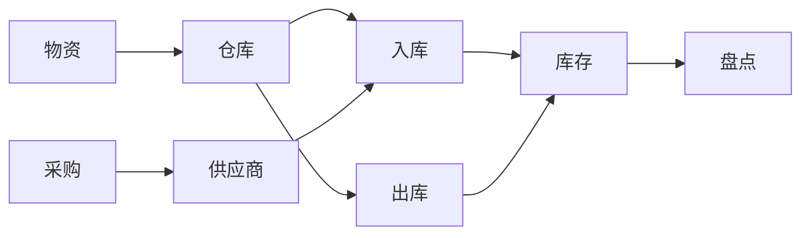

# 物资管理系统设计与实现

作者：禅与计算机程序设计艺术

## 1. 背景介绍

### 1.1 物资管理的意义

在任何企业或组织中，物资管理都是一项至关重要的任务。有效的物资管理可以帮助企业降低成本、提高效率、优化库存、加强监管和提升客户满意度。随着信息技术的快速发展，传统的物资管理模式已经无法满足现代企业的需求，因此，开发一套高效、智能的物资管理系统变得尤为重要。

### 1.2 物资管理系统的目标

物资管理系统的设计目标是为了解决传统物资管理模式中存在的效率低下、信息不透明、人工操作繁琐等问题。具体来说，物资管理系统需要实现以下目标：

*   **提高物资管理效率：**  通过自动化流程和信息化管理，减少人工操作，提高工作效率。
*   **优化库存管理：**  实时监控库存水平，预测物资需求，避免库存积压或短缺。
*   **加强物资监管：**  实现物资的全生命周期跟踪，防止物资流失和滥用。
*   **降低物资管理成本：**  通过优化采购流程、减少库存损耗等方式，降低物资管理成本。
*   **提升客户满意度：**  及时响应客户需求，提供准确的物资信息，提升客户满意度。

### 1.3 系统设计原则

为了实现上述目标，物资管理系统的设计需要遵循以下原则：

*   **实用性：**  系统功能要满足实际需求，能够解决实际问题。
*   **易用性：**  系统界面简洁易懂，操作方便快捷，用户易于上手。
*   **可靠性：**  系统稳定可靠，数据安全，能够长期稳定运行。
*   **可扩展性：**  系统设计要具有一定的前瞻性，能够方便地进行功能扩展和升级。
*   **可维护性：**  系统代码结构清晰，易于维护和修改。

## 2. 核心概念与联系

### 2.1 物资

物资是指企业在生产经营过程中所需要的各种原材料、辅助材料、燃料、设备、工具等。

### 2.2 仓库

仓库是用于存储物资的场所，可以根据物资的种类、特性等进行分类管理。

### 2.3 入库

入库是指物资进入仓库的过程，包括物资的验收、登记、存放等环节。

### 2.4 出库

出库是指物资离开仓库的过程，包括物资的领用、发货等环节。

### 2.5 库存

库存是指仓库中存储的物资数量，是物资管理的重要指标之一。

### 2.6 盘点

盘点是指定期对仓库中的物资进行清点，核对库存数量和实际数量，确保库存信息的准确性。

### 2.7 采购

采购是指企业为了满足生产经营需求，从外部供应商购买物资的过程。

### 2.8 供应商

供应商是指为企业提供物资的外部单位或个人。

### 2.9 关系图

下图展示了物资管理系统中各个核心概念之间的联系：



## 3. 核心算法原理具体操作步骤

### 3.1 库存管理算法

#### 3.1.1 安全库存量计算

安全库存量是指为防止突发事件或意外需求而设置的最低库存量。安全库存量的计算方法有很多种，常用的方法包括：

*   **经验法：**  根据历史经验和行业惯例设定安全库存量。
*   **统计法：**  根据历史需求数据，采用统计学方法计算安全库存量。
*   **需求波动法：**  根据需求的波动情况，设定安全库存量。

#### 3.1.2 订货点计算

订货点是指当库存量下降到一定水平时，需要进行物资采购的临界点。订货点的计算公式如下：

```
订货点 = 平均日需求量 * 采购提前期 + 安全库存量
```

其中，平均日需求量是指单位时间内的平均物资需求量，采购提前期是指从发出采购订单到物资到货所需的时间。

### 3.2 采购管理算法

#### 3.2.1 供应商选择算法

供应商选择是采购管理中的重要环节，需要考虑供应商的资质、价格、供货能力、服务质量等因素。常用的供应商选择方法包括：

*   **层次分析法：**  将供应商的各项指标进行量化，构建层次结构模型，进行综合评价。
*   **数据包络分析法：**  通过比较不同供应商的效率，选择效率最高的供应商。
*   **模糊综合评价法：**  采用模糊数学方法，对供应商进行综合评价。

#### 3.2.2 采购计划制定算法

采购计划是指根据企业生产经营需求，制定物资采购的计划。采购计划的制定需要考虑以下因素：

*   **物资需求量：**  根据生产计划、销售计划等预测物资需求量。
*   **库存水平：**  考虑现有库存水平，避免过度采购或库存不足。
*   **供应商供货能力：**  确保供应商能够按时按量供货。
*   **资金预算：**  控制采购成本，确保资金预算充足。

## 4. 数学模型和公式详细讲解举例说明

### 4.1 库存管理模型

#### 4.1.1 经济订货批量模型 (EOQ)

EOQ 模型是一种经典的库存管理模型，用于确定每次采购的最佳数量，以最小化库存成本。EOQ 模型的公式如下：

$$
EOQ = \sqrt{\frac{2DS}{H}}
$$

其中：

*   $D$：年需求量
*   $S$：每次订购成本
*   $H$：单位库存持有成本

**举例说明：**

假设某企业年需求量为 1000 件，每次订购成本为 50 元，单位库存持有成本为 2 元，则该企业的 EOQ 为：

$$
EOQ = \sqrt{\frac{2 \times 1000 \times 50}{2}} = 500 件
$$

#### 4.1.2 ABC 分类法

ABC 分类法是一种常用的库存管理方法，根据物资的重要程度和价值将库存分为 A、B、C 三类，分别进行管理。

*   **A 类物资：**  价值高、需求量大的物资，需要重点管理。
*   **B 类物资：**  价值和需求量中等 的物资，需要进行常规管理。
*   **C 类物资：**  价值低、需求量小的物资，可以简化管理。

### 4.2 采购管理模型

#### 4.2.1 供应商评价模型

供应商评价模型用于对供应商进行综合评价，常用的评价指标包括：

*   **价格：**  物资的价格水平。
*   **质量：**  物资的质量水平。
*   **交货期：**  供应商的交货速度。
*   **服务水平：**  供应商的服务质量。

#### 4.2.2 采购成本模型

采购成本模型用于计算物资采购的总成本，包括物资价格、运输成本、仓储成本等。

## 5. 项目实践：代码实例和详细解释说明

### 5.1 技术选型

*   **编程语言：**  Java
*   **数据库：**  MySQL
*   **框架：**  Spring Boot
*   **前端框架：**  Vue.js

### 5.2 数据库设计

```sql
-- 物资表
CREATE TABLE `material` (
  `id` int(11) NOT NULL AUTO_INCREMENT,
  `name` varchar(255) NOT NULL COMMENT '物资名称',
  `type` varchar(255) NOT NULL COMMENT '物资类型',
  `unit` varchar(255) NOT NULL COMMENT '计量单位',
  `price` decimal(10,2) NOT NULL COMMENT '单价',
  `remark` varchar(255) DEFAULT NULL COMMENT '备注',
  PRIMARY KEY (`id`)
) ENGINE=InnoDB DEFAULT CHARSET=utf8;

-- 仓库表
CREATE TABLE `warehouse` (
  `id` int(11) NOT NULL AUTO_INCREMENT,
  `name` varchar(255) NOT NULL COMMENT '仓库名称',
  `address` varchar(255) NOT NULL COMMENT '仓库地址',
  `contact` varchar(255) NOT NULL COMMENT '联系人',
  `phone` varchar(255) NOT NULL COMMENT '联系电话',
  `remark` varchar(255) DEFAULT NULL COMMENT '备注',
  PRIMARY KEY (`id`)
) ENGINE=InnoDB DEFAULT CHARSET=utf8;

-- 入库表
CREATE TABLE `instock` (
  `id` int(11) NOT NULL AUTO_INCREMENT,
  `material_id` int(11) NOT NULL COMMENT '物资ID',
  `warehouse_id` int(11) NOT NULL COMMENT '仓库ID',
  `quantity` int(11) NOT NULL COMMENT '数量',
  `instock_date` datetime NOT NULL COMMENT '入库日期',
  `operator` varchar(255) NOT NULL COMMENT '操作员',
  `remark` varchar(255) DEFAULT NULL COMMENT '备注',
  PRIMARY KEY (`id`),
  KEY `fk_instock_material` (`material_id`),
  KEY `fk_instock_warehouse` (`warehouse_id`),
  CONSTRAINT `fk_instock_material` FOREIGN KEY (`material_id`) REFERENCES `material` (`id`),
  CONSTRAINT `fk_instock_warehouse` FOREIGN KEY (`warehouse_id`) REFERENCES `warehouse` (`id`)
) ENGINE=InnoDB DEFAULT CHARSET=utf8;

-- 出库表
CREATE TABLE `outstock` (
  `id` int(11) NOT NULL AUTO_INCREMENT,
  `material_id` int(11) NOT NULL COMMENT '物资ID',
  `warehouse_id` int(11) NOT NULL COMMENT '仓库ID',
  `quantity` int(11) NOT NULL COMMENT '数量',
  `outstock_date` datetime NOT NULL COMMENT '出库日期',
  `operator` varchar(255) NOT NULL COMMENT '操作员',
  `remark` varchar(255) DEFAULT NULL COMMENT '备注',
  PRIMARY KEY (`id`),
  KEY `fk_outstock_material` (`material_id`),
  KEY `fk_outstock_warehouse` (`warehouse_id`),
  CONSTRAINT `fk_outstock_material` FOREIGN KEY (`material_id`) REFERENCES `material` (`id`),
  CONSTRAINT `fk_outstock_warehouse` FOREIGN KEY (`warehouse_id`) REFERENCES `warehouse` (`id`)
) ENGINE=InnoDB DEFAULT CHARSET=utf8;

-- 库存表
CREATE TABLE `inventory` (
  `id` int(11) NOT NULL AUTO_INCREMENT,
  `material_id` int(11) NOT NULL COMMENT '物资ID',
  `warehouse_id` int(11) NOT NULL COMMENT '仓库ID',
  `quantity` int(11) NOT NULL COMMENT '数量',
  PRIMARY KEY (`id`),
  KEY `fk_inventory_material` (`material_id`),
  KEY `fk_inventory_warehouse` (`warehouse_id`),
  CONSTRAINT `fk_inventory_material` FOREIGN KEY (`material_id`) REFERENCES `material` (`id`),
  CONSTRAINT `fk_inventory_warehouse` FOREIGN KEY (`warehouse_id`) REFERENCES `warehouse` (`id`)
) ENGINE=InnoDB DEFAULT CHARSET=utf8;
```

### 5.3 代码实现

#### 5.3.1 入库管理

```java
@Service
public class InstockServiceImpl implements InstockService {

    @Autowired
    private InstockRepository instockRepository;

    @Autowired
    private InventoryService inventoryService;

    @Override
    @Transactional
    public void instock(Instock instock) {
        // 保存入库记录
        instockRepository.save(instock);

        // 更新库存数量
        inventoryService.increaseInventory(instock.getMaterialId(), instock.getWarehouseId(), instock.getQuantity());
    }
}
```

#### 5.3.2 出库管理

```java
@Service
public class OutstockServiceImpl implements OutstockService {

    @Autowired
    private OutstockRepository outstockRepository;

    @Autowired
    private InventoryService inventoryService;

    @Override
    @Transactional
    public void outstock(Outstock outstock) {
        // 保存出库记录
        outstockRepository.save(outstock);

        // 更新库存数量
        inventoryService.decreaseInventory(outstock.getMaterialId(), outstock.getWarehouseId(), outstock.getQuantity());
    }
}
```

#### 5.3.3 库存管理

```java
@Service
public class InventoryServiceImpl implements InventoryService {

    @Autowired
    private InventoryRepository inventoryRepository;

    @Override
    @Transactional
    public void increaseInventory(Integer materialId, Integer warehouseId, Integer quantity) {
        Inventory inventory = inventoryRepository.findByMaterialIdAndWarehouseId(materialId, warehouseId)
                .orElse(new Inventory(materialId, warehouseId, 0));
        inventory.setQuantity(inventory.getQuantity() + quantity);
        inventoryRepository.save(inventory);
    }

    @Override
    @Transactional
    public void decreaseInventory(Integer materialId, Integer warehouseId, Integer quantity) {
        Inventory inventory = inventoryRepository.findByMaterialIdAndWarehouseId(materialId, warehouseId)
                .orElseThrow(() -> new RuntimeException("库存不足"));
        if (inventory.getQuantity() < quantity) {
            throw new RuntimeException("库存不足");
        }
        inventory.setQuantity(inventory.getQuantity() - quantity);
        inventoryRepository.save(inventory);
    }
}
```

## 6. 实际应用场景

### 6.1 制造业

制造企业可以使用物资管理系统对原材料、零部件、产成品等进行管理，提高生产效率，降低生产成本。

### 6.2 零售业

零售企业可以使用物资管理系统对商品库存进行管理，优化库存结构，提高商品周转率。

### 6.3 物流业

物流企业可以使用物资管理系统对货物运输、仓储、配送等环节进行管理，提高物流效率，降低物流成本。

### 6.4 医疗行业

医疗机构可以使用物资管理系统对药品、器械等进行管理，确保医疗物资的质量和安全。

## 7. 工具和资源推荐

### 7.1 开源物资管理系统

*   Odoo
*   Dolibarr
*   ERPNext

### 7.2 物资管理相关书籍

*   《供应链管理》
*   《物流管理》
*   《仓库管理》

## 8. 总结：未来发展趋势与挑战

### 8.1 未来发展趋势

*   **智能化：**  利用人工智能技术，实现物资管理的自动化、智能化。
*   **云计算：**  将物资管理系统部署到云端，提高系统的可靠性和可扩展性。
*   **物联网：**  利用物联网技术，实现物资的实时跟踪和监控。
*   **大数据分析：**  利用大数据分析技术，优化库存管理，提高采购效率。

### 8.2 面临挑战

*   **数据安全：**  物资管理系统中存储了大量的敏感数据，需要加强数据安全防护。
*   **系统集成：**  物资管理系统需要与其他系统进行集成，例如 ERP 系统、CRM 系统等。
*   **用户体验：**  物资管理系统的用户体验需要不断提升，以满足用户的需求。

## 9. 附录：常见问题与解答

### 9.1 如何选择合适的物资管理系统？

选择物资管理系统需要考虑企业规模、业务需求、预算等因素。

### 9.2 如何保证物资管理系统的安全性？

加强用户权限管理、数据加密、安全审计等措施可以提高系统的安全性。

### 9.3 如何提高物资管理系统的效率？

优化系统流程、简化操作步骤、利用自动化技术等可以提高系统的效率。
