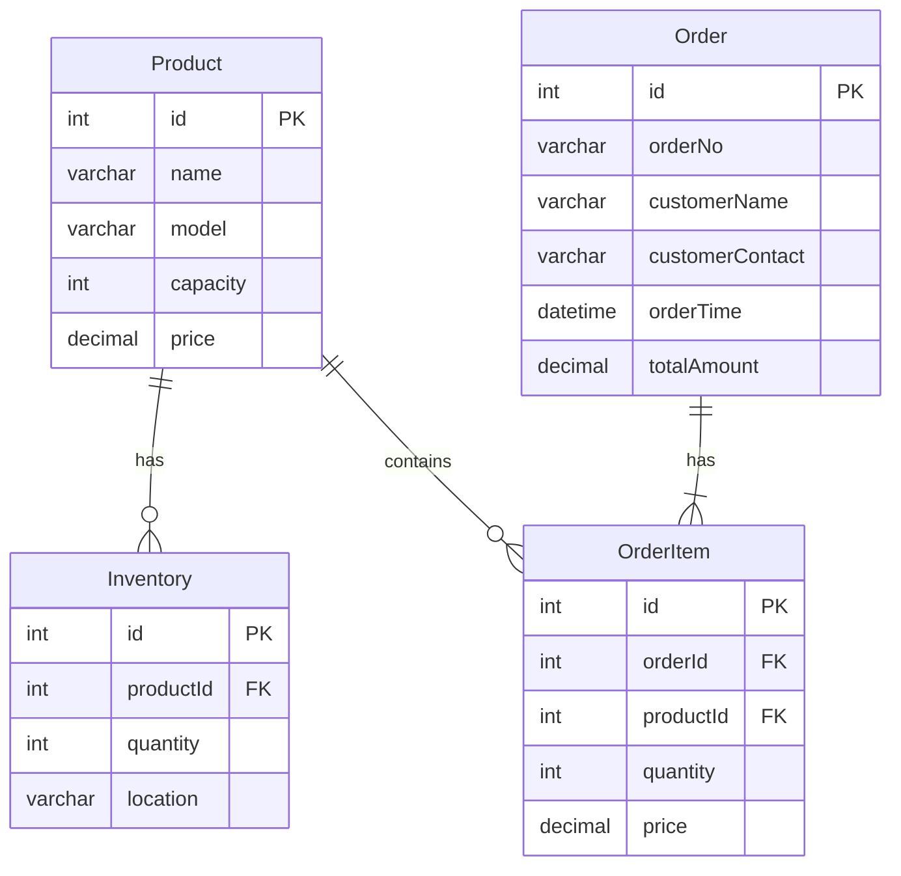

# 移动硬盘销售系统详细设计与具体代码实现

作者：禅与计算机程序设计艺术

## 1. 背景介绍

### 1.1 移动硬盘销售系统的需求背景

随着移动存储设备的普及,移动硬盘已成为人们日常生活中必不可少的数据存储工具。为了更好地服务客户,提高销售效率,开发一套完善的移动硬盘销售系统已成为众多硬件厂商的迫切需求。

### 1.2 系统目标

本文旨在设计并实现一个高效、易用、功能完备的移动硬盘销售系统。该系统将涵盖从商品管理、库存管理到订单处理、数据分析等全流程,力求为硬件厂商提供一站式的移动硬盘销售解决方案。

### 1.3 系统应用价值

- 提高移动硬盘销售效率,减少人工操作环节
- 加强库存管理,避免库存积压或短缺
- 优化订单处理流程,缩短交付周期
- 提供数据分析功能,助力管理决策

## 2. 核心概念与关系

### 2.1 商品(Product)

- 移动硬盘的基本信息,如名称、型号、容量、价格等
- 一个商品可对应多个库存记录和订单明细

### 2.2 库存(Inventory)

- 移动硬盘的库存数量和所在仓库位置信息  
- 一条库存记录对应一个商品

### 2.3 订单(Order) 

- 客户购买移动硬盘的交易记录
- 包含订单号、客户信息、下单时间、总金额等
- 一个订单包含多个订单明细

### 2.4 订单明细(OrderItem)

- 订单中每个商品的购买信息
- 包含商品、数量、单价等
- 隶属于一个订单

### 2.5 ER图



## 3. 核心算法原理与操作步骤

### 3.1 库存分配算法

#### 3.1.1 先入先出(FIFO)原则

- 按照库存记录的创建时间,优先使用最早入库的商品
- 保证最先入库的商品最先被售出,避免库存积压

#### 3.1.2 分配步骤

1. 按商品维度汇总订单数量
2. 查询该商品的库存记录,按创建时间升序排列
3. 依次从最早的库存记录中扣减,直到满足订单数量
4. 若库存不足,标记订单为缺货状态并触发补货流程

### 3.2 数据分析算法

#### 3.2.1 销量预测

- 采用时间序列分析方法,如ARIMA、Prophet等
- 根据历史销售数据,预测未来一段时间的销量走势
- 为生产计划和库存管理提供决策支持

#### 3.2.2 RFM模型

- 根据客户的最近购买时间(Recency)、购买频率(Frequency)和消费金额(Monetary)进行客户价值评估和细分
- 识别高价值客户,开展针对性营销

#### 3.2.3 关联规则

- 采用Apriori、FP-Growth等算法,发现商品之间的关联关系
- 挖掘搭配销售、交叉推荐等商机

## 4. 数学模型与公式

### 4.1 销量预测模型

#### 4.1.1 ARIMA模型

ARIMA(Auto Regressive Integrated Moving Average)是一种常用的时间序列预测模型。其一般形式为：

$$(1-\sum_{i=1}^p\phi_iB^i)(1-B)^dX_t=(1+\sum_{i=1}^q\theta_iB^i)\epsilon_t$$

其中:
- $p$: AR项阶数
- $d$: 差分阶数
- $q$: MA项阶数
- $\phi_i$: AR系数
- $\theta_i$: MA系数
- $B$: 滞后算子, $B^iX_t=X_{t-i}$
- $\epsilon_t$: 白噪声序列

### 4.2 RFM模型

RFM模型通过计算每个客户的R、F、M三个指标,对客户进行评分和分层。

- R(Recency): $(now - last\_order\_time) / time\_unit$
- F(Frequency): $total\_orders$
- M(Monetary): $total\_consumption$

根据每个指标划分等级(如1-5分),然后将三个指标的等级值拼接,得到每个客户的RFM评分(如555、431等)。评分越高,客户价值越大。

### 4.3 关联规则

#### 4.3.1 支持度(Support)

反映物品A和B同时出现的概率。

$$Support(A\Rightarrow B) = P(A \cap B) = \frac{count(A \cap B)}{N}$$

#### 4.3.2 置信度(Confidence)  

反映在包含物品A的交易中,同时包含物品B的概率。

$$Confidence(A\Rightarrow B) = P(B|A) = \frac{Support(A \cap B)}{Support(A)}$$

#### 4.3.3 提升度(Lift)

反映物品A和B的关联程度,即B对A的依赖程度。

$$Lift(A\Rightarrow B) = \frac{Confidence(A\Rightarrow B)}{Support(B)} = \frac{P(A \cap B)}{P(A)P(B)}$$

Lift>1时,A和B正相关;Lift<1时,A和B负相关;Lift=1时,A和B独立。

## 5. 项目实践:代码实例与说明

### 5.1 创建数据库表

```sql
-- 商品表
CREATE TABLE product (
  id INT PRIMARY KEY AUTO_INCREMENT,
  name VARCHAR(50) NOT NULL,
  model VARCHAR(50) NOT NULL,
  capacity INT NOT NULL,
  price DECIMAL(10,2) NOT NULL
);

-- 库存表  
CREATE TABLE inventory (
  id INT PRIMARY KEY AUTO_INCREMENT,
  product_id INT NOT NULL,
  quantity INT NOT NULL,
  location VARCHAR(50) NOT NULL,
  FOREIGN KEY (product_id) REFERENCES product(id)  
);

-- 订单表
CREATE TABLE `order` (
  id INT PRIMARY KEY AUTO_INCREMENT,
  order_no VARCHAR(20) NOT NULL,
  customer_name VARCHAR(50) NOT NULL,
  customer_contact VARCHAR(50) NOT NULL,
  order_time DATETIME NOT NULL,
  total_amount DECIMAL(10,2) NOT NULL
);

-- 订单明细表
CREATE TABLE order_item (
  id INT PRIMARY KEY AUTO_INCREMENT,
  order_id INT NOT NULL,
  product_id INT NOT NULL,
  quantity INT NOT NULL, 
  price DECIMAL(10,2) NOT NULL,
  FOREIGN KEY (order_id) REFERENCES `order`(id),
  FOREIGN KEY (product_id) REFERENCES product(id)
);
```

### 5.2 库存分配代码示例(Python)

```python
from collections import defaultdict

class InventoryAllocator:
    def __init__(self, inventories):
        self.inventories = inventories

    def allocate(self, order_items):
        # 按商品汇总订单数量
        product_quantities = defaultdict(int)
        for item in order_items:
            product_quantities[item['product_id']] += item['quantity']
        
        # 分配库存
        allocation = []
        for product_id, quantity in product_quantities.items():
            # 获取商品库存记录
            product_inventories = [
                inv for inv in self.inventories 
                if inv['product_id'] == product_id
            ]
            product_inventories.sort(key=lambda x: x['created_at'])  # 按创建时间排序
            
            allocated_quantity = 0
            for inventory in product_inventories:
                if quantity <= 0:
                    break
                
                # 从最早的库存记录中扣减  
                consume = min(quantity, inventory['quantity'])    
                quantity -= consume
                inventory['quantity'] -= consume
                allocated_quantity += consume
            
            # 记录分配结果
            allocation.append({
                'product_id': product_id,
                'allocated_quantity': allocated_quantity, 
                'lack_quantity': quantity  # 缺货数量
            })

        return allocation
```

### 5.3 RFM模型代码示例(SQL)

```sql
WITH order_stats AS (
  SELECT
    customer_id,
    MAX(order_time) AS last_order_time,
    COUNT(*) AS total_orders,
    SUM(total_amount) AS total_consumption  
  FROM `order`
  GROUP BY customer_id
),
rfm_scores AS (
  SELECT 
    customer_id,
    DATEDIFF(NOW(), last_order_time) / 30 AS recency,
    total_orders AS frequency,
    total_consumption AS monetary 
  FROM order_stats
),
rfm_levels AS (
  SELECT
    customer_id,
    CASE 
      WHEN recency <= 1 THEN 5
      WHEN recency <= 3 THEN 4
      WHEN recency <= 6 THEN 3
      WHEN recency <= 12 THEN 2
      ELSE 1
    END AS r_level,
    CASE
      WHEN frequency >= 10 THEN 5
      WHEN frequency >= 5 THEN 4  
      WHEN frequency >= 3 THEN 3
      WHEN frequency >= 2 THEN 2
      ELSE 1
    END AS f_level,
    CASE
      WHEN monetary >= 10000 THEN 5
      WHEN monetary >= 5000 THEN 4
      WHEN monetary >= 1000 THEN 3  
      WHEN monetary >= 500 THEN 2
      ELSE 1
    END AS m_level
  FROM rfm_scores    
)
SELECT
  customer_id,
  CONCAT(r_level, f_level, m_level) AS rfm
FROM rfm_levels;
```

## 6. 应用场景

移动硬盘销售系统可广泛应用于各类硬件厂商和电商平台,主要场景包括:

- **官方商城**: 厂商自建的线上销售渠道,借助销售系统实现商品管理、订单处理、客户服务等全流程数字化运作。
- **线下门店**: 通过系统收集门店销售数据,结合库存管理,优化调配,提升整体运营效率。 
- **电商平台**: 入驻天猫、京东等第三方平台时,销售系统可与平台进行订单、库存等信息对接,实现自动化处理。
- **大客户直销**: 针对企业大客户的采购需求,销售系统支持批量下单、按进度发货等个性化服务,提高客户满意度。

## 7. 工具与资源推荐

- 开发语言: Java、Python、Go等
- 数据库: MySQL、PostgreSQL等关系型数据库;MongoDB、Elasticsearch等NoSQL数据库 
- 开发框架: Spring Boot、Django、Gin等
- 库存管理: Odoo、OpenBoxes等开源ERP系统
- 数据分析: Pandas、NumPy、R   
- 机器学习: scikit-learn、TensorFlow、PyTorch
- 可视化: Tableau、PowerBI、ECharts
- 推荐资源:
  - 《利用Python进行数据分析》
  - 《统计学习方法》李航
  - Google Developer Guide: https://developers.google.com/machine-learning/guides
  - Towards Data Science: https://towardsdatascience.com

## 8. 总结: 发展趋势与挑战

移动硬盘销售系统的建设是硬件厂商数字化转型的重要一环。未来,其发展趋势和面临的挑战主要有:

1. **个性化**: 针对不同客户的喜好特征,利用推荐系统技术,提供个性化的商品推荐与优惠,提升客户关系。
2. **智能化**: 引入AI技术,实现销量预测、智能补货、客服机器人等,提高系统的自动化和智能化水平。
3. **全渠道融合**: 打通线上线下销售渠道,借助大数据分析,实现全渠道数据采集、库存调配、营销协同。
4. **供应链优化**: 从销售端触发,结合生产、采购环节,优化端到端供应链效率。
5. **数据安全与隐私**: 在数字化的同时,需高度重视数据安全风险,遵循GDPR等隐私保护条例,构建安全合规的数据管理机制。

## 9. 附录:常见问题与答疑

### 9.1 如何实现库存同步?

可采用定时或事件触发的方式,在系统内部或与外部系统(如ERP、WMS)之间进行库存增量或全量同步,保证各系统之间的库存数据一致性。

### 9.2 如何处理订单高并发?

- 在系统架构上采用微服务化设计,实现服务解耦和独立扩展。
- 对于库存、订单等关键数据,采用缓存预热、查询和更新分离等