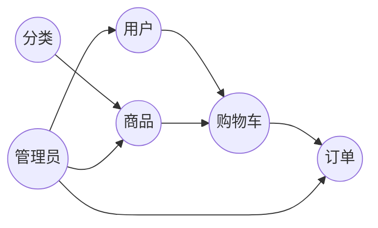

# 网上图书销售系统详细设计与具体代码实现

作者：禅与计算机程序设计艺术

## 1. 背景介绍

### 1.1. 电商行业的兴起与发展

近年来，随着互联网技术的快速发展和普及，电子商务行业蓬勃发展，网上购物已成为人们生活中不可或缺的一部分。网上图书销售作为电商行业的重要分支，也迎来了前所未有的发展机遇。

### 1.2. 网上图书销售系统的优势

与传统线下书店相比，网上图书销售系统具有诸多优势：

*   **便捷性:**  用户可以随时随地浏览、购买图书，不受时间和地域限制。
*   **丰富性:**  网上书店可以提供海量的图书资源，满足用户多样化的阅读需求。
*   **价格优势:**  由于运营成本较低，网上书店往往能够提供更优惠的图书价格。
*   **个性化推荐:**  系统可以根据用户的购买历史和阅读偏好，推荐个性化的图书，提升用户体验。

### 1.3. 系统设计目标

本系统旨在构建一个功能完善、安全可靠、易于维护的网上图书销售平台，为用户提供便捷、高效的图书购买服务，同时为商家提供高效的销售渠道和管理工具。

## 2. 核心概念与联系

### 2.1. 用户

*   **普通用户:**  注册用户，可以浏览图书、下单购买、查看订单、撰写书评等。
*   **管理员:**  负责系统管理，包括用户管理、商品管理、订单管理、数据统计等。

### 2.2. 商品

*   **图书:**  系统销售的核心商品，包含名称、作者、出版社、ISBN、价格、库存等信息。
*   **分类:**  图书按照不同的类别进行分类，例如文学、艺术、科技、教育等。

### 2.3. 订单

*   **订单:**  用户购买图书的记录，包含订单号、购买时间、商品信息、收货地址、支付状态等。
*   **支付:**  系统支持多种支付方式，例如支付宝、微信支付、银行卡等。

### 2.4. 购物车

*   **购物车:**  用户将想要购买的图书添加到购物车，方便统一结算。

### 2.5. 关系图

下图展示了系统中各个核心概念之间的联系：



## 3. 核心算法原理具体操作步骤

### 3.1. 用户注册登录

1.  用户填写注册信息，包括用户名、密码、邮箱等。
2.  系统验证用户信息，生成用户账号。
3.  用户使用用户名和密码登录系统。

### 3.2. 商品浏览与搜索

1.  用户浏览系统首页或分类页面，查看图书列表。
2.  用户可以通过关键字搜索特定图书。
3.  系统根据用户输入的关键字，匹配相关图书信息并展示。

### 3.3. 购物车操作

1.  用户将想要购买的图书添加到购物车。
2.  用户可以修改购物车中商品的数量或删除商品。
3.  用户确认购物车中的商品后，进行结算。

### 3.4. 订单生成与支付

1.  用户选择支付方式，填写收货地址等信息。
2.  系统生成订单，并跳转到支付页面。
3.  用户完成支付操作后，系统更新订单状态。

### 3.5. 订单管理

1.  用户可以查看自己的订单信息，包括订单状态、商品信息、收货地址等。
2.  管理员可以查看所有用户的订单信息，并进行处理，例如发货、退款等。

## 4. 数学模型和公式详细讲解举例说明

### 4.1. 库存管理模型

假设某图书的初始库存为 $I$，每日销售量为 $S$，则该图书在 $t$ 天后的剩余库存为：

$$
R(t) = I - S \cdot t
$$

**举例说明:**

某图书的初始库存为 100 本，每日销售量为 10 本，则该图书在 5 天后的剩余库存为：

$$
R(5) = 100 - 10 \cdot 5 = 50
$$

### 4.2. 销售额预测模型

假设某图书的每日销售量服从正态分布，均值为 $\mu$，标准差为 $\sigma$，则该图书在 $t$ 天内的销售额预测值为：

$$
E = t \cdot \mu \cdot P
$$

其中，$P$ 为图书单价。

**举例说明:**

某图书的每日销售量服从正态分布，均值为 20 本，标准差为 5 本，图书单价为 50 元，则该图书在 7 天内的销售额预测值为：

$$
E = 7 \cdot 20 \cdot 50 = 7000
$$

## 5. 项目实践：代码实例和详细解释说明

### 5.1. 技术选型

*   **编程语言:** Python
*   **Web框架:** Django
*   **数据库:** MySQL
*   **前端框架:** Bootstrap

### 5.2. 数据库设计

| 表名       | 字段名     | 数据类型     | 说明                                   |
| :---------- | :---------- | :----------- | :------------------------------------- |
| 用户表     | id         | int         | 用户ID，主键                           |
|            | username    | varchar(255) | 用户名                               |
|            | password    | varchar(255) | 密码                                   |
|            | email       | varchar(255) | 邮箱                                   |
| 商品表     | id         | int         | 商品ID，主键                           |
|            | name        | varchar(255) | 商品名称                               |
|            | author      | varchar(255) | 作者                                   |
|            | publisher   | varchar(255) | 出版社                               |
|            | isbn        | varchar(255) | ISBN                                   |
|            | price      | decimal(10,2) | 价格                                   |
|            | stock       | int         | 库存                                   |
|            | category_id | int         | 分类ID，外键                           |
| 分类表     | id         | int         | 分类ID，主键                           |
|            | name        | varchar(255) | 分类名称                               |
| 订单表     | id         | int         | 订单ID，主键                           |
|            | user_id    | int         | 用户ID，外键                           |
|            | create_time | datetime    | 创建时间                               |
|            | status      | int         | 订单状态，例如：未支付、已支付、已发货等 |
| 订单详情表 | id         | int         | 订单详情ID，主键                       |
|            | order_id    | int         | 订单ID，外键                           |
|            | product_id  | int         | 商品ID，外键                           |
|            | quantity    | int         | 购买数量                               |

### 5.3. 代码示例

**用户模型:**

```python
from django.db import models

class User(models.Model):
    username = models.CharField(max_length=255, unique=True)
    password = models.CharField(max_length=255)
    email = models.EmailField(unique=True)

    def __str__(self):
        return self.username
```

**商品模型:**

```python
from django.db import models

class Product(models.Model):
    name = models.CharField(max_length=255)
    author = models.CharField(max_length=255)
    publisher = models.CharField(max_length=255)
    isbn = models.CharField(max_length=255, unique=True)
    price = models.DecimalField(max_digits=10, decimal_places=2)
    stock = models.IntegerField()
    category = models.ForeignKey('Category', on_delete=models.CASCADE)

    def __str__(self):
        return self.name
```

**订单模型:**

```python
from django.db import models

class Order(models.Model):
    user = models.ForeignKey('User', on_delete=models.CASCADE)
    create_time = models.DateTimeField(auto_now_add=True)
    status = models.IntegerField(default=0)

    def __str__(self):
        return f'Order #{self.id}'
```

## 6. 实际应用场景

### 6.1. 线上书店

该系统可以用于构建各种类型的线上书店，例如：

*   综合性线上书店
*   专业性线上书店
*   二手书交易平台

### 6.2. 出版社官网

出版社可以利用该系统搭建自己的官方网站，销售自出版的图书。

### 6.3. 图书馆管理系统

图书馆可以利用该系统管理馆藏图书，并提供线上借阅服务。

## 7. 总结：未来发展趋势与挑战

### 7.1. 个性化推荐

随着人工智能技术的不断发展，个性化推荐将成为网上图书销售系统的重要发展趋势，系统可以根据用户的阅读偏好、购买历史等信息，推荐更加精准的图书，提升用户体验。

### 7.2. 大数据分析

通过收集用户行为数据，系统可以进行大数据分析，了解用户的阅读需求和市场趋势，为商家提供决策支持。

### 7.3. 移动端适配

随着移动互联网的普及，用户 increasingly 使用移动设备访问互联网，因此系统需要进行移动端适配，提供更好的用户体验。

### 7.4. 信息安全

网上图书销售系统涉及用户的个人信息和支付信息，因此信息安全至关重要，系统需要采取相应的安全措施，保障用户信息安全。

## 8. 附录：常见问题与解答

### 8.1. 用户注册失败

**问题:** 用户注册时提示注册失败。

**解答:** 可能的原因包括：

*   用户名或邮箱已被注册。
*   密码不符合要求，例如长度不足或未包含特殊字符。
*   网络连接问题。

**解决方法:**

*   检查用户名和邮箱是否已被注册。
*   确保密码符合要求。
*   检查网络连接是否正常。

### 8.2. 无法添加商品到购物车

**问题:** 用户无法将商品添加到购物车。

**解答:** 可能的原因包括：

*   商品已售罄。
*   用户未登录系统。
*   网络连接问题。

**解决方法:**

*   检查商品库存是否充足。
*   确保用户已登录系统。
*   检查网络连接是否正常。

### 8.3. 支付失败

**问题:** 用户支付失败。

**解答:** 可能的原因包括：

*   银行卡余额不足。
*   支付密码错误。
*   网络连接问题。

**解决方法:**

*   检查银行卡余额是否充足。
*   确保支付密码正确。
*   检查网络连接是否正常。
