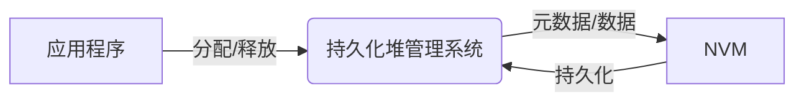

# 一种面向非易失内存的持久化堆管理系统设计与实现

作者：禅与计算机程序设计艺术

## 1. 背景介绍
### 1.1 研究背景与意义
#### 1.1.1 非易失内存技术发展现状
#### 1.1.2 持久化堆管理的重要性
#### 1.1.3 面向非易失内存的持久化堆管理研究意义

### 1.2 国内外研究现状
#### 1.2.1 国外研究现状综述
#### 1.2.2 国内研究现状综述
#### 1.2.3 现有研究的不足之处

### 1.3 本文的研究内容和创新点
#### 1.3.1 研究内容概述  
#### 1.3.2 技术创新点
#### 1.3.3 文章结构安排

随着大数据时代的到来，传统的基于DRAM的内存系统已经难以满足海量数据低延迟持久化存储的需求。近年来，非易失内存（Non-Volatile Memory, NVM）技术的兴起为解决这一难题提供了新的思路。NVM具有非易失性、字节可寻址、高性能、高密度等优点，有望成为未来主流的持久化存储介质。然而，如何高效地管理NVM空间，特别是如何设计与实现面向NVM优化的持久化堆管理系统，是充分发挥NVM潜力必须攻克的难题。

传统的堆管理系统主要面向易失性内存（如DRAM）设计，旨在提高内存分配与回收的速度。为适应NVM的特性，学术界已经展开了一系列研究，提出了各种面向NVM的持久化堆管理方案。例如，PMDK[1]引入事务机制以保证NVM操作的原子性与持久性，nvm_malloc[2]通过在NVM中维护分配元数据实现crash consistency，HPE[3]利用局部性原理结合NVM和DRAM进行混合分配。尽管这些方案在一定程度上改进了NVM堆管理的性能，但它们或多或少存在着并发伸缩性差、恢复效率低、碎片率高等不足。因此，设计一个高性能、强一致、易恢复、低碎片的持久化堆管理系统仍是NVM领域亟需突破的关键问题。

本文旨在针对现有NVM持久化堆管理系统的局限性，提出一种全新的设计与实现方案。主要研究内容包括：
1) 引入多版本并发控制（MVCC），无锁实现读写并发，提高伸缩性；
2) 设计Persistent SkipList结构对堆元数据进行索引，实现快速恢复；
3) 采用best-fit和bump-pointer相结合的混合分配策略，降低碎片率；
4) 在真实NVM硬件平台上实现原型系统并测试，验证性能与正确性。

本文的主要创新点在于：首次将MVCC引入持久化堆管理，在保证强一致性的同时大幅提高并发伸缩性；首次采用Persistent SkipList对堆元数据索引，实现亚线性恢复时间；针对NVM的独特特性定制了混合分配算法，在保证低碎片率的同时兼顾分配性能。

本文后续章节安排如下：第2节介绍NVM与持久化堆管理相关的核心概念与二者联系；第3节详细阐述所提出堆管理系统的核心算法与关键实现步骤；第4节对算法中用到的关键数据结构与数学原理进行建模分析；第5节给出原型系统的架构设计与核心代码实现；第6节讨论所提出方法的实际应用场景；第7节总结全文工作并展望后续研究方向；第8节列举一些常见问答以帮助读者理解。

## 2. 核心概念与联系
### 2.1 非易失内存(NVM)
#### 2.1.1 NVM简介与特点
非易失内存(Non-Volatile Memory, NVM)是一类即使在断电情况下仍能保持数据不丢失的新型存储器件。与传统存储介质相比，NVM具有以下特点[4][5]：

1) 非易失性 (Non-Volatility) - 数据掉电不丢失
2) 字节寻址 (Byte-Addressability) - 可像内存一样按字节寻址访问
3) 高性能 (High-Performance) - 读写延迟低，远超过SSD/HDD
4) 高密度 (High-Density) - 单位面积存储密度高，可大幅提高容量
5) 低功耗 (Low-Power) - 空闲时几乎不耗能，有利于绿色节能

常见的NVM技术包括相变存储器(PCM)、阻变存储器(ReRAM)、磁阻存储器(MRAM)等。它们在材料特性、器件结构、工作原理上存在差异，但对外呈现的特性较为一致。

#### 2.1.2 NVM 应用领域
NVM拥有存储级的持久性、内存级的性能，天然适合应用于融合存储与内存的领域，主要包括[6][7]：

1) 持久化存储 - 相比固态硬盘等传统存储介质，NVM的读写性能可提升1-2个数量级。因此，NVM可作为低延迟的持久化存储设备，加速数据密集型应用，如数据库、搜索引擎、图处理等。

2) 内存扩展 - 由于容量成本优势，NVM可用于扩展系统的可用内存空间。通过将不常访问的内存页迁移到NVM中，可显著降低系统的内存使用压力，提升整体性能。 

3) 持久化内存 - NVM兼具持久化存储和字节寻址能力，可以构建持久化内存池，供应用程序直接分配和使用，无需再经过文件系统等存储栈，大大简化了持久化数据访问的编程模型。

4) 检查点/恢复 - 利用NVM的持久性和字节寻址特性，可将应用程序或系统运行时状态直接Checkpoint到NVM中。发生故障时，可从NVM快速恢复，避免了传统基于磁盘的检查点/恢复机制的高额外开销。

### 2.2 持久化堆管理
#### 2.2.1 堆的基本概念
堆(Heap)是应用程序动态分配内存的区域。与静态分配的全局变量、栈变量不同，堆对象的生命周期由程序显式控制。标准C库提供了malloc/free函数簇，C++提供了new/delete运算符用于在堆上分配和回收内存。堆管理器负责在堆区域中组织和维护空闲内存，响应上层应用的分配、释放请求。高效的堆管理对于提高应用程序的整体性能至关重要。

#### 2.2.2 持久化堆的特殊性
传统的堆管理器如glibc ptmalloc[8]、jemalloc[9]等，主要面向易失性内存(DRAM)设计，关注点在于优化分配与回收速度、降低碎片率等。将其直接应用于NVM环境会遇到以下问题：

1) 一致性(Consistency) - 持久化堆的元数据如空闲列表等也要持久化到NVM中，需要保证元数据与实际对象的一致性。传统堆分配器并不保证掉电后数据的一致性。

2) 并发伸缩(Scalability) - NVM的读写延迟高于DRAM，粗粒度的堆锁会严重限制伸缩性。需要细粒度的并发控制机制以提高多线程下的分配与回收性能。  

3) 恢复效率(Recoverability) - 系统重启后需从NVM中恢复持久化堆的运行时状态。传统分配器需要扫描整个堆区域重建元数据，代价高昂。持久化堆需支持快速恢复。

4) 碎片管理(Fragmentation) - NVM容量有限且写入放大会加速磨损，需要有效控制外碎片。传统分配器的碎片整理在NVM中代价更高。

综上，有必要专门针对NVM的特性设计与实现持久化堆管理系统。这是NVM系统软件栈的核心组件之一。

### 2.3 NVM与持久化堆管理的关系

图示NVM与持久化堆管理之间的关系：



NVM为持久化堆管理提供了物理存储基础设施，持久化堆管理系统负责在NVM之上实现面向应用的内存分配、回收等堆管理功能，并保证NVM中数据的一致性、持久性、高性能访问。二者相辅相成，缺一不可。

具体而言，持久化堆管理与NVM的交互体现在以下几方面：

1) 分配对象持久化 - 应用程序通过持久化堆管理系统分配的对象要持久化到NVM中，保证断电后数据不丢失。这需要利用NVM的持久化特性。

2) 元数据持久化 - 持久化堆管理系统自身维护的如空闲列表、分配位图等堆元数据也要持久化到NVM中。这样重启恢复时才能重建一致的内存管理状态。

3) 字节寻址访问 - NVM支持字节粒度的直接加载/存储，与内存具有相同的编程模型。持久化堆管理系统可通过普通指针直接访问NVM，无需再经过读写文件系统的繁琐过程。

4) 一致性维护 - NVM虽具备持久性，但其读写过程仍可能因为系统crash而中断。持久化堆管理系统需采取如redo/undo log等机制保证NVM数据的原子性、一致性。

5) 并发控制 - 多线程环境下多个线程可能同时分配/释放NVM堆中的对象，需采取细粒度锁、无锁、事务等并发控制机制，以提高NVM堆的并发访问性能。

6) 碎片整理 - NVM空间有限且写入代价高，持久化堆管理系统需尽可能减少内外碎片。可采取NVM优化的碎片整理算法，在线整理、重定位对象，平衡NVM空间利用率与整理开销。

## 3. 核心算法原理与关键实现步骤
本节详细阐述本文提出的持久化堆管理系统的核心算法原理与关键实现步骤，主要包括面向NVM的MVCC并发控制机制、面向恢复的Persistent SkipList元数据索引结构、面向NVM的混合内存分配策略等。

### 3.1 面向NVM的MVCC并发控制
#### 3.1.1 MVCC基本原理
多版本并发控制(Multi-Version Concurrency Control, MVCC)[10]是一种无锁并发控制方法。其基本思想是：写操作不直接对原数据进行修改，而是生成一个新版本；读操作根据时间戳判断应该读取哪个版本。这样，读写操作天然不会相互阻塞。MVCC广泛应用于数据库系统，如PostgreSQL、MySQL的InnoDB引擎等。

在持久化堆管理中引入MVCC，主要考虑有以下几点：
1) NVM的读写延迟高于DRAM，粗粒度堆锁会使并发性能恶化。细粒度锁又难以彻底避免死锁风险且代码复杂，引入额外开销。 
2) NVM的容量相比DRAM更大，支持存储多个版本的堆对象。
3) MVCC允许读写操作无锁执行，只在提交时才需要检查冲突。非常适合读多写少的持久化堆访问特征。

#### 3.1.2 持久化堆的MVCC设计
在所设计的持久化堆管理系统中，每个堆对象由以下字段组成：
```cpp
struct PersistentObject {
    void*  addr;     // 堆对象起始地址
    size_t size;     // 对象大小
    void*  next;     // 下一版本指针
    int    version;  // 对象版本号
};
```
其中，next指针指向该对象的下一个版本，version表示版本号。初始版本的next为NULL，version为1。

分配对象时，先从NVM中分配一块合适大小的内存区域，将其addr和size填入PersistentObject结构体。然后将该结构体插入全局的版本链表中。版本链表按对象地址哈希，每个桶用一个原子指针维护，指向桶内最新