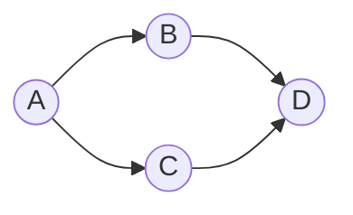
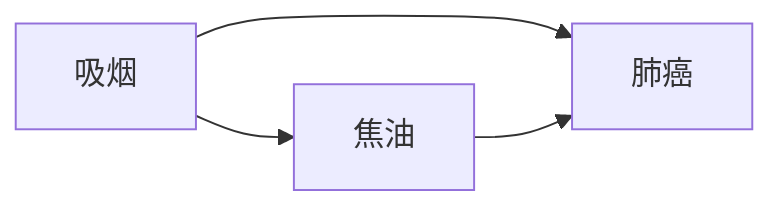

# 因果推理与因果学习原理与代码实战案例讲解

作者：禅与计算机程序设计艺术

## 1. 背景介绍
### 1.1 因果推理与因果学习的定义
因果推理是指根据已知的因果关系,对未知事件进行预测和解释的过程。它是人工智能领域的重要研究方向之一,旨在让机器像人类一样具备因果思维和推理能力。而因果学习则是指从数据中自动发现和学习因果关系的过程,是实现因果推理的基础。
### 1.2 因果推理与因果学习的重要性
在许多领域,如医疗诊断、金融风控、营销策略等,因果关系的发现和利用至关重要。传统的机器学习方法大多基于相关性,很难区分相关性和因果性,容易得出错误的结论。因果推理与因果学习能够帮助我们理解事物之间的内在机制,做出更加符合因果规律的预测和决策。
### 1.3 因果推理与因果学习的发展历程
因果推理与因果学习源于统计学和计量经济学,后来逐渐发展成为人工智能的一个分支。早期的代表性工作有 Judea Pearl 的 Do-Calculus 和 Biwei Huang 的 Causal Bayesian Networks。近年来,随着深度学习的发展,涌现出很多融合了深度学习和因果推断的新方法,如Yoshua Bengio 等人提出的 Causal-Effect VAE。

## 2. 核心概念与联系
### 2.1 傅里叶级数
因果推理与傅里叶级数有着紧密的联系。傅里叶级数是把周期函数表示成三角函数之和的级数,在信号处理、图像压缩等领域应用广泛。因果推理借鉴了傅里叶级数的思想,将因果效应分解为多个更基本的成分。
### 2.2 条件概率
条件概率是指在给定某个事件发生的条件下,另一个事件发生的概率。它是概率论的基本概念。在因果推理中,条件概率用于表示在某些原因发生的条件下,结果发生的概率。通过比较不同情形下条件概率的变化,可以判断原因和结果间的因果关系。
### 2.3 贝叶斯网络 
贝叶斯网络是一种用于表示变量间依赖关系的概率图模型。在贝叶斯网络中,节点表示变量,有向边表示变量间的依赖关系,每个节点附有一个条件概率表。贝叶斯网络常用于因果推理,其因果结构可以直观地表示各个原因和结果间的因果关系。
### 2.4 Khan 算法
Khan 算法是一种用于在贝叶斯网络中进行推理的精确推断算法。给定部分变量的观测值,Khan 算法可以计算后验概率分布。在因果推理中,我们往往需要在已知部分原因或结果的情况下,推断其他变量取值的概率分布,这可以通过 Khan 算法高效实现。
### 2.5 Causal DAG
Causal DAG （Causal Directed Acyclic Graph）是用于表示因果关系的一种特殊的有向无环图。在 Causal DAG 中,节点表示变量,有向边 A->B 表示 A 是 B 的直接原因。Causal DAG 清晰地刻画了因果机制,但实际应用中因果图往往是未知且需要学习的。

## 3. 核心算法原理具体操作步骤
### 3.1 基于观测数据的因果效应估计
#### 3.1.1 背景知识回顾
在很多场景下,我们无法控制变量,只能被动地观测数据。此时因果效应的估计面临许多挑战,如 confounding bias。
#### 3.1.1 具体步骤
1. 根据领域知识,绘制 Causal DAG,表示变量间的因果关系
2. 收集观测数据,假设为 $(X_i,T_i,Y_i),i=1,\ldots,n$,其中 $X_i$ 为协变量,$T_i$ 为处理变量,$Y_i$ 为结果变量
3. 通过机器学习模型(如神经网络)拟合处理分配机制: $\hat{P}(T|X)$ 
4. 训练另一个机器学习模型(如神经网络)估计条件期望: $\hat{E}(Y|T,X)$
5. 使用 $\hat{P}(T|X)$ 和 $\hat{E}(Y|T,X)$ 计算个体处理效应和平均处理效应:

$$ITE_i=\hat{E}(Y_i|T_i=1,X_i)-\hat{E}(Y_i|T_i=0,X_i)$$

$$ATE=\frac{1}{n}\sum_{i=1}^nIET_i$$

这种方法本质上是用机器学习模型做倾向性评分,可以在一定程度上减轻 confounding bias。

### 3.2 利用 Causal VAE 学习因果表示
#### 3.2.1 背景知识回顾
Causal VAE 是一种基于变分自编码器的生成式模型,可以无监督地学习因果表示。它将观测数据 $X$ 视作由 noise variable $Z$ 和 causal variable $C$ 生成,其中 $C$ 中的每一维对应一个潜在的原因。
#### 3.2.2 具体步骤
1. 搭建 Causal VAE 的网络结构。编码器 $q_\phi(z,c|x)$ 将数据 $X$ 编码为 $Z$ 和 $C$,解码器 $p_\theta(x|z,c)$ 从 $Z$ 和 $C$ 重构 $X$
2. 定义优化目标,即变分下界(ELBO):

$$L(\theta,\phi;x)=\mathbb{E}_qlog\frac{p(x,z,c)}{q(z,c|x)}$$

3. 用基于梯度的优化算法最大化 ELBO,如 Adam,同时优化编码器和解码器的参数
4. 解码器训练好后,固定参数,优化 $\hat{c}=argmax_cp_\theta(x|\hat{z},c)$,得到 $x$ 对应的因果表示 $\hat{c}$
5. 利用因果表示 $\hat{c}$ 进行下游的因果推理和预测任务

Causal VAE 学到的 $C$ 可以解释为数据的潜在原因,从而赋予 VAE 因果语义,使之能进行因果推理。

### 3.3 基于强化学习的因果推理策略学习
#### 3.3.1 背景知识回顾
因果推理的一个重要应用是辅助决策。给定目标,自动地学习一个因果推理策略来指导行动,有助于实现目标。设计合理的强化学习算法可以学习到优秀的策略。
#### 3.3.2 具体步骤
1. 将因果推理问题形式化为 MDP。状态为系统当前的因果知识,动作为对某个变量的干预,奖励为干预导致目标的改善程度
2. 设计 Q-learning 算法。定义 Q 函数 $Q(s,a)$ 为在状态 $s$ 下采取动作 $a$ 的期望未来奖励
3. 初始化 Q 函数,如用神经网络拟合
4. 与环境交互,在每个状态 $s$ 根据 $Q(s,a)$ 选择动作,如 $\epsilon$-greedy 策略:

$$\pi(s)=\begin{cases}argmax_aQ(s,a), & with prob. 1-\epsilon \\ random\ a, & with prob. \epsilon\end{cases}$$

5. 收集$(s,a,r,s')$ 的轨迹数据,更新 Q 函数:

$$Q(s,a)\leftarrow Q(s,a)+\alpha[r+\gamma max_{a'}Q(s',a')-Q(s,a)]$$

6. 重复 4-5,直到 Q 函数收敛

学到的 $Q(s,a)$ 定义了一个因果推理策略,告诉我们在给定因果知识的情况下,应该如何干预变量,以达到理想的结果。

## 4. 数学模型和公式详细讲解举例说明
### 4.1 Causal Bayesian Networks 的数学定义
Causal Bayesian Network 是一个二元组 $\mathcal{G}=(V,E)$,其中:
- $V$ 是节点(变量)的集合
- $E$ 是有向边的集合,$E\subset V\times V$。如果 $(X,Y)\in E$,称 $X$ 是 $Y$ 的父节点
- $P(V)$ 是联合概率分布,满足马尔可夫性: $P(X_i|Pa(X_i))=P(X_i|V\backslash X_i)$

根据全概率公式,CBN 的联合分布可以分解为:

$$P(X_1,\ldots,X_n)=\prod_{i=1}^nP(X_i|Pa(X_i))$$

下图是一个简单的 CBN 示例:



其联合分布为:
$$\begin{aligned}
P(A,B,C,D)&=P(D|B,C)P(B|A)P(C|A)P(A)\\
&=P(D|B,C)P(B|A)P(C|A)\sum_aP(A=a)
\end{aligned}$$

### 4.2 Do-Calculus 介入运算的三条规则

Do-Calculus 是 Pearl 提出的,用于推导因果效应的三条代数规则。设 $X,Y,Z$ 为不相交的变量集合,$G$ 为因果图,$G_{\underline{X}}$ 表示将 $X$ 的所有入边删除后的图。三条规则如下:
- 规则一:

$$P(y|do(x),z,w)=P(y|do(x),w),if\ (Y\bot Z|X,W)_{G_{\underline{X}}}$$

- 规则二:

$$P(y|do(x),do(z),w)=P(y|do(x),z,w),if\ (Y\bot Z|X,W)_{G_{\underline{X}\underline{Z}}}$$

- 规则三:

$$P(y|do(x),do(z),w)=P(y|do(x),w),if\ (Y\bot Z|X,W)_{G_{\underline{X},\overline{Z(W)}}}$$

其中 $Z(W)$ 表示 $W$ 在 $G_{\underline{X}}$ 中的所有 $Z-$后代。

以经典的吸烟-肺癌-焦油为例:



关键问题是: $P(cancer|do(smoke))=?$ 

利用规则二,有:
$$\begin{aligned}
P(cancer|do(smoke))&=\sum_tP(cancer|do(smoke),tar=t)P(tar=t|do(smoke))\\
&=\sum_tP(cancer|smoke,tar=t)P(tar=t|smoke)
\end{aligned}$$

上式表明,即使我们无法直接控制吸烟者肺部的焦油量,也可以根据观测数据估计吸烟对肺癌的因果作用。

## 5. 项目实践：代码实例和详细解释说明
下面我们用 PyTorch 实现一个简单的 Causal VAE,用于学习 MNIST 数据集的因果表示。
```python
import torch
import torch.nn as nn
import torch.optim as optim
from torch.utils.data import DataLoader
from torchvision import datasets, transforms

# 定义编码器网络
class Encoder(nn.Module):
    def __init__(self, latent_dim):
        super(Encoder, self).__init__()
        self.latent_dim = latent_dim
        self.fc1 = nn.Linear(784, 512)
        self.fc2 = nn.Linear(512, 256)
        self.fc3 = nn.Linear(256, latent_dim*2)
        
    def forward(self, x):
        x = torch.relu(self.fc1(x))
        x = torch.relu(self.fc2(x))
        x = self.fc3(x)
        
        # 将输出分成两半,分别表示均值和对数标准差
        mu = x[:, :self.latent_dim]
        log_std = x[:, self.latent_dim:]
        
        return mu, log_std

# 定义解码器网络  
class Decoder(nn.Module):
    def __init__(self, latent_dim):
        super(Decoder, self).__init__()
        self.fc1 = nn.Linear(latent_dim, 256)
        self.fc2 = nn.Linear(256, 512)
        self.fc3 = nn.Linear(512, 784)
        
    def forward(self, z):
        z = torch.relu(self.fc1(z))
        z = torch.relu(self.fc2(z))
        z = torch.sigmoid(