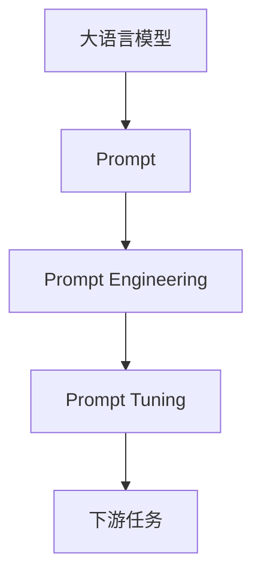

## 1. 背景介绍

### 1.1  大语言模型的崛起

近年来，随着深度学习技术的飞速发展，大语言模型（Large Language Models，LLMs）应运而生，并在自然语言处理领域取得了革命性的突破。LLMs基于海量文本数据训练，能够理解和生成人类语言，展现出惊人的能力，例如：

*   **文本生成**: 写诗歌、小说、新闻报道等各种类型的文本。
*   **机器翻译**: 将一种语言翻译成另一种语言。
*   **问答系统**: 回答用户提出的问题。
*   **代码生成**: 根据指令生成代码。

### 1.2 Prompt Learning的兴起

传统的深度学习模型通常需要大量的标注数据进行训练，而获取和标注数据成本高昂。Prompt Learning作为一种新的学习范式，通过设计合适的 prompt，将下游任务转化为语言模型能够理解的形式，从而避免了对大量标注数据的依赖。

### 1.3  Prompt Learning的优势

*   **减少数据标注成本**: Prompt Learning 可以利用少量样本进行学习，甚至不需要任何标注数据。
*   **提高模型泛化能力**: Prompt Learning 可以将知识从一个领域迁移到另一个领域，提高模型的泛化能力。
*   **增强模型可解释性**: Prompt Learning 可以将模型的决策过程转化为人类可理解的语言，增强模型的可解释性。

## 2. 核心概念与联系

### 2.1  Prompt

Prompt是指用于引导语言模型生成特定输出的文本片段。它可以是一个问题、一段描述、一段代码或者其他任何形式的文本。

### 2.2  Prompt Engineering

Prompt Engineering 是指设计和优化 prompt 的过程，其目标是找到能够最大程度激发语言模型能力的 prompt。

### 2.3  Prompt Tuning

Prompt Tuning 是一种微调技术，通过调整 prompt 中的参数来提高模型在下游任务上的性能。

### 2.4  关系图



## 3. 核心算法原理具体操作步骤

### 3.1  Prompt构造

*   **任务描述**: 清晰地描述下游任务的目标，例如"将中文翻译成英文"。
*   **输入输出格式**: 指定输入和输出的格式，例如"输入: {中文句子}，输出: {英文句子}"。
*   **示例**: 提供一些示例，帮助语言模型理解任务要求，例如"输入: 今天天气很好，输出: The weather is good today."。

### 3.2  Prompt模板

*   **完形填空**: 在 prompt 中留空，让语言模型填空，例如"中国的首都是___"。
*   **问题回答**: 将下游任务转化为问题，例如"中国的首都是哪里？"。
*   **指令**: 直接指示语言模型执行任务，例如"将以下中文句子翻译成英文: 今天天气很好。"。

### 3.3  Prompt Tuning

*   **离散 Prompt Tuning**: 将 prompt 视为一组离散的 token，通过优化这些 token 来提高模型性能。
*   **连续 Prompt Tuning**: 将 prompt 视为一组连续的向量，通过优化这些向量来提高模型性能。

## 4. 数学模型和公式详细讲解举例说明

### 4.1  语言模型

大语言模型通常基于 Transformer 架构，其核心是自注意力机制。自注意力机制可以捕捉文本序列中不同位置之间的依赖关系，从而更好地理解和生成语言。

### 4.2  Prompt Tuning

Prompt Tuning 可以看作是在语言模型的输入端添加一个额外的参数矩阵，用于调整 prompt 的表示。

$$
\mathbf{h}_i = \text{LN}(\mathbf{x}_i + \mathbf{W}_p \mathbf{p}_i)
$$

其中，$\mathbf{h}_i$ 是 prompt 的最终表示，$\mathbf{x}_i$ 是 prompt 的原始表示，$\mathbf{W}_p$ 是 prompt tuning 参数矩阵，$\mathbf{p}_i$ 是 prompt 模板。

### 4.3  举例说明

假设我们想要使用 Prompt Tuning 来训练一个情感分类模型，prompt 模板为"The sentiment of this movie review is: {sentiment}"。我们可以将 prompt tuning 参数矩阵 $\mathbf{W}_p$ 初始化为一个随机矩阵，然后使用梯度下降算法来优化 $\mathbf{W}_p$，使得模型能够准确地预测电影评论的情感。

## 5. 项目实践：代码实例和详细解释说明

### 5.1  使用Hugging Face Transformers库进行Prompt Learning

```python
from transformers import pipeline

# 加载预训练语言模型
model_name = "bert-base-uncased"
nlp = pipeline("fill-mask", model=model_name)

# 构造 prompt
prompt = "The sentiment of this movie review is: {sentiment}."

# 输入文本
text = "This movie is absolutely amazing!"

# 使用语言模型进行预测
result = nlp(prompt.format(sentiment="<mask>"), text=text)

# 输出预测结果
print(result[0]['token_str'])
```

### 5.2  代码解释

*   `transformers` 库提供了方便的 Prompt Learning 工具。
*   `pipeline` 函数可以创建一个用于特定任务的管道。
*   `fill-mask` 任务可以用于预测文本中的缺失词语。
*   `prompt.format(sentiment="<mask>")` 将 prompt 中的 `{sentiment}` 替换为 `<mask>`，表示需要预测的词语。
*   `result[0]['token_str']` 获取预测的词语。

## 6. 实际应用场景

### 6.1  文本生成

*   **故事创作**:  利用 Prompt Learning 生成创意故事，为作家提供灵感。
*   **新闻撰写**:  根据事件描述，自动生成新闻报道。
*   **诗歌创作**:  根据主题或情感，生成优美的诗歌。

### 6.2  机器翻译

*   **低资源翻译**:  利用 Prompt Learning 提高低资源语言的翻译质量。
*   **领域特定翻译**:  针对特定领域，例如法律、医学等，进行翻译。

### 6.3  问答系统

*   **知识库问答**:  利用 Prompt Learning 构建基于知识库的问答系统。
*   **开放域问答**:  利用 Prompt Learning 构建能够回答开放域问题的问答系统。

## 7. 总结：未来发展趋势与挑战

### 7.1  Prompt Engineering 自动化

*   开发自动化的 Prompt Engineering 方法，降低 Prompt Learning 的使用门槛。

### 7.2  多模态 Prompt Learning

*   将 Prompt Learning 应用于多模态数据，例如图像、视频等。

### 7.3  Prompt Learning 的理论基础

*   深入研究 Prompt Learning 的理论基础，解释其工作原理。

### 7.4  Prompt Learning 的伦理问题

*   关注 Prompt Learning 的伦理问题，例如数据偏见、模型滥用等。

## 8. 附录：常见问题与解答

### 8.1  如何选择合适的 Prompt 模板？

*   根据下游任务的特点选择合适的 Prompt 模板。
*   参考已有研究和最佳实践。
*   进行实验验证不同 Prompt 模板的性能。

### 8.2  如何进行 Prompt Tuning？

*   使用梯度下降算法优化 Prompt Tuning 参数。
*   选择合适的学习率和优化器。
*   监控训练过程，避免过拟合。

### 8.3  Prompt Learning 的局限性？

*   Prompt Engineering 需要一定的专业知识和经验。
*   Prompt Learning 的性能受 Prompt 模板的影响较大。
*   Prompt Learning 的可解释性仍有待提高。
