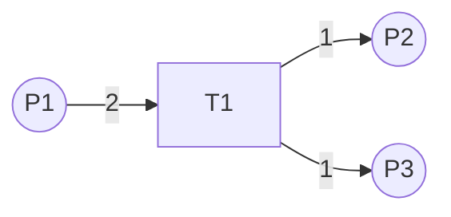

# 工作流引擎子系统详细设计与具体代码实现

作者：禅与计算机程序设计艺术

## 1. 背景介绍

### 1.1 工作流引擎概述
#### 1.1.1 工作流引擎的定义
工作流引擎是一种软件系统，用于定义、创建和管理工作流程的执行。它负责解释流程定义，控制流程实例的执行，并与其他系统交互以执行各个流程步骤。

#### 1.1.2 工作流引擎的特点
工作流引擎具有以下特点：
- 流程驱动：工作流引擎基于预定义的流程模型来驱动业务流程的执行。
- 灵活性：工作流引擎能够适应业务流程的变化，支持动态修改流程定义。
- 可扩展性：工作流引擎提供了开放的架构，易于与其他系统集成，支持扩展自定义功能。
- 可监控性：工作流引擎提供了实时监控和跟踪流程执行状态的能力，便于管理和优化。

### 1.2 工作流引擎的应用场景
工作流引擎广泛应用于各个行业和领域，典型的应用场景包括：
- 业务流程自动化：通过工作流引擎实现业务流程的自动化执行，提高效率和准确性。
- 审批与协作：工作流引擎支持多人参与的审批和协作流程，促进团队协同工作。
- 订单处理：利用工作流引擎自动处理订单，包括订单审核、配送、发货等环节。
- 客户服务：工作流引擎可用于客户服务流程的管理，如投诉处理、问题解决等。

## 2. 核心概念与联系

### 2.1 流程定义
流程定义是对业务流程的静态建模，描述了流程的结构、活动、参与者、数据等要素。它通常使用一种标准的建模语言，如BPMN（Business Process Model and Notation）来表示。

### 2.2 流程实例
流程实例是流程定义的一次具体执行，代表了一个业务流程从开始到结束的完整生命周期。每个流程实例都有唯一的标识，并维护着自己的状态和数据。

### 2.3 活动
活动是流程定义中的基本构建块，表示流程中的一个具体任务或步骤。活动可以是手动执行的任务，也可以是自动执行的程序。

### 2.4 网关
网关用于控制流程的分支和聚合。常见的网关类型包括排他网关（XOR）、并行网关（AND）和包容网关（OR）。网关根据条件判断流程的执行路径。

### 2.5 参与者
参与者指流程中的角色或用户，他们负责执行分配给自己的任务。参与者可以是个人、群组或系统。

### 2.6 任务
任务是分配给参与者的工作单元，表示需要完成的具体操作。任务可以是用户任务、服务任务、脚本任务等类型。

### 2.7 事件
事件表示流程执行过程中发生的重要时刻，如启动事件、结束事件、定时事件等。事件可以触发流程的开始、中断或结束。

## 3. 核心算法原理与具体操作步骤

### 3.1 流程定义的解析
#### 3.1.1 解析BPMN文件
工作流引擎需要能够解析BPMN格式的流程定义文件。通常使用XML解析库如DOM或SAX来解析BPMN的XML文件，提取流程的元素和结构信息。

#### 3.1.2 构建流程对象模型
解析得到的流程信息需要转换为引擎内部使用的流程对象模型，包括流程、活动、网关、事件等对象。这些对象之间的关系也需要建立，如活动之间的连线、网关的分支条件等。

### 3.2 流程实例的管理
#### 3.2.1 创建流程实例
当启动一个新的流程时，引擎根据流程定义创建一个新的流程实例对象，并初始化实例的状态和数据。

#### 3.2.2 流程实例的持久化
为了支持长时间运行的流程和系统崩溃后的恢复，流程实例的状态和数据需要持久化到数据库中。引擎使用对象-关系映射（ORM）技术将流程实例对象保存到关系型数据库中。

#### 3.2.3 流程实例的状态转换
流程实例在执行过程中会经历不同的状态，如运行中、暂停、完成、终止等。引擎根据流程定义和当前的执行情况来管理实例的状态转换。

### 3.3 活动的执行
#### 3.3.1 任务的分配
当流程执行到一个活动时，引擎根据流程定义中的参与者配置，将任务分配给相应的用户或群组。任务分配可以基于角色、规则或自定义的分配策略。

#### 3.3.2 任务的执行
参与者通过工作流引擎提供的用户界面或API来执行分配给自己的任务。引擎监控任务的执行状态，并在任务完成后触发后续的流程步骤。

#### 3.3.3 服务任务的调用
对于自动执行的服务任务，引擎通过调用外部服务或执行预定义的脚本来完成任务。服务的调用可以是同步的或异步的，引擎需要管理服务调用的生命周期和异常处理。

### 3.4 流程控制
#### 3.4.1 顺序流
顺序流表示活动之间的执行顺序，引擎根据顺序流的定义来决定下一个要执行的活动。

#### 3.4.2 网关分支
当流程执行到一个网关时，引擎根据网关的类型和条件来决定流程的分支路径。排他网关根据条件选择一个分支，并行网关会同时激活所有分支，包容网关会根据条件选择一个或多个分支。

#### 3.4.3 事件处理
引擎需要监听和处理流程执行过程中的各种事件，如定时事件、消息事件、错误事件等。事件的触发可以改变流程的执行路径或状态。

## 4. 数学模型和公式详细讲解举例说明

### 4.1 Petri网模型
Petri网是一种用于建模和分析并发系统的数学工具，也广泛用于工作流建模。一个Petri网由以下元素组成：
- 库所（Place）：表示系统的状态或条件，用圆圈表示。
- 变迁（Transition）：表示系统的事件或操作，用矩形表示。
- 弧（Arc）：表示库所和变迁之间的关系，用有向弧表示。
- 令牌（Token）：表示系统的资源或数据，存在于库所中。

Petri网的执行规则如下：
1. 当一个变迁的所有输入库所都有足够的令牌时，该变迁是启用的。
2. 启用的变迁可以触发（fire），从输入库所移除令牌，并向输出库所添加令牌。
3. 变迁的触发是原子操作，不能被中断。

例如，考虑以下简单的Petri网模型：



其中，库所P1有2个初始令牌。当变迁T1触发时，它会消耗P1的2个令牌，并在P2和P3各生成1个令牌。

Petri网可以用数学方式表示为一个五元组：

$PN = (P, T, F, W, M_0)$

其中：
- $P$是有限的库所集合。
- $T$是有限的变迁集合，$P \cap T = \emptyset$。
- $F \subseteq (P \times T) \cup (T \times P)$是弧的集合。
- $W: F \rightarrow \mathbb{N}$是弧的权重函数。
- $M_0: P \rightarrow \mathbb{N}$是初始标识，表示每个库所中初始令牌的数量。

Petri网的状态转换可以用以下规则描述：

$$
M(p_i) \geq W(p_i, t_j) \Rightarrow t_j \text{ 启用}
$$

$$
M'(p_i) = M(p_i) - W(p_i, t_j) + W(t_j, p_i), \forall p_i \in P
$$

其中，$M(p_i)$表示库所$p_i$中的令牌数，$W(p_i, t_j)$表示从库所$p_i$到变迁$t_j$的弧的权重，$W(t_j, p_i)$表示从变迁$t_j$到库所$p_i$的弧的权重。

Petri网模型可以用于工作流的建模和分析，如死锁检测、可达性分析、性能评估等。工作流引擎可以基于Petri网模型来执行和管理工作流。

### 4.2 BPMN流程建模
BPMN（Business Process Model and Notation）是一种标准的图形化建模语言，用于描述业务流程。BPMN模型由以下主要元素组成：
- 事件（Event）：表示流程中发生的事情，如开始事件、结束事件、中间事件等。
- 活动（Activity）：表示流程中的任务或子流程，可以是用户任务、服务任务、脚本任务等。
- 网关（Gateway）：表示流程的分支和聚合点，如排他网关、并行网关、包容网关等。
- 顺序流（Sequence Flow）：表示活动之间的执行顺序，用带箭头的实线表示。
- 消息流（Message Flow）：表示不同参与者之间的消息传递，用带箭头的虚线表示。

下面是一个简单的BPMN流程示例：

```mermaid
graph LR
    start((开始)) --> task1[用户任务]
    task1 --> gateway1{条件网关}
    gateway1 --条件1--> task2[服务任务]
    gateway1 --条件2--> task3[脚本任务]
    task2 --> end((结束))
    task3 --> end
```

BPMN模型可以映射到Petri网模型，例如：
- 活动映射为变迁。
- 顺序流映射为库所和弧。
- 排他网关映射为变迁和库所，根据条件选择一个输出路径。
- 并行网关映射为变迁和库所，所有输入路径都要满足才能触发。

通过将BPMN模型转换为Petri网，可以利用Petri网的数学分析方法来验证和优化流程模型。

## 5. 项目实践：代码实例和详细解释说明

下面以Java语言为例，展示工作流引擎的部分核心代码实现。

### 5.1 流程定义解析

```java
public class BpmnParser {
    public ProcessDefinition parse(InputStream inputStream) {
        // 使用XML解析库解析BPMN文件
        Document document = parseXmlFile(inputStream);
        
        // 创建流程定义对象
        ProcessDefinition processDefinition = new ProcessDefinition();
        
        // 解析流程元素
        Element processElement = document.getRootElement();
        processDefinition.setId(processElement.getAttribute("id"));
        processDefinition.setName(processElement.getAttribute("name"));
        
        // 解析活动
        List<Element> activityElements = processElement.elements("task");
        for (Element activityElement : activityElements) {
            ActivityDefinition activity = parseActivity(activityElement);
            processDefinition.addActivity(activity);
        }
        
        // 解析网关
        List<Element> gatewayElements = processElement.elements("gateway");
        for (Element gatewayElement : gatewayElements) {
            GatewayDefinition gateway = parseGateway(gatewayElement);
            processDefinition.addGateway(gateway);
        }
        
        // 解析顺序流
        List<Element> sequenceFlowElements = processElement.elements("sequenceFlow");
        for (Element sequenceFlowElement : sequenceFlowElements) {
            SequenceFlowDefinition sequenceFlow = parseSequenceFlow(sequenceFlowElement);
            processDefinition.addSequenceFlow(sequenceFlow);
        }
        
        return processDefinition;
    }
    
    // 解析活动
    private ActivityDefinition parseActivity(Element activityElement) {
        // ...
    }
    
    // 解析网关
    private GatewayDefinition parseGateway(Element gatewayElement) {
        // ...
    }
    
    // 解析顺序流
    private SequenceFlowDefinition parseSequenceFlow(Element sequenceFlowElement) {
        // ...
    }
}
```

以上代码展示了如何使用XML解析库解析BPMN文件，并将解析得到的流程元素转换为引擎内部的流程