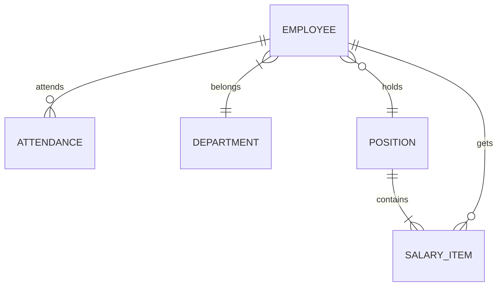

# 工资管理系统详细设计与具体代码实现

作者：禅与计算机程序设计艺术

## 1. 背景介绍

工资管理是每个企业的重要组成部分,对于保证企业的正常运作、员工的积极性以及企业的健康发展都有着至关重要的作用。传统的工资管理方式往往依赖于手工操作和大量的人力,效率低下且容易出错。因此,开发一套功能完善、高效可靠的工资管理系统就显得尤为必要。

本文将以某企业的工资管理需求为例,详细介绍工资管理系统的详细设计过程,包括需求分析、概要设计、详细设计以及具体的代码实现。旨在为有类似需求的企业提供一套完整的解决方案。

### 1.1 工资管理系统的目标

工资管理系统的主要目标包括:

- 提高工资管理的效率和准确性
- 减少人工成本,实现工资管理流程的自动化
- 强化数据安全,严格权限控制,保护员工隐私
- 提供丰富的统计和查询功能,为企业决策提供数据支持
- 灵活可配置,适应企业的个性化需求

### 1.2 工资管理系统的应用场景

工资管理系统主要应用于以下场景:

- 员工信息管理:包括员工的个人信息、岗位信息、工资标准等
- 考勤管理:与考勤系统对接,自动计算员工的出勤天数、加班时长等
- 工资计算:根据员工的出勤、绩效、职级等因素自动计算工资
- 工资发放:与银行系统对接,自动将工资发放到员工账户
- 统计与查询:提供工资条、工资汇总等常用报表,支持自定义查询  

### 1.3 技术选型

考虑系统的安全性、稳定性、可扩展性等因素,本系统采用以下技术:

- 开发语言:Java
- 数据库:MySQL
- 前端框架:Vue.js
- 后端框架:Spring Boot
- 权限框架:Shiro
- 工作流引擎:Flowable

## 2. 核心概念与关系

工资管理涉及的核心概念如下:

### 2.1 员工

指与公司签订劳动合同的所有人员。主要属性包括:

- 工号(员工的唯一标识)
- 姓名
- 部门
- 岗位 
- 入职日期
- 银行卡号
- ...

一个部门包含多名员工,一名员工只能属于一个部门。

### 2.2 部门  

指公司的组织单元。主要属性包括:

- 部门编号
- 部门名称
- 上级部门
- ...

部门之间存在上下级关系,构成一个树形结构。

### 2.3 岗位

指員工所担任的职务。主要属性包括:  

- 岗位编号
- 岗位名称
- 岗位职级
- 岗位工资标准
- ...

一个岗位可对应多名员工,一名员工只能担任一个岗位。

### 2.4 工资项

指组成员工工资的各项具体项目,包括:

- 基本工资
- 岗位工资
- 绩效工资  
- 加班工资
- 津贴
- 社保
- 个税
- ...

### 2.5 考勤

指员工的出勤情况,包括:  

- 出勤天数
- 旷工天数
- 休假天数
- 加班小时数
- ...

考勤数据与工资计算直接相关。

### 2.6 E-R图

下图展示了员工、部门、岗位、工资项、考勤这几个核心概念之间的关系:



## 3. 核心算法与流程

工资管理系统的核心流程是每月工资的计算和发放。这个过程可分为以下步骤:

### 3.1 读取员工数据

从员工信息表中读取所有员工的基本信息,主要包括:

- 员工工号
- 员工姓名
- 员工部门  
- 员工岗位
- 员工银行卡号
- ...

### 3.2 读取考勤数据

从考勤系统中获取每位员工的月度考勤数据,主要包括:

- 出勤天数
- 旷工天数
- 事假天数
- 病假天数  
- 加班小时数
- ...

### 3.3 计算基本工资

基本工资是跟员工的岗位职级相关的固定工资。计算公式为:

$基本工资 = 岗位工资标准 \times 出勤天数 / 月标准工作日天数$ 

其中,月标准工作日天数一般设定为22天。

### 3.4 计算加班工资

加班工资是根据员工的加班时长和加班工资标准来计算的。计算公式为:

$加班工资 = 加班小时数 \times 加班工资标准$

加班工资标准一般设定为岗位小时工资标准的1.5~3倍。 

### 3.5 计算绩效工资 

绩效工资根据员工的考核等级和绩效基数来计算。计算公式为:

$绩效工资 = 绩效基数 \times 绩效系数$

其中,绩效基数一般与员工的岗位职级挂钩,绩效系数则根据考核等级来确定,如A等级对应1.5,B等级对应1,C等级对应0.5,D等级没有绩效工资。

### 3.6 计算应发工资 

应发工资是由基本工资、加班工资、绩效工资等构成的员工税前工资。计算公式为:  

$应发工资 = 基本工资 + 加班工资 + 绩效工资 + 津贴 - 缺勤扣款$

### 3.7 计算个人所得税

工资薪金所得需要缴纳个人所得税。计算公式为:

$个税 = (应发工资 - 各项社会保险费 - 起征点) \times 税率 - 速算扣除数$

其中,起征点为5000元,税率和速算扣除数如下:

| 级数 | 全月应纳税所得额        | 税率(%) | 速算扣除数 |
| ---- | ----------------------- | ------- | ---------- |
| 1    | 不超过3,000元的部分     | 3       | 0          |
| 2    | 超过3,000元至12,000元   | 10      | 210        |
| 3    | 超过12,000元至25,000元  | 20      | 1410       |
| 4    | 超过25,000元至35,000元  | 25      | 2660       |
| 5    | 超过35,000元至55,000元  | 30      | 4410       |
| 6    | 超过55,000元至80,000元  | 35      | 7160       |
| 7    | 超过80,000元的部分      | 45      | 15160      |

### 3.8 计算实发工资

实发工资是员工税后到手的工资。计算公式为:

$实发工资 = 应发工资 - 个人所得税 - 各项社会保险费$

### 3.9 数据汇总与审核

根据上述算法计算出每位员工的应发工资和实发工资后,需要进行汇总与审核,主要包括:

- 计算各部门的工资总额,与预算进行比对
- 计算工资总额,与人力成本预算进行比对 
- 对工资明细进行抽查,检查计算是否准确
- 工资总额与人工计提金额进行核对

### 3.10 数据导出与发放

审核通过后,需要将工资数据导出并发放工资。主要步骤包括:  

- 将工资明细导出,发送给员工进行确认 
- 将实发工资数据导出并加密,提交到银行进行发放
- 将工资表导出至财务系统,进行会计处理
- 将工资明细导入人力资源系统存档

## 4. 数学模型与公式

工资计算涉及的主要数学模型和公式包括:

### 4.1 出勤天数计算

$出勤天数 = 月理论工作日 - 缺勤天数$

其中,缺勤天数包括事假、病假、旷工等,月理论工作日一般为22天。

例如:小明某月请事假1天,病假2天,其出勤天数为:

$出勤天数 = 22 - (1 + 2) = 19 (天)$

### 4.2 时薪计算

$时薪 = 岗位月工资标准 \div 月理论工作日 \div 8$   

例如:小明的岗位月工资标准为8000元,则其时薪为:

$时薪 = 8000 \div 22 \div 8 \approx 45.45 (元/小时)$

### 4.3 加班工资计算

$加班工资 = 加班小时数 \times 加班工资系数 \times 时薪$

其中, 工作日加班工资系数为1.5,休息日加班为2,法定节假日加班为3。

例如:小明某月工作日加班10小时,休息日加班8小时,则其加班工资为:

$加班工资 = 10 \times 1.5 \times 45.45 + 8 \times 2 \times 45.45 \approx 1409 (元)$

### 4.4 绩效工资计算

$绩效工资 = 绩效基数 \times 绩效考核系数$

绩效考核系数:A(优秀)为1,B(良好)为0.8,C(合格)为0.6,D(不合格)为0。

例如:小明绩效考核为B,绩效基数为2000元,则其绩效工资为:

$绩效工资 = 2000 \times 0.8 = 1600 (元)$

### 4.5 应发工资计算

$应发工资 = 基本工资 + 加班工资 + 绩效工资 + 津贴 - 缺勤扣款$

例如:小明的基本工资为5000元,加班工资为1000元,绩效工资为1000元,交通补贴为500元,餐补为1000元,旷工1天扣500元,则其应发工资为:

$应发工资 = 5000 + 1000 + 1000 + 500 + 1000 - 500 = 8000 (元)$

### 4.6 个人所得税计算

个人所得税起征点为5000元,超过部分按梯度征收,具体计算公式如下:

$$
个人所得税 = 
\begin{cases}  
0 & 应纳税所得额 \leq 5000 \\
(应纳税所得额 - 5000) \times 3\% & 5000 < 应纳税所得额 \leq 8000 \\
(应纳税所得额 - 8000) \times 10\% + 210 & 8000 < 应纳税所得额 \leq 17000 \\
(应纳税所得额 - 17000) \times 20\% + 1410 & 17000 < 应纳税所得额 \leq 30000 \\
(应纳税所得额 - 30000) \times 25\% + 2660 & 30000 < 应纳税所得额 \leq 40000 \\
(应纳税所得额 - 40000) \times 30\% + 4410 & 40000 < 应纳税所得额 \leq 60000 \\
(应纳税所得额 - 60000) \times 35\% + 7160 & 60000 < 应纳税所得额 \leq 85000 \\
(应纳税所得额 - 85000) \times 45\% + 15160 & 应纳税所得额 > 85000
\end{cases}
$$

例如:小张应发工资为18000元,三险一金为3000元,则其应缴个人所得税为:

$$
\begin{aligned}
应纳税所得额 &= 18000 - 3000 = 15000 (元) \\  
个人所得税 &= (15000 - 8000) \times 10\% + 210 = 910 (元)
\end{aligned}
$$

## 5. 代码实现

下面结合上述算法和数学模型,使用Java实现工资计算的核心代码。

### 5.1 员工类

```java
@Data
public class Employee {
    private Integer id;
    private String name;
    private String dept;
    private String post;
    private BigDecimal baseSalary;
    private BigDecimal meritPay;
    private BigDecimal overtimePay;
    private BigDecimal bonus;
    private BigDecimal socialSecurity;
    