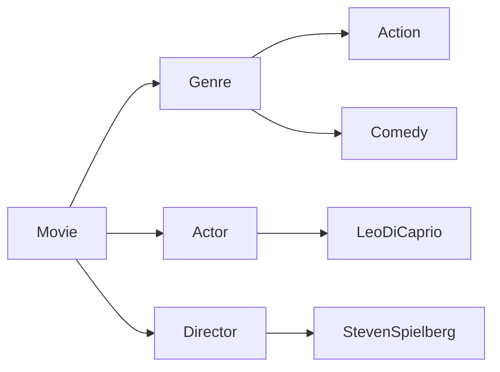
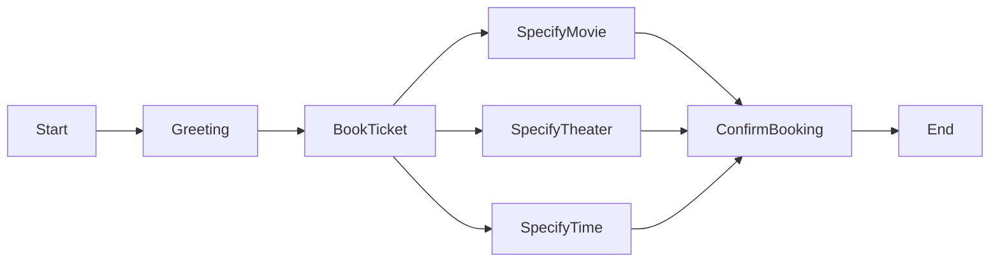

# 构建AI代理：从需求收集到工作流实现

作者：禅与计算机程序设计艺术

## 1. 背景介绍
### 1.1 AI代理的发展历程
#### 1.1.1 AI代理的起源与定义
#### 1.1.2 AI代理技术的发展阶段
#### 1.1.3 AI代理在各领域的应用现状

### 1.2 构建AI代理的意义
#### 1.2.1 提高工作效率与自动化程度
#### 1.2.2 改善用户体验与服务质量
#### 1.2.3 推动人工智能技术的发展

### 1.3 构建AI代理面临的挑战
#### 1.3.1 技术难点与瓶颈
#### 1.3.2 伦理与安全问题
#### 1.3.3 用户接受度与市场推广

## 2. 核心概念与联系
### 2.1 AI代理的定义与分类
#### 2.1.1 AI代理的定义与特点
#### 2.1.2 AI代理的分类体系
#### 2.1.3 不同类型AI代理的异同点

### 2.2 AI代理的关键技术
#### 2.2.1 自然语言处理(NLP)
#### 2.2.2 知识图谱与推理
#### 2.2.3 多模态交互与对话系统
#### 2.2.4 强化学习与自适应优化

### 2.3 AI代理与其他AI技术的关系
#### 2.3.1 AI代理与机器学习的关系
#### 2.3.2 AI代理与知识工程的关系
#### 2.3.3 AI代理与人机交互的关系

## 3. 核心算法原理具体操作步骤
### 3.1 需求收集与分析
#### 3.1.1 明确AI代理的应用场景与目标用户
#### 3.1.2 收集用户需求与业务流程
#### 3.1.3 提取关键特征与任务要素

### 3.2 知识库构建
#### 3.2.1 知识源选择与数据获取
#### 3.2.2 知识表示与本体构建
#### 3.2.3 知识融合与冲突消解
#### 3.2.4 知识库更新与维护

### 3.3 对话流程设计
#### 3.3.1 对话意图识别
#### 3.3.2 上下文理解与多轮对话管理
#### 3.3.3 对话生成与信息检索
#### 3.3.4 个性化与情感交互

### 3.4 任务规划与执行
#### 3.4.1 任务分解与建模
#### 3.4.2 任务规划算法与优化
#### 3.4.3 任务执行与监控反馈
#### 3.4.4 异常处理与错误恢复

## 4. 数学模型和公式详细讲解举例说明
### 4.1 知识表示模型
#### 4.1.1 本体模型与语义网络
Knowledge representation is a crucial aspect in constructing AI agents. Ontology models and semantic networks are commonly used for structuring and organizing domain knowledge. An ontology $O$ can be defined as a tuple:

$$O=<C,R,I>$$

Where $C$ is a set of concepts, $R$ denotes relationships between concepts, and $I$ represents instances. Semantic networks use nodes to represent concepts and edges to denote relationships. For example, consider a simple ontology for a movie domain:



Here concepts like Movie, Genre, Actor are linked via relationships, and Leo DiCaprio is an instance of Actor concept.

#### 4.1.2 逻辑表示与推理
Logic-based representations like first-order logic (FOL) allow reasoning over knowledge. FOL formulas are constructed using constants, variables, functions, and predicates. For instance, to state that all comedies are movies:

$\forall x  Comedy(x) \rightarrow Movie(x)$

Reasoning algorithms like forward chaining and backward chaining can then derive new facts from existing knowledge bases.

#### 4.1.3 概率图模型
Probabilistic graphical models like Bayesian Networks capture uncertain knowledge. A Bayesian Network is a directed acyclic graph where nodes represent random variables and edges denote conditional dependencies. The joint distribution is factored as:

$P(X_1,...,X_n)=\prod_{i=1}^{n} P(X_i | Parents(X_i))$

Inference algorithms like variable elimination and belief propagation are used to compute posterior probabilities given evidence.

### 4.2 对话管理模型 
#### 4.2.1 有限状态机
Finite-state machines are simple models for dialogue management, where each state represents a dialogue state and edges denote transitions based on user actions. For example:



#### 4.2.2 基于框架的对话管理
Frame-based dialogue managers use slots to represent key information to be collected during the conversation. For instance, a frame for movie ticket booking may have slots like:
- Movie Name 
- Theater Location
- Show Time
- Number of Tickets

The dialogue agent tries to fill these slots by asking relevant questions and then performs the required action.

#### 4.2.3 基于强化学习的对话策略优化
Reinforcement learning can be used to optimize dialogue strategies for maximizing long-term rewards. The dialogue
can be modeled as a Markov Decision Process (MDP) defined by a tuple:

$(S, A, P, R, \gamma)$ 

$S$ is the set of states representing dialogue contexts
$A$ denotes the set of actions the agent can take (e.g. asking for a slot, confirming values, or providing information)
$P$ represents state transition probabilities 
$R$ is the reward function that scores each dialogue exchange
$\gamma$ is the discount factor

Algorithms like Q-learning find an optimal dialogue policy $\pi^*$ that maximizes expected cumulative discounted rewards:

$$Q^*(s,a)=R(s,a)+\gamma \sum_{s' \in S} P(s'|s,a) \max_{a'\in A} Q^*(s',a')$$

### 4.3 自然语言处理模型
#### 4.3.1 序列标注模型
Sequence labeling models like Hidden Markov Models (HMM), Conditional Random Fields (CRF) are used for tasks like Named Entity Recognition (NER), part-of-speech (POS) tagging which are essential for natural language understanding in AI agents.

Given an input word sequence $x=(x_1,...,x_n)$, the goal is to predict a label sequence $y=(y_1,...,y_n)$. A first-order linear-chain CRF defines a conditional probability:

$$p(y|x)=\frac{1}{Z(x)} \prod_{i=1}^{n} \exp(\sum_{j} \lambda_j f_j(y_{i-1},y_i,x,i) ) $$ 

$f_j$ are feature functions, $\lambda_j$ are learnable weights and $Z(x)$ is a normalization constant. Viterbi decoding is used to find the most likely label sequence.

#### 4.3.2 语言模型与文本生成
Language Models (LM) learn to predict the probability distribution of word sequences. N-gram models estimate probabilities based on preceding context:

$P(w_1,w_2,...,w_n)=\prod_{i=1}^{n} P(w_i | w_{i-(n-1)},...,w_{i-1})$

Neural language models using architectures like RNNs, LSTMs, Transformers learn distributed representations to model long-range dependencies. Given a context vector $h$, the probability of the next word is given by:

$$P(w_t|w_{<t})= \text{softmax}(W_o \cdot h + b_o)$$

Testing hunk divisions:

$W_o$ and $b_o$ are learnable parameters. LMs can be used for text generation by iteratively sampling words from the learned conditional distribution.

#### 4.3.3 上下文表示学习
Learning good representations of dialog context is crucial for AI agents to understand and engage in coherent conversations. Architectures like Hierarchical Recurrent Encoder-Decoder (HRED) models can capture the hierarchical nature of dialog context. 

At the utterance-level, an encoder RNN maps each utterance to a vector representation:

$$h_i^{utt} = \text{RNN}_{utt}(w_{i,1},...,w_{i,n}) $$

The dialog-level encoder RNN operates over utterance vectors to capture inter-utterance dependencies:

$$h_j^{dial} =\text{RNN}_{dial}(h_1^{utt},...,h_j^{utt})$$

The decoder RNN generates the agent response conditioned on the final dialog context vector.

### 4.4 任务规划与优化模型
#### 4.4.1 层次化任务规划
Hierarchical Task Network (HTN) planning decomposes high-level tasks into lower-level subtasks. An HTN planner is defined by a tuple:

$$<S, O, M>$$

$S$ is the set of states
$O$ is a set of operators that map states to states
$M$ is a set of methods that decompose non-primitive tasks into subtasks

Given an initial state $s_0$ and a goal task $g$, HTN planning finds a sequence of operators that achieve the goal task by recursively decomposing non-primitive tasks using applicable methods.

#### 4.4.2 基于约束的规划优化
Constraint-based planners model planning problems using variables, their domains and constraints. For a set of variables $X=\{x_1,..., x_n\}$ with domains $D=\{D_1,..., D_n\}$, a Constraint Satisfaction Problem (CSP) is defined by:

- A set of variables $X$  
- A set of Domains $D$
- A set of constraints $C$ where each $c_i(x_{i1},...,x_{ik})$ specifies allowed combinations of values

The planner seeks a variable assignment that satisfies all constraints. Optimization variants like Constraint Optimization Problems (COP) also specify an objective function $f(X)$ to be maximized or minimized.

## 5. 项目实践：代码实例和详细解释说明
To illustrate the implementation of AI agents, let's walk through a simple movie ticket booking chatbot using Python and the Rasa framework. Rasa provides tools for building conversational AI agents.

### 5.1 安装依赖库

```bash
pip install rasa
```

### 5.2 定义意图和实体
We define intents and entities in a file called `nlu.yml`:

```yaml
intents:
  - greet
  - bye
  - book_movie_ticket
  - specify_movie
  - specify_theater
  - specify_time

entities:
  - movie
  - theater
  - time
```

Here we have defined intents like `greet`, `book_movie_ticket` and entities like `movie`, `theater` that are relevant for our use case.

### 5.3 定义对话流程
The dialogue flow is defined in `stories.yml` file:

```yaml
stories:
- story: book movie happy path
  steps:
  - intent: greet
  - action: utter_greet
  - intent: book_movie_ticket
  - action: movie_form
  - active_loop: movie_form
  - slot_was_set:
    - requested_slot: movie
  - slot_was_set:
    - movie: "Avengers: Endgame"
  - slot_was_set:
    - requested_slot: theater
  - slot_was_set:
    - theater: "AMC"
  - slot_was_set:
    - requested_slot: time
  - slot_was_set:
    - time: "8 PM"
  - active_loop: null
  - action: utter_confirm
  - action: utter_goodbye
```

This defines a sample conversation flow for booking a movie ticket, specifying the movie name, theater and show time.

### 5.4 实现自定义Action
We can define custom actions in a file called `actions.py`:

```python
from typing import Text, List, Any, Dict

from rasa_sdk import Tracker, FormValidationAction, Action
from rasa_sdk.types import DomainDict
from rasa_sdk.executor import CollectingDispatcher

class ValidateMovieForm(FormValidationAction):
    def name(self) -> Text:
        return "validate_movie_form"

    def validate_movie(
        self,
        slot_value: Any, 
        dispatcher: CollectingDispatcher,
        tracker: Tracker,
        domain: DomainDict ) -> Dict[Text, Any]:
        """Validate movie value."""

        if slot_value.lower() in ["avengers: endgame", "the lion king"]:
            return {"movie": slot_value}
        else:
            dispatcher.utter_message(text=f"Sorry, the movie {slot_value} is not available. Please try another movie.")
            return {"movie": None} 

    def validate_theater(
        self,
        slot_value: Any,
        dispatcher: CollectingDispatcher,
        tracker: Tracker,
        domain: DomainDict,
    ) -> Dict[Text, Any]:
        """Validate theater value."""

        if slot_value.upper() in ["AMC", "REGAL"]:
            return {"theater": slot_value}
        else:
            dispatcher.utter_message(text=f"Sorry, {slot_value} theater is not available. Please try another theater.")
            return {"theater": None}

    def validate_time(
        self,
        slot_value: Any,
        dispatcher: CollectingDispatcher,
        tracker: Tracker,
        domain: DomainDict,
    ) -> Dict[Text, Any]:
        """Validate time value."""
        
        if slot_value in ["7 PM", "8 PM", "9 PM"]:
            return {"time": slot_value}
        else:
            dispatcher.utter_message(text=f"Sorry, the show time {slot_value} is not available. Please try another time.")
            return {"time": None}

class ActionConfirm(Action):
    def name(self) -> Text:
        return "action_confirm"
    
    def run(self, dispatcher: CollectingDispatcher,
            tracker: Tracker,
            domain: Dict[Text, Any]) -> List[Dict[Text, Any]]:

        movie = tracker.get_slot("movie")
        theater = tracker.get_slot("theater")  
        time = tracker.get_slot("time")

        msg = f"You have booked a ticket for the movie {movie} at {theater} for the {time} show. Enjoy your movie!"
        dispatcher.utter_message(text=msg)

        return []
```

Here we define form validation actions to validate the slot values provided by the user and an action to confirm the booking details.

### 5.5 训练与测试
To train the model:

```bash
rasa train
```

To test the chatbot in shell:

```bash
rasa