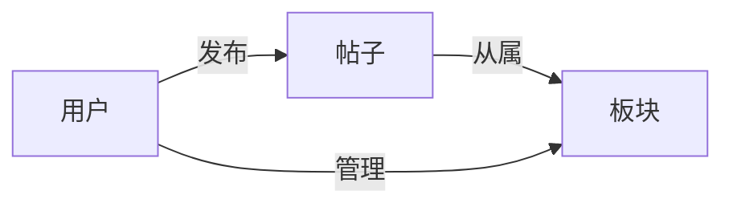
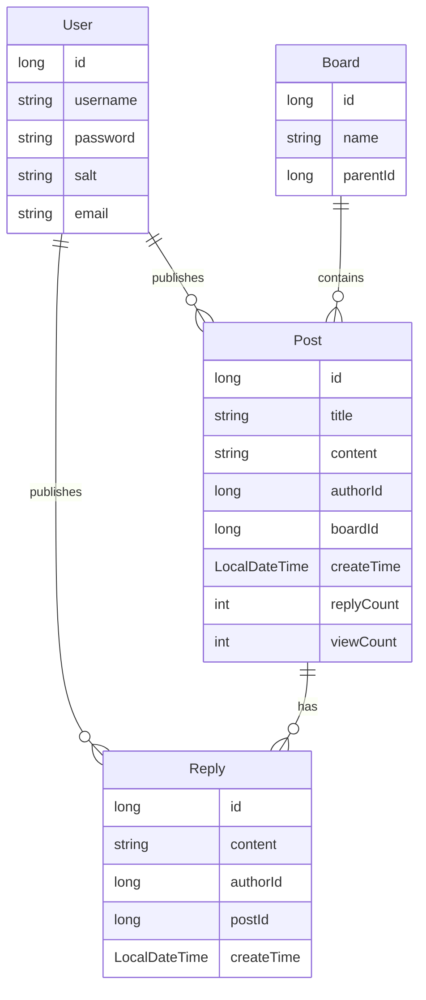

# 论坛系统详细设计与具体代码实现

作者：禅与计算机程序设计艺术

## 1. 背景介绍
### 1.1 论坛系统概述
#### 1.1.1 论坛的定义与特点
论坛是一个基于Web的交互式平台，让用户能够就特定主题进行讨论和交流。论坛具有以下特点：

- 用户注册和登录：用户需要注册账号并登录后才能参与讨论
- 主题分类：论坛通常按照不同主题划分版块，让讨论更有针对性
- 发帖与回复：用户可以发布新主题或者回复已有主题
- 帖子管理：版主有权对不当言论进行删除或屏蔽

#### 1.1.2 论坛系统的价值与意义
论坛系统为用户提供了一个自由交流的平台，有利于知识的传播和思想的碰撞。对于网站而言，论坛是提升用户粘性、增加网站活跃度的重要手段。一个活跃的论坛社区可以为网站带来大量忠实用户。

### 1.2 论坛系统开发技术选型
#### 1.2.1 编程语言选择
论坛系统作为一个Web应用，通常采用成熟的Web开发语言，如Java、PHP、Python、Ruby等。选择哪种语言主要取决于开发者的技术背景和项目具体需求。本文将以Java语言为例进行讲解。

#### 1.2.2 框架与工具选择
为了提高开发效率，通常会采用一些流行的开发框架和工具，如：
- 后端框架：Spring、Spring Boot
- ORM框架：MyBatis、Hibernate 
- 前端框架：Vue.js、React
- 构建工具：Maven、Gradle
- 数据库：MySQL、Oracle、PostgreSQL

选择合适的框架和工具可以让开发过程更加规范和高效。

## 2. 核心概念与关联关系
### 2.1 用户
用户是论坛的核心参与者。用户分为游客、注册用户和管理员三类。只有注册用户才能发帖和回复，游客只有浏览权限。管理员拥有最高权限，可以管理用户和帖子。

用户的属性包括：
- 用户ID
- 用户名
- 密码
- 邮箱
- 头像
- 签名
- 积分
- 等级

### 2.2 板块
板块是帖子的分类，每个板块包含多个主题帖。板块的层级结构分为:
- 一级板块：代表大的分类，如技术、生活、娱乐等
- 二级板块：在一级板块下进一步细分，如Java、C++等

板块的属性包括:
- 板块ID
- 板块名称  
- 父板块ID

### 2.3 帖子
帖子是论坛的基本组成单位，包括主题帖和回复帖。主题帖是讨论的起点，回复帖是对主题的讨论和发散。

帖子的属性包括：
- 帖子ID
- 标题
- 内容
- 发布者ID
- 发布时间
- 所属板块ID
- 回复数
- 浏览数

### 2.4 实体关系
论坛系统的核心实体及其关系如下：



## 3. 核心算法与流程
本节介绍论坛系统的核心算法和关键流程，主要包括用户注册登录、发帖与回复、帖子排序、敏感词过滤等。

### 3.1 用户密码加密存储
用户密码不能明文存储，否则一旦数据库泄露会造成严重后果。常见的密码存储方式是加盐哈希：

```
EncryptedPassword = HASH(Password + Salt)
```

其中HASH可以选择SHA-256等安全哈希算法，Salt是随机生成的字符串，用于增加密码破解难度。注册时存储`EncryptedPassword`和`Salt`，登录时将用户输入的密码加盐哈希后与库中存储的密文比对。

### 3.2 分页查询
分页是论坛的常见需求，可以有效降低一次性查询的数据量。分页查询的核心就是`LIMIT`语句：

```sql
SELECT * FROM posts ORDER BY create_time DESC LIMIT offset, size 
```

其中`offset`表示起始位置，`size`表示每页显示的记录数。后端计算总页数并返回给前端，前端在点击页码时传入`offset`和`size`参数。

### 3.3 帖子全文搜索
全文搜索可以提升用户检索帖子的效率。常见的全文搜索引擎有ElasticSearch、Solr等。以ElasticSearch为例，将帖子title和content存入ES，搜索时调用ES的查询接口：

```json
GET /posts/_search
{
  "query": {
    "multi_match": {
      "query": "关键词",
      "fields": ["title", "content"]
    }
  }
}
```

将ES查询结果解析后返回给前端即可实现全文检索功能。

### 3.4 feeds流生成
feeds流是用户可以快速浏览感兴趣内容的途径。生成feeds流需要考虑新帖和热帖两个维度：
- 新帖：按照发帖时间倒序获取最新N条
- 热帖：按照一定时间范围内的回复数和浏览数计算热度得分，取Top N

最后将新帖和热帖合并去重，按照一定权重生成最终的feeds流结果。引入Redis可以加速feeds流的访问。

## 4. 数学模型与公式
### 4.1 用户活跃度计算
用户活跃度表征了用户对论坛做出的贡献值。可以用如下公式表示：

$$
Score = \alpha \cdot PostCount + \beta \cdot ReplyCount + \gamma \cdot LoginCount
$$

其中 $PostCount$ 表示用户发帖数，$ReplyCount$表示用户的回帖数, $LoginCount$表示一段时间内的登录天数。$\alpha, \beta, \gamma$ 为三个维度的权重系数。这几个指标可以合理刻画用户在论坛的活跃程度。

### 4.2 帖子热度计算
帖子的热度与回复数、浏览数、发帖时间都有关系。参考Hacker News的热度算法：

$$
Score = \frac{P-1}{(T+2)^{G}}
$$

其中，$P$代表帖子的得分（可以用回复数和浏览数加权求和），$T$代表距离发帖的时间（单位为小时），$G$是重力因子，常取1.8。这个公式可以较好地平衡帖子的新鲜度和受欢迎程度，$T$越小、$P$越高，则帖子的热度越高。

## 5. 项目实战
这一节，我们使用Spring Boot+MyBatis+Vue来开发一个论坛系统的原型，实现用户注册登录、主题发布、帖子列表、帖子详情等核心功能。

### 5.1 数据库设计
ER图如下：



根据ER图可以设计对应的MySQL表结构。

### 5.2 后端接口设计

#### 5.2.1 用户注册

- URL: /api/register
- Method: POST
- Request Body:
```json
{
  "username": "test",
  "password": "123456",
  "email": "test@example.com"
}
```
- Response Body:
```json
{
  "code": 0, 
  "message": "注册成功"
}
```

#### 5.2.2 用户登录
- URL: /api/login
- Method: POST
- Request Body:
```json
{
  "username": "test",
  "password": "123456"
}
```
- Response Body:
```json  
{
  "code": 0,
  "message": "登录成功",
  "data": {
    "userId": 1,
    "username": "test",
    "email": "test@example.com"  
  }
}
```

#### 5.2.3 发布主题
- URL: /api/post/add
- Method: POST
- Request Body:  
```json
{
  "title": "我是一个新主题", 
  "content": "主题内容",
  "boardId": 1
}
```
- Response Body:
```json
{
  "code": 0,
  "message": "发布成功",
  "data": {
    "postId": 1
  }
}  
```

#### 5.2.4 主题列表
- URL: /api/post/list?boardId=1&page=1&size=20
- Method: GET
- Response Body:
```json
{
  "code": 0,
  "message": "查询成功",
  "data": {
    "total": 35,
    "list": [
      {
        "postId": 1,
        "title": "主题标题",
        "authorName": "张三",
        "createTime": "2023-04-18 10:00:00",
        "replyCount": 10,
        "viewCount": 100
      },
      {
        "postId": 2,
        "title": "主题标题2",
        "authorName": "李四",  
        "createTime": "2023-04-17 15:30:00",
        "replyCount": 5,
        "viewCount": 50
      }
    ]
  }
}
```

#### 5.2.5 主题详情
- URL: /api/post/detail/{postId}
- Method: GET
- Response Body:
```json
{
  "code": 0,
  "message": "查询成功",
  "data": {
    "post": {
      "postId": 1,
      "title": "主题标题",
      "content": "主题内容",
      "authorName": "张三",
      "createTime": "2023-04-18 10:00:00",
      "replyCount": 10,
      "viewCount": 100
    },
    "replies": [
      {
        "replyId": 1,
        "content": "回复内容1",
        "authorName": "李四",
        "createTime": "2023-04-18 12:30:00"  
      },
      {
        "replyId": 2,
        "content": "回复内容2",
        "authorName": "王五",
        "createTime": "2023-04-18 13:00:00"
      }
    ]
  }
}
```

### 5.3 前端页面设计
#### 5.3.1 注册页


#### 5.3.2 登录页


#### 5.3.3 主题列表页


#### 5.3.4 发布主题页


#### 5.3.5 主题详情页


### 5.4 核心代码实现
本节列出项目的部分核心代码，完整代码详见Github仓库。

#### 5.4.1 用户注册
```java
@Service
public class UserService {
    
    @Autowired
    private UserMapper userMapper;
    
    public void register(String username, String password, String email) {
        String salt = generateSalt();
        String encryptedPassword = encryptPassword(password, salt);
        User user = new User();
        user.setUsername(username);
        user.setPassword(encryptedPassword);
        user.setSalt(salt);
        user.setEmail(email);
        userMapper.insert(user);
    }
    
    private String generateSalt() {
        //生成随机盐值
    }
    
    private String encryptPassword(String password, String salt) {  
        //密码加盐哈希
    }
}
```

#### 5.4.2 用户登录
```java
@Service
public class UserService {
    
    public User login(String username, String password) {
        User user = userMapper.findByUsername(username);
        if (user == null) {
            throw new RuntimeException("用户不存在");
        }
        String salt = user.getSalt();
        String encryptedPassword = encryptPassword(password, salt);
        if (!encryptedPassword.equals(user.getPassword())) {
            throw new RuntimeException("密码错误");
        }
        return user;