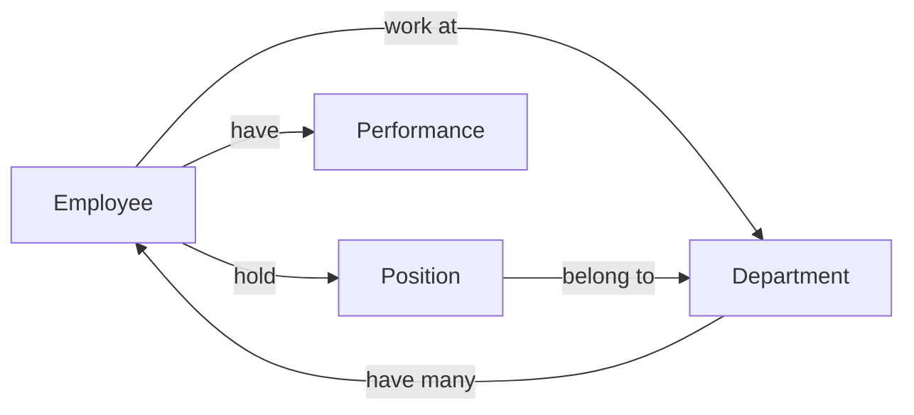
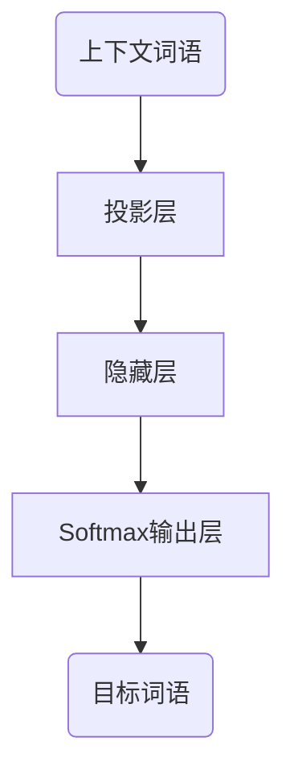

# 人才档案管理系统详细设计与具体代码实现

作者：禅与计算机程序设计艺术

## 1. 背景介绍

### 1.1 人才管理的重要性
在当今高度竞争的商业环境中,企业的成功与否很大程度上取决于其吸引、培养和留住优秀人才的能力。高效的人才管理不仅能提高组织绩效,还能为企业创造持续的竞争优势。

### 1.2 人才档案管理系统的作用  
人才档案管理系统是人才管理的重要工具和基础。通过收集、存储、分析人才相关信息,系统可以帮助HR及时掌握人才现状,优化人才配置,提供决策支持。一个设计优良、功能完备的人才档案管理系统对企业人才战略的成功实施至关重要。

### 1.3 系统开发的技术背景
#### 1.3.1 前后端分离架构
系统采用目前流行的前后端分离架构,即前端(Web界面)与后端(业务逻辑和数据存储)独立开发,通过API进行交互。这种模式使得前后端工作独立,代码复用性和可维护性更好。

#### 1.3.2 前端技术选型
前端使用React框架搭建用户界面,Redux管理状态,Ant Design组件库快速布局。选择React技术栈是因为其组件化思想,声明式编程等特性,使得前端工程化更容易实现。

#### 1.3.3 后端技术选型
后端采用Spring Boot快速搭建RESTful API,Spring Data JPA操作数据库,整合Elasticsearch实现信息搜索。Spring Boot具有自动配置、开箱即用等特点,大大简化了后端开发。 

## 2. 核心概念与联系

### 2.1 员工 Employee
员工是系统的核心实体,包含基本信息(姓名、工号、职位等)、个人信息(学历、工作经历等)和绩效考核等多方面内容。

### 2.2 部门 Department
部门代表了企业组织架构,与员工形成多对一的关系。通过部门这一概念,系统可以对人才进行组织和管理。

### 2.3 职位 Position  
职位反映了员工在企业中担任的角色,与员工和部门均有关联。借助职位概念,可以分析不同职位的人才盘点现状。

### 2.4 绩效 Performance
绩效代表了员工在特定考核周期内的工作表现和价值贡献。绩效管理是人才档案管理系统的一项重要功能。

### 2.5 实体关系图
下图展示了系统核心概念之间的关联:



## 3. 核心算法原理具体操作步骤

系统设计的一个重点和难点是如何对海量人才数据进行高效检索和分析。本节重点介绍基于Elasticsearch的人才搜索算法原理和实现步骤。

### 3.1 倒排索引原理
Elasticsearch使用倒排索引(Inverted Index)结构存储数据,可以理解为通过单词(Term)快速获取包含该单词的文档的映射关系。举例说明:

```
员工1的档案: T1 = "Tom,male,Java dev,5 years exp ..."
员工2的档案: T2 = "Jack,male,Java arch,8 years exp ..." 
员工3的档案: T3 = "Lily,female,Test eng,3 years exp ..."
```

对应的倒排索引结构如下:

```
"java":   → T1, T2
"dev":    → T1
"arch":   → T2 
"test":   → T3
"male":   → T1, T2
"female": → T3
"eng":    → T3
...
```

### 3.2 分词和提取关键字  
构建倒排索引的第一步是对文档进行分词,提取有意义的关键字。常用的分词器包括:

- 标准分词器(Standard Analyzer):按词切分,小写处理
- 空格分词器(Whitespace Analyzer):按空格切分,忽略标点
- 语言分词器(如 CJK Analyzer):按中日韩语言特点分词

### 3.3 创建倒排索引
第二步是将分词结果写入倒排索引。主要数据结构如下:

- 词典(Term Dictionary):记录所有关键词,构成一个有序表(B+树或跳表实现)
- 倒排列表(Posting List):记录包含某个关键词的文档,由倒排索引项(Posting)组成。常见结构为(docID, freq, [pos1, pos2 ...], [offset1, offset2...])

### 3.4 索引的不可变性
Elasticsearch索引一旦创建,就不可修改。这是因为不变性有利于实现高并发,无需考虑并发修改问题。新文档直接生成新的segment,查询时通过seg point汇总所有结果。

### 3.5 查询和相关性评分
查询时,Elasticsearch先计算Query语句,获取所有匹配的倒排索引,然后合并倒排列表,获得包含关键词的文档,最后根据相似度算分(TF-IDF)对结果排序。示意如下:

```
Query: Java AND (dev OR arch)

"java" 倒排索引
    → T1 T2
"dev" 倒排索引  
    → T1
"arch" 倒排索引
    → T2

Result:
    T1 (同时包含java和dev), 
    T2 (同时包含Java和arch)
```

## 4. 数学模型和公式详细讲解举例说明

在人才搜索和推荐中,经常需要计算员工档案文本之间的相似度。下面详细讲解两种常见的文本相似度计算模型。

### 4.1 基于TF-IDF的文本相似度

#### 4.1.1 TF-IDF向量空间模型

TF-IDF(Term Frequency–Inverse Document Frequency)是一种统计方法,用于评估一个词语对一个文件集或语料库中某个文件的重要程度。TF-IDF是一个向量空间模型(Vector Space Model),将文本表示为一个高维稀疏向量。

设词典维度为n,文档d可以表示为一个n维空间的向量:
$V(d) = (w_1,w_2,...,w_n)$

其中$w_i$表示词项$t_i$的权重,通过TF-IDF计算得到。

#### 4.1.2 TF系数

TF(Term Frequency)表示词项$t_i$在文档d中出现的频率。记文档d中$t_i$出现的次数为$n_{i,d}$,文档d的总词数为$s_d$,则TF定义为:

$TF_{i,d} = \frac{n_{i,d}}{s_d}$

直观来说,一个词语在文档中出现的频率越高,就越能代表这个文档的主题。

#### 4.1.3 IDF系数

IDF(Inverse Document Frequency)表示词项$t_i$对文档集D的区分能力。记包含$t_i$的文档数为$m_i$,文档集D的总文档数为M,则IDF定义为:

$IDF_i = \log(\frac{M}{m_i})$

直观来说,如果一个词语在很多文档中出现,那么它对区分不同文档的能力就越低。IDF对高频率的通用词进行了惩罚。

#### 4.1.4 TF-IDF权重计算

将TF和IDF结合,就得到了词项$t_i$对文档d的TF-IDF权重:

$w_{i,d} = TF_{i,d} \times IDF_i$

#### 4.1.5 文本相似度计算

对两个文档d1和d2,分别计算其TF-IDF向量V(d1)和V(d2),然后计算两个向量的余弦相似度(Cosine Similarity)作为文本相似度:

$Sim(d1,d2) = \cos(\theta) = \frac{V(d1) \cdot V(d2)}{||V(d1)|| \times ||V(d2)||}$

余弦相似度在[0,1]区间内,值越大表示两个文本的相似度越高。

### 4.2 基于Word2Vec的文本相似度

#### 4.2.1 Word2Vec原理

Word2Vec是一种神经网络模型,可以将词语映射到一个低维连续空间向量(通常为200-500维)。词向量的特点是,语义相似的词语对应的向量在空间中更接近。与TF-IDF等传统模型相比,Word2Vec能更好地刻画词语的语义信息。

Word2Vec有两种常见的训练模型:连续词袋模型(CBOW)和Skip-Gram模型。以CBOW为例,输入是某个词语的上下文,输出是该词语本身。网络结构如下:



#### 4.2.2 文档向量计算

使用Word2Vec得到词向量后,可以通过加权平均来表示文档向量。设文档d包含的词语为 $w_1,w_2,...,w_k$,对应的词向量为$v_1,v_2,...,v_k$,词频为$n_1,n_2,...,n_k$,则文档d的向量表示为:

$V(d) = \frac{1}{k}\sum\limits_{i=1}^{k} n_i \cdot v_i$

#### 4.2.3 文本相似度计算

与TF-IDF类似,对两个文档d1和d2,计算其文档向量V(d1)和V(d2)的余弦相似度:

$Sim(d1,d2) = \cos(\theta) = \frac{V(d1) \cdot V(d2)}{||V(d1)|| \times ||V(d2)||}$

## 4. 项目实践：代码实例和详细解释说明

下面以员工档案管理的几个核心功能为例,给出代码实现和详细解释。

### 4.1 新增员工档案

```java
@PostMapping("/employees")
public Employee addEmployee(@RequestBody Employee employee) {
    // 校验数据合法性
    validateEmployee(employee);
    
    // 设置默认值  
    setDefaultValue(employee);
    
    // 持久化到数据库
    return employeeRepository.save(employee);
}

private void validateEmployee(Employee employee) {
    // 校验必填字段是否为空
    if (StringUtils.isEmpty(employee.getName())) {
        throw new ValidationException("员工姓名不能为空");
    }
    if (StringUtils.isEmpty(employee.getJobNumber())) {
        throw new ValidationException("工号不能为空");
    }
    // 其他校验 ...
}

private void setDefaultValue(Employee employee) {
    if (employee.getEntryDate() == null) {
        employee.setEntryDate(new Date());
    }
    // 设置其他默认值 ...
}
```

代码要点:

- 使用`@PostMapping`注解声明添加员工的API端点
- 通过`@RequestBody`接收前端传递的JSON格式员工数据,自动映射为Employee对象
- 先进行必要的参数校验,检查关键字段是否为空,数据是否合法等,失败则抛出异常
- 设置某些字段的默认值,如入职日期等
- 调用Repository的save方法进行持久化,会自动生成主键

### 4.2 修改员工档案

```java
@PutMapping("/employees/{id}")
public Employee updateEmployee(@PathVariable Long id, @RequestBody Employee employee) {
    // 检查员工是否存在
    Employee existingEmployee = getEmployeeById(id);
    
    // 将新数据复制到已有对象
    BeanUtils.copyProperties(employee, existingEmployee);
    
    // 持久化到数据库  
    return employeeRepository.save(existingEmployee);
}

private Employee getEmployeeById(Long id) {
    return employeeRepository.findById(id)
            .orElseThrow(() -> new EntityNotFoundException("员工不存在,id=" + id));
}
```

代码要点:

- 使用`@PutMapping`注解声明修改员工的API端点,路径中使用`{id}`占位符
- 先根据id查询员工是否存在,不存在则抛出异常,终止执行
- 使用`BeanUtils.copyProperties`方法将新员工对象的属性复制到已有员工对象,实现更新
- 调用Repository的save方法进行持久化,会自动更新已有记录

### 4.3 查询员工档案

```java
@GetMapping("/employees/{id}")
public Employee getEmployee(@PathVariable Long id) {
    return employeeRepository.findById(id)
            .orElseThrow(() -> new EntityNotFoundException("员工不存在,id=" + id));
}

@GetMapping("/employees")
public Page<Employee> listEmployees(
        @RequestParam(defaultValue = "0") int page, 
        @RequestParam(defaultValue = "10") int size, 
        @RequestParam(required = false) String name,
        @RequestParam(required = false) String jobNumber) {
    // 构建查询