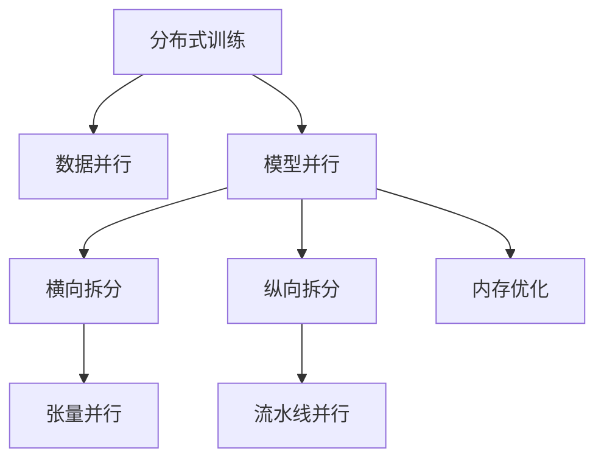

# 大规模语言模型从理论到实践 模型并行

作者：禅与计算机程序设计艺术

## 1.背景介绍

近年来,随着深度学习的蓬勃发展和算力的持续提升,大规模语言模型(Large Language Model,LLM)成为了自然语言处理领域的研究热点。LLM通过在海量文本语料上进行预训练,可以学习到丰富的语言知识和通用语义表示,在下游任务上展现出强大的迁移能力和Few-shot学习能力。

然而,训练LLM需要消耗大量的计算资源和存储空间。以当前最大的LLM GPT-3为例,其参数量高达1750亿,训练成本超过450万美元。如何在有限的硬件条件下高效训练LLM,成为了工业界和学术界亟需攻克的难题。

### 1.1 LLM发展历程

自2018年BERT问世后,LLM的发展就进入了快车道:

- 2018年6月,OpenAI发布GPT-1,参数量1.17亿
- 2019年2月,Google发布BERT,参数量3.4亿
- 2019年5月,OpenAI发布GPT-2,参数量15亿
- 2020年5月,微软发布Turing-NLG,参数量170亿
- 2020年6月,OpenAI发布GPT-3,参数量1750亿
- 2021年1月,Google发布Switch Transformer,参数量1.6万亿
- 2021年12月,DeepMind发布Gopher,参数量2800亿

可以看到,LLM的参数规模在短短3年内从1亿级跃升到了万亿级,呈现出Moore定律式的指数级增长。与之相伴的,是训练成本和资源消耗的急剧膨胀。

### 1.2 模型并行的必要性

为了让LLM落地于实际应用,我们必须想办法降低其训练开销。业界通常采用以下两种手段:

1. 模型压缩:通过知识蒸馏、网络剪枝、量化等技术,在尽量保持模型性能的前提下大幅减小参数量。代表工作有DistilBERT、TinyBERT等。

2. 分布式训练:将训练任务拆分到多个设备上并行执行,包括数据并行(Data Parallel)和模型并行(Model Parallel)。前者通过复制模型参数,后者通过切分模型参数,都能够显著提升训练效率。

对于超大规模的LLM(如GPT-3),单机的内存无法完全装下整个模型。因此除了模型压缩,还必须采用模型并行将其拆分到多个设备上。本文将重点介绍模型并行的原理、算法和实践。

## 2.核心概念与联系

在展开讨论之前,我们先明确一些基本概念:

- 数据并行(Data Parallel):将完整的模型复制到多个设备上,每个设备处理不同的数据子集,梯度在设备间同步和聚合。
- 模型并行(Model Parallel):将模型切分到多个设备上,每个设备只负责部分层和参数,设备间需传递中间激活。
  - 横向拆分(Row-wise Split):将每一层拆分到多个设备,前向传播时需要聚合,反向传播时需要广播。
  - 纵向拆分(Column-wise Split):将连续的多层拆分到多个设备,设备间以流水线的方式传递。
  - 内存优化(Memory Optimization):减少前向激活的驻留时间,及时释放无用的显存。
- 流水线并行(Pipeline Parallel):模型纵向拆分的一种实现形式,将mini-batch切分成更小的micro-batch,提高设备间的并发度。
- 张量并行(Tensor Parallel):模型横向拆分的一种实现形式,将层内的张量切分到多个设备,用于加速超大矩阵的计算。

它们的关系可以用下图表示:

可以看到,模型并行可以从多个维度入手,通过灵活组合不同的策略,达到优化训练效率的目的。

## 3.核心算法原理与操作步骤

本章将详细介绍模型并行的几种主要算法,包括流水线并行、张量并行、激活重计算等。我们以Transformer为例,讲解如何将这些算法应用到实际的模型训练中。

### 3.1 流水线并行

#### 3.1.1 算法原理

流水线并行的基本思想是,将模型的层和输入数据切成更小的单元,然后以流水线的方式在设备间传递。

假设我们有L层的模型和N个GPU,每个GPU负责L/N层。设mini-batch大小为B,我们将其均匀切分成M个micro-batch,每个大小为B/M。

前向传播时,首个micro-batch进入第1个GPU,并逐层向后传递;后续micro-batch依次进入流水线。当第1个micro-batch流出最后一个GPU时,反向传播开始,梯度以相反的方向流回。

通过micro-batch,我们在前向和反向阶段都实现了GPU间的并发。原本需要(N+M-1)个时间步的任务,现在只需要(N+M-1)*B/M个时间步。流水线的吞吐率从1个/步提高到了M个/步。

#### 3.1.2 操作步骤

1. 定义模型拓扑:指定每层及其参数放在哪个GPU上。
2. 将输入数据切分成M个micro-batch。
3. 前向传播:
   - 在每个GPU上,计算本地的层,结果发送到下一个GPU
   - 收到上游GPU的输出后,将其与本地层的输出拼接
   - 重复上述步骤,直到数据流出流水线
4。反向传播:
   - 计算最后一层的梯度,将其发送到上一个GPU
   - 用收到的梯度计算本地层的梯度,再发送到上一个GPU
   - 重复上述步骤,直到梯度回到第一个GPU
5. 更新所有参数,开始下一个训练步骤

### 3.2 张量并行

#### 3.2.1 算法原理

张量并行旨在将层内的大矩阵切分到多个GPU上,从而加速前向和反向传播。 

考虑Transformer的自注意力层:

$$
\mathrm{Attention}(Q,K,V)=\mathrm{softmax}\left(\frac{QK^{T}}{\sqrt{d}}\right)V
$$

其中Q,K,V都是大小为(B,L,D)的矩阵。粗略估算,当B=32,L=1024,D=1024时,Q,K,V的元素个数将近3500万个,远超单个GPU的显存上限。

解决办法是用分块矩阵乘法(Block Matrix Multiplication)将运算拆到多个GPU:

- 横向切分:将Q,K,V按行(即L维)切分成多份,分别放在各GPU上。前向时,$QK^T$的结果需要在GPU间做All-Reduce求和。反向时,Q,K,V梯度在GPU间做All-Reduce平均。

- 纵向切分:将Q按列(即D维)切分,K按行切分,各占一半GPU。前向时,先在持有Q的GPU上计算$QK^T$,结果发送到持有K的GPU上。反向时,梯度先回到持有Q的GPU,再发回持有K的GPU。

值得注意的是,Transformer的前馈层(FFN)也可以用类似的分块矩阵乘法并行化。总的来说,张量并行适用于各种超大规模的矩阵运算。

#### 3.2.2 操作步骤

1. 定义张量的分块方式:指定行列分块的GPU数量
2. 初始化参数:在每个GPU上创建对应的子矩阵
3. 前向传播:
   - 本地做矩阵乘法,结果在GPU间通信聚合
   - 将聚合的结果送入下一层运算
4. 反向传播:
   - 计算损失函数对最后一层输出的梯度
   - 按前向步骤的反方向传播梯度,同时做通信
   - 各GPU上计算对本地参数的梯度
5. 更新所有GPU上的参数

### 3.3 激活重计算

模型并行的一个共同问题是,需要在前向和反向传播中存储中间激活,占用大量的显存。激活重计算(Activation Recomputation)则提出及时丢弃前向激活,节省显存占用;反向传播时重新计算一遍前向过程,得到所需的激活值。

激活重计算的前提是,模型前向时间开销要远小于反向。这对Transformer来说通常成立,因为反向传播需要额外的梯度缓存和更复杂的计算图。

一个需要权衡的问题是,重计算的粒度如何选择?粒度越细,显存节省越多,但前向重复的次数也越多。实践中,以层为单位做重计算是比较常见的选择。

此外,重计算会导致训练显存需求的剧烈波动。通常需要与内存优化技术配合使用,例如:

- 及时清理和释放无用的激活、梯度缓存
- 使用显存互换技术,在GPU和CPU之间快速转移数据
- 动态分配和回收显存,避免内存碎片

总之,激活重计算是一把双刃剑。使用时需要根据具体的模型特点和硬件环境,寻求时间和空间开销的平衡。

## 4.数学模型与公式详解

本章我们从数学角度对模型并行做进一步分析。以矩阵乘法为例,推导分块算法的计算复杂度。同时给出流水线并行的理论加速比和优化目标。

### 4.1 分块矩阵乘法

考虑两个矩阵A(M×K)和B(K×N)相乘,得到矩阵C(M×N):

$$
\begin{aligned}
C_{i,j} &= \sum_{k=1}^{K}A_{i,k}B_{k,j} \\
i.e., C &= AB
\end{aligned}
$$

如果用P×Q个处理器对A,B分块,每个处理器可表示为$p_i$($1\leq i\leq P$)和$q_j$($1\leq j\leq Q$)的组合。令:

$$
\begin{aligned}
A_{i,:} &= [A_{i,1},\cdots,A_{i,K/Q}], B_{:,j} =
\begin{bmatrix}
B_{1,j}\\ \vdots\\ B_{K/P,j}
\end{bmatrix}\\
\tilde{A}_{i,:} &= A_{i,:}, \text{for }p_i\text{ s.t. }1\leq i\leq P \\
\tilde{B}_{:,j} &= B_{:,j}, \text{for }q_j\text{ s.t. }1\leq j\leq Q
\end{aligned}
$$

其中$\tilde{A}_{i,:}$表示$A$的第$i$块行,$\tilde{B}_{:,j}$表示$B$的第$j$块列。

对于$p_i$上的$\tilde{A}_{i,:}$,需要与$Q$个$\tilde{B}_{:,j}$做乘法,并将结果在$q_j\text{s.t. }j\in\{1,Q\}$上All-Reduce求和。该过程涉及$\frac{MNK}{PQ}$次乘加和$Q$次规约,通信代价为$O(\frac{MN}{PQ})$。

类似地,对于$q_j$上的$\tilde{B}_{:,j}$,需要与$P$个$\tilde{A}_{i,:}$做乘法,并将结果在$p_i\text{s.t. }i\in\{1,P\}$上All-Reduce求和。计算和通信代价与前述相同。

综上所述,分块矩阵乘法的总时间复杂度为:

$$
T=O\left(\frac{MNK}{PQ}+\frac{MN}{PQ}+\frac{MN}{PQ}\right)=O\left(\frac{MNK+2MN}{PQ}\right)
$$

### 4.2 流水线并行

回顾流水线并行将L层模型切分到N个设备,输入数据切分成M个micro-batch的设置。定义如下变量:

- $t_f$:单个设备前向计算时间
- $t_b$:单个设备反向计算时间
- $t_c$:设备间通信时间

不失一般性,假设$t_f,t_b,t_c$对各层和各设备均相等。流水线的理论总时间为