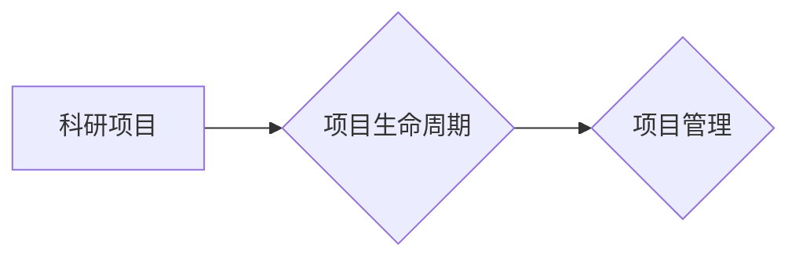

## 1. 背景介绍

### 1.1 科研项目管理的现状与挑战

科研项目管理是科研机构、高校以及企业研发部门至关重要的环节，它直接关系到科研项目的进度、质量和成果转化。近年来，随着科研项目规模的不断扩大、复杂程度的提升以及科研人员流动性的增强，传统的科研项目管理模式面临着诸多挑战：

* **信息孤岛:** 各个部门、团队之间信息沟通不畅，导致项目进度难以协调、资源分配不合理。
* **数据分散:** 科研项目相关数据分散在不同的系统和平台中，难以进行统一管理和分析。
* **协作效率低下:** 传统的线下会议、邮件沟通方式效率低下，难以满足快速迭代的科研需求。
* **缺乏透明度:** 项目进度、经费使用情况缺乏透明度，难以进行有效的监督和评估。

### 1.2 科研项目管理系统的意义

为了应对上述挑战，科研项目管理系统应运而生。科研项目管理系统旨在通过信息化手段，实现科研项目全生命周期的数字化管理，提高科研项目管理效率和效益。具体来说，科研项目管理系统可以实现以下目标：

* **集中化管理:** 将科研项目相关的所有信息和数据集中管理，打破信息孤岛。
* **流程化操作:** 将科研项目管理的各个环节进行流程化设计，规范操作流程，提高效率。
* **协同化工作:** 提供在线协作平台，方便科研人员进行沟通和协作，提高工作效率。
* **透明化监督:**  实时展示项目进度、经费使用情况，提高项目管理的透明度和可控性。


## 2. 核心概念与联系

### 2.1 科研项目

科研项目是指以科学研究为目的，围绕特定研究目标，由科研人员组成的团队，在一定时间和资源条件下开展的系统性研究工作。

### 2.2 项目生命周期

科研项目生命周期是指科研项目从立项到结题的全过程，一般包括以下几个阶段：

* 立项阶段
* 研究阶段
* 结题阶段

### 2.3 项目管理

项目管理是指将知识、技能、工具和技术应用于项目活动，以满足项目需求。

### 2.4 关系图



## 3. 核心算法原理具体操作步骤

### 3.1 系统架构设计

科研项目管理系统采用 B/S 架构，主要包括以下模块：

* **项目管理模块:** 负责科研项目的立项、审批、执行、结题等全生命周期管理。
* **人员管理模块:** 负责科研人员的信息管理、权限管理、角色分配等。
* **经费管理模块:** 负责科研项目经费的预算、审批、报销、核算等。
* **成果管理模块:** 负责科研项目成果的登记、审核、发布、统计等。
* **系统管理模块:** 负责系统的用户管理、权限管理、日志管理等。

### 3.2 数据库设计

科研项目管理系统数据库采用关系型数据库，主要包括以下数据表：

* 项目表：存储科研项目的基本信息，如项目名称、项目负责人、项目起止时间、项目经费等。
* 人员表：存储科研人员的基本信息，如姓名、性别、职称、研究方向等。
* 经费表：存储科研项目经费的预算、支出、余额等信息。
* 成果表：存储科研项目成果的基本信息，如成果名称、成果类型、成果作者、成果发表时间等。

### 3.3 功能模块设计

#### 3.3.1 项目管理模块

* 项目立项：科研人员提交项目申请，系统自动分配项目编号，并进行审批流程。
* 项目执行：项目负责人制定项目计划，分配任务，跟踪项目进度。
* 项目结题：项目完成后，提交结题报告，系统进行审核和归档。

#### 3.3.2 人员管理模块

* 人员信息管理：添加、修改、删除科研人员信息。
* 权限管理：设置不同角色的权限，例如项目负责人、项目成员、管理员等。

#### 3.3.3 经费管理模块

* 预算管理：制定项目经费预算，并进行审批流程。
* 报销管理：科研人员提交经费报销申请，系统进行审批流程。
* 核算管理：统计项目经费支出情况，生成经费报表。

#### 3.3.4 成果管理模块

* 成果登记：科研人员提交成果信息，系统进行审核和发布。
* 成果统计：统计科研项目成果数量、类型、影响力等指标。

## 4. 数学模型和公式详细讲解举例说明

本系统不涉及复杂的数学模型和公式。

## 5. 项目实践：代码实例和详细解释说明

### 5.1 技术选型

* 后端：Spring Boot
* 数据库：MySQL
* 前端：Vue.js

### 5.2 代码示例

```java
// 项目实体类
@Entity
@Table(name = "project")
public class Project {

    @Id
    @GeneratedValue(strategy = GenerationType.IDENTITY)
    private Long id;

    @Column(name = "name")
    private String name;

    // ... other fields

}

// 项目服务类
@Service
public class ProjectService {

    @Autowired
    private ProjectRepository projectRepository;

    public Project createProject(Project project) {
        return projectRepository.save(project);
    }

    // ... other methods

}
```

## 6. 实际应用场景

科研项目管理系统适用于各类科研机构、高校以及企业研发部门，例如：

* 中国科学院
* 清华大学
* 华为公司

## 7. 工具和资源推荐

* **项目管理工具:** Jira, Trello, Asana
* **代码托管平台:** GitHub, GitLab, Bitbucket
* **数据库:** MySQL, PostgreSQL, Oracle
* **云计算平台:** AWS, Azure, Google Cloud

## 8. 总结：未来发展趋势与挑战

### 8.1 未来发展趋势

* **智能化:** 利用人工智能技术，实现项目进度预测、风险预警、智能推荐等功能。
* **移动化:** 开发移动端应用，方便科研人员随时随地进行项目管理。
* **数据驱动:** 利用大数据分析技术，挖掘科研项目数据价值，为项目决策提供支持。

### 8.2 面临的挑战

* **数据安全:** 科研项目数据涉及到国家机密和商业秘密，需要加强数据安全保护。
* **系统集成:** 科研项目管理系统需要与其他系统进行集成，例如财务系统、人事系统等。
* **用户体验:**  系统需要不断优化用户体验，提高用户满意度。

## 9. 附录：常见问题与解答

### 9.1 如何申请科研项目？

科研人员可以通过科研项目管理系统在线提交项目申请，系统会自动分配项目编号并进行审批流程。

### 9.2 如何报销项目经费？

科研人员可以通过科研项目管理系统在线提交经费报销申请，系统会进行审批流程，审批通过后，财务部门会进行报销。
