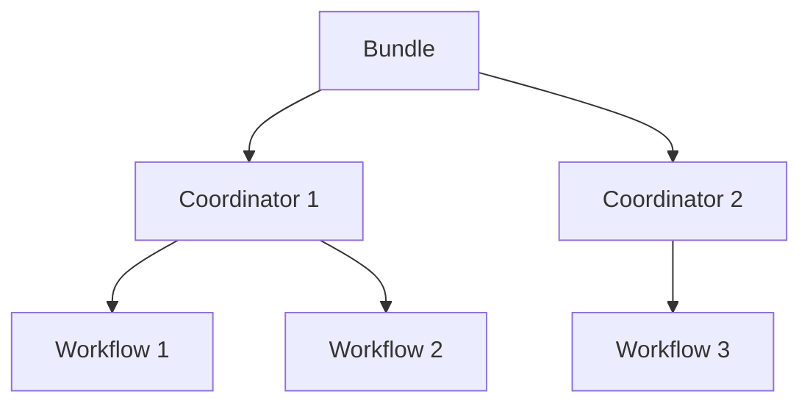

# "OozieBundle编程实例：数据处理作业"

作者：禅与计算机程序设计艺术

## 1. 背景介绍
### 1.1 大数据处理的挑战
在当今大数据时代,企业每天都要处理海量的数据。如何高效、可靠、灵活地调度和管理这些复杂的数据处理作业,成为了一个巨大的挑战。
### 1.2 Apache Oozie 简介
Apache Oozie是一个开源的工作流调度系统,用于管理Hadoop作业。它允许用户定义工作流,其中的任务可以是MapReduce、Pig、Hive或者Sqoop等。
#### 1.2.1 Oozie的主要特点
- 支持多种类型的Hadoop作业
- 可扩展性强,易于添加新的作业类型
- 支持工作流定义的参数化
- 可以定义输入输出数据集依赖关系
- 具有Web管理界面,可视化工作流
#### 1.2.2 Oozie架构概述
Oozie主要由以下几个组件构成:
- Workflow Manager:负责工作流的定义、存储和管理
- Coordinator Engine:负责协调作业和数据的依赖关系
- Bundle Manager:负责管理一组相关的协调器应用
- Oozie Client:用于提交和监控作业
### 1.3 本文目标
本文将通过一个实际的数据处理项目,详细讲解如何使用OozieBundle来编排和调度复杂的数据处理作业,帮助读者深入理解Oozie的工作原理和最佳实践。

## 2. 核心概念与联系
### 2.1 Oozie工作流
Oozie工作流是一个有向无环图(DAG),由一系列动作(Action)和决策(Decision)节点组成。每个动作节点执行一个特定任务,如Hadoop MapReduce、Pig等。决策节点提供了根据作业状态进行逻辑判断和流程控制的能力。
### 2.2 Oozie协调器
协调器应用允许用户根据时间和数据的可用性来调度工作流作业。它使用数据集、输入事件、时间触发器等来定义作业的执行条件和依赖关系。
### 2.3 Oozie Bundle
Bundle是一组相关的协调器应用。通过Bundle,可以方便地打包和管理一组逻辑上相关的数据处理作业,实现更高层次的调度和控制。
### 2.4 EL表达式
Oozie支持在工作流和协调器定义中使用EL表达式,可以引用参数、变量、函数等,提供了很大的灵活性。
### 2.5 核心概念之间的关系
下图展示了Oozie Bundle、Coordinator、Workflow之间的关系:



Bundle包含多个Coordinator,每个Coordinator定义了数据依赖和时间触发条件,可以触发一个或多个Workflow。Workflow则是由一系列Action节点组成的DAG。

## 3. 核心算法原理与具体操作步骤
### 3.1 Bundle应用编程步骤
#### 3.1.1 定义Coordinator
首先需要为Bundle中的每个Coordinator定义一个xml文件,设置数据集、输入事件、时间触发器等:

```xml
<coordinator-app name="my_coord" frequency="${coord:days(1)}" start="${startTime}" end="${endTime}">
    <datasets>
        <dataset name="input" frequency="${coord:days(1)}" initial-instance="${startTime}" timezone="UTC">
            <uri-template>hdfs://input/${YEAR}/${MONTH}/${DAY}</uri-template>
        </dataset>
    </datasets>
    <input-events>
        <data-in name="input" dataset="input">
            <instance>${coord:current(0)}</instance>
        </data-in>
    </input-events>
    <action>
        <workflow>
            <app-path>hdfs://workflow.xml</app-path>
        </workflow>
    </action>
</coordinator-app>
```

这里定义了每天运行一次的Coordinator,输入数据集为HDFS上按天分区的目录。
#### 3.1.2 定义Workflow
接下来定义被Coordinator触发的Workflow,可以包含多个Action节点:

```xml
<workflow-app name="my_wf">
    <start to="mr_node"/>
    <action name="mr_node">
        <map-reduce>
            <job-tracker>${jobTracker}</job-tracker>
            <name-node>${nameNode}</name-node>
            <configuration>
                <property>
                    <name>mapred.mapper.class</name>
                    <value>MyMapper</value>
                </property>
                <property>
                    <name>mapred.reducer.class</name>
                    <value>MyReducer</value>
                </property>
                <property>
                    <name>mapred.input.dir</name>
                    <value>${coord:dataIn('input')}</value>
                </property>
                <property>
                    <name>mapred.output.dir</name>
                    <value>hdfs://output</value>
                </property>
            </configuration>
        </map-reduce>
        <ok to="end"/>
        <error to="fail"/>
    </action>
    <kill name="fail">
        <message>MapReduce failed, error message[${wf:errorMessage(wf:lastErrorNode())}]</message>
    </kill>
    <end name="end"/>
</workflow-app>
```

这里定义了一个MapReduce作业,输入数据目录通过`${coord:dataIn('input')}`获取,也就是Coordinator定义的数据集。
#### 3.1.3 定义Bundle
最后将Coordinator组装成一个Bundle:

```xml
<bundle-app name="my_bundle">
    <coordinator name="my_coord">
        <app-path>hdfs://coordinator.xml</app-path>
        <configuration>
            <property>
                <name>startTime</name>
                <value>2023-01-01T00:00Z</value>
            </property>
            <property>
                <name>endTime</name>
                <value>2023-12-31T00:00Z</value>
            </property>
        </configuration>
    </coordinator>
</bundle-app>
```

Bundle中可以包含一个或多个Coordinator,通过配置属性传递参数。
#### 3.1.4 部署运行
完成Bundle定义后,就可以通过Oozie命令行或者API提交和运行了:

```bash
oozie job -oozie http://localhost:11000/oozie -config job.properties -run
```

其中job.properties中包含Bundle应用的必要参数。

### 3.2 数据依赖与时间触发算法
#### 3.2.1 数据依赖
Oozie通过定义数据集和数据输入事件来实现数据依赖。数据集通过uri-template定义了数据目录的命名模式,通常包含时间分区变量如`${YEAR}`、`${MONTH}`等。

数据输入事件指定了消费哪个数据集的哪个实例,通过`${coord:current(n)}`获取当前时间往前推n个数据集频率的实例。

Oozie在每次调度Coordinator时,会检查`uri-template`扩展后的数据目录是否存在,如果数据就绪则触发下游的Workflow。
#### 3.2.2 时间触发
除了等待上游数据就绪,Oozie还可以定期触发Coordinator,通过`frequency`属性指定调度频率,`start`和`end`属性指定起止时间。

Coordinator会在每个频率时间点检查依赖条件,如果满足则触发Workflow执行。同时Oozie还支持`TimeUnit`和`crontab`表达式来控制时间触发的粒度和规则。

## 4. 数学模型和公式详细讲解举例说明
### 4.1 数据频率计算
在Coordinator定义中,`frequency`属性定义了数据集和调度的频率,通常使用EL函数表示,例如:

- `${coord:days(1)}`:表示每天
- `${coord:hours(6)}`:表示每6小时  
- `${coord:months(1)}`:表示每月

Oozie的频率计算基于ISO8601时间格式和Calendar操作。例如,某月的第3天加1个月的计算公式为:

$$
\begin{aligned}
& \text{P}(Y, M, 3) + \text{P}(0, 1, 0) = \text{P}(Y, M+1, 3) \\
& \text{where P}(Y, M, D) \text{ is the ISO8601 representation of a date}
\end{aligned}
$$

### 4.2 数据滑动窗口
Oozie支持在数据集中定义滑动窗口,通过`initial-instance`和`frequency`属性控制窗口的起点和大小,例如:

```xml
<dataset name="input" frequency="${coord:days(1)}" initial-instance="2023-01-01T00:00Z" timezone="UTC">
    <uri-template>hdfs://input/${YEAR}/${MONTH}/${DAY}</uri-template>
</dataset>
```

定义了一个从2023-01-01开始,每天滑动一次的数据窗口。在任意时间点$t$,数据集实例的时间范围为:

$$
[t - \text{frequency}, t)
$$

例如在2023-01-05触发时,数据窗口为[2023-01-04, 2023-01-05)。通过滑动窗口,可以方便地引用一段时间内的数据。

## 5. 项目实践：代码实例和详细解释说明
下面通过一个实际的数据处理项目,演示如何使用OozieBundle编程。该项目每天从Kafka读取用户行为日志,经过清洗、转换、聚合等步骤,最终生成用户画像数据。
### 5.1 Coordinator定义
首先定义一个每天运行的Coordinator,等待Kafka日志数据就绪:

```xml
<coordinator-app name="user_profile" frequency="${coord:days(1)}" start="${startTime}" end="${endTime}" timezone="UTC">
    <datasets>
        <dataset name="input_logs" frequency="${coord:days(1)}" initial-instance="${startTime}" timezone="UTC">
            <uri-template>hdfs://logs/${YEAR}/${MONTH}/${DAY}</uri-template>
        </dataset>
        <dataset name="output_profile" frequency="${coord:days(1)}" initial-instance="${startTime}" timezone="UTC">
            <uri-template>hdfs://profile/${YEAR}/${MONTH}/${DAY}</uri-template>
        </dataset>
    </datasets>
    <input-events>
        <data-in name="input" dataset="input_logs">
            <instance>${coord:current(0)}</instance>
        </data-in>
    </input-events>
    <output-events>
        <data-out name="output" dataset="output_profile">
            <instance>${coord:current(0)}</instance>
        </data-out>
    </output-events>
    <action>
        <workflow>
            <app-path>hdfs://workflow.xml</app-path>
            <configuration>
                <property>
                    <name>inputDir</name>
                    <value>${coord:dataIn('input')}</value>
                </property>
                <property>
                    <name>outputDir</name>
                    <value>${coord:dataOut('output')}</value>
                </property>
            </configuration>
        </workflow>
    </action>
</coordinator-app>
```

定义了输入日志和输出画像两个数据集,每天滑动一次。输入事件指定了等待当天的日志数据,输出事件指定了输出路径。
### 5.2 Workflow定义
Workflow中包含了数据处理的主要步骤:

```xml
<workflow-app name="user_profile_wf">
    <start to="log_cleaning"/>
    <action name="log_cleaning">
        <spark>
            <job-tracker>${jobTracker}</job-tracker>
            <name-node>${nameNode}</name-node>
            <master>yarn</master>
            <mode>cluster</mode>
            <name>log_cleaning</name>
            <class>com.company.LogCleaner</class>
            <jar>hdfs://lib/my-job.jar</jar>
            <arg>${coord:dataIn('input')}</arg>
            <arg>${nameNode}/cleaned_logs/${coord:formatTime(coord:nominalTime(), 'yyyy-MM-dd')}</arg>
        </spark>
        <ok to="log_parsing"/>
        <error to="fail"/>
    </action>
    <action name="log_parsing">
        <spark>
            <job-tracker>${jobTracker}</job-tracker>
            <name-node>${nameNode}</name-node>
            <master>yarn</master>
            <mode>cluster</mode>
            <name>log_parsing</name>
            <class>com.company.LogParser</class>
            <jar>hdfs://lib/my-job.jar</jar>
            <arg>${nameNode}/cleaned_logs/${coord:formatTime(coord:nominalTime(), 'yyyy-MM-dd')}</arg>
            <arg>${nameNode}/parsed_logs/${coord:formatTime(coord:nominalTime(), 'yyyy-MM-dd')}</arg>
        </spark>
        <ok to="profile_gen"/>
        <error to="fail"/>
    </action>
    <action name="profile_gen">
        <spark>
            <job-tracker>${jobTracker}</job-tracker>
            <name-node>${nameNode}</name-node>
            <master>yarn</master>
            <mode>cluster</mode>
            <name>profile_gen</name>
            <class>com.company.ProfileGenerator</class>
            <jar>hdfs://lib/my-job.jar</jar>
            <arg>${nameNode}/parsed_logs/${coord:formatTime(coord:nominalTime(), 'yyyy-MM-dd')}</arg>
            <arg>${coord:dataOut('output')}</arg>
        </spark>
        <ok to="end"/>