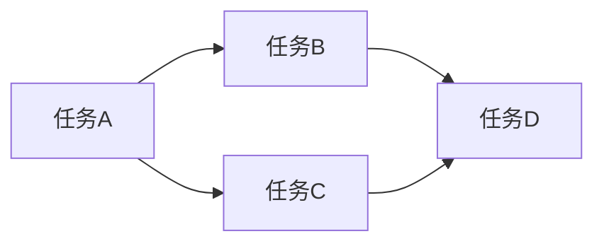

# Oozie解决方案：工作流设计、性能优化、安全配置

作者：禅与计算机程序设计艺术

## 1. 背景介绍
### 1.1 大数据处理的挑战
#### 1.1.1 数据量的爆炸式增长
#### 1.1.2 数据处理的复杂性增加  
#### 1.1.3 对数据处理效率和性能的要求提高
### 1.2 工作流调度系统的重要性
#### 1.2.1 简化大数据处理流程的编排
#### 1.2.2 提高数据处理的自动化程度
#### 1.2.3 优化资源利用率
### 1.3 Oozie的优势
#### 1.3.1 基于XML的工作流定义
#### 1.3.2 支持多种大数据处理框架
#### 1.3.3 灵活的工作流调度和管理功能

## 2. 核心概念与联系
### 2.1 Oozie工作流
#### 2.1.1 工作流定义
#### 2.1.2 工作流节点类型
#### 2.1.3 工作流依赖关系
### 2.2 Oozie协调器 
#### 2.2.1 协调器定义
#### 2.2.2 时间触发和数据触发
#### 2.2.3 协调器与工作流的关系
### 2.3 Oozie Bundle
#### 2.3.1 Bundle定义 
#### 2.3.2 Bundle与协调器的关系
#### 2.3.3 Bundle的应用场景

## 3. 核心算法原理与具体操作步骤
### 3.1 工作流设计原理
#### 3.1.1 DAG有向无环图
#### 3.1.2 工作流节点的执行顺序
#### 3.1.3 工作流分支与聚合
### 3.2 工作流设计步骤
#### 3.2.1 定义工作流节点
#### 3.2.2 配置节点参数
#### 3.2.3 设置节点之间的依赖关系
#### 3.2.4 配置工作流全局参数
### 3.3 协调器设计原理
#### 3.3.1 时间触发原理
#### 3.3.2 数据触发原理
### 3.4 协调器设计步骤 
#### 3.4.1 定义数据集
#### 3.4.2 配置触发规则
#### 3.4.3 关联工作流
#### 3.4.4 设置协调器参数

## 4. 数学模型和公式详细讲解举例说明
### 4.1 工作流调度的数学模型
#### 4.1.1 有向无环图模型
有向无环图（DAG）可以用来建模工作流中的任务依赖关系。假设工作流中有$n$个任务节点，我们可以将其表示为一个有向无环图$G=(V,E)$，其中$V$表示任务节点的集合，$E$表示任务之间的依赖关系。如果任务$i$依赖于任务$j$的执行结果，那么就在节点$i$和$j$之间连一条有向边$(i,j)∈E$。

例如，考虑以下的工作流：

该工作流可以表示为如下的邻接矩阵：

$$
A=\begin{bmatrix}
0 & 1 & 1 & 0\\
0 & 0 & 0 & 1\\
0 & 0 & 0 & 1\\
0 & 0 & 0 & 0
\end{bmatrix}
$$

其中$A_{ij}=1$表示任务$i$依赖于任务$j$，$A_{ij}=0$表示任务$i$和$j$之间没有依赖关系。

#### 4.1.2 关键路径算法
在工作流调度中，我们希望尽可能地减少整个工作流的执行时间。关键路径算法可以帮助我们找到工作流中的关键路径，即执行时间最长的路径。优化关键路径上的任务，可以有效减少整个工作流的执行时间。

假设任务$i$的执行时间为$t_i$，那么可以使用动态规划算法计算从起始节点到每个节点的最长路径长度$d_i$：

$$
d_i = \max_{j:(j,i)∈E} (d_j + t_i)
$$

其中，$(j,i)∈E$表示任务$j$是任务$i$的直接前驱任务。

在得到每个节点的最长路径长度后，终止节点的$d_i$值就是整个工作流的关键路径长度。我们可以回溯找到关键路径上的所有任务，这些任务就是工作流优化的重点。

### 4.2 资源调度的数学模型
#### 4.2.1 背包问题模型
在实际的工作流调度中，我们还需要考虑集群中的资源限制，例如内存、CPU等。这可以看作是一个多维背包问题：每个任务都有一定的资源需求，我们要在资源限制的情况下，尽可能地提高任务的并行度，减少工作流的执行时间。

假设集群中有$m$种资源，每种资源的总量为$C_k$。任务$i$对资源$k$的需求量为$r_{ik}$，任务$i$的执行时间为$t_i$。我们可以定义一个二进制变量$x_{ij}$，表示任务$i$是否在时间$j$执行。那么，资源调度问题可以表示为如下的整数规划模型：

$$
\min \sum_j j \max_i x_{ij}
$$

$$
\begin{align*}
\text{s.t.} \quad 
& \sum_i r_{ik} x_{ij} \leq C_k \quad \forall j,k \\
& \sum_j x_{ij} \geq 1 \quad \forall i \\
& x_{ij} \in \{0,1\} \quad \forall i,j
\end{align*}
$$

其中，目标函数是最小化工作流的完成时间；第一个约束条件表示在任意时刻$j$，任务的资源需求不能超过集群的资源限制；第二个约束条件表示每个任务都必须被执行；第三个约束条件表示$x_{ij}$是二进制变量。

#### 4.2.2 贪心算法
由于整数规划问题是NP难问题，求解比较困难。在实际系统中，我们通常采用启发式算法，例如贪心算法。一种简单的贪心策略是：每次选择资源需求最小、执行时间最短的任务执行，直到所有任务完成。

假设任务$i$的资源需求向量为$\mathbf{r}_i=(r_{i1},\ldots,r_{im})$，执行时间为$t_i$。我们可以定义任务$i$的优先级函数：

$$
p_i = \frac{\sum_k r_{ik}/C_k}{t_i}
$$

每次选择优先级最小的任务执行，直到所有任务完成。这种贪心策略虽然不能保证得到最优解，但通常可以得到比较好的近似解，而且算法简单，易于实现。

## 5. 项目实践：代码实例和详细解释说明
下面我们通过一个简单的示例来说明如何使用Oozie设计和调度工作流。假设我们有以下的数据处理流程：
1. 从HDFS中读取原始数据，进行清洗和预处理，结果写回HDFS
2. 对预处理后的数据进行特征提取，结果写入HDFS
3. 使用提取的特征训练机器学习模型，模型参数写入HDFS
4. 使用训练好的模型对新数据进行预测，预测结果写入MySQL

我们可以使用Oozie设计如下的工作流来实现该数据处理流程：

```xml
<workflow-app xmlns="uri:oozie:workflow:0.5" name="data-processing-workflow">
    <start to="data-preprocessing"/>
    <action name="data-preprocessing">
        <spark>
            <job-tracker>${jobTracker}</job-tracker>
            <name-node>${nameNode}</name-node>
            <prepare>
                <delete path="${nameNode}/user/${wf:user()}/temp"/>
            </prepare>
            <configuration>
                <property>
                    <name>mapred.compress.map.output</name>
                    <value>true</value>
                </property>
            </configuration>
            <master>yarn</master>
            <mode>cluster</mode>
            <name>data-preprocessing</name>
            <class>com.example.DataPreprocessing</class>
            <jar>${nameNode}/user/${wf:user()}/lib/data-processing.jar</jar>
            <arg>${nameNode}/user/${wf:user()}/input/rawdata.txt</arg>
            <arg>${nameNode}/user/${wf:user()}/temp/preprocessed-data</arg>
        </spark>
        <ok to="feature-extraction"/>
        <error to="kill"/>
    </action>
    <action name="feature-extraction">
        <spark>
            <job-tracker>${jobTracker}</job-tracker>
            <name-node>${nameNode}</name-node>
            <configuration>
                <property>
                    <name>mapred.compress.map.output</name>
                    <value>true</value>
                </property>
            </configuration>
            <master>yarn</master>
            <mode>cluster</mode>
            <name>feature-extraction</name>
            <class>com.example.FeatureExtraction</class>
            <jar>${nameNode}/user/${wf:user()}/lib/data-processing.jar</jar>
            <arg>${nameNode}/user/${wf:user()}/temp/preprocessed-data</arg>
            <arg>${nameNode}/user/${wf:user()}/temp/features</arg>
        </spark>
        <ok to="model-training"/>
        <error to="kill"/>
    </action>
    <action name="model-training">
        <spark>
            <job-tracker>${jobTracker}</job-tracker>
            <name-node>${nameNode}</name-node>
            <configuration>
                <property>
                    <name>mapred.compress.map.output</name>
                    <value>true</value>
                </property>
            </configuration>
            <master>yarn</master>
            <mode>cluster</mode>
            <name>model-training</name>
            <class>com.example.ModelTraining</class>
            <jar>${nameNode}/user/${wf:user()}/lib/data-processing.jar</jar>
            <arg>${nameNode}/user/${wf:user()}/temp/features</arg>
            <arg>${nameNode}/user/${wf:user()}/model</arg>
        </spark>
        <ok to="prediction"/>
        <error to="kill"/>
    </action>
    <action name="prediction">
        <spark>
            <job-tracker>${jobTracker}</job-tracker>
            <name-node>${nameNode}</name-node>
            <configuration>
                <property>
                    <name>mapred.compress.map.output</name>
                    <value>true</value>
                </property>
            </configuration>
            <master>yarn</master>
            <mode>cluster</mode>
            <name>prediction</name>
            <class>com.example.Prediction</class>
            <jar>${nameNode}/user/${wf:user()}/lib/data-processing.jar</jar>
            <arg>${nameNode}/user/${wf:user()}/model</arg>
            <arg>${nameNode}/user/${wf:user()}/input/newdata.txt</arg>
            <arg>jdbc:mysql://localhost/prediction_db</arg>
            <arg>username</arg>
            <arg>password</arg>
            <arg>prediction</arg>
        </spark>
        <ok to="end"/>
        <error to="kill"/>
    </action>
    <kill name="kill">
        <message>Workflow failed, error message[${wf:errorMessage(wf:lastErrorNode())}]</message>
    </kill>
    <end name="end"/>
</workflow-app>
```

在该工作流中，我们定义了4个action节点，分别对应数据处理流程中的4个步骤。每个action节点都是一个Spark作业，通过`<spark>`标签指定作业的配置信息，例如主类、jar包、参数等。action节点之间通过`<ok>`和`<error>`标签指定执行成功和失败后的跳转逻辑。

在action节点中，我们还可以使用`<prepare>`标签指定在作业执行前需要完成的操作，例如删除临时目录等。`<configuration>`标签可以用来指定作业的配置参数。

工作流定义文件中使用了一些EL表达式，例如`${nameNode}`、`${wf:user()}`等，这些表达式可以在提交工作流时动态替换为实际的值。

下面是action节点中Spark作业对应的示例代码：

```scala
// DataPreprocessing.scala
import org.apache.spark.sql.SparkSession

object DataPreprocessing {
  def main(args: Array[String]): Unit = {
    val spark = SparkSession.builder().appName("DataPreprocessing").getOrCreate()
    val inputPath = args(0)
    val outputPath = args(1)
    
    val rawData = spark.read.text(inputPath)
    // 数据清洗和预处理逻辑
    val preprocessedData = ...
    preprocessedData.write.parquet(outputPath)
    
    spark.stop()
  }
}

// FeatureExtraction.scala
import org.apache.spark.sql.SparkSession

object FeatureExtraction {
  def main(args: Array[String]): Unit = {
    val spark = Spark