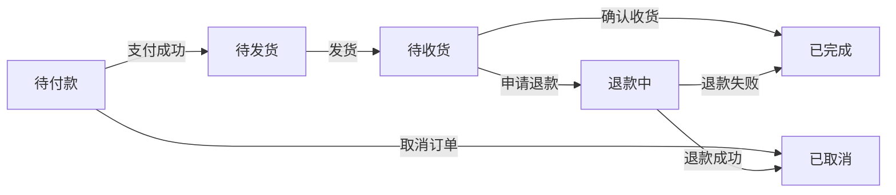

# 在线药店管理系统详细设计与具体代码实现

作者：禅与计算机程序设计艺术

## 1. 背景介绍
### 1.1 在线药店的发展现状
### 1.2 在线药店管理系统的必要性
### 1.3 在线药店管理系统的主要功能

## 2. 核心概念与联系
### 2.1 在线药店管理系统的架构设计
#### 2.1.1 前端架构
#### 2.1.2 后端架构
#### 2.1.3 数据库设计
### 2.2 在线药店管理系统的核心模块
#### 2.2.1 用户管理模块
#### 2.2.2 商品管理模块
#### 2.2.3 订单管理模块
#### 2.2.4 支付管理模块
#### 2.2.5 物流管理模块
### 2.3 各模块之间的关系与交互

## 3. 核心算法原理具体操作步骤
### 3.1 用户身份验证算法
#### 3.1.1 JWT(JSON Web Token)原理
#### 3.1.2 JWT的生成与验证流程
#### 3.1.3 基于JWT的用户身份验证实现
### 3.2 商品推荐算法
#### 3.2.1 协同过滤推荐算法原理
#### 3.2.2 基于用户的协同过滤算法
#### 3.2.3 基于物品的协同过滤算法
### 3.3 订单状态管理算法
#### 3.3.1 有限状态机原理
#### 3.3.2 订单状态转移图设计
#### 3.3.3 订单状态管理的具体实现

## 4. 数学模型和公式详细讲解举例说明
### 4.1 协同过滤推荐算法的数学模型
#### 4.1.1 用户-物品评分矩阵
$$
R=\begin{bmatrix}
r_{11} & r_{12} & \cdots & r_{1n}\\
r_{21} & r_{22} & \cdots & r_{2n}\\
\vdots & \vdots & \ddots & \vdots\\
r_{m1} & r_{m2} & \cdots & r_{mn}
\end{bmatrix}
$$
其中，$r_{ij}$表示用户$i$对物品$j$的评分。
#### 4.1.2 相似度计算公式
- 余弦相似度：
$sim(i,j)=\frac{\sum_{k=1}^{n}r_{ik}r_{jk}}{\sqrt{\sum_{k=1}^{n}r_{ik}^2}\sqrt{\sum_{k=1}^{n}r_{jk}^2}}$
- 皮尔逊相关系数：
$sim(i,j)=\frac{\sum_{k=1}^{n}(r_{ik}-\bar{r_i})(r_{jk}-\bar{r_j})}{\sqrt{\sum_{k=1}^{n}(r_{ik}-\bar{r_i})^2}\sqrt{\sum_{k=1}^{n}(r_{jk}-\bar{r_j})^2}}$
#### 4.1.3 预测评分计算公式
$p_{ij}=\bar{r_i}+\frac{\sum_{k=1}^{n}sim(i,k)(r_{kj}-\bar{r_k})}{\sum_{k=1}^{n}|sim(i,k)|}$
其中，$p_{ij}$表示预测用户$i$对物品$j$的评分，$\bar{r_i}$表示用户$i$的平均评分，$sim(i,k)$表示用户$i$和用户$k$的相似度。

### 4.2 订单状态管理的数学模型
#### 4.2.1 有限状态机五元组
$M=(Q,\Sigma,\delta,q_0,F)$
- $Q$：有限状态集合
- $\Sigma$：有限输入符号集合
- $\delta$：状态转移函数，$\delta: Q \times \Sigma \to Q$
- $q_0$：初始状态，$q_0 \in Q$
- $F$：终止状态集合，$F \subseteq Q$
#### 4.2.2 订单状态转移图


## 5. 项目实践：代码实例和详细解释说明
### 5.1 用户身份验证模块
#### 5.1.1 JWT工具类
```java
public class JwtUtil {
    private static final String SECRET_KEY = "your_secret_key";
    private static final long EXPIRATION_TIME = 86400000; // 1天
    
    public static String generateToken(String username) {
        Date now = new Date();
        Date expireDate = new Date(now.getTime() + EXPIRATION_TIME);
        
        return Jwts.builder()
                .setSubject(username)
                .setIssuedAt(now)
                .setExpiration(expireDate)
                .signWith(SignatureAlgorithm.HS512, SECRET_KEY)
                .compact();
    }
    
    public static String getUsernameFromToken(String token) {
        return Jwts.parser()
                .setSigningKey(SECRET_KEY)
                .parseClaimsJws(token)
                .getBody()
                .getSubject();
    }
    
    public static boolean validateToken(String token) {
        try {
            Jwts.parser().setSigningKey(SECRET_KEY).parseClaimsJws(token);
            return true;
        } catch (Exception e) {
            return false;
        }
    }
}
```
`JwtUtil`类提供了生成JWT、从JWT中获取用户名以及验证JWT有效性的方法。
#### 5.1.2 用户登录接口
```java
@RestController
@RequestMapping("/api/auth")
public class AuthController {
    @Autowired
    private AuthService authService;
    
    @PostMapping("/login")
    public ResponseEntity<String> login(@RequestBody LoginRequest loginRequest) {
        String username = loginRequest.getUsername();
        String password = loginRequest.getPassword();
        
        if (authService.authenticate(username, password)) {
            String token = JwtUtil.generateToken(username);
            return ResponseEntity.ok(token);
        } else {
            return ResponseEntity.status(HttpStatus.UNAUTHORIZED).body("Invalid credentials");
        }
    }
}
```
用户登录接口接收用户名和密码，调用`AuthService`进行身份验证，如果验证通过，则生成JWT并返回给客户端。
#### 5.1.3 JWT拦截器
```java
public class JwtInterceptor implements HandlerInterceptor {
    @Override
    public boolean preHandle(HttpServletRequest request, HttpServletResponse response, Object handler) throws Exception {
        String token = request.getHeader("Authorization");
        if (token != null && token.startsWith("Bearer ")) {
            token = token.substring(7);
            if (JwtUtil.validateToken(token)) {
                String username = JwtUtil.getUsernameFromToken(token);
                request.setAttribute("username", username);
                return true;
            }
        }
        response.sendError(HttpServletResponse.SC_UNAUTHORIZED, "Unauthorized");
        return false;
    }
}
```
JWT拦截器用于拦截需要身份验证的请求，从请求头中获取JWT，并验证其有效性。如果JWT有效，则将用户名存储在请求属性中，以便后续的请求处理使用。

### 5.2 商品推荐模块
#### 5.2.1 协同过滤推荐算法实现
```python
import numpy as np

class CollaborativeFiltering:
    def __init__(self, rating_matrix):
        self.rating_matrix = rating_matrix
    
    def cosine_similarity(self, user1, user2):
        ratings1 = self.rating_matrix[user1]
        ratings2 = self.rating_matrix[user2]
        dot_product = np.dot(ratings1, ratings2)
        norm1 = np.linalg.norm(ratings1)
        norm2 = np.linalg.norm(ratings2)
        return dot_product / (norm1 * norm2)
    
    def predict_rating(self, user, item, k=5):
        user_ratings = self.rating_matrix[user]
        item_ratings = self.rating_matrix[:, item]
        similarities = []
        for i in range(len(self.rating_matrix)):
            if i != user and item_ratings[i] != 0:
                similarity = self.cosine_similarity(user, i)
                similarities.append((i, similarity))
        similarities.sort(key=lambda x: x[1], reverse=True)
        top_users = similarities[:k]
        numerator = 0
        denominator = 0
        for u, s in top_users:
            numerator += s * (item_ratings[u] - np.mean(self.rating_matrix[u]))
            denominator += abs(s)
        if denominator == 0:
            return 0
        else:
            return user_ratings.mean() + numerator / denominator
```
`CollaborativeFiltering`类实现了基于用户的协同过滤推荐算法。`cosine_similarity`方法计算两个用户之间的余弦相似度，`predict_rating`方法根据相似用户的评分预测目标用户对某个物品的评分。
#### 5.2.2 商品推荐接口
```python
from flask import Flask, jsonify, request
from collaborative_filtering import CollaborativeFiltering

app = Flask(__name__)

rating_matrix = [
    [4, 0, 2, 0, 1],
    [0, 3, 0, 0, 2],
    [1, 0, 4, 0, 0],
    [0, 0, 0, 5, 0],
    [2, 0, 0, 0, 3]
]

cf = CollaborativeFiltering(np.array(rating_matrix))

@app.route('/recommend', methods=['GET'])
def recommend():
    user_id = int(request.args.get('user_id'))
    item_id = int(request.args.get('item_id'))
    predicted_rating = cf.predict_rating(user_id, item_id)
    return jsonify({'user_id': user_id, 'item_id': item_id, 'predicted_rating': predicted_rating})

if __name__ == '__main__':
    app.run()
```
商品推荐接口接收用户ID和物品ID，调用协同过滤推荐算法预测用户对该物品的评分，并返回预测结果。

### 5.3 订单管理模块
#### 5.3.1 订单状态枚举类
```java
public enum OrderStatus {
    PENDING_PAYMENT,
    PENDING_SHIPMENT,
    SHIPPED,
    COMPLETED,
    CANCELLED,
    REFUNDING,
    REFUNDED
}
```
`OrderStatus`枚举类定义了订单的各种状态。
#### 5.3.2 订单实体类
```java
@Entity
@Table(name = "orders")
public class Order {
    @Id
    @GeneratedValue(strategy = GenerationType.IDENTITY)
    private Long id;
    
    @Enumerated(EnumType.STRING)
    private OrderStatus status;
    
    // 其他订单属性...
    
    public Long getId() {
        return id;
    }
    
    public void setId(Long id) {
        this.id = id;
    }
    
    public OrderStatus getStatus() {
        return status;
    }
    
    public void setStatus(OrderStatus status) {
        this.status = status;
    }
    
    // 其他getter和setter方法...
}
```
`Order`实体类表示订单对象，包含订单状态等属性。
#### 5.3.3 订单状态转移服务
```java
@Service
public class OrderStateTransitionService {
    @Autowired
    private OrderRepository orderRepository;
    
    public void payOrder(Long orderId) {
        Order order = orderRepository.findById(orderId).orElseThrow(() -> new OrderNotFoundException(orderId));
        if (order.getStatus() == OrderStatus.PENDING_PAYMENT) {
            order.setStatus(OrderStatus.PENDING_SHIPMENT);
            orderRepository.save(order);
        } else {
            throw new InvalidOrderStateTransitionException(order.getStatus(), OrderStatus.PENDING_SHIPMENT);
        }
    }
    
    public void shipOrder(Long orderId) {
        Order order = orderRepository.findById(orderId).orElseThrow(() -> new OrderNotFoundException(orderId));
        if (order.getStatus() == OrderStatus.PENDING_SHIPMENT) {
            order.setStatus(OrderStatus.SHIPPED);
            orderRepository.save(order);
        } else {
            throw new InvalidOrderStateTransitionException(order.getStatus(), OrderStatus.SHIPPED);
        }
    }
    
    public void completeOrder(Long orderId) {
        Order order = orderRepository.findById(orderId).orElseThrow(() -> new OrderNotFoundException(orderId));
        if (order.getStatus() == OrderStatus.SHIPPED) {
            order.setStatus(OrderStatus.COMPLETED);
            orderRepository.save(order);
        } else {
            throw new InvalidOrderStateTransitionException(order.getStatus(), OrderStatus.COMPLETED);
        }
    }
    
    public void cancelOrder(Long orderId) {
        Order order = orderRepository.findById(orderId).orElseThrow(() -> new OrderNotFoundException(orderId));
        if (order.getStatus() == OrderStatus.PENDING_PAYMENT || order.getStatus() == OrderStatus.PENDING_SHIPMENT) {
            order.setStatus(OrderStatus.CANCELLED);
            orderRepository.save(order);
        } else {
            throw new InvalidOrderStateTransitionException(order.getStatus(), OrderStatus.CANCELLED);
        }
    }
    
    public void refundOrder(Long orderId) {
        Order order = orderRepository.findById(orderId).orElseThrow(() -> new OrderNotFoundException(orderId));
        if (order.getStatus() == OrderStatus.SHIPPED) {
            order.setStatus(OrderStatus.REFUNDING);
            orderRepository.save(order);
            // 处理退款逻辑...
            order.setStatus(OrderStatus.REFUNDED);
            orderRepository.save(order);
        } else {
            throw new InvalidOrderStateTransitionException(order