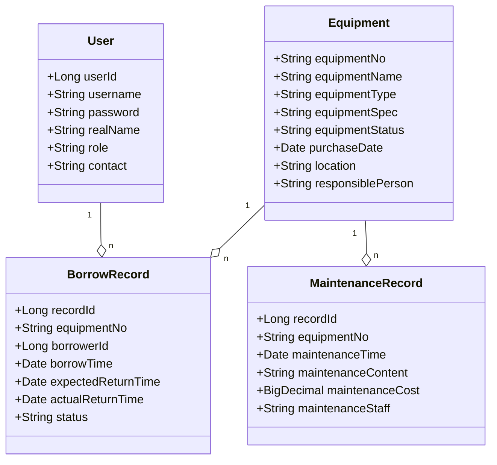

# 实验室设备管理系统详细设计与具体代码实现

作者：禅与计算机程序设计艺术

## 1. 背景介绍

### 1.1 实验室设备管理的重要性

在现代科研和教学实验室中,设备是开展各项工作的重要物质基础。实验室设备种类繁多,数量庞大,管理难度大。传统的人工管理方式效率低下,难以满足现代实验室的管理需求。因此,开发一套功能完善、易于操作的实验室设备管理系统十分必要。

### 1.2 实验室设备管理系统的主要功能

一个优秀的实验室设备管理系统应具备以下主要功能:

1. 设备信息管理:包括设备的录入、查询、修改和删除等基本操作。
2. 设备使用管理:包括设备借用、归还、维修等流程的管理。
3. 设备统计分析:对设备的使用情况进行统计分析,为设备的购置和维护提供数据支持。
4. 用户权限管理:对不同角色的用户进行权限控制,确保系统的安全性。

### 1.3 系统开发技术选型

本系统采用前后端分离的架构,具体技术选型如下:

- 前端:Vue.js + Element UI
- 后端:Spring Boot + MyBatis
- 数据库:MySQL
- 版本控制:Git
- 项目管理:Maven

## 2. 核心概念与关系

### 2.1 设备(Equipment)

设备是系统的核心实体,包含以下主要属性:

- 设备编号(equipmentNo)
- 设备名称(equipmentName)  
- 设备类型(equipmentType)
- 设备规格(equipmentSpec)
- 设备状态(equipmentStatus)
- 购置日期(purchaseDate)
- 存放地点(location)
- 负责人(responsiblePerson)

### 2.2 用户(User)

用户是系统的使用主体,包含以下主要属性:  

- 用户ID(userId)
- 用户名(username)
- 密码(password)
- 姓名(realName) 
- 角色(role)
- 联系方式(contact)

### 2.3 借用记录(BorrowRecord)

借用记录表示设备的借用和归还情况,包含以下主要属性:

- 记录ID(recordId)  
- 设备编号(equipmentNo)
- 借用人ID(borrowerId)
- 借用时间(borrowTime)
- 预计归还时间(expectedReturnTime)
- 实际归还时间(actualReturnTime) 
- 借用状态(status)

### 2.4 维修记录(MaintenanceRecord)  

维修记录表示设备的维修情况,包含以下主要属性:

- 记录ID(recordId)
- 设备编号(equipmentNo)  
- 维修时间(maintenanceTime)
- 维修内容(maintenanceContent)
- 维修费用(maintenanceCost) 
- 维修人员(maintenanceStaff)

### 2.5 实体关系图

下图展示了系统的核心实体及其关系:



## 3. 核心算法原理与具体操作步骤

### 3.1 设备借用算法

设备借用是系统的核心业务之一,其基本流程如下:

1. 用户选择要借用的设备,提交借用申请。
2. 系统检查设备状态是否为"可借用",若不可借用则提示用户并终止流程。
3. 系统生成借用记录,将设备状态更新为"已借出"。
4. 用户在预计归还时间内归还设备。
5. 系统更新借用记录,将设备状态更新为"可借用"。

具体的算法可用伪代码表示如下:

```
function borrowEquipment(user, equipment, expectedReturnTime)
    if equipment.status != "可借用" then
        throw new Exception("设备不可借用")
    
    borrowRecord = new BorrowRecord()
    borrowRecord.equipmentNo = equipment.equipmentNo
    borrowRecord.borrowerId = user.userId
    borrowRecord.borrowTime = currentTime()
    borrowRecord.expectedReturnTime = expectedReturnTime
    borrowRecord.status = "借用中"
    saveBorrowRecord(borrowRecord)
    
    equipment.status = "已借出"
    updateEquipment(equipment)
```

### 3.2 设备归还算法

设备归还是与借用相对应的业务,其基本流程如下:

1. 用户选择要归还的设备,提交归还申请。  
2. 系统根据设备编号查询对应的借用记录。
3. 系统更新借用记录,将实际归还时间设置为当前时间,将借用状态更新为"已完成"。
4. 系统将设备状态更新为"可借用"。

具体的算法可用伪代码表示如下:

```
function returnEquipment(user, equipment)
    borrowRecord = findBorrowRecordByEquipmentNo(equipment.equipmentNo)
    if borrowRecord == null or borrowRecord.borrowerId != user.userId then
        throw new Exception("无效的归还操作")
        
    borrowRecord.actualReturnTime = currentTime()
    borrowRecord.status = "已完成"
    updateBorrowRecord(borrowRecord)
    
    equipment.status = "可借用"
    updateEquipment(equipment)
```

## 4. 数学模型与公式详解

在实验室设备管理系统中,我们可以利用数学模型来优化设备的管理与使用效率。下面以设备利用率模型为例进行说明。

### 4.1 设备利用率模型

设备利用率是衡量设备使用效率的重要指标,其计算公式为:

$$
设备利用率 = \frac{设备实际使用时间}{设备可用时间} \times 100\%
$$

其中,设备实际使用时间可以通过借用记录来计算:

$$
设备实际使用时间 = \sum_{i=1}^{n} (归还时间_i - 借用时间_i)
$$

设备可用时间则需要根据设备的购置日期和当前时间来计算:

$$
设备可用时间 = 当前时间 - 购置日期
$$

将上述公式代入,我们可以得到设备利用率的完整计算公式:

$$
设备利用率 = \frac{\sum_{i=1}^{n} (归还时间_i - 借用时间_i)}{当前时间 - 购置日期} \times 100\%
$$

### 4.2 设备利用率计算示例

假设某设备的购置日期为2022年1月1日,当前时间为2023年1月1日,其借用记录如下:

| 借用时间 | 归还时间 |
| -------- | -------- |
| 2022-02-01 | 2022-02-05 | 
| 2022-03-10 | 2022-03-20 |
| 2022-05-01 | 2022-05-10 |
| 2022-10-01 | 2022-10-07 |

根据设备利用率公式,我们可以计算出该设备的利用率为:

$$
\begin{aligned}
设备实际使用时间 &= (5-1) + (20-10) + (10-1) + (7-1) \\
&= 4 + 10 + 9 + 6 \\
&= 29 \\
设备可用时间 &= 2023-01-01 - 2022-01-01 \\
&= 365 \\
设备利用率 &= \frac{29}{365} \times 100\% \\
&= 7.95\%
\end{aligned}
$$

可见,该设备在过去一年中的利用率为7.95%,还有很大的提升空间。

## 5. 项目实践:代码实例与详解

下面我们以设备借用功能为例,给出一些关键代码的实现与解释。

### 5.1 设备借用接口

```java
@RestController
@RequestMapping("/equipment")
public class EquipmentController {

    @Autowired
    private EquipmentService equipmentService;

    @PostMapping("/borrow")
    public Result borrowEquipment(@RequestBody BorrowRequest request) {
        String equipmentNo = request.getEquipmentNo();
        Long userId = request.getUserId();
        Date expectedReturnTime = request.getExpectedReturnTime();

        try {
            equipmentService.borrowEquipment(equipmentNo, userId, expectedReturnTime);
            return Result.success();
        } catch (Exception e) {
            return Result.fail(e.getMessage());
        }
    }
}
```

该接口接收一个`BorrowRequest`对象,其中包含了借用设备的编号、借用人ID和预计归还时间等信息。接口调用`EquipmentService`的`borrowEquipment`方法来完成设备借用操作,并根据执行结果返回相应的`Result`对象。

### 5.2 设备借用服务

```java
@Service
public class EquipmentServiceImpl implements EquipmentService {

    @Autowired
    private EquipmentMapper equipmentMapper;
    
    @Autowired
    private BorrowRecordMapper borrowRecordMapper;

    @Override
    @Transactional
    public void borrowEquipment(String equipmentNo, Long userId, Date expectedReturnTime) {
        Equipment equipment = equipmentMapper.selectByEquipmentNo(equipmentNo);
        if (equipment == null) {
            throw new RuntimeException("设备不存在");
        }
        if (!equipment.getStatus().equals("可借用")) {
            throw new RuntimeException("设备不可借用");
        }

        BorrowRecord borrowRecord = new BorrowRecord();
        borrowRecord.setEquipmentNo(equipmentNo);
        borrowRecord.setBorrowerId(userId);
        borrowRecord.setBorrowTime(new Date());
        borrowRecord.setExpectedReturnTime(expectedReturnTime);
        borrowRecord.setStatus("借用中");
        borrowRecordMapper.insert(borrowRecord);

        equipment.setStatus("已借出");
        equipmentMapper.updateByPrimaryKey(equipment);
    }
}
```

`EquipmentServiceImpl`实现了`EquipmentService`接口,其中的`borrowEquipment`方法对应了设备借用的核心逻辑:

1. 根据设备编号查询设备信息,检查设备是否存在且可借用。
2. 创建借用记录对象,设置相关属性并插入数据库。
3. 更新设备状态为"已借出"。

整个方法使用`@Transactional`注解来确保数据库操作的原子性。

### 5.3 设备Mapper

```java
@Mapper
public interface EquipmentMapper {
    
    Equipment selectByEquipmentNo(String equipmentNo);
    
    int updateByPrimaryKey(Equipment record);
    
}
```

`EquipmentMapper`定义了两个方法:

- `selectByEquipmentNo`:根据设备编号查询设备信息。
- `updateByPrimaryKey`:根据主键更新设备信息。

这两个方法的具体实现由MyBatis自动生成。

## 6. 实际应用场景

实验室设备管理系统可以应用于各种类型的实验室,如:

- 高校实验室:管理教学和科研用设备。
- 企业研发实验室:管理产品研发和测试用设备。  
- 医院检验实验室:管理医疗检验用设备。
- 政府监测实验室:管理环境监测用设备。

不同类型的实验室在设备种类、数量、使用方式等方面存在差异,但基本的管理需求是一致的。一套功能完善、灵活可配置的设备管理系统可以显著提升各类实验室的管理效率。

以高校实验室为例,使用本系统可以带来以下好处:

1. 提高设备使用效率:通过借用归还流程的规范管理,可以减少设备闲置,提高利用率。
2. 延长设备使用寿命:通过定期维护和故障报修,可以及时发现和解决设备问题,延长其使用寿命。
3. 优化设备购置决策:通过设备使用情况的统计分析,可以为新设备的购置提供数据支持,避免盲目采购。
4. 简化设备管理工作:传统的纸质台账管理方式繁琐低效,使用本系统可以实现信息化管理,简化管理人员的工作。

总之,实验室设备管理系统在各领域都有广阔的应用前景。随着科技的进步,实验室设备的种类和数量还将不断增加,对设备管理系统的需求也将持续增长。

## 7. 工具与资源推荐

### 7.1 