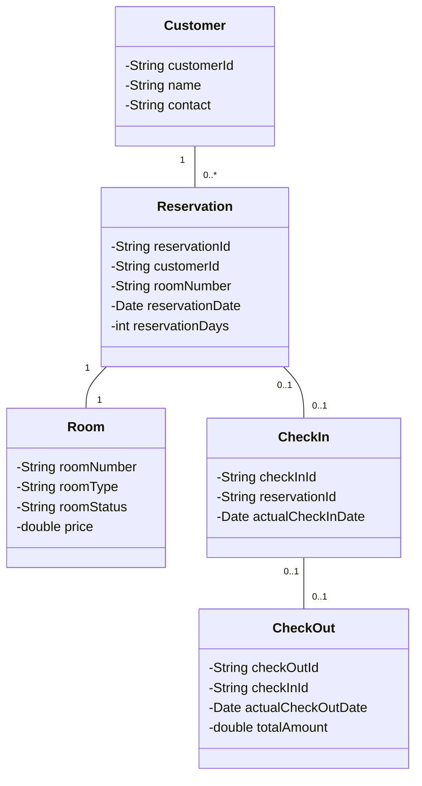

# 宾馆客房管理系统详细设计与具体代码实现

作者：禅与计算机程序设计艺术

## 1. 背景介绍

### 1.1 宾馆客房管理系统的重要性

在现代酒店管理中,高效的客房管理是提高酒店服务质量和运营效率的关键。传统的人工管理方式已经无法满足日益增长的客房管理需求。因此,开发一个功能完善、易于操作的宾馆客房管理系统变得尤为重要。

### 1.2 系统开发目标

本文旨在设计并实现一个基于Java的宾馆客房管理系统。该系统将实现客房预订、入住登记、退房结算等核心功能,并提供直观的用户界面,方便酒店工作人员的日常操作。同时,系统还将引入一些智能化功能,如自动房态更新、房价动态调整等,以提高酒店的运营效率。

### 1.3 技术选型与开发环境

- 开发语言:Java 
- 开发工具:IntelliJ IDEA
- 数据库:MySQL
- 前端框架:JavaFX
- 版本控制:Git

## 2. 核心概念与关联

### 2.1 领域模型

在宾馆客房管理系统中,我们需要对以下核心概念进行建模:

- 客房(Room):包括房间号、房型、房态、房价等属性。
- 客户(Customer):包括客户ID、姓名、联系方式等属性。
- 预订(Reservation):包括预订ID、客户ID、房间号、预订日期、预订天数等属性。
- 入住(CheckIn):包括入住ID、预订ID、实际入住日期等属性。
- 退房(CheckOut):包括退房ID、入住ID、实际退房日期、消费金额等属性。

### 2.2 类图设计

根据领域模型,我们可以设计出系统的核心类图如下:



## 3. 核心算法原理与具体操作步骤

### 3.1 客房预订算法

客房预订是系统的核心功能之一。当客户提交预订请求时,系统需要根据客户的预订日期和房型需求,查找可用客房并生成预订记录。具体步骤如下:

1. 根据客户输入的预订日期和房型,查询该日期范围内的所有客房记录。
2. 过滤出房态为"可预订"的客房。
3. 如果存在可用客房,则随机选择一个房间,并将其房态更新为"已预订"。
4. 创建预订记录,关联客户和客房,并保存到数据库中。
5. 返回预订成功的结果。

### 3.2 客房动态定价算法

为了提高酒店的收益,我们可以根据客房的供需情况动态调整房价。当客房供不应求时,我们可以适当提高房价;当客房供大于求时,我们可以适当降低房价。具体算法如下:

1. 设定一个基准房价 $P_0$ 和调整系数 $\alpha$。
2. 对于每个房型,统计未来 $N$ 天的预订率 $R_i$,其中 $i=1,2,\cdots,N$。
3. 计算预订率的加权平均值:

$$
\bar{R} = \frac{\sum_{i=1}^{N} w_i R_i}{\sum_{i=1}^{N} w_i}
$$

其中 $w_i$ 为第 $i$ 天的权重,通常取 $w_i=\frac{1}{i}$。

4. 根据预订率的加权平均值 $\bar{R}$ 调整房价:

$$
P = P_0 \times (1 + \alpha \times (\bar{R} - 0.5))
$$

其中 $\alpha$ 为调整系数,取值范围为 $[0,1]$。当 $\bar{R} > 0.5$ 时,房价上调;当 $\bar{R} < 0.5$ 时,房价下调。

5. 更新房型的价格,并保存到数据库中。

## 4. 数学模型和公式详细讲解举例说明

在上一节中,我们介绍了客房动态定价算法中使用的数学模型和公式。下面我们通过一个具体的例子来说明该算法的计算过程。

假设某酒店的标准双人间基准房价为 $P_0=500$ 元,调整系数 $\alpha=0.2$。现在我们要根据未来 $N=7$ 天的预订率来调整房价。

首先,我们统计出未来7天的预订率如下:

| 日期   | 预订率 $R_i$ | 权重 $w_i$ |
|--------|------------|------------|
| 第1天  | 0.8        | 1          |
| 第2天  | 0.7        | 1/2        |
| 第3天  | 0.6        | 1/3        |
| 第4天  | 0.5        | 1/4        |
| 第5天  | 0.4        | 1/5        |
| 第6天  | 0.3        | 1/6        |
| 第7天  | 0.2        | 1/7        |

然后,我们计算预订率的加权平均值:

$$
\begin{aligned}
\bar{R} &= \frac{\sum_{i=1}^{7} w_i R_i}{\sum_{i=1}^{7} w_i} \\
&= \frac{0.8 \times 1 + 0.7 \times \frac{1}{2} + 0.6 \times \frac{1}{3} + 0.5 \times \frac{1}{4} + 0.4 \times \frac{1}{5} + 0.3 \times \frac{1}{6} + 0.2 \times \frac{1}{7}}{1 + \frac{1}{2} + \frac{1}{3} + \frac{1}{4} + \frac{1}{5} + \frac{1}{6} + \frac{1}{7}} \\
&\approx 0.58
\end{aligned}
$$

最后,我们根据预订率的加权平均值调整房价:

$$
\begin{aligned}
P &= P_0 \times (1 + \alpha \times (\bar{R} - 0.5)) \\
&= 500 \times (1 + 0.2 \times (0.58 - 0.5)) \\
&\approx 508 \text{(元)}
\end{aligned}
$$

因此,根据未来7天的预订率,我们将标准双人间的房价从500元调整为508元。

## 5. 项目实践:代码实例与详细解释说明

下面我们通过一些代码实例来展示如何实现宾馆客房管理系统的核心功能。

### 5.1 客房预订功能

```java
public class ReservationService {
    
    private RoomRepository roomRepository;
    private ReservationRepository reservationRepository;
    
    public ReservationService(RoomRepository roomRepository, ReservationRepository reservationRepository) {
        this.roomRepository = roomRepository;
        this.reservationRepository = reservationRepository;
    }
    
    public Reservation createReservation(String customerId, Date startDate, Date endDate, String roomType) {
        List<Room> availableRooms = roomRepository.findAvailableRooms(startDate, endDate, roomType);
        if (availableRooms.isEmpty()) {
            throw new RuntimeException("No available rooms for the given dates and room type.");
        }
        Room room = availableRooms.get(0);
        room.setRoomStatus("RESERVED");
        roomRepository.save(room);
        
        Reservation reservation = new Reservation();
        reservation.setCustomerId(customerId);
        reservation.setRoomNumber(room.getRoomNumber());
        reservation.setReservationDate(new Date());
        reservation.setReservationDays((int) ((endDate.getTime() - startDate.getTime()) / (1000 * 60 * 60 * 24)));
        return reservationRepository.save(reservation);
    }
}
```

在上面的代码中,`ReservationService` 类封装了客房预订的业务逻辑。它依赖于 `RoomRepository` 和 `ReservationRepository` 来访问数据库中的客房和预订记录。

`createReservation` 方法接受客户ID、预订起止日期和房型作为参数,然后执行以下步骤:

1. 调用 `RoomRepository` 的 `findAvailableRooms` 方法查询可用客房。
2. 如果没有可用客房,则抛出异常。
3. 选择第一个可用客房,并将其房态更新为"已预订"。
4. 创建预订记录,设置相关属性,并保存到数据库中。
5. 返回新创建的预订记录。

### 5.2 客房动态定价功能

```java
public class PricingService {
    
    private static final double BASE_PRICE = 500.0;
    private static final double ADJUSTMENT_FACTOR = 0.2;
    
    private ReservationRepository reservationRepository;
    private RoomRepository roomRepository;
    
    public PricingService(ReservationRepository reservationRepository, RoomRepository roomRepository) {
        this.reservationRepository = reservationRepository;
        this.roomRepository = roomRepository;
    }
    
    public void updateRoomPrices() {
        List<String> roomTypes = roomRepository.findDistinctRoomTypes();
        for (String roomType : roomTypes) {
            double occupancyRate = calculateWeightedOccupancyRate(roomType);
            double newPrice = BASE_PRICE * (1 + ADJUSTMENT_FACTOR * (occupancyRate - 0.5));
            roomRepository.updateRoomPrice(roomType, newPrice);
        }
    }
    
    private double calculateWeightedOccupancyRate(String roomType) {
        LocalDate today = LocalDate.now();
        List<Double> occupancyRates = new ArrayList<>();
        List<Double> weights = new ArrayList<>();
        for (int i = 1; i <= 7; i++) {
            LocalDate date = today.plusDays(i);
            double occupancyRate = reservationRepository.calculateOccupancyRate(date, roomType);
            occupancyRates.add(occupancyRate);
            weights.add(1.0 / i);
        }
        double numerator = 0.0;
        double denominator = 0.0;
        for (int i = 0; i < 7; i++) {
            numerator += weights.get(i) * occupancyRates.get(i);
            denominator += weights.get(i);
        }
        return numerator / denominator;
    }
}
```

在上面的代码中,`PricingService` 类封装了客房动态定价的业务逻辑。它依赖于 `ReservationRepository` 和 `RoomRepository` 来访问数据库中的预订记录和客房信息。

`updateRoomPrices` 方法遍历所有的房型,对于每个房型,执行以下步骤:

1. 调用 `calculateWeightedOccupancyRate` 方法计算未来7天的加权平均预订率。
2. 根据预订率调整房价,并调用 `RoomRepository` 的 `updateRoomPrice` 方法更新房价。

`calculateWeightedOccupancyRate` 方法根据房型计算未来7天的加权平均预订率,具体步骤如下:

1. 获取未来7天的日期。
2. 对于每个日期,调用 `ReservationRepository` 的 `calculateOccupancyRate` 方法计算预订率,并存储到列表中。
3. 计算权重列表,权重取倒数。
4. 计算加权平均预订率,并返回结果。

## 6. 实际应用场景

宾馆客房管理系统可以应用于各种类型的酒店,包括商务酒店、度假酒店、公寓式酒店等。下面我们以一个中等规模的商务酒店为例,说明该系统的实际应用场景。

假设该酒店拥有100间客房,包括标准间、双人间、豪华间等多种房型。酒店的客房管理流程通常包括以下步骤:

1. 预订:客户通过电话、网站或APP提交预订请求,前台工作人员使用客房管理系统的预订功能录入预订信息,系统自动分配可用客房并生成预订记录。

2. 入住:客户到达酒店后,前台工作人员使用客房管理系统的入住功能录入客户信息,并将预订状态更新为已入住。

3. 退房:客户退房时,前台工作人员使用客房管理系统的退房功能录入退房信息,并生成账单。系统自动将客房状态更新为可用。

4. 客房维护:客房服务人员使用客房管