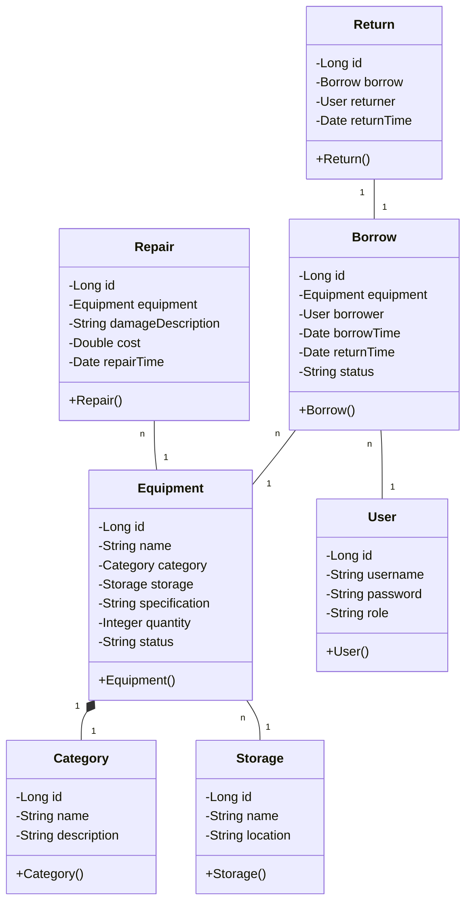

# 教学设备管理系统详细设计与具体代码实现

## 1. 背景介绍
### 1.1 教学设备管理的重要性
在现代化教学过程中,教学设备发挥着至关重要的作用。高效的教学设备管理可以提高教学质量,节约教学资源,为师生提供良好的教学环境。然而,传统的人工管理方式效率低下,容易出错,已经无法满足现代教学的需求。因此,开发一套功能完善、易于使用的教学设备管理系统势在必行。

### 1.2 教学设备管理系统的目标
教学设备管理系统旨在实现教学设备的信息化、智能化管理,具体目标包括:

1. 实现教学设备的电子化登记、查询和统计功能。
2. 提供设备借用、归还、维修等业务流程的自动化管理。
3. 支持多角色用户权限管理,保证数据安全。
4. 生成各类统计报表,为教学管理决策提供数据支持。
5. 提供友好的用户界面,降低用户的学习成本。

### 1.3 系统开发技术选型
为了实现上述目标,本系统采用以下技术方案:

1. 后端:Spring Boot + MyBatis + MySQL
2. 前端:Vue.js + Element UI
3. 部署:Docker + Jenkins

## 2. 核心概念与关系
### 2.1 领域模型
在教学设备管理领域,存在以下核心概念:

- Equipment:教学设备,包括多媒体设备、实验仪器、体育器材等。
- Category:设备分类,如电子设备、机械设备等。
- Storage:设备库房,用于存放设备。
- User:系统用户,分为管理员、教师、学生等角色。
- Borrow:设备借用记录。
- Return:设备归还记录。
- Repair:设备维修记录。

### 2.2 类图设计
根据领域模型,设计系统的核心类如下:



### 2.3 数据库设计
根据类图,设计数据库表结构如下:

```sql
CREATE TABLE `equipment` (
  `id` bigint(20) NOT NULL AUTO_INCREMENT,
  `name` varchar(50) NOT NULL,
  `category_id` bigint(20) NOT NULL,
  `storage_id` bigint(20) NOT NULL,
  `specification` varchar(100) DEFAULT NULL,
  `quantity` int(11) NOT NULL,
  `status` varchar(20) NOT NULL,
  PRIMARY KEY (`id`),
  KEY `fk_equipment_category` (`category_id`),
  KEY `fk_equipment_storage` (`storage_id`),
  CONSTRAINT `fk_equipment_category` FOREIGN KEY (`category_id`) REFERENCES `category` (`id`),
  CONSTRAINT `fk_equipment_storage` FOREIGN KEY (`storage_id`) REFERENCES `storage` (`id`)
) ENGINE=InnoDB DEFAULT CHARSET=utf8;

CREATE TABLE `category` (
  `id` bigint(20) NOT NULL AUTO_INCREMENT,
  `name` varchar(50) NOT NULL,
  `description` varchar(200) DEFAULT NULL,
  PRIMARY KEY (`id`),
  UNIQUE KEY `name` (`name`)
) ENGINE=InnoDB DEFAULT CHARSET=utf8;

CREATE TABLE `storage` (
  `id` bigint(20) NOT NULL AUTO_INCREMENT,
  `name` varchar(50) NOT NULL,
  `location` varchar(100) NOT NULL,
  PRIMARY KEY (`id`),
  UNIQUE KEY `name` (`name`)
) ENGINE=InnoDB DEFAULT CHARSET=utf8;

CREATE TABLE `user` (
  `id` bigint(20) NOT NULL AUTO_INCREMENT,
  `username` varchar(50) NOT NULL,
  `password` varchar(100) NOT NULL,
  `role` varchar(20) NOT NULL,
  PRIMARY KEY (`id`),
  UNIQUE KEY `username` (`username`)
) ENGINE=InnoDB DEFAULT CHARSET=utf8;

CREATE TABLE `borrow` (
  `id` bigint(20) NOT NULL AUTO_INCREMENT,
  `equipment_id` bigint(20) NOT NULL,
  `borrower_id` bigint(20) NOT NULL,
  `borrow_time` datetime NOT NULL,
  `return_time` datetime DEFAULT NULL,
  `status` varchar(20) NOT NULL,
  PRIMARY KEY (`id`),
  KEY `fk_borrow_equipment` (`equipment_id`),
  KEY `fk_borrow_user` (`borrower_id`),
  CONSTRAINT `fk_borrow_equipment` FOREIGN KEY (`equipment_id`) REFERENCES `equipment` (`id`),
  CONSTRAINT `fk_borrow_user` FOREIGN KEY (`borrower_id`) REFERENCES `user` (`id`)
) ENGINE=InnoDB DEFAULT CHARSET=utf8;

CREATE TABLE `return` (
  `id` bigint(20) NOT NULL AUTO_INCREMENT,
  `borrow_id` bigint(20) NOT NULL,
  `returner_id` bigint(20) NOT NULL,
  `return_time` datetime NOT NULL,
  PRIMARY KEY (`id`),
  UNIQUE KEY `borrow_id` (`borrow_id`),
  KEY `fk_return_user` (`returner_id`),
  CONSTRAINT `fk_return_borrow` FOREIGN KEY (`borrow_id`) REFERENCES `borrow` (`id`),
  CONSTRAINT `fk_return_user` FOREIGN KEY (`returner_id`) REFERENCES `user` (`id`)
) ENGINE=InnoDB DEFAULT CHARSET=utf8;

CREATE TABLE `repair` (
  `id` bigint(20) NOT NULL AUTO_INCREMENT,
  `equipment_id` bigint(20) NOT NULL,
  `damage_description` varchar(200) NOT NULL,
  `cost` decimal(10,2) NOT NULL,
  `repair_time` datetime NOT NULL,
  PRIMARY KEY (`id`),
  KEY `fk_repair_equipment` (`equipment_id`),
  CONSTRAINT `fk_repair_equipment` FOREIGN KEY (`equipment_id`) REFERENCES `equipment` (`id`)
) ENGINE=InnoDB DEFAULT CHARSET=utf8;
```

## 3. 核心算法原理与具体操作步骤
### 3.1 设备借用算法
#### 3.1.1 算法原理
设备借用的核心是判断设备是否可借,并更新设备和借用记录的状态。判断设备是否可借的条件如下:

1. 设备状态为"在库"。
2. 设备数量大于等于借用数量。
3. 借用人有借用权限。

借用成功后,需要执行以下操作:

1. 创建借用记录,记录借用人、借用时间、应还时间等信息。
2. 更新设备状态为"借出",并减少相应数量。

#### 3.1.2 具体步骤
1. 接收用户的借用请求,包括设备ID、借用数量、借用人ID等。
2. 检查设备状态是否为"在库",若不是,返回错误信息。
3. 检查设备数量是否大于等于借用数量,若不是,返回错误信息。
4. 检查借用人是否有借用权限,若没有,返回错误信息。
5. 创建借用记录,设置借用人、借用时间、应还时间等属性。
6. 更新设备状态为"借出",并减少相应数量。
7. 返回借用成功信息。

### 3.2 设备归还算法
#### 3.2.1 算法原理
设备归还的核心是根据借用记录更新设备状态,并创建归还记录。归还成功的条件如下:

1. 借用记录状态为"借出"。
2. 归还人与借用人一致。
3. 归还时间不早于借用时间。

归还成功后,需要执行以下操作:

1. 创建归还记录,记录归还人、归还时间等信息。
2. 更新借用记录状态为"已还"。
3. 更新设备状态为"在库",并增加相应数量。

#### 3.2.2 具体步骤
1. 接收用户的归还请求,包括借用记录ID、归还人ID等。
2. 检查借用记录状态是否为"借出",若不是,返回错误信息。
3. 检查归还人是否与借用人一致,若不是,返回错误信息。
4. 检查归还时间是否不早于借用时间,若不是,返回错误信息。
5. 创建归还记录,设置归还人、归还时间等属性。
6. 更新借用记录状态为"已还"。
7. 更新设备状态为"在库",并增加相应数量。
8. 返回归还成功信息。

## 4. 数学模型与公式详解
### 4.1 设备可用率模型
设备可用率是衡量设备管理效率的重要指标,可用率越高,说明设备利用率越高,管理效果越好。设备可用率的计算公式如下:

$$
Availability = \frac{T_{total} - T_{borrow} - T_{repair}}{T_{total}}
$$

其中:
- $T_{total}$:统计时间段内的总时间,单位为小时。
- $T_{borrow}$:统计时间段内设备借出的时间,单位为小时。
- $T_{repair}$:统计时间段内设备维修的时间,单位为小时。

例如,某设备一个月内总时间为720小时,借出时间为100小时,维修时间为20小时,则其可用率为:

$$
Availability = \frac{720 - 100 - 20}{720} = 83.33\%
$$

### 4.2 设备完好率模型
设备完好率反映了设备的健康程度,完好率越高,说明设备故障率越低,运行状态越好。设备完好率的计算公式如下:

$$
Integrity = \frac{N_{total} - N_{damage}}{N_{total}}
$$

其中:
- $N_{total}$:设备总数。
- $N_{damage}$:损坏设备数。

例如,某单位共有100台设备,其中5台设备损坏,则设备完好率为:

$$
Integrity = \frac{100 - 5}{100} = 95\%
$$

## 5. 项目实践
### 5.1 后端实现
#### 5.1.1 Spring Boot项目搭建
使用Spring Initializr创建一个Maven项目,添加Web、MyBatis、MySQL等依赖:

```xml
<dependencies>
    <dependency>
        <groupId>org.springframework.boot</groupId>
        <artifactId>spring-boot-starter-web</artifactId>
    </dependency>
    <dependency>
        <groupId>org.mybatis.spring.boot</groupId>
        <artifactId>mybatis-spring-boot-starter</artifactId>
        <version>2.1.3</version>
    </dependency>
    <dependency>
        <groupId>mysql</groupId>
        <artifactId>mysql-connector-java</artifactId>
        <scope>runtime</scope>
    </dependency>
</dependencies>
```

#### 5.1.2 配置数据源
在application.yml中配置数据库连接信息:

```yaml
spring:
  datasource:
    url: jdbc:mysql://localhost:3306/equipment_db
    username: root
    password: 123456
    driver-class-name: com.mysql.cj.jdbc.Driver
```

#### 5.1.3 创建实体类
根据数据库表结构,创建对应的实体类,例如Equipment类:

```java
public class Equipment {
    private Long id;
    private String name;
    private Category category;
    private Storage storage;
    private String specification;
    private Integer quantity;
    private String status;
    
    // 省略getter和setter方法
}
```

#### 5.1.4 创建Mapper接口
使用MyBatis注解方式编写Mapper接口,例如EquipmentMapper:

```java
@Mapper
public interface EquipmentMapper {
    @Select("SELECT * FROM equipment WHERE id = #{id}")
    @Results({
        @Result(property = "category", column = "category_id", 
            one = @One(select = "com.example.mapper.CategoryMapper.selectById")),
        @Result(property = "storage", column = "storage_id",
            one = @One(select = "com.example.mapper.StorageMapper.selectById"))
    })
    Equipment selectById(Long id);
    
    @Select("SELECT * FROM equipment")
    @Results({
        @Result(property = "category", column = "category_id", 
            one = @One(select = "com.example.mapper.CategoryMapper.selectById")),
        @Result(property = "storage", column = "storage_id",
            one = @One(select = "com.example.mapper.StorageMapper.selectById"))
    })
    List<Equipment> selectAll();
    
    @Insert("INSERT INTO equipment(name, category_id, storage_id, specification, quantity, status) " +
            "VALUES (#{name}, #{category.id}, #{storage.id}, #{specification}, #{quantity}, #{status})")
    void insert(Equipment equipment);
    
    @Update