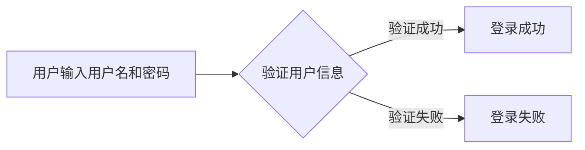
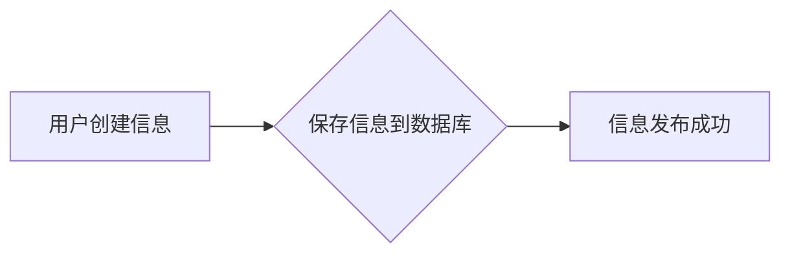
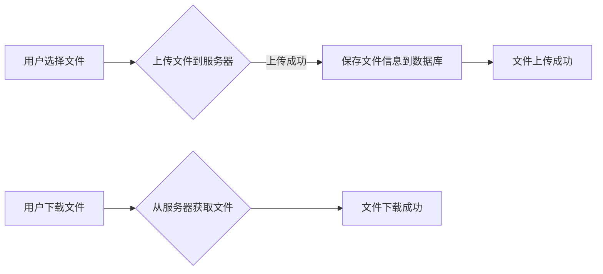

# 班级网站详细设计与具体代码实现

作者：禅与计算机程序设计艺术

## 1. 背景介绍

### 1.1. 教育信息化的发展趋势

随着互联网技术的飞速发展，教育信息化已经成为现代教育的重要趋势。班级网站作为教育信息化的重要组成部分，为师生之间、学生之间搭建了一个便捷的沟通桥梁，为教学资源共享、班级管理、家校互动等提供了高效的平台。

### 1.2. 班级网站的功能需求

一个功能完善的班级网站应满足以下需求：

*   **信息发布平台:**  发布班级公告、通知、活动信息等。
*   **学习资源共享:**  提供课件、习题、学习资料等资源下载。
*   **师生互动交流:**  支持在线答疑、讨论、作业提交等功能。
*   **班级管理工具:**  提供学生成绩管理、考勤记录、评优评先等功能。
*   **家校沟通渠道:**  方便家长了解学生在校情况，与老师进行沟通交流。

### 1.3. 本文目的

本文旨在提供一个班级网站的详细设计方案和具体代码实现，帮助开发者快速构建一个功能完善、易于维护的班级网站。

## 2. 核心概念与联系

### 2.1. 网站架构

班级网站采用典型的三层架构：

*   **表现层（Presentation Layer）：** 负责用户界面展示和用户交互，使用 HTML、CSS、JavaScript 等技术实现。
*   **业务逻辑层（Business Logic Layer）：** 负责处理业务逻辑，例如用户登录、数据校验、数据库操作等，使用 Python、Java、PHP 等后端语言实现。
*   **数据访问层（Data Access Layer）：** 负责与数据库进行交互，进行数据的增删改查操作，使用 SQL 语言实现。

### 2.2. 技术选型

本项目采用以下技术栈：

*   **前端:** HTML、CSS、JavaScript、Bootstrap
*   **后端:** Python、Django
*   **数据库:** MySQL

### 2.3. 模块划分

根据功能需求，将班级网站划分为以下模块：

*   **用户管理模块:**  负责用户注册、登录、权限管理等功能。
*   **信息发布模块:**  负责班级公告、通知、活动信息的发布和管理。
*   **学习资源模块:**  负责学习资源的上传、下载、分类管理等功能。
*   **师生互动模块:**  负责在线答疑、讨论、作业提交等功能。
*   **班级管理模块:**  负责学生成绩管理、考勤记录、评优评先等功能。
*   **家校沟通模块:**  负责家长信息的管理、家校沟通信息的发布和管理。

## 3. 核心算法原理具体操作步骤

### 3.1. 用户登录认证

#### 3.1.1. 流程图



#### 3.1.2. 具体步骤

1.  用户在登录页面输入用户名和密码。
2.  系统将用户输入的用户名和密码与数据库中存储的用户信息进行比对。
3.  如果用户名和密码匹配，则验证成功，用户登录成功。
4.  如果用户名或密码错误，则验证失败，用户登录失败。

### 3.2. 信息发布流程

#### 3.2.1. 流程图



#### 3.2.2. 具体步骤

1.  用户在信息发布页面填写信息内容。
2.  系统将用户填写的信息保存到数据库中。
3.  信息发布成功，用户可以在网站上查看已发布的信息。

### 3.3. 文件上传下载

#### 3.3.1. 流程图



#### 3.3.2. 具体步骤

1.  用户在文件上传页面选择要上传的文件。
2.  系统将用户选择的文件上传到服务器。
3.  文件上传成功后，系统将文件信息保存到数据库中。
4.  用户可以在文件下载页面查看已上传的文件，并点击下载按钮下载文件。

## 4. 数学模型和公式详细讲解举例说明

本项目不涉及复杂的数学模型和公式。

## 5. 项目实践：代码实例和详细解释说明

### 5.1. 用户模型

```python
from django.db import models

class User(models.Model):
    username = models.CharField(max_length=32, unique=True)
    password = models.CharField(max_length=128)
    email = models.EmailField(unique=True)
    role = models.CharField(max_length=16, choices=(
        ('student', '学生'),
        ('teacher', '教师'),
        ('parent', '家长'),
    ))

    def __str__(self):
        return self.username
```

**代码解释：**

*   `User` 模型定义了用户表，包含用户名、密码、邮箱、角色等字段。
*   `username` 字段定义为字符串类型，最大长度为 32 个字符，且唯一。
*   `password` 字段定义为字符串类型，最大长度为 128 个字符。
*   `email` 字段定义为邮箱类型，且唯一。
*   `role` 字段定义为字符串类型，最大长度为 16 个字符，可选值为 `student`、`teacher`、`parent`。

### 5.2. 信息发布模型

```python
from django.db import models

class Information(models.Model):
    title = models.CharField(max_length=128)
    content = models.TextField()
    author = models.ForeignKey(User, on_delete=models.CASCADE)
    created_at = models.DateTimeField(auto_now_add=True)

    def __str__(self):
        return self.title
```

**代码解释：**

*   `Information` 模型定义了信息表，包含标题、内容、作者、创建时间等字段。
*   `title` 字段定义为字符串类型，最大长度为 128 个字符。
*   `content` 字段定义为文本类型。
*   `author` 字段定义为外键，关联 `User` 模型，表示信息的作者。
*   `created_at` 字段定义为日期时间类型，自动记录信息的创建时间。

## 6. 实际应用场景

### 6.1. 学校班级网站

班级网站可以作为学校班级信息发布、学习资源共享、师生互动交流的平台，方便学校管理和家校沟通。

### 6.2. 培训机构网站

培训机构可以使用班级网站发布课程信息、学员作业、学习资料等，方便学员学习和管理。

### 6.3. 社区活动网站

社区活动网站可以作为社区居民发布活动信息、交流互动、资源共享的平台，促进社区和谐发展。

## 7. 工具和资源推荐

### 7.1. Django 框架

Django 是一个高级 Python Web 框架，可以帮助开发者快速构建安全、可维护的 Web 应用。

### 7.2. Bootstrap 前端框架

Bootstrap 是一个流行的前端框架，提供了丰富的 CSS 和 JavaScript 组件，可以帮助开发者快速构建美观、响应式的用户界面。

### 7.3. MySQL 数据库

MySQL 是一个流行的关系型数据库管理系统，可以用于存储和管理班级网站的数据。

## 8. 总结：未来发展趋势与挑战

### 8.1. 个性化学习

未来班级网站将更加注重个性化学习，根据学生的学习情况和兴趣爱好，推荐个性化的学习资源和学习路径。

### 8.2. 人工智能辅助教学

人工智能技术将被应用于班级网站，例如智能答疑、自动批改作业等，提高教学效率和质量。

### 8.3. 数据安全与隐私保护

随着班级网站存储的数据越来越丰富，数据安全和隐私保护将成为重要的挑战。

## 9. 附录：常见问题与解答

### 9.1. 如何注册账号？

在网站首页点击“注册”按钮，填写注册信息即可。

### 9.2. 如何修改密码？

登录后点击“个人中心”，在“修改密码”页面修改密码。

### 9.3. 如何上传文件？

在“学习资源”页面点击“上传文件”按钮，选择要上传的文件即可。