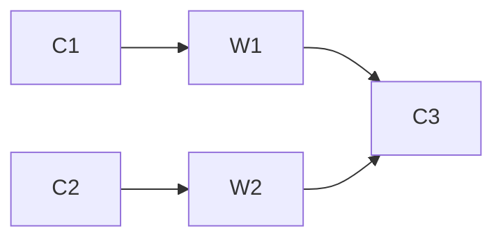

# "OozieBundle：多步作业调度实例"

作者：禅与计算机程序设计艺术

## 1. 背景介绍
### 1.1 大数据处理的挑战
在大数据时代，企业需要处理海量的数据，这些数据通常来自不同的来源，格式多样，且数据量巨大。为了从这些数据中提取有价值的信息，需要使用各种大数据处理框架和工具，如Hadoop、Spark、Hive等。然而，仅仅使用这些框架还不够，我们还需要一个工作流调度系统来协调和管理这些大数据处理作业，以确保作业能够按照预定的顺序和时间执行，并且能够处理错误和异常情况。

### 1.2 Apache Oozie简介
Apache Oozie是一个开源的工作流调度系统，专门用于管理Hadoop作业。它允许用户定义工作流，其中包含一系列动作（Action）和决策点（Decision Point），并以DAG（有向无环图）的形式表示整个工作流。Oozie支持多种类型的Hadoop作业，包括MapReduce、Pig、Hive和Sqoop等，同时还能够调度Java程序和Shell脚本。

### 1.3 Oozie Bundle概述
Oozie Bundle是Oozie的一个高级特性，它允许用户将多个工作流打包成一个逻辑单元，并指定它们之间的依赖关系和执行顺序。通过使用Bundle，用户可以更方便地管理和调度复杂的多步骤作业，提高作业的可维护性和可重用性。

## 2. 核心概念与联系
### 2.1 Workflow、Coordinator和Bundle
在Oozie中，有三个核心概念：Workflow、Coordinator和Bundle。

- Workflow：代表一个单独的作业流程，由一系列Action和Decision Point组成，以DAG的形式定义作业的执行顺序和依赖关系。
- Coordinator：用于定义作业的调度策略，如何根据时间或数据的可用性来触发Workflow的执行。
- Bundle：用于将多个Coordinator和Workflow打包成一个逻辑单元，定义它们之间的依赖关系和执行顺序。

### 2.2 Bundle的优势
使用Bundle有以下几个优势：

1. 简化复杂作业的管理：通过将多个Workflow和Coordinator打包成一个Bundle，可以更方便地管理和维护复杂的多步骤作业。
2. 提高作业的可重用性：Bundle可以作为一个独立的单元进行部署和调度，方便在不同的环境中重复使用。
3. 增强作业的模块化：Bundle允许将作业划分为多个独立的模块，每个模块负责特定的功能，提高作业的可维护性和可扩展性。

### 2.3 Bundle的组成部分
一个Bundle由以下几个部分组成：

1. Bundle应用程序：定义Bundle的基本信息，如名称、描述和配置参数等。
2. Coordinator应用程序：定义作业的调度策略，指定何时触发Workflow的执行。
3. Workflow应用程序：定义作业的执行流程，包含一系列Action和Decision Point。
4. 数据依赖关系：定义Bundle中各个组件之间的数据依赖关系，确保作业按照正确的顺序执行。

## 3. 核心算法原理与具体操作步骤
### 3.1 创建Bundle应用程序
创建Bundle应用程序的步骤如下：

1. 定义Bundle的基本信息，如名称、描述和配置参数等。
2. 指定Bundle中包含的Coordinator和Workflow应用程序。
3. 定义Bundle中各个组件之间的依赖关系和执行顺序。
4. 将Bundle应用程序打包成一个XML文件，用于部署到Oozie服务器上。

下面是一个简单的Bundle应用程序示例：

```xml
<bundle-app name="my-bundle" xmlns="uri:oozie:bundle:0.2">
    <coordinator name="my-coord-1">
        <app-path>hdfs://localhost:8020/user/oozie/coordinators/my-coord-1</app-path>
    </coordinator>
    <coordinator name="my-coord-2">
        <app-path>hdfs://localhost:8020/user/oozie/coordinators/my-coord-2</app-path>
        <dependency>
            <coordinator name="my-coord-1"/>
        </dependency>
    </coordinator>
</bundle-app>
```

在这个示例中，我们定义了一个名为"my-bundle"的Bundle应用程序，其中包含两个Coordinator应用程序："my-coord-1"和"my-coord-2"。"my-coord-2"依赖于"my-coord-1"，因此它只有在"my-coord-1"执行完成后才会被触发。

### 3.2 创建Coordinator应用程序
创建Coordinator应用程序的步骤如下：

1. 定义Coordinator的基本信息，如名称、描述和配置参数等。
2. 指定Coordinator的调度策略，如何根据时间或数据的可用性来触发Workflow的执行。
3. 指定Coordinator中包含的Workflow应用程序。
4. 将Coordinator应用程序打包成一个XML文件，用于部署到Oozie服务器上。

下面是一个简单的Coordinator应用程序示例：

```xml
<coordinator-app name="my-coord" frequency="${coord:days(1)}" start="${startTime}" end="${endTime}" timezone="UTC" xmlns="uri:oozie:coordinator:0.4">
    <action>
        <workflow>
            <app-path>hdfs://localhost:8020/user/oozie/workflows/my-workflow</app-path>
        </workflow>
    </action>
</coordinator-app>
```

在这个示例中，我们定义了一个名为"my-coord"的Coordinator应用程序，它每天触发一次Workflow的执行。Workflow的定义文件位于HDFS上的"/user/oozie/workflows/my-workflow"路径。

### 3.3 创建Workflow应用程序
创建Workflow应用程序的步骤如下：

1. 定义Workflow的基本信息，如名称、描述和配置参数等。
2. 定义Workflow中包含的Action和Decision Point，指定它们之间的依赖关系和执行顺序。
3. 将Workflow应用程序打包成一个XML文件，用于部署到Oozie服务器上。

下面是一个简单的Workflow应用程序示例：

```xml
<workflow-app name="my-workflow" xmlns="uri:oozie:workflow:0.5">
    <start to="action1"/>
    <action name="action1">
        <shell xmlns="uri:oozie:shell-action:0.2">
            <job-tracker>${jobTracker}</job-tracker>
            <name-node>${nameNode}</name-node>
            <exec>echo "Hello, World!"</exec>
        </shell>
        <ok to="end"/>
        <error to="fail"/>
    </action>
    <kill name="fail">
        <message>Workflow failed, error message[${wf:errorMessage(wf:lastErrorNode())}]</message>
    </kill>
    <end name="end"/>
</workflow-app>
```

在这个示例中，我们定义了一个名为"my-workflow"的Workflow应用程序，其中包含一个Shell Action，用于输出"Hello, World!"。如果Action执行成功，则转移到结束节点；如果执行失败，则转移到失败节点。

### 3.4 部署和运行Bundle应用程序
部署和运行Bundle应用程序的步骤如下：

1. 将Bundle、Coordinator和Workflow应用程序打包成XML文件，并上传到HDFS上。
2. 使用Oozie客户端提交Bundle应用程序，指定Bundle的配置参数和启动时间等。
3. 监控Bundle的执行状态，查看各个Coordinator和Workflow的执行进度和结果。
4. 如果需要，可以暂停、恢复或终止Bundle的执行。

下面是一个使用Oozie客户端提交Bundle应用程序的示例命令：

```bash
oozie job -run -config job.properties
```

其中，"job.properties"文件包含Bundle应用程序的配置参数，如下所示：

```properties
oozie.bundle.application.path=hdfs://localhost:8020/user/oozie/bundles/my-bundle.xml
oozie.use.system.libpath=true
oozie.bundle.start.time=2023-05-01T00:00Z
```

## 4. 数学模型和公式详细讲解举例说明
在Oozie Bundle中，主要涉及的数学模型是有向无环图（DAG）。Bundle中的Coordinator和Workflow应用程序按照DAG的方式组织，每个节点代表一个应用程序，边代表应用程序之间的依赖关系。

### 4.1 有向无环图（DAG）
有向无环图是一种图形数据结构，它由一组节点和一组有向边组成，且不存在环路。在Oozie Bundle中，DAG用于表示Coordinator和Workflow应用程序之间的依赖关系和执行顺序。

假设我们有一个Bundle应用程序，其中包含三个Coordinator应用程序（C1、C2和C3）和两个Workflow应用程序（W1和W2），它们之间的依赖关系如下：

- C1触发W1的执行
- C2触发W2的执行
- C3依赖于W1和W2的执行结果

我们可以使用以下DAG来表示这个Bundle应用程序：



在这个DAG中，节点表示Coordinator和Workflow应用程序，边表示它们之间的依赖关系。C1和C2分别触发W1和W2的执行，而C3依赖于W1和W2的执行结果。

### 4.2 拓扑排序
为了确保Bundle应用程序中的Coordinator和Workflow按照正确的顺序执行，Oozie使用拓扑排序算法对DAG进行排序。拓扑排序是一种对有向无环图进行排序的算法，它将图中的节点按照依赖关系的顺序排列，使得每个节点都排在其依赖节点的后面。

以上面的DAG为例，拓扑排序的结果可以是：

```
C1, C2, W1, W2, C3
```

这个排序结果表示，C1和C2可以并行执行，W1和W2需要在C1和C2执行完成后才能开始执行，而C3需要等待W1和W2都执行完成后才能开始执行。

拓扑排序算法的时间复杂度为$O(V+E)$，其中$V$表示图中节点的数量，$E$表示图中边的数量。

## 5. 项目实践：代码实例和详细解释说明
下面我们通过一个实际的项目实践，来演示如何使用Oozie Bundle调度多个Coordinator和Workflow应用程序。

### 5.1 项目需求
假设我们有一个电商网站，每天需要执行以下三个作业：

1. 从订单数据库中导出前一天的订单数据，并将其存储到HDFS上。
2. 对订单数据进行清洗和转换，生成用户购买行为数据。
3. 将用户购买行为数据导入到Hive表中，用于后续的数据分析。

我们希望使用Oozie Bundle来调度这三个作业，并且要求作业2和作业3依赖于作业1的执行结果。

### 5.2 项目实现
#### 5.2.1 创建Workflow应用程序
首先，我们需要为每个作业创建一个Workflow应用程序，定义作业的执行流程和依赖关系。

作业1的Workflow应用程序（export_orders.xml）：

```xml
<workflow-app name="export_orders" xmlns="uri:oozie:workflow:0.5">
    <start to="export_orders"/>
    <action name="export_orders">
        <shell xmlns="uri:oozie:shell-action:0.2">
            <job-tracker>${jobTracker}</job-tracker>
            <name-node>${nameNode}</name-node>
            <exec>export_orders.sh</exec>
            <argument>${outputDir}</argument>
        </shell>
        <ok to="end"/>
        <error to="fail"/>
    </action>
    <kill name="fail">
        <message>Workflow failed, error message[${wf:errorMessage(wf:lastErrorNode())}]</message>
    </kill>
    <end name="end"/>
</workflow-app>
```

作业2的Workflow应用程序（process_orders.xml）：

```xml
<workflow-app name="process_orders" xmlns="uri:oozie:workflow:0.5">
    <start to="process_orders"/>
    <action name="process_orders">
        <spark xmlns="uri:oozie:spark-action:0.2">
            <job-tracker>${jobTracker}</job-tracker>
            <name-node>${nameNode}</name-node>
            <master>yarn-cluster</master>
            <mode>cluster</mode>
            <name>process_orders</name>
            <class>com.example.ProcessOrders</class>
            <jar>process_orders.jar</jar>
            <arg>${inputDir}</arg>
            <arg>${outputDir}</arg>
        </spark>
        <ok to="end"/>
        <error to="fail"/>
    </action>
    <kill name="fail">
        <message>Workflow failed, error message[${wf:errorMessage(wf:lastErrorNode())}]</message>
    </kill>
    <end name="end"/>
</workflow-app>
```

作业3的