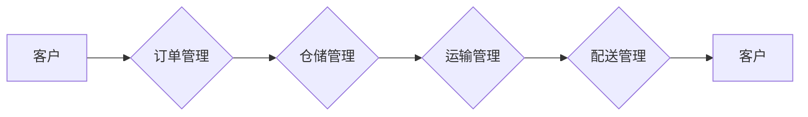
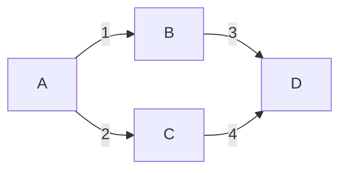

## 1. 背景介绍

### 1.1 物流行业现状与挑战

随着电子商务的迅猛发展和全球贸易的日益繁荣，物流行业正经历着前所未有的变革。传统的物流模式已无法满足日益增长的市场需求，面临着效率低下、成本高昂、信息不透明等诸多挑战。为了应对这些挑战，现代物流企业迫切需要构建高效、智能、可视化的物流系统，以提升运营效率、降低成本、增强客户满意度。

### 1.2  Web技术的优势与应用

Web技术以其开放性、跨平台性、易用性等优势，成为构建现代物流系统的理想选择。基于Web的网上物流系统能够实现物流信息的实时共享、业务流程的自动化处理、物流资源的优化配置，从而有效提升物流效率和服务质量。

### 1.3 本文研究目标与意义

本文旨在设计和实现一个基于Web的网上物流系统，该系统将涵盖物流业务的全流程，包括订单管理、仓储管理、运输管理、配送管理等核心功能模块。通过详细阐述系统的设计思路、技术架构、功能模块、代码实现等内容，为物流企业构建高效、智能的物流系统提供参考和借鉴。

## 2. 核心概念与联系

### 2.1 物流系统基本概念

* **订单:**  客户购买商品或服务的请求，包含商品信息、数量、价格、收货地址等关键信息。
* **仓库:**  用于存储和管理货物的场所，包括存储区域、货架、叉车等设施。
* **运输:**  将货物从一个地点转移到另一个地点的过程，涉及运输工具、路线规划、运输时间等要素。
* **配送:**  将货物送达最终客户手中的过程，包括配送路线规划、配送时间安排、配送人员管理等环节。

### 2.2 系统功能模块之间的联系

网上物流系统各个功能模块之间紧密联系，协同工作，共同完成物流业务的全流程。例如：

* **订单管理模块** 接收客户订单，并将其传递给 **仓储管理模块** 进行库存分配和出库操作。
* **仓储管理模块** 将出库货物信息传递给 **运输管理模块** 进行运输安排。
* **运输管理模块** 将货物运送到目的地后，通知 **配送管理模块** 进行配送安排。
* **配送管理模块** 完成配送后，更新订单状态并通知客户。

### 2.3 系统数据流图



## 3. 核心算法原理具体操作步骤

### 3.1 路径规划算法

路径规划是物流系统中的核心算法之一，用于确定货物运输的最优路线，以最小化运输成本和时间。常用的路径规划算法包括：

* **Dijkstra 算法:**  一种基于贪心策略的最短路径算法，适用于单源最短路径问题。
* **A* 算法:**  一种启发式搜索算法，通过引入启发函数来提高搜索效率，适用于单源最短路径问题。
* **Floyd-Warshall 算法:**  一种动态规划算法，用于解决所有节点对之间的最短路径问题。

### 3.2 库存管理算法

库存管理算法用于优化仓库的货物存储和管理，以最大限度地利用仓库空间、降低库存成本、提高库存周转率。常用的库存管理算法包括：

* **ABC 分类法:**  根据货物的价值和重要程度进行分类，对不同类别的货物采取不同的管理策略。
* **经济订货批量 (EOQ) 模型:**  用于确定最佳的订货批量，以最小化库存成本。
* **物料需求计划 (MRP) 系统:**  一种基于预测的库存管理方法，用于确定未来一段时间内所需的物料数量。

### 3.3 配送路线优化算法

配送路线优化算法用于规划最佳的配送路线，以最大限度地减少配送时间和成本。常用的配送路线优化算法包括：

* **旅行商问题 (TSP) 算法:**  一种经典的组合优化问题，旨在寻找访问所有客户的最短路径。
* **车辆路径问题 (VRP) 算法:**  一种扩展的 TSP 问题，考虑了车辆容量、配送时间窗口等约束条件。

## 4. 数学模型和公式详细讲解举例说明

### 4.1 经济订货批量 (EOQ) 模型

EOQ 模型用于确定最佳的订货批量，以最小化库存成本。其数学模型如下：

$$
EOQ = \sqrt{\frac{2DS}{H}}
$$

其中：

* $D$ 表示年需求量
* $S$ 表示每次订货成本
* $H$ 表示单位库存持有成本

**举例说明:**

假设某公司年需求量为 10,000 件，每次订货成本为 50 元，单位库存持有成本为 2 元。则最佳订货批量为：

$$
EOQ = \sqrt{\frac{2 \times 10000 \times 50}{2}} = 1000 件
$$

### 4.2 Dijkstra 算法

Dijkstra 算法是一种基于贪心策略的最短路径算法，适用于单源最短路径问题。其基本步骤如下：

1. 初始化所有节点的距离为无穷大，起点节点的距离为 0。
2. 将起点节点加入到已访问节点集合中。
3. 循环遍历未访问节点集合中的节点，计算起点节点到该节点的距离，并更新距离数组。
4. 选择距离起点节点最近的未访问节点，将其加入到已访问节点集合中。
5. 重复步骤 3 和 4，直到所有节点都被访问。

**举例说明:**

假设存在如下网络拓扑结构：



使用 Dijkstra 算法计算 A 节点到 D 节点的最短路径：

1. 初始化距离数组：`distance = {A: 0, B: inf, C: inf, D: inf}`。
2. 将 A 节点加入到已访问节点集合中：`visited = {A}`。
3. 遍历未访问节点 B 和 C，计算 A 节点到 B 和 C 的距离：`distance = {A: 0, B: 1, C: 2, D: inf}`。
4. 选择距离 A 节点最近的未访问节点 B，将其加入到已访问节点集合中：`visited = {A, B}`。
5. 遍历未访问节点 C 和 D，计算 A 节点到 C 和 D 的距离：`distance = {A: 0, B: 1, C: 2, D: 4}`。
6. 选择距离 A 节点最近的未访问节点 C，将其加入到已访问节点集合中：`visited = {A, B, C}`。
7. 遍历未访问节点 D，计算 A 节点到 D 的距离：`distance = {A: 0, B: 1, C: 2, D: 4}`。
8. 选择距离 A 节点最近的未访问节点 D，将其加入到已访问节点集合中：`visited = {A, B, C, D}`。

因此，A 节点到 D 节点的最短路径为 `A -> B -> D`，距离为 4。

## 5. 项目实践：代码实例和详细解释说明

### 5.1 系统架构设计

本系统采用 MVC (Model-View-Controller) 架构模式，将系统划分为模型层、视图层和控制器层，以实现代码的模块化和可维护性。

* **模型层:**  负责数据存储和业务逻辑处理，包括数据库设计、数据访问层、业务逻辑层等。
* **视图层:**  负责用户界面展示，包括 HTML 页面、CSS 样式、JavaScript 脚本等。
* **控制器层:**  负责接收用户请求、调用模型层进行业务逻辑处理、返回处理结果给视图层进行展示。

### 5.2 数据库设计

本系统采用关系型数据库 MySQL 进行数据存储，主要数据表包括：

* **用户表:**  存储用户信息，包括用户名、密码、角色等。
* **订单表:**  存储订单信息，包括订单编号、商品信息、数量、价格、收货地址等。
* **仓库表:**  存储仓库信息，包括仓库编号、仓库名称、仓库地址等。
* **货物表:**  存储货物信息，包括货物编号、货物名称、货物规格等。
* **运输表:**  存储运输信息，包括运输单号、运输路线、运输车辆等。
* **配送表:**  存储配送信息，包括配送单号、配送人员、配送路线等。

### 5.3 代码实例

**订单管理模块 - 创建订单:**

```python
from django.shortcuts import render, redirect
from .models import Order

def create_order(request):
    if request.method == 'POST':
        # 获取表单数据
        product_id = request.POST.get('product_id')
        quantity = request.POST.get('quantity')
        address = request.POST.get('address')

        # 创建订单对象
        order = Order(
            product_id=product_id,
            quantity=quantity,
            address=address
        )

        # 保存订单到数据库
        order.save()

        # 重定向到订单列表页面
        return redirect('order_list')
    else:
        # 渲染创建订单页面
        return render(request, 'order/create.html')
```

**仓储管理模块 - 入库操作:**

```python
from django.shortcuts import render, redirect
from .models import Warehouse, Goods

def stock_in(request):
    if request.method == 'POST':
        # 获取表单数据
        warehouse_id = request.POST.get('warehouse_id')
        goods_id = request.POST.get('goods_id')
        quantity = request.POST.get('quantity')

        # 获取仓库对象
        warehouse = Warehouse.objects.get(id=warehouse_id)

        # 获取货物对象
        goods = Goods.objects.get(id=goods_id)

        # 更新仓库库存
        warehouse.stock += quantity

        # 保存仓库对象
        warehouse.save()

        # 重定向到仓库列表页面
        return redirect('warehouse_list')
    else:
        # 渲染入库操作页面
        return render(request, 'warehouse/stock_in.html')
```

## 6. 实际应用场景

### 6.1 电商平台

电商平台可以利用网上物流系统来管理订单、仓库、运输、配送等环节，实现物流业务的自动化处理，提高物流效率和客户满意度。

### 6.2 物流企业

物流企业可以利用网上物流系统来管理运输路线、车辆调度、货物跟踪等，优化物流资源配置，降低物流成本。

### 6.3 制造企业

制造企业可以利用网上物流系统来管理原材料采购、生产计划、产品配送等，提高生产效率和供应链管理水平。

## 7. 总结：未来发展趋势与挑战

### 7.1 未来发展趋势

* **智能化:**  利用人工智能、大数据等技术，实现物流系统的智能化决策和自动化操作。
* **可视化:**  通过数据可视化技术，实时监控物流状态、分析物流数据，提高物流透明度和可控性。
* **一体化:**  将物流系统与其他企业系统进行集成，实现信息共享和业务协同，构建一体化供应链管理平台。

### 7.2 面临的挑战

* **数据安全:**  物流系统涉及大量敏感数据，需要加强数据安全防护措施，防止数据泄露和滥用。
* **系统复杂性:**  物流系统功能复杂、业务流程繁琐，需要采用先进的技术架构和开发方法，确保系统稳定性和可维护性。
* **人才短缺:**  物流行业需要大量 skilled 的技术人才，才能满足智能化物流系统开发和运维的需求。

## 8. 附录：常见问题与解答

### 8.1 如何保证系统安全性？

* 采用 HTTPS 协议进行数据传输加密。
* 使用安全的密码存储和验证机制。
* 定期进行安全漏洞扫描和修复。
* 制定完善的数据安全管理制度。

### 8.2 如何提高系统性能？

* 采用分布式架构，将系统负载分散到多台服务器上。
* 使用缓存技术，减少数据库访问次数。
* 优化数据库设计和查询语句，提高数据访问效率。
* 使用负载均衡技术，将用户请求均匀地分配到多台服务器上。

### 8.3 如何进行系统维护？

* 定期进行系统备份和恢复演练。
* 定期更新系统软件和补丁。
* 建立完善的系统监控和报警机制。
* 制定详细的系统维护手册。
