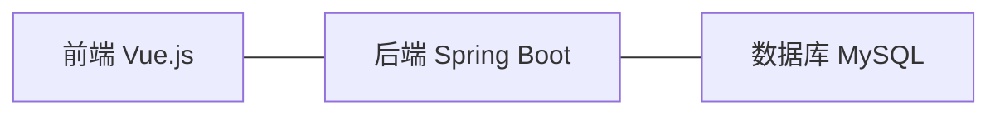

# 学校教学管理系统详细设计与具体代码实现

作者：禅与计算机程序设计艺术

## 1. 背景介绍

### 1.1 教学管理系统的重要性

在现代化的教育体系中,高效的教学管理是保证教学质量和学校运转的关键。传统的人工管理方式已经无法满足日益增长的教学管理需求。因此,开发一套功能完善、易于使用的教学管理系统就显得尤为重要。

### 1.2 教学管理系统的主要功能

一个优秀的教学管理系统应该包含以下主要功能:

- 学生信息管理:包括学生的基本信息、学籍信息等。
- 教师信息管理:包括教师的基本信息、教学安排等。
- 课程管理:包括课程的基本信息、授课计划、教学大纲等。
- 成绩管理:包括学生成绩的录入、查询、统计等。
- 教学质量评估:对教师的教学质量进行评估和反馈。

### 1.3 系统开发技术选型

为了开发一个高质量的教学管理系统,我们需要选择合适的技术栈。本系统将采用以下技术:

- 前端:Vue.js + Element UI
- 后端:Spring Boot + MyBatis
- 数据库:MySQL
- 版本控制:Git
- 项目管理:Maven

## 2. 核心概念与关系

### 2.1 领域模型

在教学管理系统中,核心的领域概念包括:

- Student(学生):学生的基本信息和学籍信息。
- Teacher(教师):教师的基本信息和教学安排。
- Course(课程):课程的基本信息、授课计划和教学大纲。
- Grade(成绩):学生修读课程的成绩信息。

### 2.2 概念之间的关系

这些概念之间存在着以下关系:

- Student 和 Course 之间是多对多的选课关系。
- Teacher 和 Course 之间是一对多的授课关系。
- Student 和 Course 之间通过 Grade 产生多对多的成绩关系。

### 2.3 系统架构设计

本系统采用前后端分离的架构设计,前端使用 Vue.js 进行用户界面开发,后端使用 Spring Boot 提供 RESTful API,数据持久化使用 MySQL 数据库。系统架构图如下:



## 3. 核心算法原理与具体操作步骤

### 3.1 学生成绩加权平均算法

在成绩管理模块中,我们需要根据学生的各科成绩计算出加权平均成绩。加权平均成绩的计算公式如下:

$$
\bar{x} = \frac{\sum_{i=1}^{n} w_i x_i}{\sum_{i=1}^{n} w_i}
$$

其中,$\bar{x}$表示加权平均成绩,$x_i$表示第$i$门课程的成绩,$w_i$表示第$i$门课程的学分,$n$表示总课程数。

具体操作步骤如下:

1. 查询出学生的所有课程成绩和对应的学分。
2. 根据公式计算出加权平均成绩。
3. 将加权平均成绩保存到数据库中。

### 3.2 教学质量评估算法

在教学质量评估模块中,我们需要根据学生对教师教学的评分计算出教师的教学质量得分。教学质量得分的计算公式如下:

$$
Q = \frac{\sum_{i=1}^{m} S_i}{m}
$$

其中,$Q$表示教学质量得分,$S_i$表示第$i$个学生的评分,$m$表示参评学生数。

具体操作步骤如下:

1. 查询出所有参评学生对该教师的评分。
2. 根据公式计算出教学质量得分。
3. 将教学质量得分保存到数据库中。

## 4. 数学模型和公式详细讲解举例说明

### 4.1 学生成绩加权平均数学模型

假设某学生修读了3门课程,各科成绩和学分如下:

| 课程   | 成绩 | 学分 |
|--------|------|------|
| 高等数学 | 85  | 4    |
| 大学英语 | 90  | 3    |
| 程序设计 | 92  | 4    |

根据加权平均成绩公式,可以计算出该学生的加权平均成绩为:

$$
\begin{aligned}
\bar{x} &= \frac{4 \times 85 + 3 \times 90 + 4 \times 92}{4 + 3 + 4} \\
&= \frac{340 + 270 + 368}{11} \\
&= \frac{978}{11} \\
&= 88.91
\end{aligned}
$$

因此,该学生的加权平均成绩为88.91。

### 4.2 教学质量评估数学模型

假设某教师有5个学生参与教学质量评估,各学生的评分如下:

| 学生   | 评分 |
|--------|------|
| 学生A  | 9    |
| 学生B  | 8    |
| 学生C  | 10   |
| 学生D  | 9    |
| 学生E  | 8    |

根据教学质量得分公式,可以计算出该教师的教学质量得分为:

$$
\begin{aligned}
Q &= \frac{9 + 8 + 10 + 9 + 8}{5} \\
&= \frac{44}{5} \\
&= 8.8
\end{aligned}
$$

因此,该教师的教学质量得分为8.8。

## 5. 项目实践:代码实例和详细解释说明

下面我们通过具体的代码实例来展示如何实现学生成绩管理和教学质量评估功能。

### 5.1 学生成绩管理

#### 5.1.1 数据库设计

首先我们需要设计学生成绩表`t_grade`:

```sql
CREATE TABLE `t_grade` (
  `id` bigint(20) NOT NULL AUTO_INCREMENT COMMENT '主键',
  `student_id` bigint(20) NOT NULL COMMENT '学生id',
  `course_id` bigint(20) NOT NULL COMMENT '课程id',
  `score` int(11) DEFAULT NULL COMMENT '成绩',
  PRIMARY KEY (`id`),
  KEY `idx_student_course` (`student_id`,`course_id`)
) ENGINE=InnoDB DEFAULT CHARSET=utf8mb4;
```

#### 5.1.2 后端接口设计

然后我们需要设计后端接口,提供学生成绩的增删改查功能,这里以查询学生成绩为例:

```java
@RestController
@RequestMapping("/grade")
public class GradeController {

    @Autowired
    private GradeService gradeService;

    @GetMapping("/{studentId}")
    public List<Grade> getGradeByStudentId(@PathVariable Long studentId) {
        return gradeService.getGradeByStudentId(studentId);
    }
}
```

#### 5.1.3 前端界面设计

最后我们需要设计前端界面,展示学生的成绩信息,这里以Vue.js为例:

```html
<template>
  <div>
    <el-table :data="grades">
      <el-table-column prop="courseName" label="课程名称"></el-table-column>
      <el-table-column prop="score" label="成绩"></el-table-column>
    </el-table>
  </div>
</template>

<script>
export default {
  data() {
    return {
      grades: []
    }
  },
  created() {
    this.getGrades()
  },
  methods: {
    async getGrades() {
      const res = await this.$http.get(`/grade/${this.studentId}`)
      this.grades = res.data
    }
  }
}
</script>
```

### 5.2 教学质量评估

#### 5.2.1 数据库设计

首先我们需要设计教学质量评估表`t_evaluation`:

```sql
CREATE TABLE `t_evaluation` (
  `id` bigint(20) NOT NULL AUTO_INCREMENT COMMENT '主键',
  `teacher_id` bigint(20) NOT NULL COMMENT '教师id',
  `student_id` bigint(20) NOT NULL COMMENT '学生id',
  `score` int(11) DEFAULT NULL COMMENT '评分',
  PRIMARY KEY (`id`),
  KEY `idx_teacher_student` (`teacher_id`,`student_id`)
) ENGINE=InnoDB DEFAULT CHARSET=utf8mb4;
```

#### 5.2.2 后端接口设计

然后我们需要设计后端接口,提供教学质量评估的增删改查功能,这里以新增评估为例:

```java
@RestController
@RequestMapping("/evaluation")
public class EvaluationController {

    @Autowired
    private EvaluationService evaluationService;

    @PostMapping
    public void addEvaluation(@RequestBody Evaluation evaluation) {
        evaluationService.addEvaluation(evaluation);
    }
}
```

#### 5.2.3 前端界面设计

最后我们需要设计前端界面,让学生可以对教师进行评分,这里以Vue.js为例:

```html
<template>
  <div>
    <el-form :model="evaluation">
      <el-form-item label="评分">
        <el-rate v-model="evaluation.score"></el-rate>
      </el-form-item>
      <el-form-item>
        <el-button type="primary" @click="onSubmit">提交</el-button>
      </el-form-item>
    </el-form>
  </div>
</template>

<script>
export default {
  data() {
    return {
      evaluation: {
        teacherId: null,
        studentId: null,
        score: 0
      }
    }
  },
  methods: {
    async onSubmit() {
      await this.$http.post('/evaluation', this.evaluation)
      this.$message.success('评分成功')
    }
  }
}
</script>
```

## 6. 实际应用场景

教学管理系统可以应用于各级各类学校,包括中小学、大学等。它可以极大地提高学校的教学管理效率,减轻教师的工作负担,为学校的教学质量提升提供数据支撑。

下面是一些具体的应用场景:

### 6.1 学生学籍管理

通过教学管理系统,学校可以方便地管理学生的学籍信息,包括入学、休学、复学、退学等,大大减少了人工管理的工作量。

### 6.2 教师教学管理

教师可以通过系统发布教学计划、上传教学资料、布置作业、批改作业等,实现教学过程的全流程管理。

### 6.3 学生选课管理

学生可以通过系统自主选课、查询课表、查询成绩等,提高了选课的便捷性和透明度。

### 6.4 教学质量评估

通过学生对教师教学的评分,学校可以及时了解教学质量情况,并根据评估结果进行教学改进,提升教学水平。

## 7. 工具和资源推荐

### 7.1 开发工具

- IntelliJ IDEA:Java IDE
- WebStorm:前端 IDE
- Navicat:数据库管理工具
- Postman:API 测试工具

### 7.2 学习资源

- Spring Boot 官方文档:https://spring.io/projects/spring-boot
- Vue.js 官方文档:https://cn.vuejs.org/
- 阿里巴巴 Java 开发手册:https://github.com/alibaba/p3c
- 廖雪峰 Java 教程:https://www.liaoxuefeng.com/wiki/1252599548343744

## 8. 总结:未来发展趋势与挑战

### 8.1 未来发展趋势

随着教育信息化的不断推进,教学管理系统将向着智能化、移动化、个性化的方向发展。

- 智能化:利用人工智能技术,实现智能排课、智能推荐等功能。
- 移动化:提供移动端应用,让师生可以随时随地使用系统。
- 个性化:根据学生的学习特点,提供个性化的学习资源和学习路径。

### 8.2 面临的挑战

教学管理系统的发展也面临着一些挑战,主要包括:

- 数据安全:如何保证学生和教师的隐私数据安全是一大挑战。
- 系统性能:如何提供高并发、高可用的系统服务是另一大挑战。
- 用户体验:如何设计出易用、友好的用户界面也是不容忽视的问题。

## 9. 附录:常见问题与解答

### 9.1 如何导入学生数据?

可以通过Excel等格式的文件导入学生数据,系统会提供相应的数据导入功能。

### 9.2 如何进行系统权限管理?

系统会提供基于角色的权限管理功能,可以给不同的用户分配不同的角色和权限。

### 9.3 如何进行数据备份?

系统会定期自动备份数据,同时也提供手动备份功能,以防止数据丢失。

### 9.4 如何进行系统升级?