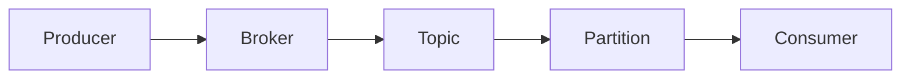

# Kafka原理与代码实例讲解

作者：禅与计算机程序设计艺术

## 1. 背景介绍

### 1.1 消息队列的重要性
在现代分布式系统中,消息队列扮演着至关重要的角色。它能够实现系统组件之间的解耦,提高系统的可扩展性、可靠性和性能。Kafka作为一个高吞吐量的分布式消息队列系统,已经被广泛应用于数据处理、日志收集、流处理等领域。

### 1.2 Kafka的诞生
Kafka最初由LinkedIn公司开发,用于解决该公司内部的海量日志传输问题。2011年,Kafka成为Apache顶级开源项目。多年来,Kafka凭借其优异的性能和可靠性,赢得了业界的广泛认可。

### 1.3 Kafka的特点
Kafka具有以下几个主要特点:
- 高吞吐量:单机每秒可以处理数十万条消息。
- 高可扩展性:可以轻松扩展到数百台服务器。  
- 持久化存储:消息可以持久化到磁盘,保证数据不丢失。
- 多语言支持:提供Java、Scala、Python等多种语言的客户端API。

## 2. 核心概念与联系

### 2.1 Producer(生产者)
Producer是消息的生产者,负责将消息发送到Kafka集群。Producer可以向不同的Topic发送消息。

### 2.2 Consumer(消费者) 
Consumer是消息的消费者,负责从Kafka集群中拉取消息并进行消费。Consumer可以订阅一个或多个Topic。

### 2.3 Broker
Broker是Kafka集群中的服务器。每个Broker都有一个唯一的ID,称为Broker ID。Broker负责接收和存储消息,并为Consumer提供消息服务。

### 2.4 Topic(主题)
Topic是Kafka中消息的类别或种类。每个消息都属于一个特定的Topic。Topic可以被分区,以实现消息的并行处理。

### 2.5 Partition(分区)
Partition是Topic的物理分片。一个Topic可以有多个Partition,每个Partition是一个有序的、不可变的消息序列。Partition可以分布在不同的Broker上,以实现负载均衡。

### 2.6 Offset(偏移量)
Offset是消息在Partition中的唯一标识。每个消息都有一个Offset值,表示其在Partition中的位置。Consumer通过Offset来跟踪消费进度。

### 2.7 消息传递流程
下图展示了Kafka的消息传递流程:



## 3. 核心算法原理与具体操作步骤

### 3.1 生产者发送消息
1. 生产者创建ProducerRecord对象,指定消息的Topic、Partition(可选)和内容。 
2. 生产者将ProducerRecord对象序列化为字节数组。
3. 生产者根据Topic和Partition选择对应的Broker,并将消息发送给Broker。
4. Broker接收到消息后,将其追加到对应的Partition中,并更新Offset。
5. Broker向生产者发送确认(Acknowledgement),表示消息已经成功写入。

### 3.2 消费者消费消息
1. 消费者订阅一个或多个Topic。
2. 消费者向Broker发送拉取(Fetch)请求,并指定要拉取的Partition和Offset。
3. Broker接收到拉取请求后,从指定的Partition中读取消息,并返回给消费者。
4. 消费者接收到消息后,对消息进行处理。
5. 消费者定期向Broker发送提交(Commit)请求,更新Offset,表示消息已经成功消费。

### 3.3 Broker存储消息
1. Broker接收到生产者发送的消息后,将其追加到对应的Partition中。
2. Broker将消息写入到磁盘上的日志文件中,以确保消息的持久性。
3. Broker维护每个Partition的Offset信息,记录最新的消息位置。
4. Broker定期进行日志压缩(Log Compaction),删除过期或重复的消息,以节省存储空间。

## 4. 数学模型和公式详细讲解举例说明

### 4.1 生产者吞吐量模型
生产者的吞吐量可以用以下公式表示:

$$
Throughput = \frac{MessageSize \times BatchSize}{RTT + BatchDelay}
$$

其中:
- $MessageSize$:单个消息的大小(以字节为单位)。
- $BatchSize$:批次大小,即每次发送的消息数量。
- $RTT$:往返时间(Round-Trip Time),即从发送请求到收到响应的时间。
- $BatchDelay$:批次延迟,即生产者等待批次填满的时间。

举例说明:假设单个消息大小为1KB,批次大小为1000,往返时间为10ms,批次延迟为50ms。则生产者的吞吐量为:

$$
Throughput = \frac{1KB \times 1000}{10ms + 50ms} \approx 16.7 MB/s
$$

### 4.2 消费者吞吐量模型
消费者的吞吐量可以用以下公式表示:

$$
Throughput = \frac{MessageSize \times BatchSize}{FetchDelay + ProcessingTime}
$$

其中:
- $MessageSize$:单个消息的大小(以字节为单位)。
- $BatchSize$:批次大小,即每次拉取的消息数量。
- $FetchDelay$:拉取延迟,即消费者等待拉取请求返回的时间。
- $ProcessingTime$:处理时间,即消费者处理一个批次消息的时间。

举例说明:假设单个消息大小为1KB,批次大小为500,拉取延迟为20ms,处理时间为30ms。则消费者的吞吐量为:

$$
Throughput = \frac{1KB \times 500}{20ms + 30ms} \approx 10 MB/s
$$

## 5. 项目实践:代码实例和详细解释说明

### 5.1 生产者代码实例
下面是一个使用Java客户端API编写的Kafka生产者示例:

```java
import org.apache.kafka.clients.producer.*;

public class KafkaProducerExample {
    public static void main(String[] args) {
        // 配置生产者属性
        Properties props = new Properties();
        props.put("bootstrap.servers", "localhost:9092");
        props.put("key.serializer", "org.apache.kafka.common.serialization.StringSerializer");
        props.put("value.serializer", "org.apache.kafka.common.serialization.StringSerializer");
        
        // 创建生产者实例
        Producer<String, String> producer = new KafkaProducer<>(props);
        
        // 发送消息
        for (int i = 0; i < 10; i++) {
            String message = "Message " + i;
            producer.send(new ProducerRecord<>("my-topic", message), new Callback() {
                @Override
                public void onCompletion(RecordMetadata metadata, Exception exception) {
                    if (exception == null) {
                        System.out.println("Message sent successfully: " + metadata.toString());
                    } else {
                        System.out.println("Error sending message: " + exception.getMessage());
                    }
                }
            });
        }
        
        // 关闭生产者
        producer.close();
    }
}
```

代码解释:
1. 配置生产者属性,包括Kafka集群地址、键和值的序列化器等。
2. 创建KafkaProducer实例,传入配置属性。
3. 使用for循环发送10条消息到名为"my-topic"的Topic。
4. 创建ProducerRecord对象,指定Topic和消息内容。
5. 调用producer.send()方法发送消息,并传入回调函数处理发送结果。
6. 关闭生产者实例,释放资源。

### 5.2 消费者代码实例
下面是一个使用Java客户端API编写的Kafka消费者示例:

```java
import org.apache.kafka.clients.consumer.*;

public class KafkaConsumerExample {
    public static void main(String[] args) {
        // 配置消费者属性
        Properties props = new Properties();
        props.put("bootstrap.servers", "localhost:9092");
        props.put("group.id", "my-group");
        props.put("key.deserializer", "org.apache.kafka.common.serialization.StringDeserializer");
        props.put("value.deserializer", "org.apache.kafka.common.serialization.StringDeserializer");
        
        // 创建消费者实例
        Consumer<String, String> consumer = new KafkaConsumer<>(props);
        
        // 订阅Topic
        consumer.subscribe(Collections.singletonList("my-topic"));
        
        // 消费消息
        while (true) {
            ConsumerRecords<String, String> records = consumer.poll(Duration.ofMillis(100));
            for (ConsumerRecord<String, String> record : records) {
                System.out.println("Received message: " + record.value());
            }
        }
    }
}
```

代码解释:
1. 配置消费者属性,包括Kafka集群地址、消费者组ID、键和值的反序列化器等。
2. 创建KafkaConsumer实例,传入配置属性。
3. 调用consumer.subscribe()方法订阅名为"my-topic"的Topic。
4. 使用while循环不断拉取消息。
5. 调用consumer.poll()方法拉取消息,传入超时时间。
6. 遍历ConsumerRecords,处理每条消息。

## 6. 实际应用场景

### 6.1 日志收集
Kafka可以用于收集分布式系统中的日志数据。各个服务器将日志发送到Kafka,然后通过消费者将日志存储到集中的日志存储系统(如HDFS)中,方便进行日志分析和监控。

### 6.2 消息系统
Kafka可以作为消息中间件,实现系统组件之间的异步通信。例如,在电商系统中,订单服务可以将订单消息发送到Kafka,然后库存服务和物流服务分别消费订单消息,执行相应的业务逻辑。

### 6.3 流处理
Kafka可以与流处理框架(如Apache Spark、Apache Flink)集成,实现实时数据处理。例如,Kafka可以接收传感器产生的数据流,然后通过流处理框架进行实时分析和计算。

## 7. 工具和资源推荐

### 7.1 Kafka官方文档
Kafka官方文档提供了详细的Kafka使用指南和API参考,是学习Kafka的权威资料。
官方文档地址:https://kafka.apache.org/documentation/

### 7.2 Kafka可视化工具
- Kafka Tool:一个Kafka集群管理和测试的GUI工具。
- Kafka Manager:一个用于管理Kafka集群的Web工具。
- Kafka Eagle:一个Kafka集群监控和管理工具。

### 7.3 Kafka客户端库
除了Java客户端API,Kafka还提供了多种编程语言的客户端库,如Python、Go、C++等。这些客户端库可以方便地与Kafka进行交互。

## 8. 总结:未来发展趋势与挑战

### 8.1 云原生Kafka
随着云计算的发展,越来越多的企业将Kafka部署在云平台上。云原生Kafka将成为未来的发展趋势,提供更高的弹性、可扩展性和易用性。

### 8.2 流处理的融合
Kafka将与流处理引擎进一步融合,提供端到端的流处理解决方案。这将简化流处理应用的开发和部署,提高实时数据处理的效率。

### 8.3 数据安全与隐私
随着数据安全和隐私法规的日益严格,Kafka需要提供更强大的安全特性,如数据加密、访问控制等,以满足企业的合规性要求。

### 8.4 性能优化
Kafka需要不断优化其性能,以应对海量数据的处理需求。这包括提高吞吐量、降低延迟、优化存储和网络传输等方面的改进。

## 9. 附录:常见问题与解答

### 9.1 Kafka如何保证消息的顺序?
Kafka通过Partition来保证消息的顺序。同一个Partition内的消息是有序的,但是不同Partition之间的消息顺序不能保证。

### 9.2 Kafka如何实现消息的持久化?
Kafka将消息持久化到磁盘上的日志文件中。Kafka使用分段日志(Segmented Log)的方式,将日志文件分割成多个段,每个段有固定的大小。当一个段写满后,Kafka会创建一个新的段来继续写入消息。

### 9.3 Kafka如何处理消费者的Offset?
Kafka将消费者的Offset保存在一个特殊的Topic中,称为__consumer_offsets。消费者定期将Offset提交到该Topic,以记录消费进度。当消费者重启后,可以从上次提交的Offset处继续消费。

### 9.4 Kafka如何实现负载均衡?
Kafka通过Partition的分配来实现负载均衡。每个Partition