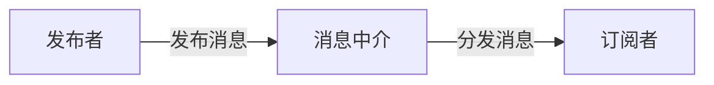

## 1.背景介绍

随着信息技术的飞速发展，大数据已经成为了我们日常生活中无处不在的存在。每一次我们浏览网页、使用社交媒体、购物、甚至是开车出行，都在产生大量的数据。这些数据，如果能够被有效地收集和分析，将有可能为我们提供深入的洞见，帮助我们做出更明智的决策。然而，大数据的处理和分析并非易事，尤其是在数据量越来越大，数据来源越来越多，数据类型越来越复杂的今天。

在这种背景下，发布订阅模式应运而生。发布订阅模式是一种消息传递方式，其中，发送消息的一方（发布者）并不直接将消息发送给特定的接收者（订阅者），而是将消息发布到一个中介（通常被称为主题或频道）中，订阅者可以根据自己的需求订阅感兴趣的主题，从而接收到消息。这种方式可以将消息的发送者和接收者解耦，使得系统更加灵活，更易于扩展。

## 2.核心概念与联系

发布订阅模式主要包含三个核心角色：发布者、订阅者和消息中介。下面我们分别来介绍一下这三个角色。

- **发布者**：发布者是消息的发送方，它的任务是生产消息并将其发布到消息中介中。发布者并不需要知道谁会接收到这些消息，也不需要关心消息的分发方式。

- **订阅者**：订阅者是消息的接收方，它的任务是订阅感兴趣的主题，并处理接收到的消息。订阅者并不需要知道这些消息是谁发送的，也不需要关心其他订阅者的存在。

- **消息中介**：消息中介是发布者和订阅者之间的桥梁，它的任务是接收发布者发布的消息，然后将这些消息分发给订阅了相应主题的订阅者。

在发布订阅模式中，发布者、订阅者和消息中介之间的关系可以用如下的图示来表示：



## 3.核心算法原理具体操作步骤

发布订阅模式的核心算法可以概括为以下几个步骤：

1. **发布者生成消息**：发布者根据需要生成消息。消息可以包含任何类型的数据，包括但不限于文本、图片、音频、视频等。

2. **发布者发布消息**：发布者将生成的消息发布到消息中介中。这一步通常需要指定一个主题，以便消息中介知道应该将这个消息分发给哪些订阅者。

3. **消息中介接收消息**：消息中介接收到发布者发布的消息后，将其存储在相应的主题中。

4. **消息中介分发消息**：消息中介将存储在主题中的消息分发给订阅了这个主题的订阅者。

5. **订阅者处理消息**：订阅者接收到消息后，根据自己的需要对消息进行处理。

## 4.数学模型和公式详细讲解举例说明

在发布订阅模式中，我们可以使用一种称为概率模型的数学模型来描述订阅者接收到消息的可能性。假设我们有`n`个订阅者，每个订阅者订阅了`m`个主题，那么，当发布者发布一条消息时，订阅者接收到这条消息的概率`P`可以用下面的公式来计算：

$$
P = \frac{m}{n}
$$

这个公式的含义是，订阅者接收到消息的概率等于它订阅的主题数占总主题数的比例。

## 5.项目实践：代码实例和详细解释说明

为了更好地理解发布订阅模式，下面我们来看一个简单的示例。在这个示例中，我们将使用Python语言实现一个简单的发布订阅系统。

首先，我们需要定义一个`Publisher`类，这个类的任务是发布消息：

```python
class Publisher:
    def __init__(self):
        self.subscribers = {}

    def subscribe(self, subscriber, topic):
        self.subscribers.setdefault(topic, []).append(subscriber)

    def publish(self, message, topic):
        for subscriber in self.subscribers.get(topic, []):
            subscriber.receive(message)
```

在这个类中，我们使用一个字典`subscribers`来存储订阅者和主题的关系。`subscribe`方法用于订阅者订阅主题，`publish`方法用于发布消息。

然后，我们需要定义一个`Subscriber`类，这个类的任务是接收和处理消息：

```python
class Subscriber:
    def __init__(self, name):
        self.name = name

    def receive(self, message):
        print(f'{self.name} received: {message}')
```

在这个类中，我们定义了一个`receive`方法，当订阅者接收到消息时，这个方法会被调用。

最后，我们可以创建一些发布者和订阅者，然后让订阅者订阅主题，发布者发布消息，看看结果如何：

```python
publisher = Publisher()
alice = Subscriber('Alice')
bob = Subscriber('Bob')

publisher.subscribe(alice, 'tech')
publisher.subscribe(bob, 'sports')

publisher.publish('AI is the future!', 'tech')
publisher.publish('Football is fun!', 'sports')
```

运行这段代码，你会看到如下的输出：

```
Alice received: AI is the future!
Bob received: Football is fun!
```

这说明，Alice订阅的`tech`主题的消息被成功地发布出去，Bob订阅的`sports`主题的消息也被成功地发布出去。

## 6.实际应用场景

发布订阅模式在实际中有很多应用场景，例如：

- **日志系统**：在一个大型的分布式系统中，有可能有数以百计的服务器在同时运行。这时，如果我们想要收集这些服务器的运行日志，就可以使用发布订阅模式。每个服务器作为一个发布者，将自己的运行日志发布出去，而日志收集系统作为订阅者，订阅所有服务器的日志主题，从而收集所有服务器的运行日志。

- **消息队列**：消息队列是一种常见的中间件，它可以帮助我们在分布式系统中传递消息。在消息队列中，发送消息的服务作为发布者，接收消息的服务作为订阅者，消息队列本身就是一个消息中介。通过发布订阅模式，我们可以将发送消息的服务和接收消息的服务解耦，使得系统更加灵活，更易于扩展。

- **实时通讯**：在一些需要实时通讯的应用中，例如聊天应用、在线协作工具等，我们也可以使用发布订阅模式。每个用户都可以作为发布者和订阅者，当他们发送消息时，作为发布者将消息发布出去，当他们接收消息时，作为订阅者从消息中介中接收消息。

## 7.工具和资源推荐

如果你想要在实际项目中使用发布订阅模式，你可能需要一些工具和资源。下面是我个人推荐的一些工具：

- **RabbitMQ**：RabbitMQ是一个开源的消息队列系统，它支持多种消息模型，包括发布订阅模式。RabbitMQ有一个非常完善的文档，无论你是初学者还是有经验的开发者，都可以在其中找到你需要的信息。

- **Redis**：Redis不仅仅是一个内存数据库，它也支持发布订阅模式。你可以使用Redis的`PUBLISH`和`SUBSCRIBE`命令来发布和订阅消息。

- **Apache Kafka**：Apache Kafka是一个分布式的流处理平台，它可以处理高吞吐量的实时数据。Kafka有一个强大的发布订阅模型，可以支持大规模的消息处理。

## 8.总结：未来发展趋势与挑战

随着云计算、大数据、物联网等技术的发展，发布订阅模式的应用场景将会越来越广泛。然而，随着应用场景的扩大，发布订阅模式也将面临新的挑战，例如如何处理海量的消息、如何保证消息的可靠性、如何保证系统的可扩展性等。

不过，我相信随着技术的进步，这些挑战都将被一一解决。发布订阅模式作为一种简单而强大的模式，将会在未来的IT领域中发挥更大的作用。

## 9.附录：常见问题与解答

**Q1：发布订阅模式和观察者模式有什么区别？**

A1：发布订阅模式和观察者模式都是一种一对多的通信模式，都可以实现消息的发布者和接收者的解耦。但是，它们之间有一个重要的区别：在观察者模式中，观察者直接观察发布者，而在发布订阅模式中，订阅者通过一个消息中介订阅消息。

**Q2：发布订阅模式适用于哪些场景？**

A2：发布订阅模式适用于以下场景：
- 需要广播消息的场景。
- 发布者和订阅者需要解耦的场景。
- 需要动态添加和删除订阅者的场景。

**Q3：如何保证发布订阅模式中的消息顺序？**

A3：在某些情况下，我们需要保证消息的顺序，例如在日志系统中，我们希望日志的顺序与事件发生的顺序一致。这时，我们可以使用时间戳或者序列号来标记消息的顺序，然后在订阅者那里按照这个顺序处理消息。

**Q4：如何保证发布订阅模式中的消息可靠性？**

A4：在某些情况下，我们需要保证消息的可靠性，例如在支付系统中，我们不能容忍支付消息丢失。这时，我们可以使用持久化和确认机制来提高消息的可靠性。持久化是指将消息存储在持久化存储（如磁盘）中，以防止系统崩溃导致的消息丢失。确认机制是指订阅者在处理完消息后向消息中介发送一个确认信息，如果消息中介没有收到确认信息，就认为消息没有被成功处理，需要重新发送。