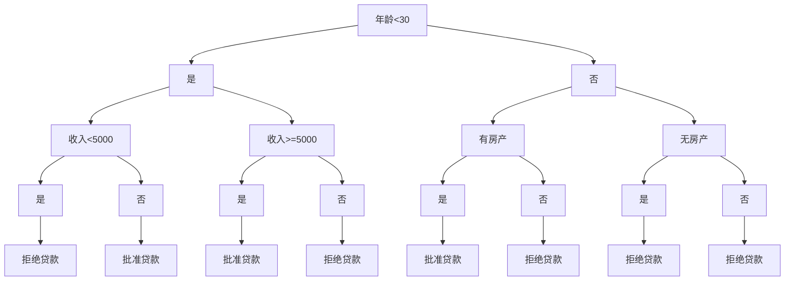
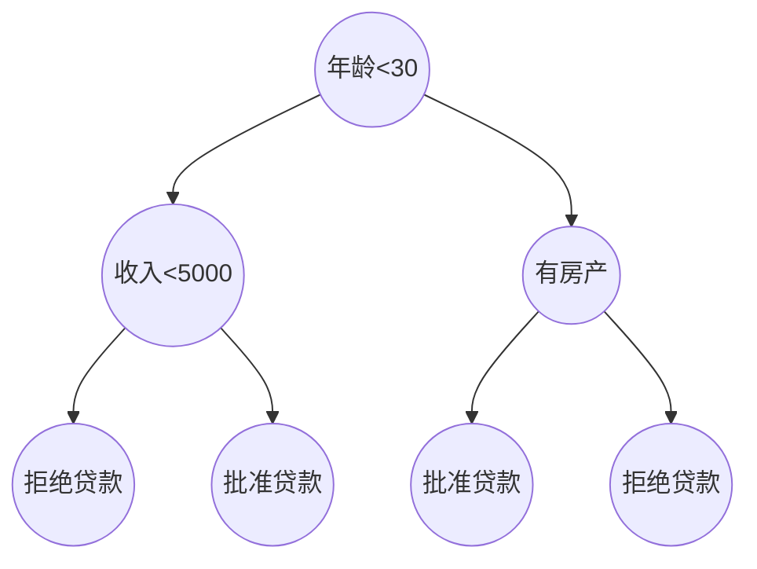

# 可视化技巧：让决策树更易理解

作者：禅与计算机程序设计艺术

## 1. 背景介绍

### 1.1 决策树的重要性

决策树是一种广泛应用于机器学习和数据挖掘领域的预测模型。它以树状结构表示一系列的决策规则,通过对数据特征的逐步判断,最终得出预测结果。决策树易于理解和解释,能够处理数值型和类别型数据,并能够自动进行特征选择。因此,决策树在实际应用中得到了广泛的应用,如金融风控、医疗诊断、营销推荐等。

### 1.2 决策树可视化的必要性

尽管决策树模型本身较为直观,但是当决策树的规模较大、深度较深时,直接呈现决策树的文本或代码形式会让人难以理解其内在逻辑。决策树的可视化旨在以图形化的方式展现决策树,让人们能够更加直观地理解决策树的结构、决策过程和关键特征。良好的可视化不仅能够帮助模型开发者分析和优化决策树,也能让非技术人员如业务专家、决策者等理解模型的工作原理,建立对模型的信任。

### 1.3 决策树可视化面临的挑战

决策树的可视化并非易事,主要面临以下几点挑战:

1. 决策树的规模和复杂度。当决策树的节点数量巨大、深度很深时,如何在有限的屏幕空间内有效地展示决策树结构是一大挑战。

2. 信息过载。决策树的每个节点可能包含丰富的信息,如划分特征、阈值、节点样本数、不纯度等,如何在不引起信息过载的情况下呈现这些信息具有挑战性。

3. 审美与可读性。可视化需要兼顾美观和可读性。如何设计配色方案、布局、交互等使得可视化界面赏心悦目,同时不失信息传递的准确性也是一个挑战。

4. 可解释性。可视化不应只关注决策树的结构,还应体现出决策树的解释性,让人们理解每个节点的划分依据、每条路径的决策过程。这需要可视化与模型解释技术的结合。

## 2. 核心概念与联系

### 2.1 决策树的基本概念

决策树由节点和有向边组成。节点包括根节点、内部节点和叶节点。根节点是树的起始节点;内部节点表示一个特征的判断条件;叶节点表示决策结果。有向边表示不同判断条件下的决策路径。

每个内部节点都包含以下信息:
- 划分特征:用于判断的特征属性
- 判断条件:特征取值满足该条件时,数据流向其左子节点,否则流向右子节点
- 节点样本数:落入该节点的训练样本数量
- 不纯度:衡量该节点数据的混乱程度,常用指标有基尼系数和信息增益

叶节点包含以下信息:
- 样本数:落入该叶节点的样本数量
- 决策结果:对应的预测类别或预测值

### 2.2 决策树可视化的核心要素

根据上述决策树的基本概念,决策树可视化需要表现以下核心要素:

1. 树状结构:节点之间的父子关系和决策路径
2. 节点属性:划分特征、判断条件、样本数、不纯度等
3. 叶节点预测结果:类别或数值
4. 决策过程:从根节点到叶节点的判断路径及其含义

除了上述信息内容,可视化还需考虑美学设计,如配色、布局、交互等,以提升可视化的吸引力和可读性。

### 2.3 可视化与决策树算法的关系

可视化是决策树算法的重要辅助工具。主流的决策树算法,如ID3、C4.5、CART等,都以树状结构为模型表示。可视化能够直观展现这些算法生成的决策树,帮助人们理解树的生成过程。

同时,可视化对决策树算法的设计和优化也有帮助作用。通过可视化分析决策树,我们能够发现树的问题,如过拟合、特征使用不平衡等,从而对算法进行针对性的改进。

此外,可视化还是决策树模型评估和应用的重要手段。业务专家可以通过可视化直观判断决策树是否符合领域知识,决策者可以通过可视化了解系统的判断依据,这有助于建立对模型的信任和理解。

## 3. 核心算法原理与具体操作步骤

本节将介绍几种经典的决策树可视化算法,包括节点链接图、缩进树、圆形树等。这些算法从不同角度对决策树进行可视化编码,以平衡信息展示与美观度。同时,本节还将介绍一些提升决策树可视化效果的实用技巧。

### 3.1 节点链接图

节点链接图(Node-Link Diagram)是一种常见的树可视化方法。它通过节点表示树的节点,通过链接表示父子关系。下面是节点链接图的实现步骤:

1. 输入:决策树模型
2. 初始化画布,设定画布大小、边距等
3. 从决策树模型中提取节点信息,包括特征、阈值、样本数、不纯度、类别等
4. 计算每个节点的位置坐标。常见的布局算法有:
   - 层次布局(Hierarchical Layout):根节点置于顶部,子节点逐层向下排列
   - 辐射布局(Radial Layout):根节点置于中心,子节点沿辐射状向外排列
5. 绘制节点。根据节点属性设计节点的视觉编码,如:
   - 节点形状编码节点类型,如矩形表示内部节点,圆形表示叶节点
   - 节点颜色编码节点的不纯度或类别
   - 节点大小编码节点的样本数量
6. 绘制链接。使用直线或曲线连接父子节点,可以考虑使用不同颜色或粗细来编码链接的属性,如左右分支。
7. 添加交互。常见的交互功能有:
   - 节点悬停:鼠标悬停在节点上时显示节点的详细信息
   - 节点点击:点击节点可以展开或收起其子树
   - 平移缩放:支持画布的平移和缩放,方便探索大型决策树

下面是一个简单的节点链接图示例:



### 3.2 缩进树

缩进树(Indented Tree)通过缩进和文本来表示树的层次结构。它简洁直观,适合展示决策过程。下面是缩进树的实现步骤:

1. 输入:决策树模型
2. 初始化画布,设定文本字体、颜色、缩进量等
3. 从根节点开始,递归遍历决策树的每个节点
4. 对于每个节点:
   - 计算节点的缩进量,一般为节点深度乘以固定缩进值
   - 根据节点属性生成节点描述文本,如"年龄<30[是/否]"
   - 在对应缩进位置绘制节点文本
   - 如果是内部节点,递归绘制其子节点
   - 如果是叶节点,在其后追加决策结果文本
5. 添加交互。常见的交互功能有:
   - 节点展开/收起:点击内部节点的[是/否]可以展开或收起其子树
   - 节点悬停:鼠标悬停在节点文本上时显示更多信息

下面是一个简单的缩进树示例:

```
年龄<30[是/否]
  ├── 是
  │   └── 收入<5000[是/否]
  │       ├── 是
  │       │   └── 拒绝贷款
  │       └── 否
  │           └── 批准贷款
  └── 否
      └── 有房产[是/否]
          ├── 是
          │   └── 批准贷款
          └── 否
              └── 拒绝贷款
```

### 3.3 圆形树

圆形树(Circular Tree)将树布局在一个圆内,节点沿圆周分布,链接穿过圆心。这种布局紧凑美观,能够在有限空间内展示更多层次的节点。下面是圆形树的实现步骤:

1. 输入:决策树模型
2. 初始化画布,设定圆的中心坐标和半径
3. 计算每个节点的角度位置。一般采用先序遍历,将360度平分给每个节点。
4. 对每个节点:
   - 根据节点的角度和深度,计算其在圆周上的坐标
   - 绘制节点,可以使用不同的颜色、形状区分内部节点和叶节点
   - 如果有父节点,绘制从父节点经圆心到当前节点的曲线作为链接
5. 添加交互。常见的交互功能有:
   - 节点悬停:鼠标悬停在节点上时,高亮显示从根节点到当前节点的决策路径
   - 节点点击:点击叶节点可以展示其决策结果,点击内部节点可以展开或收起其子树

下面是一个简单的圆形树示例:



### 3.4 其他可视化技巧

除了上述经典的可视化方法,还有一些提升决策树可视化效果的技巧:

1. 特征重要性编码。根据特征的重要性对节点或链接进行颜色、大小等视觉编码,使得关键特征更加突出。

2. 多树对比。并排展示多棵决策树,或者用不同颜色叠加多棵树,可以比较不同决策树的结构异同。

3. 树与数据联动。将决策树与原始数据进行联动,如通过颜色编码树中的数据流向,或者支持点击叶节点展示其对应的数据样本。

4. 树与模型联动。将决策树可视化与模型评估指标联动,如根据叶节点的错误率对其进行颜色编码,快速诊断模型的问题。

5. 多粒度探索。提供树的多粒度交互探索功能,如缩放到不同深度、展开/收起不同支路等,方便用户在全局和局部之间切换。

## 4. 数学模型和公式详细讲解举例说明

决策树可视化涉及的数学模型主要有两类:一是决策树学习算法中使用的数学模型,如信息增益、基尼系数等;二是可视化布局中使用的数学模型,如树的层次布局、辐射布局等。本节将重点介绍决策树学习中的信息增益模型。

### 4.1 信息增益模型

信息增益(Information Gain)是ID3决策树算法使用的特征选择准则。它衡量某个特征对数据集分类的贡献度。直观地说,一个特征的信息增益越大,使用它进行划分所获得的"纯度提升"越大,数据的不确定性减少得越多。

设训练数据集为$D$,类别数为$K$,第$k$类样本所占比例为$p_k$,则数据集$D$的信息熵(Information Entropy)定义为:

$$
H(D) = -\sum_{k=1}^K p_k \log_2 p_k
$$

信息熵反映了数据集的不确定性,熵值越大,数据的不确定性越高。

设特征$A$有$V$个可能的取值${a_1,a_2,...,a_V}$,根据$A$