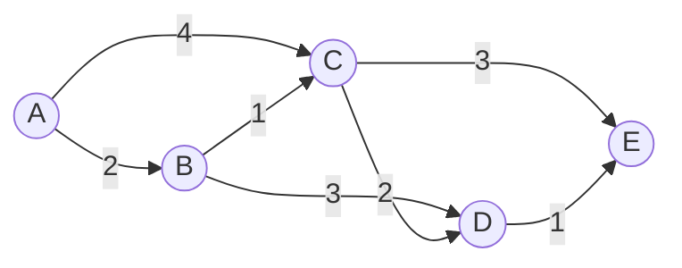

# 城市交通查询系统详细设计与具体代码实现

作者：禅与计算机程序设计艺术

## 1. 背景介绍

### 1.1 城市交通查询系统的重要性
在现代城市生活中,高效便捷的交通出行是市民日常生活的重要组成部分。然而,随着城市规模的不断扩大,交通网络日益复杂,市民对于如何选择最优出行路线,如何获取实时路况信息等方面的需求日益增长。因此,开发一套功能完善、易用性强的城市交通查询系统具有重要意义。

### 1.2 城市交通查询系统的主要功能
一个完善的城市交通查询系统应具备以下主要功能:
1. 多种交通方式的路线规划:包括公交、地铁、驾车、步行、骑行等,满足不同出行偏好的需求。
2. 实时路况信息查询:根据交通流量、道路施工、交通管制等因素,提供实时路况信息,帮助用户优化出行决策。
3. 公交、地铁换乘方案推荐:结合起点和终点,推荐最优的公交、地铁换乘方案,并提供详细的换乘指引。
4. 站点和线路信息查询:提供公交站点、地铁站点的位置信息,以及公交、地铁线路的运营时间、首末班车时间、票价等信息。
5. 交通出行费用估算:根据出行方式和路线,估算出行费用,帮助用户合理安排出行预算。

### 1.3 城市交通查询系统的技术挑战
开发一个高质量的城市交通查询系统面临以下技术挑战:
1. 海量交通数据的存储和检索:需要存储城市道路网络、公交线路、地铁线路等海量数据,并支持快速检索。
2. 高效的路径规划算法:需要在海量数据的基础上,设计高效的路径规划算法,在可接受的时间内给出最优出行路线。
3. 实时交通数据的获取和处理:需要与交通管理部门对接,获取实时路况数据,并进行清洗、存储、分析,以支持实时路况查询。
4. 高并发、高可用的系统架构:需要设计高并发、高可用的系统架构,以应对大量用户的并发访问,保证系统的稳定性。
5. 友好易用的用户界面:需要设计直观、易用的用户界面,方便用户快速输入查询条件,获取查询结果。

## 2. 核心概念与联系

### 2.1 城市道路网络模型
城市道路网络是城市交通查询系统的基础数据。通常使用有向加权图来建模:
- 图的节点表示道路的交叉点
- 图的边表示道路段,边的方向表示道路的通行方向,边的权重可以是道路长度、通行时间等

### 2.2 最短路径算法
在城市道路网络模型的基础上,路径规划问题可以转化为图上的最短路径问题。常用的最短路径算法包括:
- Dijkstra算法:适用于没有负权边的加权图
- A*算法:在Dijkstra算法的基础上引入启发式函数,适用于大规模道路网络
- Floyd算法:适用于任意两点间的最短路径查询

### 2.3 公交、地铁线路模型
公交、地铁线路可以抽象为一个有向图:
- 图的节点表示公交站点或地铁站点
- 图的边表示两个站点间的直达线路,边的权重可以是站点间的距离或通行时间

在此基础上,公交、地铁换乘问题可以转化为图上的最短路径问题,同样可以使用Dijkstra、A*等算法求解。

### 2.4 实时路况信息更新
实时路况信息的更新涉及以下几个关键环节:
1. 数据采集:通过与交通管理部门的数据接口对接,定期拉取道路实时流量、平均速度等数据。
2. 数据清洗:对采集到的数据进行去噪、异常值处理,提高数据质量。
3. 数据存储:将清洗后的数据存储到数据库中,供路径规划算法使用。
4. 定期更新:设定合理的数据更新频率,定期触发数据采集和计算流程,保证路况信息的实时性。

## 3. 核心算法原理与具体操作步骤

### 3.1 Dijkstra最短路径算法
Dijkstra算法是求解单源最短路径问题的经典算法,其基本思想是:
1. 初始化:将起点的距离设为0,其他节点的距离设为正无穷。
2. 选择距离最小的节点:从未确定最短距离的节点中,选择距离最小的节点,将其标记为已确定。
3. 更新距离:对于刚刚标记为已确定的节点,遍历其所有出边,尝试通过该节点缩短其他节点的距离。
4. 重复步骤2和3,直到所有节点都被标记为已确定。

具体操作步骤如下:
1. 创建一个优先队列,存储节点和对应的距离。
2. 将起点加入优先队列,距离为0。
3. 循环执行以下步骤,直到优先队列为空:
   - 取出优先队列中距离最小的节点u
   - 遍历节点u的所有出边(u, v),尝试通过节点u缩短节点v的距离:
     - 如果`distance[u] + weight(u, v) < distance[v]`,则更新`distance[v]`为`distance[u] + weight(u, v)`,并将节点v加入优先队列
4. 最终得到所有节点的最短距离

### 3.2 A*最短路径算法
A*算法是Dijkstra算法的启发式优化版本,引入了启发函数来指导搜索方向,适用于大规模道路网络。A*算法的核心思想是:
1. 对于每个节点n,定义`f(n) = g(n) + h(n)`,其中:
   - `g(n)`表示从起点到节点n的实际距离
   - `h(n)`表示从节点n到终点的估计距离,即启发函数
2. 将`f(n)`作为优先队列的排序依据,每次优先探索`f(n)`最小的节点

具体操作步骤如下:
1. 创建一个优先队列,存储节点和对应的`f`值。
2. 将起点加入优先队列,`g`值为0,`f`值为`h(start)`。
3. 循环执行以下步骤,直到优先队列为空或达到终点:
   - 取出优先队列中`f`值最小的节点u
   - 如果节点u为终点,则结束搜索
   - 遍历节点u的所有出边(u, v),尝试通过节点u缩短节点v的距离:
     - 计算新的`g`值:`g_new = g[u] + weight(u, v)`
     - 如果`g_new < g[v]`,则更新`g[v]`为`g_new`,更新`f[v]`为`g_new + h(v)`,并将节点v加入优先队列
4. 如果搜索结束时达到终点,则找到最短路径;否则不存在从起点到终点的路径

### 3.3 公交、地铁换乘算法
公交、地铁换乘问题可以转化为多模式图上的最短路径问题:
1. 构建多模式图:
   - 将公交站点、地铁站点、换乘点作为图的节点
   - 在同一交通模式内,连接直达站点形成边
   - 在不同交通模式间,连接换乘点形成边,边权为换乘时间
2. 在多模式图上应用Dijkstra或A*算法,求解最短路径
3. 将最短路径上的边转化为换乘方案

## 4. 数学模型和公式详细讲解举例说明

### 4.1 最短路径问题的数学模型
给定一个带权有向图$G=(V,E)$,其中$V$表示节点集合,$E$表示边集合。对于每条边$(u,v)\in E$,定义其权重为$w(u,v)$,表示从节点$u$到节点$v$的距离或通行时间。

定义起点$s\in V$和终点$t\in V$,最短路径问题的目标是找到一条从$s$到$t$的路径$P=(v_0,v_1,\dots,v_k)$,使得路径上各边权重之和最小,即:

$$
\min \sum_{i=1}^k w(v_{i-1},v_i)
$$

其中,$v_0=s$,$v_k=t$。

### 4.2 Dijkstra算法的数学描述
定义$dist[v]$表示从起点$s$到节点$v$的最短距离,$prev[v]$表示最短路径上节点$v$的前驱节点。

Dijkstra算法的数学描述如下:
1. 初始化:
   - $dist[s]=0$
   - $dist[v]=\infty,\forall v\in V\setminus\{s\}$
   - $prev[v]=null,\forall v\in V$
2. 定义未确定节点集合$Q=V$
3. 循环执行以下步骤,直到$Q$为空:
   - 从$Q$中选择$dist$最小的节点$u$,即$u=\arg\min_{v\in Q} dist[v]$
   - 将$u$从$Q$中移除
   - 对于每条边$(u,v)\in E$:
     - 如果$dist[u]+w(u,v)<dist[v]$,则更新:
       - $dist[v]=dist[u]+w(u,v)$
       - $prev[v]=u$
4. 最终,$dist[v]$即为从起点$s$到节点$v$的最短距离,$prev$数组记录了最短路径的结构

举例说明:
考虑下图所示的带权有向图,求解从节点A到其他节点的最短路径。

应用Dijkstra算法的过程如下:
1. 初始化:
   - $dist[A]=0$
   - $dist[B]=dist[C]=dist[D]=dist[E]=\infty$
   - $prev[v]=null,\forall v\in V$
2. 第一次循环:
   - 选择$dist$最小的节点$A$,将其从$Q$中移除
   - 更新$dist[B]=2$,$prev[B]=A$
   - 更新$dist[C]=4$,$prev[C]=A$
3. 第二次循环:
   - 选择$dist$最小的节点$B$,将其从$Q$中移除
   - 更新$dist[C]=3$,$prev[C]=B$
   - 更新$dist[D]=5$,$prev[D]=B$
4. 第三次循环:
   - 选择$dist$最小的节点$C$,将其从$Q$中移除
   - 更新$dist[D]=5$,不变
   - 更新$dist[E]=6$,$prev[E]=C$
5. 第四次循环:
   - 选择$dist$最小的节点$D$,将其从$Q$中移除
   - 更新$dist[E]=6$,不变
6. 第五次循环:
   - 选择$dist$最小的节点$E$,将其从$Q$中移除
7. 算法结束,得到最短距离:
   - $dist[A]=0$
   - $dist[B]=2$
   - $dist[C]=3$
   - $dist[D]=5$
   - $dist[E]=6$

最短路径为:
- $A\to B$
- $A\to B\to C$
- $A\to B\to D$
- $A\to B\to C\to E$

### 4.3 A*算法的启发函数设计
A*算法的关键在于启发函数$h(n)$的设计,启发函数需要满足以下条件:
1. $h(n)$必须是对从节点$n$到终点实际距离的下界估计
2. $h(n)$越接近实际距离,算法的效率越高

常用的启发函数设计方法包括:
1. 欧几里得距离:对于节点$n(x_1,y_1)$和终点$t(x_2,y_2)$,欧几里得距离为:

$$
h(n)=\sqrt{(x_1-x_2)^2+(y_1-y_2)^2}
$$

2. 曼哈顿距离:对于节点$n(x_1,y_1)$和终点$t(x_2,y_2)$,曼哈顿距离为:

$$
h(n)=|x_1-x_2|+|y_1