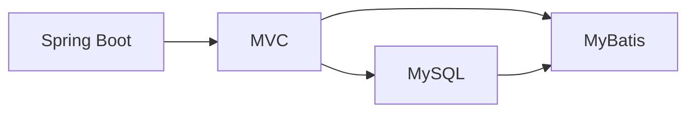

## 1.背景介绍

在当前的网络时代，电子商务已经成为我们生活中不可或缺的一部分。随着科技的发展，越来越多的人开始利用网络进行购物。在这一过程中，水果蔬菜商城因其便捷性和实用性，受到了大家的欢迎。而在技术实现方面，springboot因其简化的开发过程和强大的功能，成为了构建这类商城的热门选择。因此，本文将会以基于springboot的水果蔬菜商城为例，深入解析其实现过程。

## 2.核心概念与联系

在开始构建这样一个商城之前，我们首先需要理解一些核心的概念和他们之间的联系。

### 2.1 Spring Boot

Spring Boot是一个简化Spring应用开发的框架，它可以帮助我们更快速的构建和部署Spring应用。Spring Boot自带了大量的默认配置，使得我们可以很容易的创建出一个独立运行的Spring应用。

### 2.2 MVC架构

MVC架构，即Model-View-Controller（模型-视图-控制器）架构。这是一种用于设计用户界面的模式，将业务逻辑、数据和用户界面分离，使得修改单一部分变得更加容易。

### 2.3 MySQL

MySQL是一种关系型数据库管理系统，被广泛用于网络应用。在我们的商城中，我们将使用MySQL来存储和管理数据。

### 2.4 MyBatis

MyBatis是一种Java的持久层框架，它内部封装了JDBC，开发者只需要关注 SQL 语句本身，而不需要处理繁琐的JDBC操作和数据库连接管理。

### 2.5 关系图

下图展示了这些核心概念之间的关系：



在我们的商城中，Spring Boot提供了整体的框架和运行环境，MVC是我们设计应用的基本架构，MySQL和MyBatis则负责数据的存储和管理。

## 3.核心算法原理具体操作步骤

接下来，我们将详解如何使用Spring Boot、MVC、MySQL和Mybatis构建我们的水果蔬菜商城。

### 3.1 环境配置

首先，我们需要配置我们的开发环境。这包括安装Java开发环境、Spring Boot环境、MySQL数据库以及相关的IDE工具。

### 3.2 创建项目

在环境配置完成后，我们可以开始创建我们的项目。我们可以使用Spring Initializr来快速创建一个Spring Boot项目。

### 3.3 设计数据库

根据我们商城的需求，我们需要设计相应的数据库表结构。包括用户表、商品表、订单表等。

### 3.4 编写代码

在数据库设计完成后，我们就可以开始编写代码了。我们需要按照MVC的架构，分别编写Model、View和Controller。

### 3.5 配置MyBatis

在代码编写完成后，我们需要配置MyBatis，将我们的应用和数据库连接起来。

### 3.6 测试

在所有配置完成后，我们就可以进行测试了。我们需要进行单元测试和集成测试，确保我们的商城可以正常运行。

## 4.数学模型和公式详细讲解举例说明

在我们的商城中，有一些地方会用到一些数学模型和公式，下面我们就来详细讲解一下。

### 4.1 用户评分算法

在我们的商城中，用户可以对购买的商品进行评分。我们可以通过以下的公式来计算商品的平均评分：

$$
\overline{r} = \frac{\sum_{i=1}^{n} r_i}{n}
$$

其中，$n$ 是评分的数量，$r_i$ 是第 $i$ 个评分。

### 4.2 推荐算法

在我们的商城中，我们可以通过以下的公式来计算用户对某个商品的兴趣度：

$$
s(u, i) = \frac{\sum_{j \in I(u) \cap N(i)} r_{uj}}{\sum_{j \in I(u)} r_{uj}}
$$

其中，$I(u)$ 是用户 $u$ 评分过的商品集合，$N(i)$ 是和商品 $i$ 相似的商品集合，$r_{uj}$ 是用户 $u$ 对商品 $j$ 的评分。

## 5.项目实践：代码实例和详细解释说明

接下来，我们将通过一些代码实例来详细解释我们的商城是如何实现的。这里，我们将以用户登录功能为例。

我们首先需要在数据库中创建用户表：

```sql
CREATE TABLE `user` (
  `id` int(11) NOT NULL AUTO_INCREMENT,
  `username` varchar(255) NOT NULL,
  `password` varchar(255) NOT NULL,
  PRIMARY KEY (`id`)
) ENGINE=InnoDB DEFAULT CHARSET=utf8;
```

然后，我们需要在我们的项目中创建对应的User类：

```java
public class User {
    private Integer id;
    private String username;
    private String password;
    // getters and setters ...
}
```

接着，我们需要创建对应的mapper接口和mapper.xml文件，完成对数据库的操作：

```java
public interface UserMapper {
    User selectByUsernameAndPassword(@Param("username") String username, @Param("password") String password);
}
```

```xml
<mapper namespace="com.example.demo.mapper.UserMapper">
    <select id="selectByUsernameAndPassword" resultType="com.example.demo.entity.User">
        SELECT * FROM user WHERE username = #{username} AND password = #{password}
    </select>
</mapper>
```

最后，我们需要在Controller中添加登录的接口：

```java
@RestController
public class UserController {
    @Autowired
    private UserMapper userMapper;

    @PostMapping("/login")
    public String login(@RequestParam("username") String username, @RequestParam("password") String password) {
        User user = userMapper.selectByUsernameAndPassword(username, password);
        if (user != null) {
            return "Login success!";
        } else {
            return "Login failed!";
        }
    }
}
```

通过以上的代码，我们就实现了用户登录的功能。当用户输入用户名和密码后，我们的应用会查询数据库，如果找到对应的用户，则登录成功，否则登录失败。

## 6.实际应用场景

我们的商城可以应用在许多场景中。例如，超市、果蔬店、餐饮店等都可以使用我们的商城来在线销售他们的商品。用户可以在任何地方、任何时间购买他们需要的商品，非常方便。

## 7.工具和资源推荐

在我们的项目中，我们使用了以下的工具和资源：

- Spring Boot：用于构建我们的应用的主体框架。
- MySQL：用于存储我们的数据。
- MyBatis：用于完成Java代码和SQL之间的映射。
- Maven：用于项目的依赖管理和构建。
- IntelliJ IDEA：强大的Java IDE，提供了许多便捷的功能，如代码提示、自动完成、重构等。
- Git：用于版本控制，可以让我们更好的管理我们的代码。

## 8.总结：未来发展趋势与挑战

随着科技的发展，人们的生活方式正在发生变化。在线购物已经成为趋势，而基于springboot的水果蔬菜商城正好满足了这样的需求。然而，这样的商城也面临着许多挑战，如如何提高用户体验、如何保证数据安全、如何提高系统稳定性等。

## 9.附录：常见问题与解答

1. **Q：为什么选择Spring Boot作为开发框架？**

   A：Spring Boot提供了许多默认配置，使得我们可以快速的创建出一个独立运行的Spring应用。此外，Spring Boot还具有自动配置、独立运行、无需部署等优点，非常适合快速开发。

2. **Q：为什么选择MySQL作为数据库？**

   A：MySQL是一种关系型数据库，它具有性能高、成本低、开源等优点。此外，MySQL还有着丰富的社区资源和完善的文档，使得我们在遇到问题时可以很快的找到解决方案。

3. **Q：如何保证数据的安全性？**

   A：我们的商城采用了许多措施来保证数据的安全性。例如，我们使用了加密技术来保护用户的密码，使用了权限控制来限制用户的操作，使用了备份和恢复机制来防止数据丢失等。

4. **Q：如何提高用户体验？**

   A：我们的商城采用了许多措施来提高用户体验。例如，我们使用了响应式设计，使得我们的商城可以在各种设备上良好的运行；我们提供了搜索和推荐功能，帮助用户快速找到他们需要的商品；我们提供了在线支付和物流追踪等功能，使得用户可以方便的购买和收到商品等。

5. **Q：如何提高系统的稳定性？**

   A：我们的商城采用了许多措施来提高系统的稳定性。例如，我们使用了负载均衡和熔断机制，来保证在高并发的情况下，我们的系统仍然可以稳定运行；我们使用了监控和报警系统，可以实时了解到我们的系统状态，及时发现和解决问题。