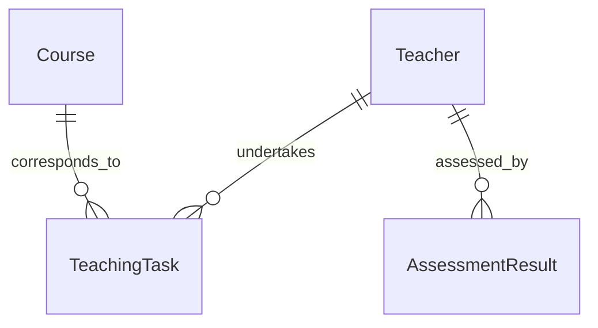

# 基于web的师资管理系统详细设计与具体代码实现

作者：禅与计算机程序设计艺术

## 1. 背景介绍
### 1.1 师资管理系统的重要性
在现代教育管理中,师资管理是一项非常重要的工作。高效的师资管理可以提高教学质量,优化教学资源配置,促进教育事业的发展。传统的师资管理方式效率低下,难以满足日益增长的教育需求。因此,开发一套基于web的师资管理系统具有重要意义。
### 1.2 师资管理系统的主要功能
一个完善的师资管理系统应该包括以下主要功能:
- 教师信息管理:包括教师的基本信息、教育背景、工作经历、科研成果等。
- 教学任务管理:包括教学计划、课程安排、教学评估等。
- 绩效考核管理:包括教学质量评估、科研成果评估、综合考核等。
- 培训与发展管理:包括教师培训计划、培训课程管理、培训效果评估等。
- 数据统计与分析:包括教师数据统计、教学数据分析、绩效数据分析等。
### 1.3 基于web的师资管理系统的优势  
与传统的C/S架构相比,基于web的B/S架构具有以下优势:
- 跨平台:只需要一个浏览器,就可以在任何操作系统上访问系统。
- 易维护:系统升级和维护只需要在服务器端进行,客户端无需更新。
- 开发成本低:使用成熟的web开发技术,开发周期短,成本低。
- 用户体验好:界面友好,操作简单,用户易于接受。

## 2. 核心概念与关系
### 2.1 教师 Teacher
教师是师资管理系统的核心对象之一。教师具有以下属性:
- 教师ID:唯一标识教师的编号
- 姓名:教师的姓名
- 性别:教师的性别
- 出生日期:教师的出生日期
- 职称:教师的职称,如讲师、副教授、教授等
- 学历:教师的最高学历,如本科、硕士、博士等
- 专业:教师所教授的专业
- 教龄:教师从教的年限
### 2.2 课程 Course
课程是师资管理系统的另一个核心对象。课程具有以下属性:
- 课程ID:唯一标识课程的编号 
- 课程名称:课程的名称
- 学分:课程的学分
- 学时:课程的总学时
- 考核方式:课程的考核方式,如考试、考查等
### 2.3 教学任务 TeachingTask
教学任务是指分配给教师的教学工作。教学任务具有以下属性:
- 任务ID:唯一标识教学任务的编号
- 教师ID:承担教学任务的教师ID
- 课程ID:教学任务对应的课程ID
- 学期:教学任务所在的学期
- 班级:教学任务面向的班级
- 学时:教学任务的总学时
### 2.4 考核结果 AssessmentResult  
考核结果是指对教师工作的考核评估。考核结果具有以下属性:
- 考核ID:唯一标识考核结果的编号
- 教师ID:被考核的教师ID
- 考核项目:考核的项目,如教学质量、科研成果等
- 考核分数:考核的分数
- 考核等级:考核的等级,如优秀、良好、合格等
- 考核时间:考核的时间
### 2.5 实体关系图
下面是师资管理系统的实体关系图(ERD):



从ERD可以看出:
- 一个教师可以承担多个教学任务,一个教学任务只能分配给一个教师
- 一门课程可以产生多个教学任务,一个教学任务只能对应一门课程 
- 一个教师可以有多个考核结果,一个考核结果只能对应一个教师

## 3. 核心算法原理与具体操作步骤
### 3.1 教师排课算法
教师排课是指根据教学任务,为每位教师合理安排教学工作。其核心是一个约束满足问题(CSP)。以下是教师排课算法的基本步骤:
1. 定义变量:每个教学任务都是一个变量,其值域是所有教师的集合。
2. 定义约束:
   - 每位教师的授课总学时不能超过规定的上限
   - 某些课程只能由特定职称的教师授课
   - 尽量避免一位教师在同一时间段授课
   - ......
3. 建立CSP模型:根据变量和约束,建立一个CSP模型。
4. 求解CSP:使用回溯搜索、约束传播等方法,求解CSP模型,得到一个满足所有约束的排课方案。
5. 优化排课方案:在满足约束的前提下,尽量优化某些指标,如师资利用率、教师满意度等。

以下是教师排课算法的伪代码:
```
function TeacherScheduling(tasks, teachers, constraints):
    variables ← tasks
    domains ← {teacher | teacher ∈ teachers}
    csp ← BuildCSP(variables, domains, constraints)
    solution ← SolveCSP(csp)
    optimizedSolution ← OptimizeSchedule(solution)
    return optimizedSolution
```

### 3.2 教师绩效考核算法
教师绩效考核是指根据教师的工作表现,给出综合评估。其核心是一个加权求和模型。以下是教师绩效考核算法的基本步骤:
1. 确定考核指标:根据学校的实际情况,确定考核教师的各项指标,如教学质量、科研成果、学生评价等。
2. 确定指标权重:根据各项指标的重要程度,给出相应的权重系数。
3. 收集数据:收集每位教师在各项指标上的原始数据。
4. 数据标准化:由于各项指标的量纲不同,需要对原始数据进行标准化处理,转化为无量纲的评分。
5. 加权求和:对每位教师的各项评分进行加权求和,得到综合评分。
6. 评定等级:根据综合评分,评定每位教师的考核等级。

以下是教师绩效考核算法的伪代码:
```
function TeacherAssessment(teachers, indicators, weights):
    scores ← {}
    for each teacher in teachers:
        rawData ← CollectData(teacher, indicators)
        normalizedData ← Normalize(rawData)
        weightedSum ← WeightedSum(normalizedData, weights)
        scores[teacher] ← weightedSum
    grades ← RateGrade(scores)
    return grades
```

## 4. 数学模型与公式详解
### 4.1 教师排课的CSP模型
教师排课问题可以表示为一个CSP模型:
- 变量$X = \{x_1,x_2,...,x_n\}$,其中$x_i$表示第$i$个教学任务,$n$为教学任务总数。
- 值域$D = \{d_1,d_2,...,d_m\}$,其中$d_j$表示第$j$个教师,m为教师总数。
- 约束$C = \{c_1,c_2,...,c_k\}$,其中$c_i$表示第$i$个约束条件,k为约束总数。

例如,约束"每位教师的授课总学时不能超过规定的上限"可以表示为:

$$\forall d_j \in D, \sum_{i=1}^n hours(x_i) \leq maxHours(d_j)$$

其中,$hours(x_i)$表示教学任务$x_i$的学时,$maxHours(d_j)$表示教师$d_j$的最大授课学时。

求解CSP的目标是找到一个变量赋值$A = \{a_1,a_2,...,a_n\}$,使得:
$$\forall c_i \in C, c_i(A) = true$$

即所有约束条件都得到满足。

### 4.2 教师绩效考核的加权求和模型
教师绩效考核可以表示为一个加权求和模型:

$$score(t) = \sum_{i=1}^n w_i \cdot f_i(t)$$

其中:
- $t$表示一位教师
- $n$表示考核指标的个数
- $w_i$表示第$i$个指标的权重系数,$\sum_{i=1}^n w_i = 1$
- $f_i(t)$表示教师$t$在第$i$个指标上的标准化评分

标准化评分可以采用线性缩放法:

$$f_i(t) = \frac{x_i(t) - min(x_i)}{max(x_i) - min(x_i)}$$

其中:
- $x_i(t)$表示教师$t$在第$i$个指标上的原始数据
- $max(x_i)$和$min(x_i)$分别表示第$i$个指标的最大值和最小值

例如,假设考核指标包括教学质量、科研成果和学生评价三项,权重分别为0.5、0.3和0.2。某位教师的原始数据如下:

| 指标   | 原始数据 | 最大值 | 最小值 |
| ------ | -------- | ------ | ------ |
| 教学质量 | 85     | 100    | 60     |
| 科研成果 | 3      | 10     | 0      |
| 学生评价 | 90     | 100    | 70     |

则该教师的综合评分为:

$$score = 0.5 \cdot \frac{85-60}{100-60} + 0.3 \cdot \frac{3-0}{10-0} + 0.2 \cdot \frac{90-70}{100-70} = 0.675$$

## 5. 项目实践:代码实例与详解
下面是师资管理系统的部分核心代码,使用Python语言和Django框架实现。

### 5.1 教师模型
```python
from django.db import models

class Teacher(models.Model):
    id = models.AutoField(primary_key=True)
    name = models.CharField(max_length=50)
    gender = models.CharField(max_length=10)
    birth_date = models.DateField()
    title = models.CharField(max_length=50)
    degree = models.CharField(max_length=50) 
    major = models.CharField(max_length=50)
    teaching_years = models.IntegerField()

    def __str__(self):
        return self.name
```

这段代码定义了教师模型,包括教师ID、姓名、性别、出生日期、职称、学历、专业和教龄等属性。`__str__`方法返回教师的姓名,方便在管理后台显示。

### 5.2 课程模型
```python
from django.db import models

class Course(models.Model):
    id = models.AutoField(primary_key=True)
    name = models.CharField(max_length=100)
    credit = models.IntegerField()
    hours = models.IntegerField()
    assessment_method = models.CharField(max_length=50)

    def __str__(self):
        return self.name
```

这段代码定义了课程模型,包括课程ID、名称、学分、学时和考核方式等属性。

### 5.3 教学任务模型
```python
from django.db import models

class TeachingTask(models.Model):
    id = models.AutoField(primary_key=True)
    teacher = models.ForeignKey(Teacher, on_delete=models.CASCADE)
    course = models.ForeignKey(Course, on_delete=models.CASCADE)
    semester = models.CharField(max_length=50)
    class_name = models.CharField(max_length=50)
    hours = models.IntegerField()

    def __str__(self):
        return f"{self.teacher} - {self.course}"
```

这段代码定义了教学任务模型,包括任务ID、授课教师、课程、学期、班级和学时等属性。其中,授课教师和课程通过外键与Teacher和Course模型关联。`__str__`方法返回"教师名称 - 课程名称",表示一项教学任务。

### 5.4 考核结果模型
```python
from django.db import models

class AssessmentResult(models.Model):
    id = models.AutoField(primary_key=True)
    teacher = models.ForeignKey(Teacher, on_delete=models.CASCADE)
    indicator = models.CharField(max_length=100)
    score = models.FloatField()
    grade = models.CharField(max_length=50)
    assessment_time = models.DateTimeField(auto_now_add=True)

    def __str__(self):
        return f"{self.teacher} - {self.indicator}"
```

这段代码定义了考核结果模型,包括考核ID、被考核教师、考核指标、考核分数、考核等级和考核时间等属性。其中,被考核教师通过外键与Teacher模型关联。考核时间字段设置了`auto_now_add=True`,表示自动使用记录创建时的时间戳。

### 5