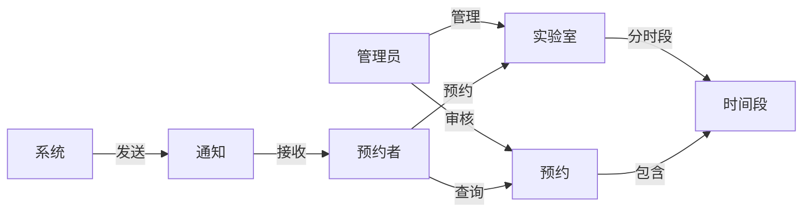

# 实验室预约系统详细设计与具体代码实现

作者：禅与计算机程序设计艺术

## 1. 背景介绍

### 1.1 实验室预约系统的必要性
在现代高校和研究机构中,实验室是进行科学研究和教学实践的重要场所。然而,实验室资源有限,需要合理分配和管理。传统的人工预约方式效率低下,容易出错,难以满足日益增长的预约需求。因此,开发一个高效、便捷、智能的实验室预约系统势在必行。

### 1.2 实验室预约系统的目标
实验室预约系统旨在实现以下目标:

1. 提高实验室资源利用率,避免资源浪费和冲突
2. 简化预约流程,为师生提供便捷的预约体验  
3. 加强预约管理,提供多角色权限控制和智能调度
4. 数字化运营,提供数据统计和分析功能,为管理决策提供支持

### 1.3 同类系统综述
目前市面上存在多种实验室预约管理系统,主要分为两大类:

1. 通用预约系统:提供会议室、活动室等场地的预约管理,功能较为简单,缺乏针对实验室的特殊需求。
2. 专业实验室管理系统:提供实验室全生命周期管理,包括预约、使用、耗材管理等,系统庞大,学习成本高,不够轻量级。

本系统将在吸收两者优点的基础上,开发一款轻量级、针对性强、易用性好的实验室预约系统。

## 2. 核心概念与关联

### 2.1 核心概念

- 实验室:可供预约的实验场地,包括地点、容纳人数、设备信息等属性
- 预约者:进行预约的用户,分为学生和教师两种角色
- 管理员:负责实验室和预约的管理,拥有最高权限
- 预约:用户对实验室的占用意向,包括时间段、人数、用途等信息
- 时间段:可供预约的最小时间单位,如每天分为多个时间段
- 审核:管理员对预约进行审批的过程,判断是否允许预约
- 通知:系统向用户发送的预约结果、提醒等消息

### 2.2 核心概念关联


## 3. 核心算法原理与具体操作步骤

### 3.1 预约时间冲突检测算法

#### 3.1.1 算法原理
预约时间冲突检测是系统的核心功能之一。当用户提交预约请求时,系统需要检查该时间段是否与已有预约冲突。可以将预约看作是时间轴上的区间,检测冲突就是判断区间是否重叠。

#### 3.1.2 算法步骤
1. 根据预约请求的实验室、日期,从数据库中查询出该实验室当天的所有预约记录
2. 将预约请求的起止时间与每条预约记录的起止时间进行比较:
   - 如果两个时间段没有交集,则不冲突
   - 如果两个时间段有交集,则冲突
3. 如果遍历完所有记录都没有冲突,则该预约时间段可用;否则,返回冲突信息

#### 3.1.3 算法优化
- 可以将预约记录按起始时间排序,利用二分查找快速定位可能冲突的记录
- 可以将一天划分为固定数量的时间块,每个预约占用若干块,检测冲突转化为检测对应块是否占用

### 3.2 预约调度优化算法

#### 3.2.1 算法原理
实验室资源有限,为提高利用率,需要对预约进行智能调度优化。可以将此问题建模为一个多目标优化问题:在满足预约者时间偏好的同时,尽可能提高实验室利用率,并兼顾公平性。

#### 3.2.2 算法步骤
1. 收集所有待调度的预约请求,提取其时间偏好、人数等属性 
2. 根据实验室的空闲时间片,构建一个三维的时间-资源矩阵,每个元素表示某个时间片某个实验室的剩余容量
3. 定义目标函数,如实验室利用率、用户偏好满意度、公平性等,形成多目标优化模型
4. 采用启发式搜索算法,如遗传算法、模拟退火等,在时间-资源矩阵上进行搜索,寻找最优的预约调度方案
5. 输出优化后的调度结果,更新预约记录和时间-资源矩阵

#### 3.2.3 算法优化
- 可以预先剪枝掉一些不可行的搜索分支,如冲突过多的时间片
- 可以引入随机性和多样性,避免局部最优
- 可以设置算法的终止条件,在满足一定条件时提前退出,平衡优化效果和计算成本

## 4. 数学模型与公式详解

### 4.1 多目标优化模型

#### 4.1.1 决策变量
- $x_{ijk}$:第$i$个预约在第$j$个时间片预约第$k$个实验室的决策变量,取值为0或1
- $y_{ij}$:第$i$个预约是否占用第$j$个时间片的决策变量,取值为0或1
- $z_{jk}$:第$j$个时间片第$k$个实验室的占用人数决策变量,非负整数

#### 4.1.2 目标函数
1. 实验室利用率最大化:
$$ \max \sum_{j,k} z_{jk} $$

2. 用户偏好满意度最大化:
$$ \max \sum_i \sum_j c_{ij} y_{ij} $$
其中,$c_{ij}$表示第$i$个预约对第$j$个时间片的偏好程度

3. 公平性最大化(如最小化预约之间的时间片数差异):
$$ \min \max_i \sum_j y_{ij} - \min_i \sum_j y_{ij} $$

#### 4.1.3 约束条件
1. 每个预约只能占用连续的时间片:
$$ y_{i,j+1} \geq y_{ij}, \forall i,j $$

2. 每个预约只能选择一个实验室:
$$ \sum_k x_{ijk} = y_{ij}, \forall i,j $$

3. 每个时间片每个实验室的占用人数不能超过容量:
$$ z_{jk} = \sum_i n_i x_{ijk} \leq c_k, \forall j,k $$
其中,$n_i$为第$i$个预约的人数,$c_k$为第$k$个实验室的容量

4. 决策变量取值范围:
$$ x_{ijk}, y_{ij} \in \{0,1\}, z_{jk} \in \mathbb{Z}^+ $$

### 4.2 公式说明与案例

以上是实验室预约调度问题的一个简化的多目标优化模型。实际应用中,可以根据需求添加更多的目标和约束。

例如,考虑预约的优先级,可以在用户偏好满意度目标中引入优先级权重系数:
$$ \max \sum_i w_i \sum_j c_{ij} y_{ij} $$
其中,$w_i$为第$i$个预约的优先级权重。

又如,考虑实验室的准备时间,可以在时间片之间添加准备时间约束:
$$ y_{i,j+1} \leq 1 - y_{i,j-p}, \forall i,j $$
其中,$p$为实验室的准备时间所跨越的时间片数。

## 5. 项目实践:代码实例与详解

下面以Python为例,展示实验室预约系统的部分核心代码。

### 5.1 数据模型定义

```python
from django.db import models

class Laboratory(models.Model):
    """实验室模型"""
    name = models.CharField(max_length=100)
    location = models.CharField(max_length=100)
    capacity = models.IntegerField()
    
class Reservation(models.Model):
    """预约模型"""
    user = models.ForeignKey(User, on_delete=models.CASCADE)
    laboratory = models.ForeignKey(Laboratory, on_delete=models.CASCADE)
    date = models.DateField()
    start_time = models.TimeField()
    end_time = models.TimeField()
    num_people = models.IntegerField()
    purpose = models.CharField(max_length=100)
    status = models.CharField(max_length=20, default='pending')
```

- 定义了实验室和预约两个核心数据模型,分别对应数据库中的表
- 一个实验室可以有多个预约,一个预约对应一个实验室和一个用户
- 预约记录了日期、起止时间、人数、用途等信息,以及预约状态(待审核、已通过、已拒绝等)

### 5.2 预约时间冲突检测

```python
def check_conflict(laboratory, date, start_time, end_time):
    """检查预约时间是否冲突"""
    conflicting_reservations = Reservation.objects.filter(
        laboratory=laboratory,
        date=date,
        start_time__lt=end_time,
        end_time__gt=start_time,
        status='approved'
    )
    return conflicting_reservations.exists()
```

- 利用Django的ORM查询语法,找出与给定时间段冲突的已通过预约记录
- 冲突条件为:同一实验室、同一日期、时间段重叠
- 如果存在冲突记录,则返回True,否则返回False

### 5.3 预约调度优化

```python
import numpy as np
from scipy.optimize import linprog

def optimize_schedule(reservations, laboratories, time_slots):
    """预约调度优化"""
    num_reservations = len(reservations)
    num_time_slots = len(time_slots)
    num_laboratories = len(laboratories)
    
    # 构建时间-资源矩阵
    capacity_matrix = np.zeros((num_time_slots, num_laboratories))
    for j, lab in enumerate(laboratories):
        capacity_matrix[:, j] = lab.capacity
        
    # 提取预约属性
    reservation_matrix = np.zeros((num_reservations, num_time_slots))
    for i, res in enumerate(reservations):
        reservation_matrix[i, :] = res.preference
        
    # 定义目标函数系数
    c = reservation_matrix.flatten()
    
    # 定义约束条件系数矩阵
    A_eq = np.kron(np.eye(num_reservations), np.ones(num_time_slots))
    b_eq = np.ones(num_reservations)
    A_ub = np.kron(np.ones((num_time_slots, 1)), np.eye(num_laboratories))
    b_ub = capacity_matrix.flatten()
    
    # 求解线性规划
    res = linprog(c, A_ub, b_ub, A_eq, b_eq, bounds=(0, 1))
    
    # 解码结果
    if res.success:
        schedule = res.x.reshape((num_reservations, num_time_slots, num_laboratories))
        return schedule
    else:
        return None
```

- 利用scipy库的linprog函数求解多目标线性规划问题
- 将预约调度问题转化为标准形式的线性规划模型
- 时间-资源矩阵表示每个时间片每个实验室的可用容量
- 预约属性矩阵表示每个预约在不同时间片的偏好值
- 目标函数为最大化总偏好值,约束条件为每个预约只占用一个时间片,每个时间片的占用不超过容量
- 求得最优解后,将结果解码为一个三维的预约调度矩阵

## 6. 实际应用场景

实验室预约系统可应用于以下场景:

1. 高校教学实验室:方便师生预约实验,提高实验课程质量和效率
2. 科研机构实验平台:合理分配有限的科研设备资源,促进科研项目开展
3. 企业研发试验室:规范研发流程,加强知识产权保护,提升研发效率
4. 医疗机构检验科:优化患者检验预约,缩短等待时间,提高满意度
5. 政府监测实验室:加强对环境、食品、药品等的检测监管,保障公共安全

不同场景下,实验室预约系统可根据需求提供个性化的功能,如课程管理、项目管理、仪器管理、样品管理、