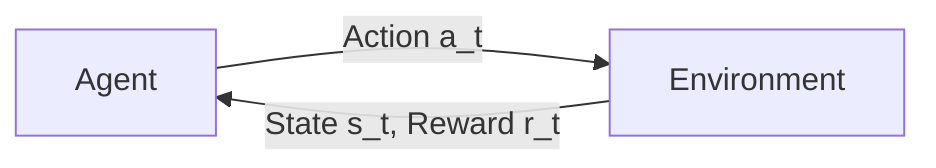

# 强化学习：在视觉目标追踪领域的应用

作者：禅与计算机程序设计艺术

## 1. 背景介绍
### 1.1 视觉目标追踪的重要性
#### 1.1.1 实时监控与安全
#### 1.1.2 人机交互与辅助驾驶
#### 1.1.3 医学影像分析
### 1.2 传统视觉目标追踪方法的局限性  
#### 1.2.1 基于模板匹配的方法
#### 1.2.2 基于判别式学习的方法
#### 1.2.3 基于生成式模型的方法
### 1.3 强化学习在视觉目标追踪中的优势
#### 1.3.1 自适应性与鲁棒性
#### 1.3.2 端到端的学习能力
#### 1.3.3 长时记忆与上下文理解

## 2. 核心概念与联系
### 2.1 强化学习基本原理
#### 2.1.1 马尔可夫决策过程（MDP）
#### 2.1.2 状态、动作与奖励
#### 2.1.3 策略与价值函数
### 2.2 深度强化学习模型 
#### 2.2.1 Deep Q-Network (DQN)
#### 2.2.2 Policy Gradient (PG) 
#### 2.2.3 Actor-Critic (AC)
### 2.3 视觉目标追踪问题建模
#### 2.3.1 状态空间与动作空间设计
#### 2.3.2 奖励函数设计
#### 2.3.3 网络结构设计

## 3. 核心算法原理与具体操作步骤
### 3.1 基于DQN的视觉目标追踪算法
#### 3.1.1 算法流程
#### 3.1.2 网络结构与损失函数
#### 3.1.3 探索与利用策略
### 3.2 基于PG的视觉目标追踪算法
#### 3.2.1 算法流程 
#### 3.2.2 策略网络与价值网络
#### 3.2.3 重要性采样与方差减少
### 3.3 基于AC的视觉目标追踪算法
#### 3.3.1 算法流程
#### 3.3.2 Actor网络与Critic网络
#### 3.3.3 时序差分学习与优势函数

## 4. 数学模型和公式详细讲解举例说明
### 4.1 马尔可夫决策过程（MDP）
MDP可以用一个五元组 $(S,A,P,R,\gamma)$ 来表示：
- 状态空间 $S$：所有可能的状态集合
- 动作空间 $A$：在每个状态下允许采取的动作集合  
- 状态转移概率 $P$：$P(s'|s,a)$ 表示在状态 $s$ 下采取动作 $a$ 后转移到状态 $s'$ 的概率
- 奖励函数 $R$：$R(s,a)$ 表示在状态 $s$ 下采取动作 $a$ 后获得的即时奖励
- 折扣因子 $\gamma \in [0,1]$：用于平衡即时奖励和未来奖励

在MDP中，智能体（Agent）与环境（Environment）交互的过程可以用下图表示：



### 4.2 Q-Learning与DQN
Q-Learning是一种经典的值迭代算法，它通过迭代更新状态-动作值函数 $Q(s,a)$ 来寻找最优策略。Q函数的更新公式为：

$$Q(s_t,a_t) \leftarrow Q(s_t,a_t) + \alpha [r_t + \gamma \max_{a} Q(s_{t+1},a) - Q(s_t,a_t)]$$

其中，$\alpha$ 是学习率，$\gamma$ 是折扣因子。

DQN将Q-Learning与深度神经网络相结合，使用神经网络 $Q_{\theta}(s,a)$ 来近似Q函数，其中 $\theta$ 为网络参数。DQN的损失函数为：

$$L(\theta) = \mathbb{E}_{(s,a,r,s')\sim D} [(r + \gamma \max_{a'} Q_{\theta^-}(s',a') - Q_{\theta}(s,a))^2]$$

其中，$D$ 为经验回放缓冲区，$\theta^-$ 为目标网络参数，用于计算TD目标值。

### 4.3 Policy Gradient与REINFORCE算法
Policy Gradient（PG）是一类基于策略的强化学习算法，它直接对策略函数 $\pi_{\theta}(a|s)$ 进行优化。PG的目标函数为期望累积奖励：

$$J(\theta) = \mathbb{E}_{\tau \sim \pi_{\theta}}[R(\tau)] = \mathbb{E}_{\tau \sim \pi_{\theta}}[\sum_{t=0}^{T} \gamma^t r_t]$$

其中，$\tau$ 为轨迹，$R(\tau)$ 为轨迹的累积奖励。

REINFORCE算法是一种经典的PG算法，它通过蒙特卡洛采样来估计策略梯度：

$$\nabla_{\theta} J(\theta) = \mathbb{E}_{\tau \sim \pi_{\theta}}[\sum_{t=0}^{T} \nabla_{\theta} \log \pi_{\theta}(a_t|s_t) R(\tau)]$$

实际应用中，我们通常使用基于时间步的累积奖励 $G_t$ 来替代整个轨迹的累积奖励 $R(\tau)$：

$$\nabla_{\theta} J(\theta) \approx \frac{1}{N} \sum_{i=1}^{N} \sum_{t=0}^{T} \nabla_{\theta} \log \pi_{\theta}(a_t^{(i)}|s_t^{(i)}) G_t^{(i)}$$

其中，$N$ 为采样轨迹的数量，$G_t^{(i)} = \sum_{k=t}^{T} \gamma^{k-t} r_k^{(i)}$。

### 4.4 Actor-Critic算法
Actor-Critic（AC）算法结合了PG和值函数近似，由两部分组成：
- Actor：策略网络 $\pi_{\theta}(a|s)$，用于生成动作
- Critic：值函数网络 $V_{\phi}(s)$ 或 $Q_{\phi}(s,a)$，用于评估状态或状态-动作对的价值

AC算法的优势函数（Advantage Function）定义为：

$$A(s,a) = Q(s,a) - V(s)$$

它表示在状态 $s$ 下采取动作 $a$ 相对于平均表现的优势。我们可以使用优势函数来替代PG中的累积奖励，得到AC的策略梯度：

$$\nabla_{\theta} J(\theta) = \mathbb{E}_{\tau \sim \pi_{\theta}}[\sum_{t=0}^{T} \nabla_{\theta} \log \pi_{\theta}(a_t|s_t) A(s_t,a_t)]$$

Critic网络的损失函数为均方误差（MSE）：

$$L(\phi) = \mathbb{E}_{(s,a,r,s')\sim D} [(r + \gamma V_{\phi}(s') - V_{\phi}(s))^2]$$

## 5. 项目实践：代码实例和详细解释说明
下面我们以PyTorch为例，实现一个基于DQN的视觉目标追踪算法。

首先定义Q网络结构：

```python
class QNet(nn.Module):
    def __init__(self, state_dim, action_dim):
        super(QNet, self).__init__()
        self.conv1 = nn.Conv2d(state_dim[0], 32, kernel_size=8, stride=4)
        self.conv2 = nn.Conv2d(32, 64, kernel_size=4, stride=2)
        self.conv3 = nn.Conv2d(64, 64, kernel_size=3, stride=1)
        
        conv_out_size = self._get_conv_out(state_dim)
        self.fc1 = nn.Linear(conv_out_size, 512)
        self.fc2 = nn.Linear(512, action_dim)
        
    def _get_conv_out(self, shape):
        o = self.conv1(torch.zeros(1, *shape))
        o = self.conv2(o)
        o = self.conv3(o)
        return int(np.prod(o.size()))
    
    def forward(self, x):
        x = F.relu(self.conv1(x))
        x = F.relu(self.conv2(x))
        x = F.relu(self.conv3(x))
        x = x.view(x.size(0), -1)
        x = F.relu(self.fc1(x))
        return self.fc2(x)
```

然后定义DQN Agent：

```python
class DQNAgent:
    def __init__(self, state_dim, action_dim, lr=1e-4, gamma=0.99, epsilon=0.1, target_update=1000, buffer_size=10000, batch_size=64):
        self.state_dim = state_dim
        self.action_dim = action_dim
        self.gamma = gamma
        self.epsilon = epsilon
        self.target_update = target_update
        self.batch_size = batch_size
        
        self.q_net = QNet(state_dim, action_dim)
        self.target_q_net = QNet(state_dim, action_dim)
        self.optimizer = optim.Adam(self.q_net.parameters(), lr=lr)
        self.buffer = ReplayBuffer(buffer_size)
        
        self.update_count = 0
        
    def get_action(self, state):
        if np.random.rand() < self.epsilon:
            return np.random.randint(self.action_dim)
        else:
            state = torch.FloatTensor(state).unsqueeze(0)
            q_values = self.q_net(state)
            return q_values.argmax().item()
        
    def update(self):
        if len(self.buffer) < self.batch_size:
            return
        
        state, action, reward, next_state, done = self.buffer.sample(self.batch_size)
        
        state = torch.FloatTensor(state)
        action = torch.LongTensor(action).unsqueeze(1)
        reward = torch.FloatTensor(reward).unsqueeze(1)
        next_state = torch.FloatTensor(next_state)
        done = torch.FloatTensor(done).unsqueeze(1)
        
        q_values = self.q_net(state).gather(1, action)
        next_q_values = self.target_q_net(next_state).max(1)[0].unsqueeze(1)
        expected_q_values = reward + self.gamma * next_q_values * (1 - done)
        
        loss = F.mse_loss(q_values, expected_q_values)
        
        self.optimizer.zero_grad()
        loss.backward()
        self.optimizer.step()
        
        self.update_count += 1
        if self.update_count % self.target_update == 0:
            self.target_q_net.load_state_dict(self.q_net.state_dict())
```

最后在环境中训练DQN Agent：

```python
env = TrackerEnv()
state_dim = env.observation_space.shape
action_dim = env.action_space.n

agent = DQNAgent(state_dim, action_dim)

num_episodes = 1000
for episode in range(num_episodes):
    state = env.reset()
    done = False
    episode_reward = 0
    
    while not done:
        action = agent.get_action(state)
        next_state, reward, done, _ = env.step(action)
        agent.buffer.push(state, action, reward, next_state, done)
        
        state = next_state
        episode_reward += reward
        
        agent.update()
        
    print(f"Episode {episode}: Reward = {episode_reward}")
```

以上就是一个简单的基于DQN的视觉目标追踪算法实现。实际应用中，我们还需要根据具体问题对算法进行改进和优化，如使用双DQN、优先级经验回放等技巧来提高算法性能。

## 6. 实际应用场景
强化学习在视觉目标追踪领域有广泛的应用前景，主要包括：

### 6.1 自动驾驶中的目标检测与跟踪
在自动驾驶系统中，准确检测和跟踪车辆、行人等目标对于避免碰撞至关重要。强化学习可以帮助自动驾驶系统在复杂多变的环境中自适应地学习目标追踪策略，提高系统的鲁棒性和实时性。

### 6.2 视频监控中的异常行为检测
在视频监控场景下，我们希望能够及时发现并跟踪异常行为，如斗殴、偷盗等。传统的基于规则的方法难以应对复杂环境，而强化学习可以通过不断与环境交互来学习异常行为的特征，自动调整检测和跟踪策略。

### 6.3 体育赛事中的运动员跟踪
在体育赛事直播或数据分析中，准确跟踪运动员的位置和运动轨迹是一项重要任务。强化学习可以学习如何在复杂的场景中（如遮挡、光照变化等）稳定地跟踪运动员，为赛事分析提供高质量的数据支持。

### 6.4 医学影像分析中的病灶追踪