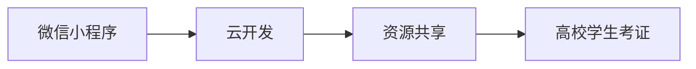

## 1. 背景介绍

### 1.1 高校学生考证现状

近年来，随着社会竞争的日益激烈，越来越多的高校学生选择通过考取各类证书来提升自身竞争力。然而，面对种类繁多的证书考试，学生们往往面临着信息获取渠道有限、学习资料分散、备考经验缺乏等问题。传统的学习方式效率低下，难以满足学生个性化、高效化的学习需求。

### 1.2 微信小程序的优势

微信小程序作为一种轻量级应用，具有开发成本低、使用便捷、传播速度快等优势，已经成为移动互联网时代的重要入口。利用微信小程序构建高校学生考证资源共享系统，可以有效整合考证信息、学习资料和备考经验，为学生提供一站式考证服务。

### 1.3 系统目标

本系统旨在构建一个基于微信小程序的高校学生考证资源共享平台，实现以下目标：

*   **信息共享：** 提供丰富的考证信息，包括考试时间、考试大纲、考试真题等，方便学生及时了解考证动态。
*   **资源整合：** 整合各类学习资料，包括教材、课件、笔记、视频等，方便学生系统化学习。
*   **经验交流：** 提供一个学生交流互动的平台，方便学生分享备考经验、交流学习心得。
*   **个性化推荐：** 根据学生的专业、兴趣等信息，推荐相关的考证信息和学习资源，提高学习效率。

## 2. 核心概念与联系

### 2.1 微信小程序

微信小程序是一种不需要下载安装即可使用的应用，它实现了应用“触手可及”的梦想，用户扫一扫或搜一下即可打开应用。

### 2.2 云开发

云开发是微信团队联合腾讯云推出的专业的小程序Serverless开发服务，提供数据库、存储、云函数等能力，免去了服务器搭建及运维的烦恼，开发者可以专注于业务逻辑的实现。

### 2.3 资源共享

资源共享是指将各种类型的资源，例如信息、文件、软件等，通过网络平台进行共享，方便用户获取和使用。

### 2.4 关系图

下图展示了系统中各个核心概念之间的联系：



## 3. 核心算法原理具体操作步骤

### 3.1 用户登录

1.  用户打开微信小程序，点击“登录”按钮。
2.  小程序调用微信登录接口，获取用户微信openid。
3.  小程序将openid发送至云函数进行校验。
4.  云函数查询数据库中是否存在该用户，如果存在则返回用户信息，否则创建新用户并返回用户信息。

### 3.2 信息发布

1.  用户点击“发布信息”按钮。
2.  小程序弹出信息发布表单，用户填写考证信息。
3.  用户点击“提交”按钮，小程序将信息发送至云函数。
4.  云函数将信息存储到数据库中。

### 3.3 资源上传

1.  用户点击“上传资源”按钮。
2.  小程序弹出资源上传表单，用户选择要上传的资源文件。
3.  用户点击“提交”按钮，小程序将资源文件上传至云存储。
4.  云函数将资源信息存储到数据库中。

### 3.4 搜索功能

1.  用户在搜索框中输入关键词。
2.  小程序将关键词发送至云函数。
3.  云函数根据关键词查询数据库，返回匹配的考证信息和资源信息。

## 4. 数学模型和公式详细讲解举例说明

本系统不涉及复杂的数学模型和公式。

## 5. 项目实践：代码实例和详细解释说明

### 5.1 数据库设计

**考证信息表**

| 字段名      | 数据类型 | 说明               |
| :----------- | :------- | :----------------- |
| id          | int      | 主键               |
| name        | string   | 考证名称           |
| time        | string   | 考试时间           |
| outline     | string   | 考试大纲           |
| past_paper | string   | 考试真题           |

**资源信息表**

| 字段名      | 数据类型 | 说明               |
| :----------- | :------- | :----------------- |
| id          | int      | 主键               |
| title       | string   | 资源标题           |
| type        | string   | 资源类型           |
| url         | string   | 资源链接           |
| description | string   | 资源描述           |

### 5.2 云函数代码

**获取用户信息**

```javascript
const cloud = require('wx-server-sdk')

cloud.init({
  env: cloud.DYNAMIC_CURRENT_ENV
})

const db = cloud.database()

exports.main = async (event, context) => {
  const wxContext = cloud.getWXContext()
  const openid = wxContext.OPENID

  const user = await db.collection('users').where({
    openid: openid
  }).get()

  if (user.data.length > 0) {
    return user.data[0]
  } else {
    const newUser = await db.collection('users').add({
       {
        openid: openid,
        nickname: '',
        avatarUrl: ''
      }
    })
    return newUser
  }
}
```

**发布考证信息**

```javascript
const cloud = require('wx-server-sdk')

cloud.init({
  env: cloud.DYNAMIC_CURRENT_ENV
})

const db = cloud.database()

exports.main = async (event, context) => {
  const { name, time, outline, past_paper } = event

  await db.collection('exam_info').add({
     {
      name: name,
      time: time,
      outline: outline,
      past_paper: past_paper
    }
  })

  return {
    success: true
  }
}
```

### 5.3 小程序代码

**登录页面**

```javascript
Page({
  login() {
    wx.cloud.callFunction({
      name: 'getUser',
      success: res => {
        console.log(res.result)
      },
      fail: err => {
        console.error(err)
      }
    })
  }
})
```

**发布信息页面**

```javascript
Page({
   {
    name: '',
    time: '',
    outline: '',
    past_paper: ''
  },
  submit() {
    wx.cloud.callFunction({
      name: 'publishExamInfo',
       {
        name: this.data.name,
        time: this.data.time,
        outline: this.data.outline,
        past_paper: this.data.past_paper
      },
      success: res => {
        console.log(res.result)
      },
      fail: err => {
        console.error(err)
      }
    })
  }
})
```

## 6. 实际应用场景

### 6.1 学生用户

*   **获取考证信息：** 学生可以通过小程序查看各类证书考试的信息，包括考试时间、考试大纲、考试真题等。
*   **下载学习资料：** 学生可以根据自己的需求下载相关的学习资料，包括教材、课件、笔记、视频等。
*   **分享备考经验：** 学生可以分享自己的备考经验，帮助其他学生更好地备考。

### 6.2 教师用户

*   **发布考证信息：** 教师可以发布最新的考证信息，方便学生及时了解考证动态。
*   **上传学习资料：** 教师可以上传自己整理的学习资料，供学生下载学习。
*   **解答学生疑问：** 教师可以解答学生在备考过程中遇到的问题，提供专业的指导。

## 7. 工具和资源推荐

### 7.1 微信开发者工具

微信开发者工具是微信官方提供的用于开发微信小程序的 IDE，集成了开发、调试、预览、上传等功能，方便开发者进行小程序开发。

### 7.2 云开发文档

云开发文档提供了详细的云开发使用指南，包括数据库、存储、云函数等功能的介绍和使用方法，方便开发者快速上手云开发。

### 7.3 微信小程序开发文档

微信小程序开发文档提供了小程序开发的详细指南，包括小程序框架、组件、API 等内容，方便开发者学习小程序开发。

## 8. 总结：未来发展趋势与挑战

### 8.1 未来发展趋势

*   **个性化推荐：** 利用大数据和人工智能技术，为学生提供更加个性化的考证信息和学习资源推荐。
*   **智能辅导：** 开发智能辅导系统，为学生提供个性化的学习指导和答疑解惑服务。
*   **虚拟现实技术：** 利用虚拟现实技术，模拟真实考试场景，帮助学生更好地备考。

### 8.2 面临挑战

*   **数据安全和隐私保护：** 如何保障学生个人信息和学习数据的安全和隐私。
*   **资源质量和可靠性：** 如何保证平台上共享的资源质量和可靠性。
*   **用户粘性和活跃度：** 如何提高用户粘性和活跃度，吸引更多学生使用平台。

## 9. 附录：常见问题与解答

### 9.1 如何注册账号？

用户无需注册账号，直接使用微信登录即可。

### 9.2 如何发布考证信息？

点击“发布信息”按钮，填写考证信息后提交即可。

### 9.3 如何上传学习资料？

点击“上传资源”按钮，选择要上传的资源文件后提交即可。

### 9.4 如何联系管理员？

在小程序中点击“联系我们”按钮，即可联系管理员。
