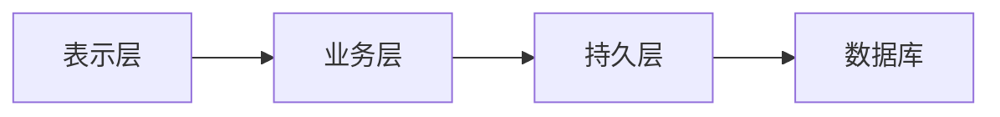

# 教师信息管理系统详细设计与具体代码实现

作者：禅与计算机程序设计艺术

## 1. 背景介绍

### 1.1 教师信息管理系统的重要性

在现代化的教育管理中,教师信息管理系统扮演着至关重要的角色。高效、准确、安全的教师信息管理不仅可以提高学校的管理效率,还能为教师提供更好的服务,为教学质量的提升提供有力支撑。

### 1.2 教师信息管理系统的主要功能

一个完善的教师信息管理系统通常包括以下主要功能:

- 教师基本信息管理:包括教师的个人信息、教育背景、工作经历等
- 教学任务管理:包括教师的授课安排、课程管理等  
- 科研成果管理:包括教师的论文、专利、项目等
- 考核评价管理:包括教师的教学质量评估、学生评教等
- 系统管理:包括用户权限管理、数据备份与恢复等

### 1.3 教师信息管理系统的技术选型

为了实现一个高质量的教师信息管理系统,我们需要选择合适的技术架构和开发工具。本文将重点介绍基于Java语言的SSM(Spring+SpringMVC+MyBatis)框架的教师信息管理系统的设计与实现。

SSM框架是当前Java Web开发领域的主流框架之一,具有如下优势:

- 分层设计,结构清晰,易于维护和扩展 
- 支持MVC设计模式,实现了前后端分离
- 支持ORM映射,简化了数据库操作
- 提供了IoC和AOP等机制,增强了系统的灵活性和可测试性

## 2. 核心概念与关联

### 2.1 领域模型设计

在教师信息管理系统中,核心的领域概念包括:

- Teacher:教师,包含教师的基本信息、教学任务、科研成果等
- Course:课程,包含课程的基本信息、授课教师等  
- Paper:论文,包含论文的基本信息、作者等
- Patent:专利,包含专利的基本信息、发明人等
- Project:项目,包含项目的基本信息、参与人员等
- Evaluation:评价,包含评价的类型、评价人、被评价对象等

这些领域概念之间存在着一定的关联关系,例如:

- 一个Teacher可以授课多门Course
- 一个Teacher可以发表多篇Paper
- 一个Teacher可以申请多项Patent  
- 一个Teacher可以参与多个Project
- 一个Teacher可以收到多条Evaluation

### 2.2 数据库设计

根据上述领域模型,我们可以设计出相应的数据库表结构:

```sql
-- 教师表
CREATE TABLE teacher (
  id INT PRIMARY KEY AUTO_INCREMENT COMMENT '教师ID',
  name VARCHAR(20) NOT NULL COMMENT '姓名',
  gender CHAR(1) COMMENT '性别',
  birthday DATE COMMENT '出生日期',
  title VARCHAR(20) COMMENT '职称',
  education VARCHAR(20) COMMENT '学历',
  college VARCHAR(20) COMMENT '所在学院'
);

-- 课程表  
CREATE TABLE course (
  id INT PRIMARY KEY AUTO_INCREMENT COMMENT '课程ID',
  name VARCHAR(20) NOT NULL COMMENT '课程名称', 
  credit FLOAT COMMENT '学分',
  period INT COMMENT '学时',
  teacher_id INT COMMENT '授课教师ID',
  FOREIGN KEY (teacher_id) REFERENCES teacher(id)
);

-- 论文表
CREATE TABLE paper (
  id INT PRIMARY KEY AUTO_INCREMENT COMMENT '论文ID',
  title VARCHAR(50) NOT NULL COMMENT '论文标题',
  author VARCHAR(20) COMMENT '第一作者',
  journal VARCHAR(50) COMMENT '发表期刊',
  publish_date DATE COMMENT '发表日期'  
);

-- 教师论文关联表
CREATE TABLE teacher_paper (
  teacher_id INT COMMENT '教师ID',
  paper_id INT COMMENT '论文ID',
  contribution VARCHAR(20) COMMENT '贡献度',
  PRIMARY KEY (teacher_id, paper_id), 
  FOREIGN KEY (teacher_id) REFERENCES teacher(id),
  FOREIGN KEY (paper_id) REFERENCES paper(id)
);

-- 专利表
CREATE TABLE patent (
  id INT PRIMARY KEY AUTO_INCREMENT COMMENT '专利ID',
  name VARCHAR(50) NOT NULL COMMENT '专利名称',
  owner VARCHAR(20) COMMENT '专利权人',
  type VARCHAR(20) COMMENT '专利类型',
  apply_date DATE COMMENT '申请日期'
);

-- 教师专利关联表  
CREATE TABLE teacher_patent (
  teacher_id INT COMMENT '教师ID',
  patent_id INT COMMENT '专利ID',
  contribution VARCHAR(20) COMMENT '贡献度',
  PRIMARY KEY (teacher_id, patent_id),
  FOREIGN KEY (teacher_id) REFERENCES teacher(id),
  FOREIGN KEY (patent_id) REFERENCES patent(id)  
);

-- 项目表
CREATE TABLE project (
  id INT PRIMARY KEY AUTO_INCREMENT COMMENT '项目ID',
  name VARCHAR(50) NOT NULL COMMENT '项目名称',
  type VARCHAR(20) COMMENT '项目类型',
  source VARCHAR(20) COMMENT '项目来源',
  amount DECIMAL(10,2) COMMENT '项目金额',
  start_date DATE COMMENT '开始日期',
  end_date DATE COMMENT '结束日期'
);

-- 教师项目关联表
CREATE TABLE teacher_project (
  teacher_id INT COMMENT '教师ID',
  project_id INT COMMENT '项目ID',
  role VARCHAR(20) COMMENT '角色',
  PRIMARY KEY (teacher_id, project_id),
  FOREIGN KEY (teacher_id) REFERENCES teacher(id),
  FOREIGN KEY (project_id) REFERENCES project(id)
);

-- 评价表  
CREATE TABLE evaluation (
  id INT PRIMARY KEY AUTO_INCREMENT COMMENT '评价ID',
  type VARCHAR(20) COMMENT '评价类型',
  content VARCHAR(200) COMMENT '评价内容', 
  score INT COMMENT '评分',
  evaluator VARCHAR(20) COMMENT '评价人',
  evaluated_id INT COMMENT '被评价对象ID',
  evaluated_type VARCHAR(20) COMMENT '被评价对象类型'
);
```

### 2.3 系统架构设计

教师信息管理系统采用经典的三层架构:

- 表示层:负责与用户的交互,实现数据的展示和操作界面。使用JSP、HTML、CSS、JavaScript、jQuery等前端技术。
- 业务层:负责处理业务逻辑,为表示层提供数据服务。使用Spring进行IoC管理和声明式事务管理,使用SpringMVC实现MVC分层。
- 持久层:负责与数据库的交互,实现数据的持久化。使用MyBatis框架简化JDBC操作,支持SQL与Java对象的双向映射。

整个系统的架构如下图所示:



## 3. 核心算法原理与具体操作步骤

### 3.1 教师信息的CRUD操作

教师信息管理系统的核心功能之一就是对教师信息进行增删改查(CRUD)操作。以下是使用SSM框架实现教师信息CRUD操作的具体步骤:

#### 3.1.1 定义实体类

首先需要根据教师表(teacher)定义相应的实体类Teacher:

```java
public class Teacher {
    private Integer id;
    private String name;
    private String gender;
    private Date birthday;
    private String title;
    private String education;
    private String college;
    // 省略getter和setter方法
}
```

#### 3.1.2 定义DAO接口

然后需要定义教师信息的DAO(Data Access Object)接口,声明CRUD操作的方法:

```java
public interface TeacherDao {
    // 新增教师信息
    void insert(Teacher teacher);
    // 删除教师信息  
    void delete(Integer id);
    // 修改教师信息
    void update(Teacher teacher);
    // 根据ID查询教师信息
    Teacher selectById(Integer id);
    // 查询所有教师信息
    List<Teacher> selectAll();  
}
```

#### 3.1.3 配置SQL映射文件

接下来需要在MyBatis的SQL映射文件中配置与DAO接口方法对应的SQL语句:

```xml
<mapper namespace="com.example.dao.TeacherDao">
    <insert id="insert" parameterType="Teacher">
        INSERT INTO teacher (name, gender, birthday, title, education, college)
        VALUES (#{name}, #{gender}, #{birthday}, #{title}, #{education}, #{college}) 
    </insert>
    
    <delete id="delete" parameterType="int">
        DELETE FROM teacher WHERE id = #{id}
    </delete>
       
    <update id="update" parameterType="Teacher">
        UPDATE teacher 
        SET name = #{name}, gender = #{gender}, birthday = #{birthday},
            title = #{title}, education = #{education}, college = #{college}
        WHERE id = #{id}
    </update>
    
    <select id="selectById" parameterType="int" resultType="Teacher">
        SELECT * FROM teacher WHERE id = #{id}  
    </select>
    
    <select id="selectAll" resultType="Teacher">
        SELECT * FROM teacher
    </select>
</mapper>
```

#### 3.1.4 实现Service层

在Service层中调用DAO层的方法,并添加事务管理:

```java
@Service
public class TeacherService {
    
    @Autowired
    private TeacherDao teacherDao;
    
    @Transactional
    public void add(Teacher teacher) {
        teacherDao.insert(teacher);
    }
    
    @Transactional
    public void remove(Integer id) {
        teacherDao.delete(id);
    }
    
    @Transactional
    public void modify(Teacher teacher) {
        teacherDao.update(teacher);  
    }
    
    public Teacher get(Integer id) {
        return teacherDao.selectById(id);
    }
    
    public List<Teacher> list() {
        return teacherDao.selectAll();
    }
}
```

#### 3.1.5 实现Controller层

最后在Controller层中调用Service层的方法,处理前端请求:

```java
@Controller
@RequestMapping("/teacher")
public class TeacherController {
    
    @Autowired
    private TeacherService teacherService;
    
    @PostMapping("/add")
    public String add(Teacher teacher) {
        teacherService.add(teacher);
        return "redirect:/teacher/list";
    }
    
    @GetMapping("/remove/{id}")  
    public String remove(@PathVariable Integer id) {
        teacherService.remove(id);
        return "redirect:/teacher/list";
    }
    
    @PostMapping("/modify")
    public String modify(Teacher teacher) {
        teacherService.modify(teacher);
        return "redirect:/teacher/list";
    }
    
    @GetMapping("/get/{id}")
    public String get(@PathVariable Integer id, Model model) {
        Teacher teacher = teacherService.get(id);
        model.addAttribute("teacher", teacher);
        return "teacher_info";  
    }
    
    @GetMapping("/list")
    public String list(Model model) {
        List<Teacher> teacherList = teacherService.list();
        model.addAttribute("teacherList", teacherList);
        return "teacher_list";
    }
}
```

至此,我们就完成了教师信息的CRUD操作。其他实体类如Course、Paper等的CRUD操作也可以参照上述步骤实现。

### 3.2 教师信息的高级查询

除了基本的CRUD操作外,教师信息管理系统还需要支持一些高级查询功能,例如:

- 根据姓名、职称、学历等条件进行模糊查询
- 根据授课数量、论文数量、项目数量等进行排序
- 对教师信息进行分页显示

以下是使用SSM框架实现教师信息高级查询的具体步骤:

#### 3.2.1 定义查询条件类

首先需要定义一个查询条件类TeacherQuery,封装各种可能的查询条件:

```java
public class TeacherQuery {
    private String name;
    private String title;
    private String education;
    private String orderBy;
    private String order;
    private Integer pageNum = 1;
    private Integer pageSize = 10;
    // 省略getter和setter方法
}
```

#### 3.2.2 定义DAO接口方法

然后需要在TeacherDao接口中声明相应的查询方法:

```java
public interface TeacherDao {
    // 根据条件查询教师信息
    List<Teacher> selectByCondition(TeacherQuery query);
    // 根据条件查询教师数量
    Long countByCondition(TeacherQuery query);
}
```

#### 3.2.3 配置SQL映射文件

在SQL映射文件中配置与查询方法对应的SQL语句,使用动态SQL来处理不同的查询条件:

```xml
<mapper namespace="com.example.dao.TeacherDao">
    <sql id="queryCondition">
        <where>
            <if test="name != null and name != ''">
                AND name LIKE CONCAT('%', #{name}, '%')
            </if>
            <if test="title != null and title != ''">
                AND title = #{title}  
            </if>
            <if test="education != null and education != ''">
                AND education = #{education}
            </if>
        </where>
    </sql>
    
    <select id="selectByCondition" parameterType="TeacherQuery" resultType="Teacher">
        SELECT * 
        FROM teacher
        <include refid="queryCondition"/>
        <choose>
            <when test="orderBy == 'courseCount'">
                ORDER BY (SELECT COUNT(*) FROM course WHERE teacher_id = teacher.id) ${order}  
            </when>  
            <when test="orderBy == 'paperCount'">
                ORDER BY (SELECT COUNT(*) FROM teacher_paper WHERE teacher_id = teacher.id) ${order}
            </when>
            <when test="orderBy == 'projectCount'">
                ORDER BY (SELECT COUNT(*) FROM teacher_project WHERE teacher