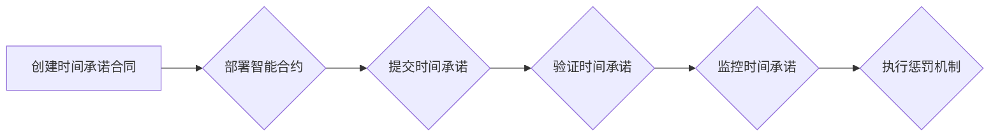

## 1. 背景介绍

### 1.1 时间承诺的必要性

在当今的数字世界中，时间是一个至关重要的因素。从简单的在线预约到复杂的金融交易，我们都需要一种可靠的方式来确保事情按时发生。然而，传统的基于信任的承诺机制往往容易受到人为错误、恶意行为和不可预见事件的影响。区块链技术的出现为解决这个问题提供了新的可能性。

### 1.2 区块链技术的优势

区块链技术具有去中心化、透明、安全和不可篡改等特点，使其成为构建可靠时间承诺机制的理想选择。通过将时间承诺记录在区块链上，我们可以创建一个防篡改、可验证和可信赖的系统，从而提高效率、降低风险并增强信任。

### 1.3 时间承诺合同的应用场景

时间承诺合同具有广泛的应用场景，包括：

* **供应链管理：**确保货物按时交付。
* **金融服务：**保障贷款按时偿还。
* **法律协议：**确保合同条款按时履行。
* **在线服务：**保证服务按时提供。

## 2. 核心概念与联系

### 2.1 区块链

区块链是一个分布式数据库，由一系列按时间顺序排列的区块组成。每个区块包含一组交易记录，并通过密码学技术与前一个区块相连接，形成一个不可篡改的链式结构。

### 2.2 智能合约

智能合约是存储在区块链上的自动执行的计算机程序。它们可以根据预先定义的规则和条件自动执行操作，例如转移资金、执行协议或更新数据。

### 2.3 时间戳

时间戳是用于记录事件发生时间的数字签名。在区块链中，每个区块都包含一个时间戳，用于记录该区块被添加到区块链上的时间。

### 2.4 哈希函数

哈希函数是一种将任意长度的数据转换为固定长度字符串的算法。哈希函数具有单向性和抗碰撞性，这意味着无法从哈希值推导出原始数据，并且不同的数据几乎不可能产生相同的哈希值。

### 2.5 关系图

```
graph LR
    区块链 --> 智能合约
    智能合约 --> 时间戳
    时间戳 --> 哈希函数
```

## 3. 核心算法原理具体操作步骤

### 3.1 创建时间承诺合同

要创建一个时间承诺合同，我们需要定义以下内容：

* **承诺内容：**承诺要执行的具体操作。
* **承诺时间：**承诺完成操作的截止时间。
* **承诺方：**做出承诺的个人或组织。
* **受益方：**承诺完成操作后受益的个人或组织。
* **惩罚机制：**如果承诺未按时履行，将执行的惩罚措施。

### 3.2 部署智能合约

将时间承诺合同的条款编写成智能合约代码，并将其部署到区块链上。

### 3.3 提交时间承诺

承诺方将承诺内容、承诺时间和承诺方的身份信息提交到智能合约。

### 3.4 验证时间承诺

智能合约验证承诺内容、承诺时间和承诺方的身份信息，并将时间承诺记录在区块链上。

### 3.5 监控时间承诺

智能合约持续监控时间承诺的执行情况。

### 3.6 执行惩罚机制

如果承诺未在承诺时间内履行，智能合约将自动执行惩罚机制，例如将承诺方的保证金转移给受益方。

### 3.7 流程图



## 4. 数学模型和公式详细讲解举例说明

### 4.1 时间戳验证

时间戳的验证可以通过哈希函数来实现。假设时间戳为 $t$，承诺内容为 $m$，承诺方的私钥为 $k$，则时间戳的哈希值为：

$$
h = H(t || m || k)
$$

其中，$||$ 表示字符串拼接操作，$H()$ 表示哈希函数。

### 4.2 举例说明

假设 Alice 承诺在 2024 年 5 月 20 日之前向 Bob 支付 100 美元。Alice 的私钥为 $k$。

1. **创建时间承诺:** Alice 创建一个时间承诺合同，其中承诺内容为“向 Bob 支付 100 美元”，承诺时间为 2024 年 5 月 20 日，承诺方为 Alice，受益方为 Bob。
2. **部署智能合约:** Alice 将时间承诺合同的条款编写成智能合约代码，并将其部署到区块链上。
3. **提交时间承诺:** Alice 将承诺内容、承诺时间和她的身份信息提交到智能合约。
4. **验证时间承诺:** 智能合约验证 Alice 的身份信息，并将时间承诺记录在区块链上。时间戳为 2024 年 5 月 16 日 18:07:12。时间戳的哈希值为：

$$
h = H(2024-05-16 18:07:12 || "向 Bob 支付 100 美元" || k)
$$

5. **监控时间承诺:** 智能合约持续监控时间承诺的执行情况。
6. **执行惩罚机制:** 如果 Alice 未在 2024 年 5 月 20 日之前向 Bob 支付 100 美元，智能合约将自动执行惩罚机制，例如将 Alice 的保证金转移给 Bob。

## 5. 项目实践：代码实例和详细解释说明

### 5.1 Solidity 代码实例

```solidity
pragma solidity ^0.8.0;

contract TimeCommitment {

    // 承诺结构体
    struct Commitment {
        address committer; // 承诺方
        address beneficiary; // 受益方
        string content; // 承诺内容
        uint256 deadline; // 承诺时间
        uint256 bond; // 保证金
    }

    // 存储承诺的映射
    mapping(bytes32 => Commitment) public commitments;

    // 创建时间承诺
    function createCommitment(
        address beneficiary,
        string memory content,
        uint256 deadline,
        uint256 bond
    ) public {
        // 计算承诺的哈希值
        bytes32 commitmentHash = keccak256(abi.encodePacked(msg.sender, beneficiary, content, deadline));

        // 创建承诺结构体
        Commitment memory commitment = Commitment({
            committer: msg.sender,
            beneficiary: beneficiary,
            content: content,
            deadline: deadline,
            bond: bond
        });

        // 存储承诺
        commitments[commitmentHash] = commitment;
    }

    // 验证时间承诺
    function verifyCommitment(bytes32 commitmentHash) public view returns (bool) {
        // 获取承诺
        Commitment memory commitment = commitments[commitmentHash];

        // 检查承诺是否存在
        if (commitment.committer == address(0)) {
            return false;
        }

        // 检查承诺是否已过期
        if (block.timestamp > commitment.deadline) {
            return false;
        }

        // 承诺有效
        return true;
    }

    // 执行惩罚机制
    function enforceCommitment(bytes32 commitmentHash) public {
        // 获取承诺
        Commitment memory commitment = commitments[commitmentHash];

        // 检查承诺是否已过期
        require(block.timestamp > commitment.deadline, "Commitment is not yet due.");

        // 将保证金转移给受益方
        payable(commitment.beneficiary).transfer(commitment.bond);
    }
}
```

### 5.2 代码解释

* `Commitment` 结构体用于存储时间承诺的信息，包括承诺方、受益方、承诺内容、承诺时间和保证金。
* `commitments` 映射用于存储所有的时间承诺，其中键为承诺的哈希值，值为 `Commitment` 结构体。
* `createCommitment` 函数用于创建新的时间承诺。它接收受益方、承诺内容、承诺时间和保证金作为参数，计算承诺的哈希值，创建 `Commitment` 结构体，并将承诺存储在 `commitments` 映射中。
* `verifyCommitment` 函数用于验证时间承诺。它接收承诺的哈希值作为参数，获取承诺，检查承诺是否存在以及是否已过期。如果承诺有效，则返回 `true`，否则返回 `false`。
* `enforceCommitment` 函数用于执行惩罚机制。它接收承诺的哈希值作为参数，获取承诺，检查承诺是否已过期。如果承诺已过期，则将保证金转移给受益方。

## 6. 实际应用场景

### 6.1 供应链管理

在供应链管理中，时间承诺合同可以用于确保货物按时交付。例如，供应商可以承诺在特定日期之前将货物交付给制造商。如果供应商未能按时交货，智能合约将自动执行惩罚机制，例如向制造商支付罚款。

### 6.2 金融服务

在金融服务中，时间承诺合同可以用于保障贷款按时偿还。例如，借款人可以承诺在特定日期之前偿还贷款。如果借款人未能按时偿还贷款，智能合约将自动执行惩罚机制，例如从借款人的账户中扣除罚款。

### 6.3 法律协议

在法律协议中，时间承诺合同可以用于确保合同条款按时履行。例如，承包商可以承诺在特定日期之前完成建筑项目。如果承包商未能按时完成项目，智能合约将自动执行惩罚机制，例如向业主支付罚款。

### 6.4 在线服务

在在线服务中，时间承诺合同可以用于保证服务按时提供。例如，云计算提供商可以承诺在特定时间内提供一定的服务水平。如果云计算提供商未能按时提供服务，智能合约将自动执行惩罚机制，例如向客户提供退款。

## 7. 工具和资源推荐

### 7.1 以太坊

以太坊是一个开源的区块链平台，支持智能合约。它是构建时间承诺合同的常用平台。

### 7.2 Solidity

Solidity 是一种面向合约的编程语言，用于编写以太坊智能合约。

### 7.3 Remix IDE

Remix IDE 是一个基于 Web 的 Solidity 集成开发环境，可以用于编写、部署和测试智能合约。

### 7.4 Truffle

Truffle 是一个以太坊开发框架，可以用于构建、测试和部署智能合约。

## 8. 总结：未来发展趋势与挑战

### 8.1 未来发展趋势

* **跨链互操作性：**未来，时间承诺合同可以跨越不同的区块链平台，实现更广泛的应用场景。
* **隐私保护：**隐私保护技术可以用于保护时间承诺合同中的敏感信息，例如承诺内容和承诺方的身份信息。
* **可扩展性：**随着区块链技术的不断发展，时间承诺合同的性能和可扩展性将得到进一步提升。

### 8.2 挑战

* **法律法规：**时间承诺合同的法律效力尚不明确，需要制定相应的法律法规来规范其应用。
* **用户采用：**用户对区块链技术和时间承诺合同的了解和接受程度仍然有限，需要进行更多的宣传和教育。
* **安全性：**区块链技术本身存在安全风险，需要采取措施来确保时间承诺合同的安全性。

## 9. 附录：常见问题与解答

### 9.1 时间承诺合同的优势是什么？

时间承诺合同的优势包括：

* **防篡改：**时间承诺记录在区块链上，无法被篡改。
* **可验证：**任何人都可以验证时间承诺的真实性。
* **可信赖：**时间承诺合同的执行不受人为因素的影响，可以确保承诺按时履行。

### 9.2 如何创建时间承诺合同？

要创建时间承诺合同，需要定义承诺内容、承诺时间、承诺方、受益方和惩罚机制，并将这些信息编写成智能合约代码，然后将其部署到区块链上。

### 9.3 时间承诺合同的应用场景有哪些？

时间承诺合同的应用场景包括供应链管理、金融服务、法律协议和在线服务等。

### 9.4 时间承诺合同的未来发展趋势是什么？

时间承诺合同的未来发展趋势包括跨链互操作性、隐私保护和可扩展性等。
