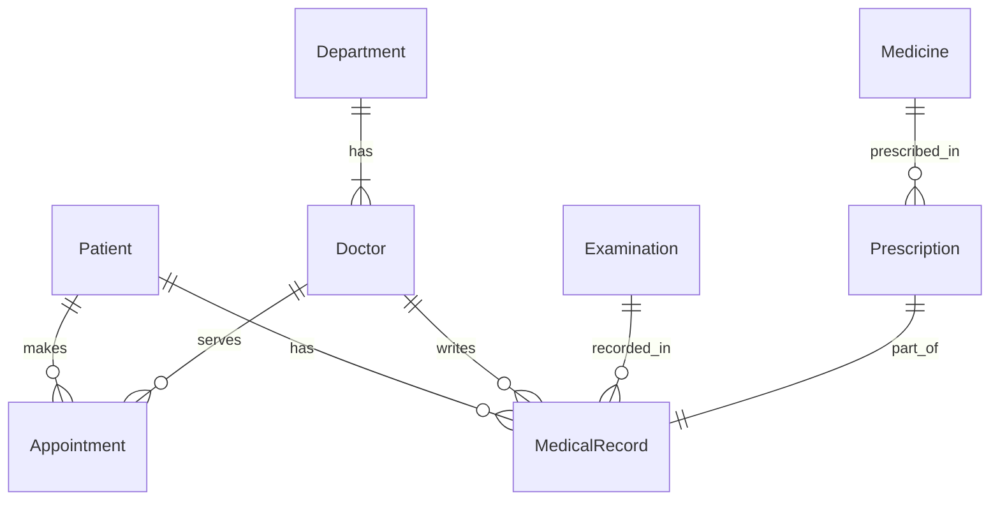

# 门诊就诊系统的设计与实现

作者：禅与计算机程序设计艺术

## 1. 背景介绍

### 1.1 门诊就诊系统的重要性
在现代医疗服务中,门诊就诊系统扮演着至关重要的角色。它是连接患者与医疗机构的桥梁,对于提高医疗服务效率、改善患者就医体验有着重大意义。

### 1.2 传统门诊就诊流程的痛点
传统的门诊就诊流程往往存在诸多问题,例如:

- 排队时间长,效率低下
- 就诊流程复杂,患者体验差
- 医疗资源分配不均,负荷过重
- 信息化程度低,数据利用不足

### 1.3 门诊就诊系统的目标
为了解决上述问题,门诊就诊系统应达成以下目标:

- 优化就诊流程,提高效率
- 合理分配医疗资源,均衡负荷  
- 提供人性化服务,改善患者体验
- 加强信息化建设,充分利用数据价值

## 2. 核心概念与关联

### 2.1 门诊就诊流程
一个典型的门诊就诊流程通常包括:

1. 预约挂号
2. 候诊排队
3. 医生问诊
4. 检查检验
5. 治疗处方
6. 缴费取药

### 2.2 业务实体及其关系
在门诊就诊系统中,主要涉及到以下业务实体:

- 患者:前来就诊的人员
- 医生:为患者提供诊疗服务的人员
- 科室:医院内部的不同诊疗部门
- 检查项目:各类医学检查项目
- 药品:用于治疗的各类药物

它们之间的关系可以用ER图表示如下:



### 2.3 系统架构设计
一个典型的门诊就诊系统架构可分为三层:

1. 表示层:用户界面,负责数据展示和交互
2. 业务逻辑层:处理各项业务逻辑,是系统的核心
3. 数据访问层:与底层数据库交互,提供数据持久化

## 3. 核心算法原理与具体步骤

### 3.1 预约挂号算法
预约挂号是门诊就诊的第一步,其核心在于根据医生的排班和号源情况,为患者安排合适的就诊时段。

#### 3.1.1 号源数据结构设计
```cpp
struct TimeSlot {
    Doctor doctor; // 医生
    DateTime start; // 开始时间
    DateTime end; // 结束时间 
    int capacity; // 号源容量
    int booked; // 已预约数
};
```

#### 3.1.2 号源生成算法
```cpp
generateTimeSlots(Doctor d, DateTime date) {
    result = []; // 号源列表
    foreach (Shift s in d.getShifts(date)) { // 遍历医生排班
        slotStart = s.start;
        while (slotStart < s.end) {
            slotEnd = min(slotStart + d.slotDuration, s.end); // 计算时段结束时间
            result.add(TimeSlot(d, slotStart, slotEnd, d.capacity, 0)); // 添加新号源
            slotStart = slotEnd; // 调整时段起始时间
        }
    }
    return result;
}
```

#### 3.1.3 号源查询与预约算法
```cpp
bookAppointment(Patient p, Department dept, DateTime date) {
    availableSlots = []; // 可用号源
    foreach (Doctor d in dept.getDoctors()) { // 遍历科室医生
        availableSlots.addAll(generateTimeSlots(d, date)); // 生成号源
    }
    availableSlots = availableSlots.filter(s => s.booked < s.capacity); // 过滤已满号源
    if (availableSlots.isEmpty()) {
        throw new FullException(); // 号源已满
    }
    selectedSlot = p.selectSlot(availableSlots); // 患者选择号源
    selectedSlot.booked++; // 预约成功,号源量加1
    return new Appointment(p, selectedSlot); // 生成预约记录
}
```

### 3.2 智能排队算法
为缓解候诊区拥挤,减少患者等待时间,可引入智能排队算法。其核心思路是根据患者的预约时间、就诊科室、病情严重程度等因素,动态调整候诊队列的优先级。

#### 3.2.1 候诊队列的优先级计算
```cpp
calculatePriority(Appointment a) {
    // 计算时间优先级,离预约时间越近优先级越高
    timePriority = 1 / (a.slot.start - currentTime); 
    
    // 计算科室优先级,急诊科优先级高于普通科室
    deptPriority = (a.slot.doctor.department == Emergency) ? 2 : 1;

    // 计算病情优先级,病情越严重优先级越高  
    conditionPriority = a.patient.condition.severity;

    return timePriority * deptPriority * conditionPriority; 
}
```

#### 3.2.2 实时调整候诊队列
```cpp
adjustQueue(Queue q, Appointment a) {
    a.priority = calculatePriority(a); // 计算预约优先级
    position = q.findInsertPosition(a); // 根据优先级找到插入位置
    q.insert(position, a); // 将预约插入队列
}
```

### 3.3 电子处方算法
电子处方系统可以帮助医生快速、准确地开具处方,同时也便于药房自动化调配。其核心在于根据药品的适应症、禁忌症、互斥关系等,对医生的处方进行合理性检查。

#### 3.3.1 药品数据结构设计
```cpp
struct Medicine {
    string name; // 药品名称
    set<string> indications; // 适应症
    set<string> contraindications; // 禁忌症
    set<string> interactions; // 相互作用药品
    float dosage; // 剂量
    string usage; // 用法
};
```

#### 3.3.2 处方合理性检查算法
```cpp
checkPrescription(Prescription p) {
    foreach (Medicine m in p.medicines) {
        // 检查适应症
        if (!m.indications.contains(p.diagnosis)) { 
            throw new IncompatibleException(m, "适应症不符");
        }
        // 检查禁忌症
        if (m.contraindications.contains(p.diagnosis)) {
            throw new ContraindicatedException(m, "存在禁忌症");
        }
        // 检查相互作用
        foreach (Medicine other in p.medicines) {
            if (m.interactions.contains(other.name)) {
                throw new InteractionException(m, other, "存在相互作用");
            }
        }
    }
}
```

## 4. 数学模型与公式详解

### 4.1 候诊队列优先级模型
候诊队列优先级可以用一个加权求和模型来表示:

$$
Priority = \sum_{i=1}^n w_i \times f_i(a)
$$

其中:
- $w_i$ 表示第 $i$ 个因素的权重
- $f_i(a)$ 表示预约 $a$ 在第 $i$ 个因素上的得分
- $n$ 为考虑的因素总数

常见的因素及其计算方式有:

1. 时间因素:
$$
f_1(a) = \frac{1}{a.slot.start - currentTime}
$$

2. 科室因素:
$$
f_2(a) = \begin{cases}
2, & a.slot.doctor.department = Emergency \\
1, & otherwise
\end{cases}
$$

3. 病情因素:
$$
f_3(a) = a.patient.condition.severity
$$

权重 $w_i$ 的取值可以根据实际情况进行调整,以反映不同因素的重要程度。

### 4.2 电子处方相互作用模型
药品之间的相互作用可以用一个无向图模型来表示,其中:

- 每个节点表示一种药品
- 两个节点之间的边表示这两种药品之间存在相互作用

我们可以用邻接矩阵 $A$ 来表示这个图:

$$
A_{ij} = \begin{cases}
1, & Medicine_i \in Medicine_j.interactions \\
0, & otherwise
\end{cases}
$$

对于一个处方 $p$,我们可以检查其对应的子图是否含有边,即:

$$
\exists i, j \in p, A_{ij} = 1
$$

如果存在这样的边,则说明处方中存在相互作用的药品,需要进行警示。

## 5. 项目实践

### 5.1 系统技术选型

- 前端:Vue.js + Element UI
- 后端:Spring Boot + MyBatis
- 数据库:MySQL
- 缓存:Redis
- 消息队列:RabbitMQ

### 5.2 核心模块代码实现

#### 5.2.1 预约挂号模块
```java
@Service
public class AppointmentService {
    @Autowired
    private DoctorMapper doctorMapper;
    @Autowired
    private AppointmentMapper appointmentMapper;

    public List<TimeSlot> generateTimeSlots(Long doctorId, Date date) {
        Doctor doctor = doctorMapper.selectById(doctorId);
        List<TimeSlot> result = new ArrayList<>();
        for (Shift shift : doctor.getShifts(date)) {
            LocalDateTime slotStart = shift.getStart();
            while (slotStart.isBefore(shift.getEnd())) {
                LocalDateTime slotEnd = slotStart.plus(doctor.getSlotDuration());
                result.add(new TimeSlot(doctor, slotStart, slotEnd, doctor.getCapacity(), 0));
                slotStart = slotEnd;
            }
        }
        return result;
    }

    @Transactional
    public Appointment bookAppointment(Long patientId, Long departmentId, Date date) {
        List<TimeSlot> availableSlots = new ArrayList<>();
        for (Doctor doctor : doctorMapper.selectByDepartmentId(departmentId)) {
            availableSlots.addAll(generateTimeSlots(doctor.getId(), date));
        }
        availableSlots = availableSlots.stream()
            .filter(slot -> slot.getBooked() < slot.getCapacity())
            .collect(Collectors.toList());
        if (availableSlots.isEmpty()) {
            throw new FullException();
        }
        TimeSlot selectedSlot = patientMapper.selectById(patientId).selectSlot(availableSlots);
        selectedSlot.setBooked(selectedSlot.getBooked() + 1);
        appointmentMapper.insert(new Appointment(patientId, selectedSlot));
        return appointment;
    }
}
```

#### 5.2.2 智能排队模块
```java
@Service
public class QueueService {
    @Autowired
    private AppointmentMapper appointmentMapper;
    @Autowired
    private QueueMapper queueMapper;

    public double calculatePriority(Appointment appointment) {
        double timePriority = 1 / Duration.between(LocalDateTime.now(), appointment.getSlot().getStart()).toMinutes();
        double deptPriority = appointment.getSlot().getDoctor().getDepartment().equals("Emergency") ? 2 : 1;
        double conditionPriority = appointment.getPatient().getCondition().getSeverity();
        return timePriority * deptPriority * conditionPriority;
    }

    @Transactional
    public void adjustQueue(Long queueId, Long appointmentId) {
        Appointment appointment = appointmentMapper.selectById(appointmentId);
        double priority = calculatePriority(appointment);
        Queue queue = queueMapper.selectById(queueId);
        int position = queue.findInsertPosition(priority);
        queue.insert(position, appointmentId);
        queueMapper.updateById(queue);
    }
}
```

#### 5.2.3 电子处方模块
```java
@Service
public class PrescriptionService {
    @Autowired
    private MedicineMapper medicineMapper;
    @Autowired
    private PrescriptionMapper prescriptionMapper;

    public void checkPrescription(Prescription prescription) {
        for (Medicine medicine : prescription.getMedicines()) {
            if (!medicine.getIndications().contains(prescription.getDiagnosis())) {
                throw new IncompatibleException(medicine, "适应症不符");
            }
            if (medicine.getContraindications().contains(prescription.getDiagnosis())) {
                throw new ContraindicatedException(medicine, "存在禁忌症");
            }
            for (Medicine other : prescription.getMedicines()) {
                if (medicine.getInteractions().contains(other.getName())) {
                    throw new InteractionException(medicine, other, "存在相互作用");
                }
            }
        }
    }

    @Transactional
    public void savePrescription(Prescription prescription) {
        checkPrescription(prescription);
        prescriptionMapper.insert(prescription);
    }
}
```

## 6. 实际应用场景

### 6.1 大型综合医院
大型综合医院门诊量大,科室众多,对门诊系统的要求非常高。引入门诊就诊系统后,可以显著提高患者的就诊效率和满意度:

- 患者可以随时在线预约挂号,不必排长队
- 系统自