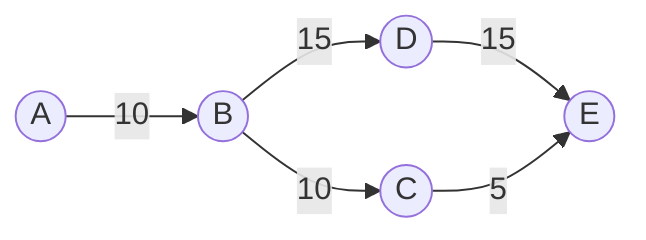

# 智能公交查询系统详细设计与具体代码实现

作者：禅与计算机程序设计艺术

## 1. 背景介绍

### 1.1 智能公交系统的发展历程

随着城市化进程的加快和人口的不断增长,公共交通系统面临着越来越大的压力。传统的公交查询方式,如电话咨询、查阅纸质时刻表等,已经无法满足人们日益增长的出行需求。为了提高公交系统的服务质量和运营效率,智能公交查询系统应运而生。

智能公交查询系统的发展可以追溯到20世纪90年代。早期的系统主要基于电话语音查询和简单的网页查询,提供的信息有限,用户体验也不够理想。随着互联网技术的快速发展,特别是移动互联网的普及,智能公交查询系统进入了一个新的阶段。

### 1.2 智能公交查询系统的现状

目前,智能公交查询系统已经成为许多城市公交系统的标配。这些系统通常以移动应用程序(App)和网页应用(Web App)的形式提供服务,具有以下特点:

1. 实时数据:系统能够实时获取公交车辆的位置信息,并根据交通状况预测到站时间。
2. 多样化的查询方式:用户可以通过输入起点和终点、公交线路号、站点名称等多种方式进行查询。
3. 个性化服务:系统可以根据用户的历史记录和偏好,提供个性化的出行推荐。
4. 信息丰富:除了基本的线路和站点信息,系统还可以提供换乘方案、票价、周边地图等多维度的信息。

### 1.3 智能公交查询系统面临的挑战

尽管智能公交查询系统已经取得了长足的进步,但仍然面临着一些挑战:

1. 数据质量:公交车辆的实时位置数据可能存在延迟、丢失等问题,影响查询结果的准确性。
2. 算法优化:如何在海量数据中快速找到最优出行方案,是一个复杂的算法问题。
3. 用户体验:如何设计简洁、易用的用户界面,提供流畅的交互体验,也是一个重要的课题。
4. 系统稳定性:如何确保系统在高并发访问下稳定运行,避免宕机或响应缓慢,是运维团队面临的挑战。

## 2. 核心概念与联系

### 2.1 公交网络模型

公交网络可以抽象为一个有向图$G=(V,E)$,其中:

- $V$表示所有公交站点的集合。每个站点$v_i \in V$都有一个唯一的ID和名称。
- $E$表示所有公交线路的集合。每条线路$e_j \in E$都由一个有序的站点序列$<v_1,v_2,...,v_n>$组成。

除了基本的拓扑结构,公交网络模型还需要包含以下信息:

- 站点的地理坐标(经纬度)
- 线路的运营时间、发车频率
- 相邻站点之间的距离、预计行驶时间

### 2.2 最短路径算法

在公交网络中,用户的查询需求通常可以转化为最短路径问题。常见的最短路径算法包括:

- Dijkstra算法:适用于边权非负的有向图,时间复杂度为$O(|E|+|V|log|V|)$。
- A*算法:在Dijkstra算法的基础上引入启发式函数,可以更快地找到最短路径。
- Floyd-Warshall算法:可以求出任意两点之间的最短路径,时间复杂度为$O(|V|^3)$。

在实际应用中,需要根据具体的场景和性能要求,选择合适的算法。

### 2.3 地理信息系统(GIS)

GIS在智能公交查询系统中扮演着重要的角色。它提供了以下功能:

- 地理编码(Geocoding):将地址、地名等文本信息转换为地理坐标。
- 路径规划:根据道路网络数据,规划出行路线。
- 地图可视化:在地图上展示公交线路、站点等信息。

常用的GIS服务包括Google Maps、百度地图、高德地图等。

## 3. 核心算法原理与具体操作步骤

### 3.1 数据预处理

在进行查询之前,需要对原始的公交数据进行预处理,主要包括:

1. 数据清洗:去除重复、错误、不完整的数据记录。
2. 数据转换:将不同格式的数据(如CSV、JSON)转换为统一的数据模型。
3. 数据压缩:对大规模数据进行压缩,减少存储空间和传输开销。

### 3.2 公交线路拓扑构建

根据预处理后的数据,构建公交网络的拓扑结构。具体步骤如下:

1. 创建站点对象,包含ID、名称、地理坐标等属性。
2. 创建线路对象,包含ID、名称、站点序列等属性。
3. 建立站点和线路之间的关联关系,形成完整的公交网络。

### 3.3 查询算法实现

以最常见的起点-终点查询为例,介绍查询算法的实现步骤:

1. 接收用户输入的起点和终点信息。
2. 调用地理编码服务,将起点和终点转换为地理坐标。
3. 在公交网络中,找出与起点和终点最近的公交站点。
4. 使用最短路径算法(如Dijkstra),在公交网络中搜索从起点站到终点站的最优路线。
5. 将搜索结果转换为易于理解的文本或图形格式,返回给用户。

### 3.4 实时数据更新

为了提供准确的到站时间预测,需要实时更新公交车辆的位置信息。具体步骤如下:

1. 公交车辆上安装GPS设备,定期(如每10秒)上报位置信息。
2. 服务器接收车辆上报的位置数据,更新内存中的车辆状态。
3. 查询算法在计算到站时间时,综合考虑车辆的实时位置和历史行驶数据。

## 4. 数学模型和公式详细讲解举例说明

### 4.1 最短路径模型

在公交网络中,最短路径问题可以用以下数学模型来描述:

给定一个有向图$G=(V,E)$,其中每条边$e \in E$都有一个非负的权重$w(e)$,表示通过该边的代价(如行驶时间)。对于任意两个顶点$u,v \in V$,找到一条从$u$到$v$的路径$P$,使得路径上所有边的权重之和最小,即:

$$
\min \sum_{e \in P} w(e)
$$

### 4.2 Dijkstra算法

Dijkstra算法是解决单源最短路径问题的经典算法。其基本思想是:

1. 初始化距离数组$d$,将起点$s$的距离设为0,其他顶点的距离设为无穷大。
2. 创建一个优先队列$Q$,将所有顶点按照距离从小到大排序。
3. 重复以下步骤,直到队列为空:
   - 取出队首顶点$u$,标记为已访问。
   - 对于$u$的每个未访问的邻居$v$,如果通过$u$到达$v$的距离更短,则更新$v$的距离,并将$v$加入队列。

以下是Dijkstra算法的伪代码:

```
function Dijkstra(Graph, source):
    dist[source] ← 0                    // 初始化源点距离为0
    create vertex priority queue Q      // 创建优先队列 

    for each vertex v in Graph:
        if v ≠ source
            dist[v] ← INFINITY          // 初始化其他顶点距离为无穷大
        Q.add_with_priority(v, dist[v])  // 将v添加到Q,优先级为dist[v]

    while Q is not empty:               // 主循环
        u ← Q.extract_min()             // 取出具有最小距离的顶点u
        for each neighbor v of u:       // 遍历u的所有邻居
            alt ← dist[u] + length(u, v)
            if alt < dist[v]:           // 如果通过u到v的距离更短
                dist[v] ← alt           // 更新v的距离
                Q.decrease_priority(v, alt) // 更新v在Q中的优先级

    return dist
```

算法的时间复杂度为$O(|E|+|V|log|V|)$,其中$|V|$是顶点数,$|E|$是边数。

### 4.3 公交网络中的Dijkstra算法应用

在公交网络中应用Dijkstra算法时,需要考虑以下因素:

1. 边权重的设置:可以使用站点间的距离、预计行驶时间等作为权重。
2. 换乘惩罚:在换乘站点,需要额外添加一个固定的时间惩罚,表示换乘的时间成本。
3. 发车频率:对于发车频率较低的线路,需要考虑乘客的等待时间。

以下是一个简单的例子,说明如何在公交网络中应用Dijkstra算法:

假设有以下公交线路:

- 线路1: A -> B -> C,行驶时间为10分钟
- 线路2: B -> D -> E,行驶时间为15分钟
- 线路3: C -> E,行驶时间为5分钟

换乘惩罚设为2分钟。现在要从站点A到站点E,求最短路径。

首先,将公交网络转化为带权有向图:



然后,应用Dijkstra算法:

1. 初始化距离数组:$d[A]=0,d[B]=\infty,d[C]=\infty,d[D]=\infty,d[E]=\infty$。
2. 第一次迭代:取出A,更新$d[B]=10$。
3. 第二次迭代:取出B,更新$d[C]=20,d[D]=25$。
4. 第三次迭代:取出C,更新$d[E]=27$。
5. 第四次迭代:取出D,更新$d[E]=40$。

最终得到最短路径:A -> B -> C -> E,总时间为27分钟。

## 5. 项目实践:代码实例和详细解释说明

下面以Python为例,演示如何实现一个简单的公交查询系统。

### 5.1 数据结构定义

首先定义站点(Station)和线路(Route)的数据结构:

```python
class Station:
    def __init__(self, id, name, lat, lng):
        self.id = id
        self.name = name
        self.lat = lat
        self.lng = lng

class Route:
    def __init__(self, id, name, stations):
        self.id = id
        self.name = name
        self.stations = stations
```

其中,`stations`是一个有序的站点列表,表示线路上的站点顺序。

### 5.2 公交网络构建

根据预处理后的数据,构建公交网络的邻接表表示:

```python
def build_network(stations, routes):
    network = {s.id: {} for s in stations}
    for r in routes:
        for i in range(len(r.stations)-1):
            s1, s2 = r.stations[i], r.stations[i+1]
            if s2.id not in network[s1.id]:
                network[s1.id][s2.id] = r.id
    return network
```

`network`是一个字典,键为站点ID,值为另一个字典,表示与该站点直接相连的站点及所在线路。

### 5.3 Dijkstra算法实现

使用优先队列实现Dijkstra算法:

```python
import heapq

def dijkstra(network, source, target, transfer_penalty=2):
    dist = {s: float('inf') for s in network}
    prev = {s: None for s in network}
    dist[source] = 0
    
    pq = [(0, source)]
    while pq:
        d, u = heapq.heappop(pq)
        if u == target:
            break
        if d > dist[u]:
            continue
        
        for v, route in network[u].items():
            alt = d + transfer_penalty if prev[u] and route != prev[u] else d
            if alt < dist[v]:
                dist[v] = alt
                prev[v] = route
                heapq.heappush(pq, (alt, v))
    
    path = []
    u = target
    while u is not None:
        path.append(u)
        u = prev[u]
    path.reverse()
    
    return path, dist[target]
```

算法