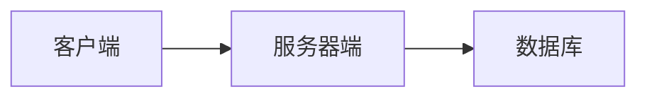

## 1. 背景介绍

### 1.1 汽车销售行业现状

随着中国经济的快速发展和人民生活水平的不断提高，汽车已经成为人们日常生活中不可或缺的一部分。汽车销售行业也随之蓬勃发展，市场竞争日益激烈。传统的汽车销售模式存在着效率低下、信息不透明、客户体验差等问题，已经难以满足现代消费者的需求。

### 1.2 信息化发展趋势

为了提高效率、降低成本、提升客户满意度，汽车销售行业正在积极拥抱信息化技术。汽车销售管理信息系统应运而生，它能够整合销售、库存、客户、财务等各个环节的信息，实现信息的自动化管理，为企业提供决策支持。

### 1.3 本系统目标

本系统旨在设计和实现一个功能完善、性能优越、易于使用的汽车销售管理信息系统，帮助汽车销售企业实现信息化转型升级，提高市场竞争力。

## 2. 核心概念与联系

### 2.1 系统架构

本系统采用B/S架构，分为客户端、服务器端和数据库三层。

*   **客户端**：用户通过浏览器访问系统，进行业务操作。
*   **服务器端**：负责处理客户端请求，实现业务逻辑，并与数据库进行交互。
*   **数据库**：存储系统数据，包括用户信息、车辆信息、销售信息等。

### 2.2 功能模块

本系统主要包括以下功能模块：

*   **用户管理**：管理系统用户，包括添加、删除、修改用户信息，分配角色权限等。
*   **车辆管理**：管理车辆信息，包括车辆基本信息、库存信息、销售历史等。
*   **销售管理**：管理销售订单，包括创建订单、修改订单、查询订单等。
*   **客户管理**：管理客户信息，包括客户基本信息、购车记录、售后服务等。
*   **财务管理**：管理财务信息，包括收款、付款、统计报表等。

### 2.3 数据流图



## 3. 核心算法原理具体操作步骤

### 3.1 用户登录认证

用户登录时，系统需要验证用户名和密码是否正确。

1.  客户端将用户名和密码发送到服务器端。
2.  服务器端查询数据库，验证用户名是否存在，密码是否匹配。
3.  如果验证通过，则生成一个Session ID，并返回给客户端。
4.  客户端将Session ID保存到本地，用于后续请求的身份验证。

### 3.2 销售订单生成

用户创建销售订单时，系统需要生成一个唯一的订单号。

1.  客户端将订单信息发送到服务器端。
2.  服务器端生成一个唯一的订单号，并将订单信息保存到数据库。
3.  服务器端返回订单号给客户端。

### 3.3 库存管理

用户购买车辆时，系统需要更新库存信息。

1.  客户端将购买的车辆信息发送到服务器端。
2.  服务器端查询数据库，检查车辆库存是否充足。
3.  如果库存充足，则更新车辆库存信息，并将订单信息保存到数据库。
4.  如果库存不足，则返回错误信息给客户端。

## 4. 数学模型和公式详细讲解举例说明

本系统不涉及复杂的数学模型和公式。

## 5. 项目实践：代码实例和详细解释说明

### 5.1 开发环境

*   操作系统：Windows 10
*   开发语言：Java
*   数据库：MySQL
*   Web服务器：Tomcat

### 5.2 代码实例

#### 5.2.1 用户登录

```java
@RequestMapping("/login")
public String login(String username, String password) {
    // 查询数据库，验证用户名和密码
    User user = userService.findByUsernameAndPassword(username, password);
    if (user != null) {
        // 生成Session ID
        String sessionId = UUID.randomUUID().toString();
        // 将Session ID保存到Session中
        session.setAttribute("sessionId", sessionId);
        // 返回登录成功信息
        return "redirect:/index";
    } else {
        // 返回登录失败信息
        return "redirect:/login?error=用户名或密码错误";
    }
}
```

#### 5.2.2 销售订单生成

```java
@RequestMapping("/order/create")
public String createOrder(Order order) {
    // 生成订单号
    String orderNo = UUID.randomUUID().toString();
    // 设置订单号
    order.setOrderNo(orderNo);
    // 保存订单信息到数据库
    orderService.save(order);
    // 返回订单号
    return "redirect:/order/detail?orderNo=" + orderNo;
}
```

#### 5.2.3 库存管理

```java
@RequestMapping("/car/buy")
public String buyCar(String carId) {
    // 查询车辆库存
    Car car = carService.findById(carId);
    if (car.getInventory() > 0) {
        // 更新车辆库存
        car.setInventory(car.getInventory() - 1);
        carService.update(car);
        // 创建订单
        Order order = new Order();
        // 设置订单信息
        // ...
        // 保存订单信息到数据库
        orderService.save(order);
        // 返回购买成功信息
        return "redirect:/order/detail?orderNo=" + order.getOrderNo();
    } else {
        // 返回库存不足信息
        return "redirect:/car/detail?carId=" + carId + "&error=库存不足";
    }
}
```

## 6. 实际应用场景

本系统可应用于各种类型的汽车销售企业，例如：

*   4S店
*   汽车经销商
*   二手车交易平台

## 7. 工具和资源推荐

### 7.1 开发工具

*   Eclipse
*   IntelliJ IDEA

### 7.2 数据库

*   MySQL
*   Oracle

### 7.3 Web服务器

*   Tomcat
*   JBoss

## 8. 总结：未来发展趋势与挑战

### 8.1 未来发展趋势

*   **云计算**：将系统部署到云平台，提高系统的可扩展性和可靠性。
*   **大数据**：利用大数据技术分析销售数据，为企业提供决策支持。
*   **人工智能**：利用人工智能技术实现智能推荐、客户画像等功能，提升客户体验。

### 8.2 面临的挑战

*   **数据安全**：如何保障系统数据的安全，防止数据泄露。
*   **系统性能**：如何提高系统的性能，满足大量用户同时访问的需求。
*   **用户体验**：如何设计用户友好的界面，提升用户体验。

## 9. 附录：常见问题与解答

### 9.1 用户忘记密码怎么办？

用户可以通过系统提供的“忘记密码”功能找回密码。

1.  用户输入注册邮箱地址。
2.  系统发送一封包含重置密码链接的邮件到用户邮箱。
3.  用户点击链接，设置新密码。

### 9.2 如何查看销售报表？

用户可以通过系统提供的“销售报表”功能查看销售数据。

1.  用户选择报表类型，例如按月份统计、按车型统计等。
2.  系统生成报表，并显示在页面上。
3.  用户可以导出报表到Excel文件。