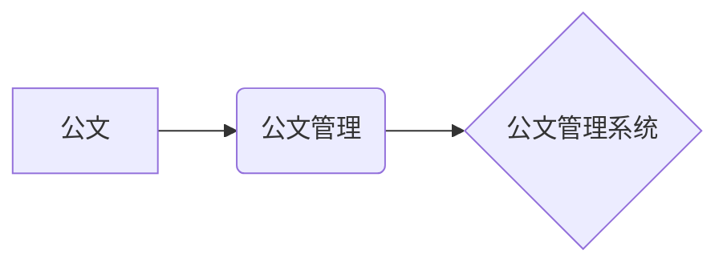

## 1. 背景介绍

### 1.1. 网络办公系统的兴起与发展

随着信息技术的飞速发展，传统的办公模式已经难以满足现代企业高效、便捷的办公需求。网络办公系统应运而生，并迅速成为企业信息化建设的重要组成部分。网络办公系统，也称为OA系统，是指利用互联网技术，实现企业内部信息共享、协同办公、流程审批等功能的软件系统。

早期的网络办公系统主要以电子邮件、文件共享等功能为主，随着技术的进步，现代网络办公系统集成了更多功能，如即时通讯、视频会议、项目管理、客户关系管理等，极大地提升了企业的办公效率和管理水平。

### 1.2. 公文管理系统的重要性

公文管理系统是网络办公系统的重要组成部分，其主要功能是对企业内部的公文进行电子化管理，包括公文的起草、审批、签发、归档等环节。公文管理系统能够有效提高公文处理效率，规范公文管理流程，保障公文安全，是企业信息化建设不可或缺的一部分。

### 1.3. 本文的写作目的

本文旨在介绍网络办公系统中公文管理系统的详细设计与具体代码实现，帮助读者了解公文管理系统的架构、功能、实现原理以及代码细节，为企业信息化建设提供参考和借鉴。

## 2. 核心概念与联系

### 2.1. 公文

公文是指党政机关、社会团体、企事业单位在处理公务活动中形成和使用的具有法定效力和规范体式的文书。公文是传达贯彻党和国家的方针政策，指导和规范工作，请示和答复问题，报告工作情况，交流经验的重要工具。

### 2.2. 公文管理

公文管理是指对公文的收集、整理、分类、存储、检索、利用等一系列活动的总称。公文管理的目的是为了规范公文处理流程，提高公文处理效率，保障公文安全，促进公文信息资源的共享和利用。

### 2.3. 公文管理系统

公文管理系统是指利用计算机技术，实现公文电子化管理的软件系统。公文管理系统通常包括以下功能模块：

* 公文起草
* 公文审批
* 公文签发
* 公文归档
* 公文检索
* 公文统计

### 2.4. 关系图



## 3. 核心算法原理具体操作步骤

### 3.1. 公文流转流程

公文管理系统的核心是公文流转流程，其基本步骤如下：

1. **公文起草**: 由相关人员起草公文，填写公文相关信息，如标题、内容、附件等。
2. **公文审批**: 将起草好的公文提交给相关领导进行审批，审批人可以对公文内容进行修改或提出意见。
3. **公文签发**: 审批通过后，由相关领导签发公文，公文正式生效。
4. **公文分发**: 将签发后的公文分发给相关人员或部门。
5. **公文办理**: 相关人员或部门根据公文内容进行办理。
6. **公文归档**: 将办理完毕的公文进行归档保存。

### 3.2. 权限控制

公文管理系统需要进行严格的权限控制，确保只有授权用户才能访问和操作相关公文。权限控制通常基于角色进行管理，不同角色的用户拥有不同的操作权限。

### 3.3. 安全保障

公文管理系统需要保障公文的安全，防止公文泄露、篡改、丢失等安全事件发生。安全保障措施包括：

* 数据加密
* 访问控制
* 审计日志
* 备份恢复

## 4. 数学模型和公式详细讲解举例说明

公文管理系统中不涉及复杂的数学模型和公式，主要采用数据库技术进行数据管理。

### 4.1. 数据库设计

公文管理系统的数据库设计需要考虑公文的结构化存储、公文流转流程、权限控制等因素。

**表结构示例:**

| 表名 | 字段 | 数据类型 | 说明 |
|---|---|---|---|
| 公文 | id | int | 公文ID |
| | 标题 | varchar | 公文标题 |
| | 内容 | text | 公文内容 |
| | 创建人 | int | 公文创建人ID |
| | 创建时间 | datetime | 公文创建时间 |
| | 状态 | int | 公文状态 |
| 审批记录 | id | int | 审批记录ID |
| | 公文ID | int | 公文ID |
| | 审批人 | int | 审批人ID |
| | 审批意见 | text | 审批意见 |
| | 审批时间 | datetime | 审批时间 |

### 4.2. 数据库操作

公文管理系统通过SQL语句对数据库进行操作，实现公文的增删改查等功能。

**SQL语句示例:**

* 插入公文: `INSERT INTO 公文 (标题, 内容, 创建人, 创建时间, 状态) VALUES ('标题', '内容', 1, NOW(), 1)`
* 查询公文: `SELECT * FROM 公文 WHERE 状态 = 1`
* 更新公文: `UPDATE 公文 SET 状态 = 2 WHERE id = 1`
* 删除公文: `DELETE FROM 公文 WHERE id = 1`

## 5. 项目实践：代码实例和详细解释说明

### 5.1. 技术选型

* 开发语言: Java
* Web框架: Spring Boot
* 数据库: MySQL
* 前端框架: Vue.js

### 5.2. 代码示例

**公文实体类:**

```java
public class Document {
    private Long id;
    private String title;
    private String content;
    private User creator;
    private Date createTime;
    private Integer status;

    // getters and setters
}
```

**公文服务接口:**

```java
public interface DocumentService {
    Document createDocument(Document document);
    Document getDocumentById(Long id);
    List<Document> getDocumentsByStatus(Integer status);
    void updateDocument(Document document);
    void deleteDocument(Long id);
}
```

**公文服务实现类:**

```java
@Service
public class DocumentServiceImpl implements DocumentService {

    @Autowired
    private DocumentRepository documentRepository;

    @Override
    public Document createDocument(Document document) {
        return documentRepository.save(document);
    }

    @Override
    public Document getDocumentById(Long id) {
        return documentRepository.findById(id).orElse(null);
    }

    @Override
    public List<Document> getDocumentsByStatus(Integer status) {
        return documentRepository.findByStatus(status);
    }

    @Override
    public void updateDocument(Document document) {
        documentRepository.save(document);
    }

    @Override
    public void deleteDocument(Long id) {
        documentRepository.deleteById(id);
    }
}
```

### 5.3. 代码解释

* `Document` 实体类定义了公文的属性，包括标题、内容、创建人、创建时间、状态等。
* `DocumentService` 接口定义了公文相关的服务，包括创建、查询、更新、删除等。
* `DocumentServiceImpl` 类实现了 `DocumentService` 接口，使用 Spring Data JPA 操作数据库。

## 6. 实际应用场景

### 6.1. 企业内部公文管理

公文管理系统可以用于企业内部的公文管理，实现公文的电子化流转、审批、签发、归档等功能，提高公文处理效率，规范公文管理流程。

### 6.2. 政府机关公文管理

公文管理系统可以用于政府机关的公文管理，实现公文的在线起草、审批、签发、发布等功能，提高政府机关的办公效率和透明度。

### 6.3. 教育机构公文管理

公文管理系统可以用于教育机构的公文管理，实现学校内部的公文流转、审批、签发、归档等功能，提高学校的管理效率和信息化水平。

## 7. 工具和资源推荐

### 7.1. Spring Boot

Spring Boot 是一个用于创建独立的、基于 Spring 的生产级应用程序的框架，可以快速构建 Web 应用程序。

### 7.2. MySQL

MySQL 是一个开源的关系型数据库管理系统，被广泛应用于 Web 应用程序开发。

### 7.3. Vue.js

Vue.js 是一个渐进式 JavaScript 框架，用于构建用户界面，可以快速构建交互式 Web 应用程序。

## 8. 总结：未来发展趋势与挑战

### 8.1. 未来发展趋势

* **云化**: 公文管理系统将逐步迁移到云平台，利用云计算的优势，提高系统的可扩展性和可靠性。
* **智能化**: 公文管理系统将集成人工智能技术，实现公文的自动分类、审批、归档等功能，进一步提高公文处理效率。
* **移动化**: 公文管理系统将支持移动设备访问，方便用户随时随地处理公文。

### 8.2. 面临的挑战

* **安全性**: 公文管理系统需要保障公文的安全，防止数据泄露、篡改、丢失等安全事件发生。
* **兼容性**: 公文管理系统需要兼容不同的操作系统、浏览器、移动设备，保证用户体验一致性。
* **用户体验**: 公文管理系统需要提供简洁易用的用户界面，方便用户快速上手和使用。

## 9. 附录：常见问题与解答

### 9.1. 如何保证公文的安全?

公文管理系统可以通过数据加密、访问控制、审计日志、备份恢复等措施保障公文的安全。

### 9.2. 如何提高公文处理效率?

公文管理系统可以通过优化公文流转流程、集成人工智能技术等措施提高公文处理效率。

### 9.3. 如何选择合适的公文管理系统?

选择公文管理系统需要考虑系统的功能、安全性、易用性、价格等因素，并结合企业自身的实际需求进行选择。 
