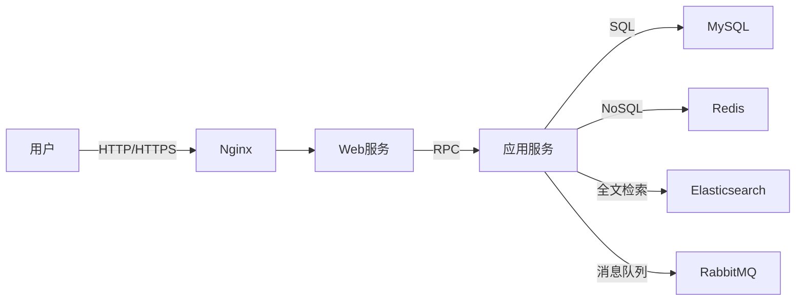

# BLOG网站建设系统详细设计与具体代码实现

作者：禅与计算机程序设计艺术

## 1. 背景介绍

### 1.1 BLOG网站的发展历史与现状

BLOG网站，全称为Web Log，最早出现于20世纪90年代末。最初的BLOG网站主要是个人日记性质，用于记录和分享个人生活、思考和见解。随着互联网技术的发展和普及，BLOG逐渐成为一种重要的信息传播和交流平台。

如今，BLOG网站已经广泛应用于个人、企业、媒体等各个领域。许多知名博主通过BLOG分享专业知识和经验，吸引了大量粉丝关注。企业也通过官方BLOG发布产品动态、行业洞察等，增强与客户的互动和品牌影响力。

### 1.2 BLOG网站建设的意义

对于个人而言，搭建BLOG网站可以:

1. 提升个人品牌影响力，展示专业能力
2. 记录和分享生活点滴，提高写作和表达能力  
3. 与志同道合的人交流互动，拓展人脉

对于企业和组织而言，BLOG网站的建设有助于:

1. 塑造品牌形象，增强用户信任
2. 发布权威信息，引导行业话语权
3. 提供优质内容，吸引潜在客户
4. 收集用户反馈，改进产品和服务

### 1.3 BLOG网站建设面临的挑战

尽管BLOG网站建设具有重要意义，但在实际开发过程中仍面临诸多挑战:

1. 功能需求复杂多样，难以全面满足
2. 用户体验要求高，界面设计和交互优化难度大
3. 海量数据存储和检索，对系统性能要求高
4. 安全性和可靠性保障，防止恶意攻击和数据丢失
5. 可扩展性和可维护性，适应未来业务变化和技术发展

因此，如何合理设计BLOG网站架构，选择恰当的技术方案，实现功能完善、性能高效、安全可靠的BLOG网站建设，是本文要重点探讨的问题。

## 2. 核心概念与联系

### 2.1 BLOG网站的核心功能

一个典型的BLOG网站通常包含以下核心功能:

1. 用户注册与登录
2. 博文撰写、发布和管理
3. 博文分类、标签和归档 
4. 评论互动与社交分享
5. 全文搜索和推荐
6. RSS订阅与邮件推送

这些功能模块之间相互关联，共同构成完整的BLOG网站。

### 2.2 BLOG网站的技术架构

为了实现上述核心功能，BLOG网站的技术架构通常采用经典的BS(Browser/Server)模式，即浏览器客户端和服务器端。

其中，前端页面由HTML、CSS、JavaScript等Web技术实现，提供用户界面和交互操作。后端服务器通过Java、Python、PHP等编程语言处理业务逻辑，并与数据库MySQL、MongoDB等进行数据存取。

同时，还会引入一些辅助技术和工具，如:

1. Nginx等Web服务器，提供反向代理和负载均衡
2. Redis等NoSQL数据库，用于缓存和提高查询性能
3. Elasticsearch等搜索引擎，实现全文检索
4. RabbitMQ等消息队列，进行异步通信和解耦
5. Docker等容器化技术，方便部署和运维

下图展示了一个典型的BLOG网站技术架构:



### 2.3 BLOG网站的开发流程

BLOG网站的开发通常遵循软件工程的一般流程，主要包括:

1. 需求分析：明确功能需求和非功能需求
2. 概要设计：确定系统架构和技术选型
3. 详细设计：进行数据库设计、接口设计和UI设计
4. 编码实现：完成前后端代码编写和单元测试
5. 集成测试：对系统功能和性能进行全面测试
6. 部署上线：搭建生产环境，发布上线
7. 运维优化：监控系统运行，持续改进和优化

需要注意的是，现代软件开发往往采用敏捷开发模式，强调快速迭代和增量交付。因此在实际BLOG网站建设过程中，以上各个阶段可能会交叉进行，并随时根据反馈调整需求和设计。

## 3. 核心算法原理具体操作步骤

BLOG网站建设涉及到诸多算法，下面重点介绍几个核心算法的原理和实现步骤。

### 3.1 基于用户协同过滤的博文推荐算法

协同过滤是一种常用的推荐算法，通过分析用户的历史行为，发现用户的兴趣偏好，从而给出个性化推荐。其基本原理是:

1. 收集用户行为数据，如浏览、点赞、评论、收藏等
2. 计算用户之间的相似度，常用的相似度计算方法有:
   - 欧氏距离
   - 皮尔逊相关系数
   - 余弦相似度
3. 找出与目标用户最相似的K个用户，称为"最近邻"
4. 将最近邻用户喜欢的博文推荐给目标用户

以下是该算法的具体操作步骤:

输入:
- 用户-博文行为矩阵 $M$，$M_{i,j}$表示用户$i$对博文$j$的偏好程度
- 目标用户$u$
- 最近邻用户数$K$ 

输出:
- 推荐博文列表$R$

步骤:
1. for each other user $v$
2.   计算$u$和$v$的相似度 $sim(u,v)$
3. 选出相似度最高的$K$个用户，作为最近邻用户集合$N$
4. for each blog $i$
5.   计算推荐度 $p(u,i) = \sum_{v \in N} sim(u,v) \cdot M_{v,i}$
6. 将推荐度最高的博文加入推荐列表$R$
7. return $R$

其中，相似度计算可以采用余弦相似度:

$$
sim(u,v) = \frac{\sum_{i=1}^n M_{u,i} \cdot M_{v,i}}{\sqrt{\sum_{i=1}^n M_{u,i}^2} \cdot \sqrt{\sum_{i=1}^n M_{v,i}^2}}
$$

### 3.2 基于TextRank的关键词提取算法

TextRank是一种用于文本关键词提取的算法，其思想源于谷歌的PageRank算法。TextRank通过构建词语之间的图模型，利用投票机制对词语重要性进行排序，得到关键词。

以下是TextRank的具体操作步骤:

输入:
- 待提取关键词的文本$T$
- 关键词数量$N$
- 阻尼系数$d$，一般取值0.85

输出:
- 关键词列表$K$

步骤:
1. 对文本进行分词和词性标注，得到候选关键词集合$V$
2. 构建候选关键词之间的无向有权图$G=(V,E)$
   - 节点$V$为候选关键词
   - 边$E$的权重$w_{ij}$为词$i$和词$j$的共现次数
3. 初始化各节点的TextRank值为1
4. while not 收敛
5.   for each node $i$
6.     $TR(i) = (1-d) + d \cdot \sum_{j \in In(i)} \frac{w_{ji}}{\sum_{k \in Out(j)} w_{jk}} TR(j)$
7. 对节点按TextRank值排序，取前$N$个作为关键词
8. return $K$

其中，$In(i)$和$Out(i)$分别表示指向节点$i$的节点集合和节点$i$指向的节点集合。

## 4. 数学模型和公式详细讲解举例说明

### 4.1 博文相似度的余弦相似度模型

在推荐算法中，我们采用了余弦相似度来衡量用户之间的相似程度。余弦相似度是一种常用的相似度度量方法，它通过计算两个向量之间的夹角余弦值来表示它们的相似程度。

假设有两个博文$d_1$和$d_2$，它们的TF-IDF特征向量分别为:

$$
d_1 = (w_{11}, w_{12}, \cdots, w_{1n}) \\
d_2 = (w_{21}, w_{22}, \cdots, w_{2n})
$$

其中，$w_{ij}$表示词$j$在博文$d_i$中的TF-IDF权重。

则$d_1$和$d_2$的余弦相似度为:

$$
sim(d_1, d_2) = \cos \theta = \frac{\sum_{i=1}^n w_{1i} \cdot w_{2i}}{\sqrt{\sum_{i=1}^n w_{1i}^2} \cdot \sqrt{\sum_{i=1}^n w_{2i}^2}}
$$

余弦相似度的取值范围为$[-1,1]$，值越大表示两个博文越相似。

举例说明:

假设博文$d_1$和$d_2$的特征向量分别为:

$$
d_1 = (0.5, 0.8, 0.2, 0.1) \\
d_2 = (0.6, 0.7, 0.3, 0.2)
$$

则它们的余弦相似度为:

$$
\begin{aligned}
sim(d_1, d_2) &= \frac{0.5 \times 0.6 + 0.8 \times 0.7 + 0.2 \times 0.3 + 0.1 \times 0.2}{\sqrt{0.5^2 + 0.8^2 + 0.2^2 + 0.1^2} \times \sqrt{0.6^2 + 0.7^2 + 0.3^2 + 0.2^2}} \\
              &= \frac{0.3 + 0.56 + 0.06 + 0.02}{\sqrt{0.25 + 0.64 + 0.04 + 0.01} \times \sqrt{0.36 + 0.49 + 0.09 + 0.04}} \\
              &= \frac{0.94}{0.97 \times 0.99} \\
              &= 0.98
\end{aligned}
$$

可见，这两个博文的余弦相似度非常高，说明它们在主题上比较接近。

### 4.2 博文热度的幂律分布模型

博文的热度分布通常服从幂律分布，即少数热门博文的访问量远大于大多数普通博文。幂律分布可以用如下公式表示:

$$
P(x) = Cx^{-\alpha}
$$

其中，$x$表示博文的访问量，$P(x)$表示访问量为$x$的博文出现的概率，$C$和$\alpha$为常数。

对上式两边取对数，得到:

$$
\log P(x) = \log C - \alpha \log x
$$

这说明，如果博文的访问量服从幂律分布，那么在双对数坐标下，$\log P(x)$和$\log x$呈现线性关系。

举例说明:

假设某BLOG网站的博文访问量数据如下:

| 访问量范围 | 博文数量 |
| --------- | -------- |
| 1-10      | 10000    |
| 10-100    | 1000     |
| 100-1000  | 100      |
| 1000-10000| 10       |

对上表数据进行双对数处理:

| $\log x$  | $\log P(x)$ |
| --------- | ----------- |
| 0         | -1          |
| 1         | -2          |
| 2         | -3          |
| 3         | -4          |

绘制散点图，可以发现$\log P(x)$和$\log x$近似呈线性关系，说明该网站的博文访问量服从幂律分布。

了解博文热度分布规律，对于制定推荐策略、优化系统性能都有重要意义。例如，可以对热门博文进行重点推荐和缓存，提高用户体验和系统效率。

## 5. 项目实践：代码实例和详细解释说明

下面以Java语言为例，给出BLOG网站建设的部分核心代码实现。

### 5.1 博文推荐服务

```java
@Service
public class BlogRecommendServiceImpl implements BlogRecommendService {

    @Autowired
    