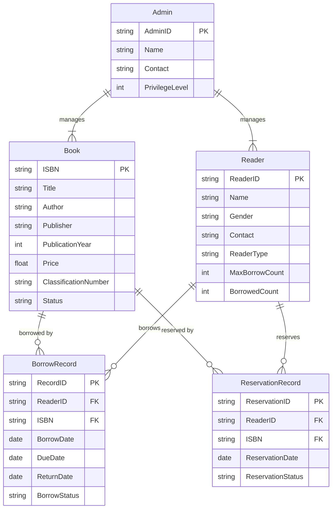

# 图书借阅管理系统详细设计与具体代码实现

作者：禅与计算机程序设计艺术

## 1. 背景介绍
### 1.1 图书借阅管理系统的重要性
在现代图书馆管理中,高效的图书借阅管理系统是必不可少的。它可以帮助图书馆员更好地管理图书资源,提高工作效率,为读者提供更优质的服务。一个设计良好的图书借阅管理系统不仅可以简化借阅流程,还能提供丰富的统计和分析功能,为图书馆的决策提供数据支持。

### 1.2 系统开发的目标和意义
开发图书借阅管理系统的主要目标是:
1. 实现图书借阅、归还、查询等基本功能
2. 提供友好的用户界面,方便读者和管理员操作
3. 支持多用户并发访问,保证系统的稳定性和可靠性
4. 生成各类统计报表,为图书馆管理决策提供数据支持

通过开发一个高质量的图书借阅管理系统,我们可以:
- 提高图书馆的管理效率和服务质量
- 减少人工操作的错误率
- 加强图书资源的管控和利用率
- 为读者提供更便捷的借阅体验

### 1.3 系统的应用场景和用户群体
图书借阅管理系统主要应用于各类图书馆,包括:
- 高校图书馆
- 公共图书馆
- 专业图书馆(如法律图书馆、医学图书馆等)

系统的主要用户群体包括:
- 图书馆管理员:负责系统的日常维护和管理
- 图书馆工作人员:负责图书的录入、上架、借阅、归还等业务操作
- 读者:通过系统查询、借阅、预约图书

## 2. 核心概念与关联
### 2.1 图书 Book
图书是系统的核心实体之一,包含以下主要属性:
- 书号 ISBN
- 书名 Title
- 作者 Author
- 出版社 Publisher
- 出版年份 PublicationYear
- 价格 Price
- 分类号 ClassificationNumber
- 状态 Status(在馆、借出、遗失、损坏等)

### 2.2 读者 Reader
读者是借阅图书的主体,包含以下主要属性:
- 读者编号 ReaderID
- 姓名 Name 
- 性别 Gender
- 联系方式 Contact
- 身份类型 ReaderType(学生、教师、社会人士等)
- 可借数量 MaxBorrowCount
- 已借数量 BorrowedCount

### 2.3 借阅记录 BorrowRecord
借阅记录表示一次具体的借阅行为,包含以下主要属性:
- 记录编号 RecordID
- 读者编号 ReaderID
- 书号 ISBN
- 借阅日期 BorrowDate
- 应还日期 DueDate
- 实际归还日期 ReturnDate
- 借阅状态 BorrowStatus(在借、已还、逾期等)

### 2.4 预约记录 ReservationRecord
预约记录表示读者对某本书的预约请求,包含以下主要属性:
- 预约编号 ReservationID 
- 读者编号 ReaderID
- 书号 ISBN
- 预约日期 ReservationDate
- 预约状态 ReservationStatus(等待、已满足、已取消等)

### 2.5 管理员 Admin
管理员负责系统的管理和维护工作,包含以下主要属性:
- 管理员编号 AdminID
- 姓名 Name
- 联系方式 Contact
- 权限级别 PrivilegeLevel

### 2.6 实体关系图
下面是图书借阅管理系统的简要实体关系图(ER图):

## 3. 核心算法原理与具体操作步骤
### 3.1 图书查询算法
#### 3.1.1 顺序查找
顺序查找是最简单的查找算法,适用于小规模数据集。其基本思想是:从头到尾逐个比较,直到找到目标元素或搜索完整个集合。

具体步骤如下:
1. 从数组的第一个元素开始,逐个比较每个元素与目标值
2. 如果当前元素等于目标值,则查找成功,返回该元素的下标
3. 如果遍历完整个数组还没有找到目标值,则查找失败,返回-1

顺序查找的时间复杂度为O(n),空间复杂度为O(1)。

#### 3.1.2 二分查找
二分查找(Binary Search)是一种高效的查找算法,适用于有序数组。其基本思想是:将数组一分为二,判断目标值在左半部分还是右半部分,然后在相应的半部分继续查找,直到找到目标值或确定其不存在。

具体步骤如下:
1. 确定数组的中间位置 mid
2. 将目标值 target 与 arr[mid] 进行比较
   - 如果 target == arr[mid],则查找成功,返回 mid
   - 如果 target < arr[mid],则在左半部分继续查找
   - 如果 target > arr[mid],则在右半部分继续查找
3. 重复步骤1-2,直到找到目标值或搜索区间为空

二分查找的时间复杂度为O(log n),空间复杂度为O(1)。

#### 3.1.3 索引查找
索引查找是一种通过预先建立索引来加速查找的方法。其基本思想是:将关键字与对应的记录位置建立一个索引表,查找时先在索引表中定位关键字,然后根据索引表中记录的位置直接访问目标记录。

常见的索引结构有:
- 哈希索引:通过哈希函数将关键字映射到数组下标,支持O(1)时间的查找,但不支持范围查询
- B+树索引:一种多叉平衡搜索树,支持O(log n)时间的查找和范围查询,广泛应用于数据库系统

### 3.2 借阅算法
借阅算法描述了读者借阅图书的基本流程,主要包括以下步骤:
1. 读者提交借阅请求,指定要借阅的图书
2. 系统检查读者的身份和借阅权限
3. 系统检查图书的状态是否可借
   - 如果图书已借出,则将该请求加入预约队列
   - 如果图书在馆,则继续下一步
4. 系统创建借阅记录,更新图书和读者的相关信息
   - 图书的状态改为"借出"
   - 读者的已借数量加1
5. 系统生成借阅凭证,通知读者借阅成功

### 3.3 归还算法
归还算法描述了读者归还图书的基本流程,主要包括以下步骤:
1. 读者提交归还请求,提交借阅凭证或图书
2. 系统根据借阅记录查找对应的图书和读者信息
3. 系统检查归还是否逾期
   - 如果逾期,则计算逾期金额并通知读者
4. 系统更新借阅记录,将归还日期设置为当前日期
5. 系统更新图书和读者的相关信息
   - 图书的状态改为"在馆"
   - 读者的已借数量减1
6. 系统检查该图书是否有未满足的预约请求
   - 如果有,则满足第一个预约请求,生成借阅记录并通知预约读者
7. 系统生成归还凭证,通知读者归还成功

### 3.4 预约算法
预约算法描述了读者预约图书的基本流程,主要包括以下步骤:
1. 读者提交预约请求,指定要预约的图书
2. 系统检查读者的身份和预约权限
3. 系统检查图书的状态
   - 如果图书在馆,则直接满足预约请求,生成借阅记录并通知读者
   - 如果图书已借出,则将预约请求加入预约队列
4. 系统生成预约记录,更新图书和读者的相关信息
5. 系统通知读者预约成功,告知预约状态

当借阅的图书归还时,系统会自动检查预约队列,满足第一个预约请求。

## 4. 数学模型与公式详解
### 4.1 逾期罚金计算模型
假设逾期罚金按照以下公式计算:

$$ Fine = OverdueDays \times BaseRate \times RateCoefficient $$

其中:
- $Fine$: 逾期罚金
- $OverdueDays$: 逾期天数
- $BaseRate$: 基础日费率
- $RateCoefficient$: 费率系数,与读者类型和图书类型相关

例如,假设学生借阅普通图书的基础日费率为0.5元,教师为1元,逾期10天的罚金计算如下:

- 学生: $Fine = 10 \times 0.5 \times 1 = 5$ 元
- 教师: $Fine = 10 \times 1 \times 1 = 10$ 元

如果图书是珍本或特藏,则费率系数可能会提高,如1.5倍或2倍。

### 4.2 图书相关度计算模型
为了给读者推荐相关图书,可以计算图书之间的相关度。一种简单的相关度计算公式如下:

$$ Similarity(A, B) = \frac{|A \cap B|}{|A \cup B|} $$

其中:
- $A$, $B$: 两本图书的特征集合,如关键词、作者、分类号等
- $|A \cap B|$: A和B的交集大小,即共同特征的数量
- $|A \cup B|$: A和B的并集大小,即所有特征的数量

例如,假设图书A和B的特征如下:

- A: {数据结构, 算法, C++, 谭浩强}
- B: {数据结构, 算法, Java, 严蔚敏}

则它们的相关度为:

$$ Similarity(A, B) = \frac{|\{数据结构, 算法\}|}{|\{数据结构, 算法, C++, 谭浩强, Java, 严蔚敏\}|} = \frac{2}{6} \approx 0.33 $$

可以设置一个相关度阈值,如0.5,当图书的相关度超过该阈值时,就可以推荐给读者。

### 4.3 图书借阅排行榜模型
为了统计一段时间内图书的借阅情况,可以生成借阅排行榜。假设要统计某个月的借阅排行,可以按照以下步骤进行:
1. 查询该月的所有借阅记录,得到每本书的借阅次数
2. 按照借阅次数从高到低排序,生成排行榜
3. 计算每本书的借阅次数占总借阅次数的百分比

假设某月共借阅了1000次,前三名的图书及其借阅次数如下:

| 排名 | 图书名称 | 借阅次数 | 百分比 |
| ---- | -------- | -------- | ------ |
| 1    | A        | 100      | 10%    |
| 2    | B        | 80       | 8%     |
| 3    | C        | 50       | 5%     |

则这三本书的借阅百分比可以按照以下公式计算:

$$ Percentage_i = \frac{BorrowCount_i}{TotalBorrowCount} \times 100\% $$

其中:
- $Percentage_i$: 第i本书的借阅百分比
- $BorrowCount_i$: 第i本书的借阅次数
- $TotalBorrowCount$: 总借阅次数

## 5. 项目实践:代码实例与