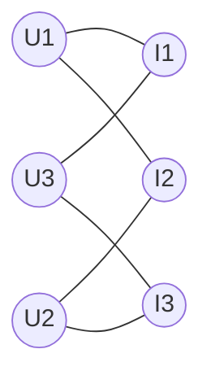

# 基于推荐算法的商品流行性预测算法研究

作者：禅与计算机程序设计艺术

## 1. 背景介绍
### 1.1 商品流行性预测的重要性
在电子商务时代,准确预测商品的流行趋势对于商家制定营销策略、优化库存管理至关重要。商品流行性预测可以帮助商家提前洞察消费者需求,抓住市场机遇。

### 1.2 推荐算法在商品流行性预测中的应用
推荐算法作为一种个性化的信息过滤技术,通过分析用户行为、商品属性等数据,可以预测用户的潜在兴趣。将推荐算法应用于商品流行性预测,可以挖掘出隐藏在海量数据中的流行趋势。

### 1.3 现有商品流行性预测方法的局限性
传统的商品流行性预测方法,如时间序列分析、回归分析等,难以有效处理海量、高维、稀疏的电商数据。这些方法忽略了用户行为数据中蕴含的关键信息,预测精度有限。

## 2. 核心概念与联系
### 2.1 商品流行性的定义与度量
商品流行性是指商品在特定时间段内受到消费者欢迎的程度。常用的流行性度量指标包括销量、搜索量、评论数等。流行性与商品自身属性、消费者偏好、外部环境等因素密切相关。

### 2.2 推荐算法的分类与原理
推荐算法主要分为三类:协同过滤(Collaborative Filtering)、基于内容(Content-based)和组合推荐(Hybrid Recommendation)。
- 协同过滤利用用户行为数据发现相似用户或商品,基于相似性进行推荐。
- 基于内容的推荐根据商品属性与用户偏好进行匹配。
- 组合推荐融合多种推荐技术,取长补短。

### 2.3 推荐算法与商品流行性预测的关系
推荐算法通过分析用户-商品交互数据,挖掘用户偏好和商品关联。将推荐结果中的热门商品作为流行趋势的先兆,再结合时间维度分析商品受欢迎程度的变化,即可实现商品流行性预测。

## 3. 核心算法原理与具体操作步骤
### 3.1 基于矩阵分解的协同过滤算法
#### 3.1.1 用户-商品评分矩阵的构建
收集用户对商品的显式评分数据,构建用户-商品评分矩阵$R$。矩阵中的元素$r_{ui}$表示用户$u$对商品$i$的评分。

#### 3.1.2 矩阵分解模型
利用矩阵分解技术,将评分矩阵$R$分解为两个低秩矩阵$P$和$Q$的乘积,如下所示:
$$R \approx P \times Q^T$$
其中,$P$矩阵表示用户对隐含特征的偏好,$Q$矩阵表示商品包含的隐含特征。$P$和$Q$可以通过优化目标函数求解得到。

#### 3.1.3 损失函数与优化求解
定义损失函数为:
$$\min_{P,Q} \sum_{u,i} (r_{ui} - p_u q_i^T)^2 + \lambda (||p_u||^2 + ||q_i||^2)$$
其中,$(u,i)$为已知的用户-商品评分,$p_u$和$q_i$分别是矩阵$P$和$Q$的行向量,$\lambda$为正则化系数。
采用随机梯度下降等优化算法求解损失函数,得到$P$和$Q$。

#### 3.1.4 流行性商品的识别
利用分解得到的矩阵$P$和$Q$,对缺失的评分进行预测:
$$\hat{r}_{ui} = p_u q_i^T$$
根据预测评分对商品进行排序,评分高的商品即为潜在的流行商品。

### 3.2 基于图嵌入的推荐算法
#### 3.2.1 构建用户-商品二部图
根据用户行为数据构建用户-商品二部图$G=(U, I, E)$,其中$U$为用户集合,$I$为商品集合,$E$为用户-商品交互边集合。

#### 3.2.2 图嵌入表示学习
使用图嵌入技术学习用户节点和商品节点的低维向量表示。以DeepWalk算法为例,通过随机游走生成节点序列,再使用Skip-gram模型学习节点嵌入表示。
优化目标函数:
$$\max \sum_{v \in V} \log Pr(N_S(v)|f(v))$$
其中$V$为节点集合,$N_S(v)$为节点$v$的邻居节点,$f(v)$为节点$v$的嵌入向量。

#### 3.2.3 相似度计算与流行商品推荐
利用学习得到的节点嵌入向量,计算用户节点与商品节点的相似度,如余弦相似度:
$$sim(u,i) = \frac{f(u) \cdot f(i)}{||f(u)|| \cdot ||f(i)||}$$
对每个用户,根据相似度给商品节点排序,推荐排名靠前的商品。将频繁出现在推荐结果中的商品视为流行商品。

## 4. 数学模型和公式详细讲解举例说明
### 4.1 矩阵分解模型
矩阵分解是协同过滤算法的核心,其基本思想是将高维稀疏的用户-商品评分矩阵分解为低维稠密的用户隐语义矩阵和商品隐语义矩阵。通过这两个矩阵的乘积来近似原始评分矩阵,同时也可以预测用户对未评分商品的评分。

以下是一个具体的例子:
假设有3个用户和4个商品,原始评分矩阵$R$如下:
$$R=\begin{bmatrix}
5 & 3 & 0 & 1\\
4 & 0 & 0 & 1\\ 
1 & 1 & 0 & 5
\end{bmatrix}$$
其中,0表示用户未对商品评分。假设隐语义矩阵的维度为2,则用户隐语义矩阵$P$和商品隐语义矩阵$Q$分别为:
$$P=\begin{bmatrix}
p_{11} & p_{12}\\
p_{21} & p_{22}\\
p_{31} & p_{32}
\end{bmatrix},
Q=\begin{bmatrix}
q_{11} & q_{12}\\  
q_{21} & q_{22}\\
q_{31} & q_{32}\\
q_{41} & q_{42}
\end{bmatrix}$$
通过优化目标函数求解$P$和$Q$,使得$P \times Q^T$尽可能逼近原始评分矩阵$R$。假设求解结果为:
$$P=\begin{bmatrix}
1.5 & 1.2\\
1.3 & 0.2\\
0.8 & 1.6
\end{bmatrix},
Q=\begin{bmatrix}
2.0 & 0.1\\
0.3 & 1.4\\
0.1 & 0.7\\
1.2 & 1.8
\end{bmatrix}$$
则$P \times Q^T$的结果为:
$$P \times Q^T = \begin{bmatrix}
4.8 & 2.7 & 0.4 & 1.3\\
3.7 & 0.5 & 0.2 & 0.8\\
1.2 & 1.1 & 0.6 & 4.7
\end{bmatrix}$$
可以看出,分解后的矩阵与原始评分矩阵很接近,同时预测了用户对未评分商品的评分。根据预测评分对商品进行排序,评分高的商品更有可能成为流行商品。

### 4.2 图嵌入模型
图嵌入将图中的节点映射到低维向量空间,使得在原图中相似的节点在嵌入空间中的向量表示也相似。以DeepWalk算法为例,其核心是通过随机游走生成节点序列,再使用Skip-gram模型学习节点嵌入表示。

假设有如下用户-商品二部图:



通过随机游走生成节点序列,如`U1-I1-U3-I3-U2-I2-U1`。然后使用Skip-gram模型学习节点嵌入表示。Skip-gram模型的目标是最大化节点序列的概率:

$$\prod_{v \in V} \prod_{u \in N_S(v)} P(u|f(v))$$

其中$V$为节点集合,$N_S(v)$为节点$v$的邻居节点,$f(v)$为节点$v$的嵌入向量,$P(u|f(v))$为给定节点$v$生成邻居节点$u$的条件概率。

假设嵌入向量维度为2,学习得到的用户和商品嵌入向量如下:

$$
\begin{aligned}
f(U1) &= [0.2, 0.5] \\
f(U2) &= [0.1, 0.3] \\
f(U3) &= [0.4, 0.2] \\
f(I1) &= [0.3, 0.6] \\
f(I2) &= [0.1, 0.4] \\
f(I3) &= [0.5, 0.1]
\end{aligned}
$$

计算用户与商品的余弦相似度,例如用户$U1$与商品$I1$的相似度为:

$$sim(U1,I1) = \frac{f(U1) \cdot f(I1)}{||f(U1)|| \cdot ||f(I1)||} = \frac{0.2 \times 0.3 + 0.5 \times 0.6}{\sqrt{0.2^2 + 0.5^2} \times \sqrt{0.3^2 + 0.6^2}} \approx 0.97$$

对每个用户,根据相似度给商品排序,推荐相似度高的商品。将频繁出现在推荐结果中的商品视为流行商品。

## 5. 项目实践:代码实例与详细解释说明
下面以Python代码为例,演示基于矩阵分解的协同过滤算法的实现。

```python
import numpy as np

class MatrixFactorization:
    def __init__(self, R, K, alpha, beta, iterations):
        """
        :param R: 用户-商品评分矩阵
        :param K: 隐语义矩阵的维度
        :param alpha: 学习率
        :param beta: 正则化系数
        :param iterations: 迭代次数
        """
        self.R = R
        self.num_users, self.num_items = R.shape
        self.K = K
        self.alpha = alpha
        self.beta = beta
        self.iterations = iterations

    def train(self):
        # 初始化用户和商品隐语义矩阵
        self.P = np.random.normal(scale=1./self.K, size=(self.num_users, self.K))
        self.Q = np.random.normal(scale=1./self.K, size=(self.num_items, self.K))
        
        # 迭代训练
        for i in range(self.iterations):
            self.sgd()

    def sgd(self):
        # 随机梯度下降优化
        for u in range(self.num_users):
            for i in range(self.num_items):
                if self.R[u, i] > 0:
                    # 预测评分
                    r_ui_pred = np.dot(self.P[u, :], self.Q[i, :].T)
                    # 计算误差
                    e_ui = self.R[u, i] - r_ui_pred
                    
                    # 更新用户和商品隐语义矩阵
                    self.P[u, :] += self.alpha * (e_ui * self.Q[i, :] - self.beta * self.P[u, :])
                    self.Q[i, :] += self.alpha * (e_ui * self.P[u, :] - self.beta * self.Q[i, :])

    def predict(self, u, i):
        # 预测用户u对商品i的评分
        return np.dot(self.P[u, :], self.Q[i, :].T)

# 示例
R = np.array([
    [5, 3, 0, 1],
    [4, 0, 0, 1],
    [1, 1, 0, 5]
])

mf = MatrixFactorization(R, K=2, alpha=0.01, beta=0.01, iterations=1000)
mf.train()

print("用户隐语义矩阵P:")
print(mf.P)
print("商品隐语义矩阵Q:")
print(mf.Q)

print("预