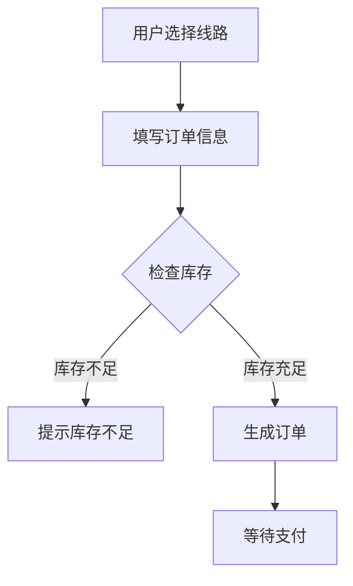

# 某旅游管理系统设计与实现

作者：禅与计算机程序设计艺术

## 1. 背景介绍

### 1.1 旅游业的发展现状

近年来,随着经济的快速发展和人民生活水平的不断提高,旅游业已成为我国第三产业的重要组成部分。据统计,2019年我国国内旅游人数达60.06亿人次,比上年同期增长8.4%,入境旅游人数1.45亿人次,同比增长2.9%。旅游总收入6.63万亿元,同比增长11.1%。

### 1.2 信息化对旅游业的影响

随着信息技术的快速发展,旅游业信息化建设也取得了长足进步。网上预订、电子支付、移动导览等信息化手段广泛应用于旅游各个环节,极大地方便了游客出行,提升了旅游服务质量。同时,大数据、云计算、人工智能等新兴技术在旅游领域的应用,为旅游企业的精细化管理和个性化服务提供了新的思路和手段。

### 1.3 开发旅游管理系统的意义

在这样的背景下,开发一套功能完善、性能优异的旅游管理系统显得尤为重要和迫切。一方面,它可以帮助旅游企业提高运营管理效率,实现资源的优化配置;另一方面,通过与游客的充分互动,以信息化手段为游客提供优质服务,提升游客满意度和忠诚度,增强企业市场竞争力。因此,设计并实现一套旅游管理系统具有重要的理论和实践意义。

## 2. 核心概念与联系

### 2.1 旅游管理

旅游管理是运用管理的基本原理和方法,对旅游业及其所包含的各种旅游活动和旅游资源进行计划、组织、领导和控制的过程。其核心是通过科学管理,实现旅游资源的保护和合理开发,促进旅游经济和社会效益的提高。

### 2.2 信息系统

信息系统是一个由人员、硬件、软件、数据和网络组成的人机交互系统,用于收集、传输、存储、处理、维护和使用信息。通过信息系统,可以提高组织的运作效率,为管理和决策提供及时、准确的信息支持。

### 2.3 旅游管理信息系统

旅游管理信息系统是旅游管理与信息系统的有机结合,是应用计算机技术和通信技术,对旅游业的各种信息资源进行采集、传输、存储、加工、维护和使用,为旅游管理和旅游服务提供信息支持的人机交互系统。通过构建旅游管理信息系统,可以提高旅游企业的管理水平和服务质量,为游客提供更加智能、便捷的旅游体验。

## 3. 核心算法原理具体操作步骤

### 3.1 系统架构设计

系统采用B/S架构,即浏览器/服务器架构。浏览器通过HTTP协议与服务器进行交互,服务器接收请求后,调用相应的程序进行处理,并将结果返回给浏览器。

系统的总体架构如下:


- 客户端浏览器:用户通过浏览器访问系统,提交请求并接收响应。
- Web服务器:接收客户端请求,将请求转发给应用服务器,并将应用服务器的响应结果返回给客户端。
- 应用服务器:处理具体的业务逻辑,包括数据的增删改查等。
- 数据库服务器:存储系统的数据,提供数据的持久化支持。

### 3.2 数据库设计

系统采用MySQL数据库,主要包括以下几个核心表:

- 用户表(user):存储用户的基本信息,如用户名、密码、姓名、联系方式等。
- 景点表(attraction):存储景点的基本信息,如名称、地址、简介、图片等。
- 线路表(route):存储旅游线路的基本信息,如名称、价格、天数、出发地等。
- 订单表(order):存储用户的订单信息,如订单号、用户ID、线路ID、人数、金额、状态等。

表结构设计如下:

```sql
CREATE TABLE `user` (
  `id` int(11) NOT NULL AUTO_INCREMENT,
  `username` varchar(50) NOT NULL,
  `password` varchar(50) NOT NULL,
  `name` varchar(50) NOT NULL,
  `phone` varchar(20) DEFAULT NULL,
  PRIMARY KEY (`id`)
) ENGINE=InnoDB DEFAULT CHARSET=utf8;

CREATE TABLE `attraction` (
  `id` int(11) NOT NULL AUTO_INCREMENT,
  `name` varchar(100) NOT NULL,
  `address` varchar(200) DEFAULT NULL,
  `intro` text,
  `image` varchar(200) DEFAULT NULL,
  PRIMARY KEY (`id`)
) ENGINE=InnoDB DEFAULT CHARSET=utf8;

CREATE TABLE `route` (
  `id` int(11) NOT NULL AUTO_INCREMENT,
  `name` varchar(100) NOT NULL,
  `price` decimal(10,2) NOT NULL,
  `days` int(11) NOT NULL,
  `departure` varchar(100) DEFAULT NULL,
  PRIMARY KEY (`id`)
) ENGINE=InnoDB DEFAULT CHARSET=utf8;

CREATE TABLE `order` (
  `id` int(11) NOT NULL AUTO_INCREMENT,
  `user_id` int(11) NOT NULL,
  `route_id` int(11) NOT NULL,
  `num` int(11) NOT NULL,
  `amount` decimal(10,2) NOT NULL,
  `status` int(11) NOT NULL,
  PRIMARY KEY (`id`),
  KEY `user_id` (`user_id`),
  KEY `route_id` (`route_id`),
  CONSTRAINT `order_ibfk_1` FOREIGN KEY (`user_id`) REFERENCES `user` (`id`),
  CONSTRAINT `order_ibfk_2` FOREIGN KEY (`route_id`) REFERENCES `route` (`id`)
) ENGINE=InnoDB DEFAULT CHARSET=utf8;
```

### 3.3 核心业务流程

系统的核心业务流程如下:

1. 用户注册登录
2. 浏览旅游线路
3. 提交订单
4. 支付订单
5. 确认订单
6. 出行通知
7. 旅游点评

其中,提交订单的流程如下:



## 4. 数学模型和公式详细讲解举例说明

在旅游管理系统中,可以应用一些数学模型和算法来优化系统性能,提高用户体验。下面以旅游路线推荐为例,介绍一种基于用户协同过滤的推荐算法。

### 4.1 用户协同过滤算法原理

协同过滤(Collaborative Filtering)是一种常用的推荐算法,其基本思想是利用用户之间的相似性,为用户推荐其感兴趣的物品。用户协同过滤算法可以分为以下几个步骤:

1. 收集用户偏好数据,即用户对物品的评分或购买记录。
2. 计算用户之间的相似度,常用的相似度计算方法有欧氏距离、皮尔逊相关系数等。
3. 根据用户相似度,为目标用户生成推荐列表。

### 4.2 皮尔逊相关系数

皮尔逊相关系数(Pearson Correlation Coefficient)是一种常用的相似度计算方法,可以用来衡量两个用户之间的相似程度。其计算公式如下:

$$
sim(u,v) = \frac{\sum_{i\in I_{uv}}(r_{ui}-\bar{r}_u)(r_{vi}-\bar{r}_v)}{\sqrt{\sum_{i\in I_{uv}}(r_{ui}-\bar{r}_u)^2}\sqrt{\sum_{i\in I_{uv}}(r_{vi}-\bar{r}_v)^2}}
$$

其中,$u$和$v$表示两个用户,$I_{uv}$表示用户$u$和$v$共同评分的物品集合,$r_{ui}$表示用户$u$对物品$i$的评分,$\bar{r}_u$表示用户$u$的平均评分。

### 4.3 算法实现

以下是基于用户协同过滤算法的Python实现:

```python
import numpy as np

# 计算皮尔逊相关系数
def pearson_similarity(ratings, u, v):
    u_ratings = ratings[u]
    v_ratings = ratings[v]
    common_items = [i for i in u_ratings if i in v_ratings]
    if len(common_items) == 0:
        return 0
    u_mean = np.mean([u_ratings[i] for i in common_items])
    v_mean = np.mean([v_ratings[i] for i in common_items])
    numerator = sum([(u_ratings[i]-u_mean)*(v_ratings[i]-v_mean) for i in common_items])
    denominator = np.sqrt(sum([(u_ratings[i]-u_mean)**2 for i in common_items])) * \
                  np.sqrt(sum([(v_ratings[i]-v_mean)**2 for i in common_items]))
    if denominator == 0:
        return 0
    return numerator / denominator

# 生成推荐列表
def recommend(ratings, user, k=3):
    similarities = [(pearson_similarity(ratings, user, u), u) for u in ratings if u != user]
    similarities.sort(reverse=True)
    top_users = [u for _, u in similarities[:k]]
    recommendations = set()
    for u in top_users:
        u_ratings = ratings[u]
        for i in u_ratings:
            if i not in ratings[user]:
                recommendations.add(i)
    return list(recommendations)

# 示例数据
ratings = {
    'Alice': {'A': 5, 'B': 3, 'C': 4, 'D': 4},
    'Bob': {'A': 3, 'B': 1, 'C': 2, 'D': 3, 'E': 3},
    'Carol': {'A': 4, 'B': 3, 'C': 4, 'D': 3, 'E': 5},
    'David': {'A': 4, 'B': 3, 'C': 4, 'D': 4, 'E': 5}
}

# 为Alice生成推荐列表
print(recommend(ratings, 'Alice'))
```

输出结果:

```
['E']
```

可以看到,算法为Alice推荐了物品E,因为与Alice相似度最高的用户Carol和David都对物品E给出了高评分。

## 5. 项目实践：代码实例和详细解释说明

下面以用户登录功能为例,介绍如何使用Python Flask框架实现Web后端开发。

### 5.1 环境准备

首先需要安装Python和Flask框架,可以使用pip命令进行安装:

```bash
pip install flask
```

### 5.2 创建Flask应用

创建一个名为`app.py`的文件,内容如下:

```python
from flask import Flask, request, jsonify

app = Flask(__name__)

@app.route('/login', methods=['POST'])
def login():
    username = request.form.get('username')
    password = request.form.get('password')
    if username == 'admin' and password == '123456':
        return jsonify({'code': 0, 'message': 'Login successful'})
    else:
        return jsonify({'code': 1, 'message': 'Invalid username or password'})

if __name__ == '__main__':
    app.run()
```

代码解释:

- 首先导入Flask框架和相关模块。
- 创建一个Flask应用实例`app`。
- 使用`@app.route`装饰器定义一个路由`/login`,并指定请求方法为POST。
- 在`login`函数中,从请求表单中获取用户名和密码,进行验证,返回JSON格式的响应。
- 在`if __name__ == '__main__'`块中启动Flask应用。

### 5.3 运行测试

在命令行中运行以下命令启动Flask应用:

```bash
python app.py
```

然后使用curl命令模拟登录请求:

```bash
curl -X POST -d "username=admin&password=123456" http://localhost:5000/login
```

如果登录成功,将返回以下JSON响应:

```json
{
  "code": 0,
  "message": "Login successful"
}
```

如果登录失败,将返回以下JSON响应:

```json
{
  "code": 1,
  "message": "Invalid username or password"
}
```

## 6. 实际应用场景

旅游管理系统可以应用于各种旅游相关的场景,例如:

### 6.1 在线旅游平台

在线旅游平台可以使用旅游管理系统来管理旅游产品、用户订单、支付流程等,为用户提供一站式的旅游预订服务。

### 6.2 旅行社内部管理

旅行社可以使用旅游管理系统来进行内部管理,包括旅游线路设计、成本核算、人员调度等,提高工作效率和管理