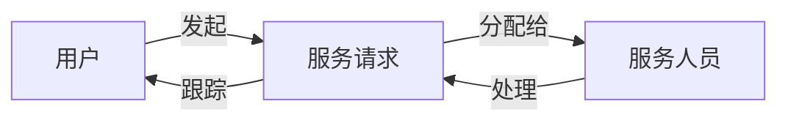

## 1.背景介绍

在当今的消费市场中，空调已经成为了每个家庭几乎都具备的电器产品之一。而空调的售后服务也因此成为了厂家和消费者关注的热点。优秀的售后服务不仅能提升消费者的购买体验，还能提升品牌的口碑，进一步推动产品的销售。因此，一个高效、准确、用户友好的空调售后服务系统至关重要。

为了实现这个目标，我们需要设计并实现一个空调售后服务系统。这个系统需要包含以下几个关键功能：故障报告、服务请求、维修人员派遣、服务跟踪、服务反馈等。在设计和实现这个系统时，我们除了要考虑到这些功能的实现，还需要考虑到系统的用户体验、系统的效率、以及系统的可维护性。

## 2.核心概念与联系

在空调售后服务系统中，我们需要理解以下几个核心概念：

- 用户：用户可以是消费者，也可以是服务人员。消费者可以通过系统报告故障、请求服务；服务人员则可以接收服务请求、进行服务。

- 服务请求：当消费者的空调出现问题时，他们可以通过系统发起服务请求。每个服务请求都会包含故障的详细信息，如故障类型、故障描述等。

- 服务人员：服务人员是处理服务请求的关键角色。他们需要根据服务请求的信息，对故障进行诊断并进行维修。

- 服务跟踪：为了让消费者能够了解服务请求的进度，系统需要提供服务跟踪功能。通过服务跟踪，消费者可以了解到他们的服务请求的当前状态。

这些核心概念之间的关系可以通过以下流程图进行描述：



## 3.核心算法原理具体操作步骤

设计空调售后服务系统的核心算法原理包含以下几个步骤：

1. 用户报告故障并发起服务请求：用户通过填写故障报告表单，提供故障的详细信息，并发起服务请求。

2. 系统接收服务请求：系统接收到用户的服务请求后，首先进行数据验证，然后存储服务请求的信息。

3. 系统分配服务人员：系统根据服务请求的信息，以及当前的服务人员的状况（如当前服务人员的工作负载、地理位置等），通过算法分配最合适的服务人员。

4. 服务人员处理服务请求：服务人员接收到服务请求后，根据服务请求的信息，进行故障诊断和维修。

5. 用户跟踪服务请求：用户可以通过系统查看他们的服务请求的当前状态，如服务请求是否已经被接收、服务人员是否已经被分配、服务是否已经完成等。

这个流程可以通过以下的伪代码进行描述：

```python
def handle_service_request(user, request):
    validate_request(request)
    store_request(request)
    serviceman = assign_serviceman(request)
    handle_request(serviceman, request)
    track_request(user, request)
```

## 4.数学模型和公式详细讲解举例说明

在系统中，我们需要一个算法来自动分配服务人员。为了实现这个功能，我们可以使用一个简单的数学模型。

假设我们有n个服务请求，m个服务人员。我们可以将这个问题看作是一个分配问题，目标是最小化所有服务请求的等待时间。我们可以使用以下的数学模型来描述这个问题：

定义$x_{ij}$为一个二进制变量，当服务请求i被分配给服务人员j时，$x_{ij}=1$，否则$x_{ij}=0$。

定义$w_i$为服务请求i的等待时间，$s_j$为服务人员j的服务时间。

我们的目标是最小化所有服务请求的等待时间，可以表示为：

$$
min \sum_{i=1}^{n} w_i
$$

约束条件为：

每个服务请求只能被分配给一个服务人员：

$$
\sum_{j=1}^{m} x_{ij} = 1, \quad i=1,2,...,n
$$

服务人员的服务时间不能超过他的工作时间：

$$
\sum_{i=1}^{n} x_{ij} * s_j \leq W, \quad j=1,2,...,m
$$

这个问题是一个典型的整数线性规划问题，可以使用如Gurobi, CPLEX等工具进行求解。

## 5.项目实践：代码实例和详细解释说明

以下是使用Python和Pulp库实现的一个简单示例：

```python
from pulp import *

# 服务请求和服务人员的数量
n_requests = 10
n_servicemen = 5

# 服务请求的等待时间和服务人员的服务时间
w = [random.randint(1, 10) for _ in range(n_requests)]
s = [random.randint(1, 10) for _ in range(n_servicemen)]

# 定义问题
prob = LpProblem("Service Request Assignment", LpMinimize)

# 定义变量
x = LpVariable.dicts("x", (range(n_requests), range(n_servicemen)), 0, 1, LpBinary)

# 目标函数
prob += lpSum([w[i]*x[i][j] for i in range(n_requests) for j in range(n_servicemen)])

# 约束条件
for i in range(n_requests):
    prob += lpSum([x[i][j] for j in range(n_servicemen)]) == 1

for j in range(n_servicemen):
    prob += lpSum([x[i][j]*s[j] for i in range(n_requests)]) <= W

# 求解问题
prob.solve()
```

## 6.实际应用场景

这个系统可以广泛应用于各种需要售后服务的行业，不仅仅是空调，还可以是其他家电，如电视、冰箱等，甚至可以扩展到汽车、电脑等更多的产品。通过这个系统，我们可以提升消费者的购买体验，提升品牌的口碑，进一步推动产品的销售。

## 7.工具和资源推荐

在设计和实现这个系统时，以下是一些可能会用到的工具和资源：

- Python：Python是一门强大的编程语言，有丰富的库和框架，可以用来实现系统的后端。

- Django或Flask：这两个都是Python的Web框架，可以用来实现系统的前端。

- Pulp：Pulp是一个Python的线性规划库，可以用来实现服务人员的自动分配。

- SQLite或MySQL：这两个都是数据库，可以用来存储服务请求的信息。

- Docker：Docker是一个容器平台，可以用来部署系统。

## 8.总结：未来发展趋势与挑战

随着科技的发展，售后服务系统面临着新的发展趋势和挑战。

从发展趋势来看，未来的售后服务系统将更加智能化。例如，可以通过AI和机器学习来预测故障，提前发出警报；可以通过大数据和分析来优化服务人员的分配，提升服务的效率。

从挑战来看，随着用户需求的多样化和复杂化，如何设计和实现一个既能满足用户需求，又能保持高效率的售后服务系统将是一个重要的挑战。此外，如何保护用户的隐私，如何处理用户的敏感数据，也是未来需要重点关注的问题。

## 9.附录：常见问题与解答

1. Q: 系统如何处理高峰期的服务请求？
   
   A: 系统可以通过算法自动调度服务人员，以确保服务请求在高峰期也能得到及时处理。如果服务人员的数量不足，可以考虑采用时间窗口的方法，将非紧急的服务请求延后处理。

2. Q: 系统如何保证服务的质量？
   
   A: 系统可以通过收集用户的反馈来持续改进。例如，可以让用户对服务人员的服务进行评价，然后根据评价结果对服务人员进行奖励或惩罚。

3. Q: 系统如何处理用户的隐私信息？
   
   A: 系统需要遵守相关的数据保护法规，对用户的隐私信息进行保护。例如，可以使用加密的方法来存储用户的敏感数据，只有经过授权的人员才能访问。

总的来说，设计和实现一个空调售后服务系统是一个复杂的过程，需要我们对各种技术和工具有深入的了解。但是，只要我们遵循正确的方法，我们就能够成功地完成这个任务。