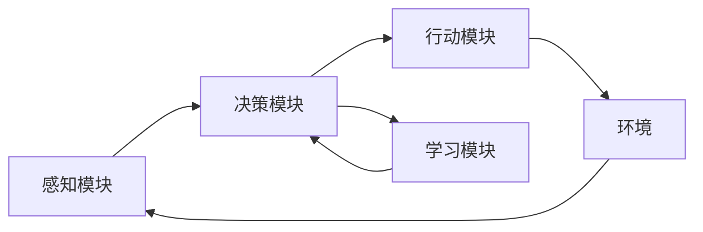

## 1. 背景介绍

### 1.1 人工智能的新浪潮：从感知到行动

近年来，人工智能（AI）取得了举世瞩目的成就，尤其是在感知领域，例如图像识别、语音识别和自然语言处理等。然而，当前的AI系统大多局限于被动地接收和处理信息，缺乏主动与环境交互、执行任务的能力。AI Agent 的出现，标志着人工智能正在迈向一个新的阶段：从感知到行动。

### 1.2 AI Agent：自主、智能、可学习的实体

AI Agent，也被称为智能体，是指能够感知环境、进行决策并采取行动以实现特定目标的自主实体。与传统的AI系统不同，AI Agent 具备以下关键特征：

* **自主性:**  AI Agent 能够自主地感知环境、做出决策并采取行动，无需人工干预。
* **智能性:** AI Agent 能够利用机器学习、深度学习等技术进行学习和推理，以优化其行为策略。
* **可学习性:** AI Agent 能够根据经验不断改进其行为策略，以更好地适应环境变化。

### 1.3 AI Agent 的应用前景

AI Agent 的出现为人工智能的应用开辟了广阔的空间，其潜在应用场景包括：

* **个性化推荐:**  根据用户的历史行为和偏好，为用户提供个性化的产品或服务推荐。
* **智能客服:**  利用自然语言处理技术，实现智能化的客户服务，例如自动回答问题、解决投诉等。
* **自动驾驶:**  通过感知周围环境、预测交通状况并做出驾驶决策，实现自动驾驶。
* **机器人控制:**  控制机器人在复杂环境中执行任务，例如搬运货物、巡逻等。

## 2. 核心概念与联系

### 2.1 Agent、环境和任务

AI Agent 的核心概念包括：

* **Agent:**  指能够感知环境、进行决策并采取行动的自主实体。
* **环境:**  指 Agent 所处的外部世界，包括物理环境和虚拟环境。
* **任务:**  指 Agent 需要完成的目标或任务。

Agent 与环境之间存在着持续的交互，Agent 通过感知环境获取信息，并根据环境的变化调整其行为策略。Agent 的目标是通过一系列行动来完成特定任务，并最大化其在环境中的收益。

### 2.2  Agent 的架构

AI Agent 的架构通常包括以下模块：

* **感知模块:**  负责感知环境信息，例如图像、声音、文本等。
* **决策模块:**  负责根据感知到的信息进行决策，选择最佳行动方案。
* **行动模块:**  负责执行决策模块选择的行动方案，与环境进行交互。
* **学习模块:**  负责根据经验不断改进 Agent 的行为策略。



### 2.3 强化学习：AI Agent 的核心算法

强化学习 (Reinforcement Learning, RL) 是一种机器学习范式，其目标是让 Agent 通过与环境交互学习最佳行为策略。在强化学习中，Agent 通过试错的方式学习，根据环境的反馈信号 (奖励或惩罚) 不断调整其行为策略，以最大化累积奖励。

## 3. 核心算法原理具体操作步骤

### 3.1 强化学习的基本原理

强化学习的基本原理可以概括为以下几个步骤：

1. **Agent 观察环境状态。**
2. **Agent 选择一个行动。**
3. **环境对 Agent 的行动做出反应，并返回一个奖励信号。**
4. **Agent 根据奖励信号更新其行为策略。**

### 3.2  强化学习算法的分类

强化学习算法可以分为以下几类：

* **基于值函数的方法:**  例如 Q-learning、SARSA 等。
* **基于策略梯度的方法:**  例如 REINFORCE、Actor-Critic 等。
* **基于模型的方法:**  例如 Dyna-Q 等。

### 3.3 Q-learning 算法的具体操作步骤

以 Q-learning 算法为例，其具体操作步骤如下：

1. **初始化 Q 值表:**  为所有状态-行动对初始化一个 Q 值。
2. **重复以下步骤，直到收敛:**
    * 观察当前状态 $s$。
    * 选择一个行动 $a$ (例如，使用 $\epsilon$-greedy 策略)。
    * 执行行动 $a$，并观察下一个状态 $s'$ 和奖励 $r$。
    * 更新 Q 值表：
    $$Q(s, a) \leftarrow Q(s, a) + \alpha [r + \gamma \max_{a'} Q(s', a') - Q(s, a)]$$
    其中，$\alpha$ 是学习率，$\gamma$ 是折扣因子。

## 4. 数学模型和公式详细讲解举例说明

### 4.1 马尔可夫决策过程 (MDP)

马尔可夫决策过程 (Markov Decision Process, MDP) 是强化学习的数学基础，它描述了 Agent 与环境交互的过程。一个 MDP 通常由以下元素组成：

* **状态空间:**  表示 Agent 可能处于的所有状态的集合。
* **行动空间:**  表示 Agent 可能采取的所有行动的集合。
* **状态转移函数:**  表示 Agent 在状态 $s$ 采取行动 $a$ 后转移到状态 $s'$ 的概率。
* **奖励函数:**  表示 Agent 在状态 $s$ 采取行动 $a$ 后获得的奖励。

### 4.2  Bellman 方程

Bellman 方程是强化学习中的一个重要公式，它描述了状态值函数和行动值函数之间的关系。状态值函数 $V(s)$ 表示 Agent 在状态 $s$ 下的期望累积奖励，行动值函数 $Q(s, a)$ 表示 Agent 在状态 $s$ 下采取行动 $a$ 的期望累积奖励。Bellman 方程可以表示为：

$$V(s) = \max_{a} Q(s, a)$$

### 4.3  Q-learning 算法的数学模型

Q-learning 算法的数学模型可以表示为：

$$Q(s, a) \leftarrow Q(s, a) + \alpha [r + \gamma \max_{a'} Q(s', a') - Q(s, a)]$$

其中：

* $Q(s, a)$ 是状态-行动对 $(s, a)$ 的 Q 值。
* $\alpha$ 是学习率，控制 Q 值更新的速度。
* $r$ 是 Agent 在状态 $s$ 采取行动 $a$ 后获得的奖励。
* $\gamma$ 是折扣因子，控制未来奖励对当前 Q 值的影响。
* $s'$ 是 Agent 在状态 $s$ 采取行动 $a$ 后转移到的下一个状态。
* $a'$ 是 Agent 在状态 $s'$ 下可能采取的所有行动。

## 5. 项目实践：代码实例和详细解释说明

### 5.1  OpenAI Gym 环境

OpenAI Gym 是一个用于开发和比较强化学习算法的工具包，它提供了一系列模拟环境，例如 CartPole、MountainCar、Acrobot 等。

### 5.2  Q-learning 算法的 Python 实现

以下是一个使用 Q-learning 算法解决 CartPole 问题的 Python 代码示例：

```python
import gym
import numpy as np

# 创建 CartPole 环境
env = gym.make('CartPole-v1')

# 初始化 Q 值表
state_size = env.observation_space.shape[0]
action_size = env.action_space.n
q_table = np.zeros([state_size, action_size])

# 设置超参数
learning_rate = 0.1
discount_factor = 0.99
exploration_rate = 0.1
num_episodes = 1000

# 训练 Agent
for episode in range(num_episodes):
    # 初始化环境
    state = env.reset()

    # 重置总奖励
    total_reward = 0

    # 循环直到游戏结束
    while True:
        # 选择行动
        if np.random.uniform(0, 1) < exploration_rate:
            action = env.action_space.sample()
        else:
            action = np.argmax(q_table[state, :])

        # 执行行动
        next_state, reward, done, info = env.step(action)

        # 更新 Q 值表
        q_table[state, action] = q_table[state, action] + learning_rate * (
            reward + discount_factor * np.max(q_table[next_state, :]) - q_table[state, action]
        )

        # 更新总奖励
        total_reward += reward

        # 更新状态
        state = next_state

        # 如果游戏结束，则退出循环
        if done:
            break

    # 打印 episode 的总奖励
    print(f'Episode {episode + 1}: Total Reward = {total_reward}')

# 关闭环境
env.close()
```

## 6. 实际应用场景

### 6.1  游戏 AI

AI Agent 在游戏领域有着广泛的应用，例如：

* **游戏角色控制:**  控制游戏角色的行为，例如移动、攻击、防御等。
* **游戏关卡设计:**  根据玩家的行为动态调整游戏关卡的难度。
* **游戏 NPC 行为:**  控制非玩家角色的行为，使其更加智能和逼真。

### 6.2  金融交易

AI Agent 可以用于自动化金融交易，例如：

* **股票交易:**  根据市场数据预测股票价格走势，并进行自动交易。
* **外汇交易:**  根据汇率波动进行自动交易。
* **期货交易:**  根据期货价格波动进行自动交易。

### 6.3  智能家居

AI Agent 可以用于控制智能家居设备，例如：

* **智能照明:**  根据环境光线自动调节灯光亮度。
* **智能温控:**  根据室内温度自动调节空调温度。
* **智能安防:**  通过监控摄像头和传感器检测异常情况，并自动报警。

## 7. 工具和资源推荐

### 7.1  强化学习框架

* **TensorFlow Agents:**  Google 开源的强化学习框架，支持多种强化学习算法和环境。
* **Stable Baselines3:**  基于 PyTorch 的强化学习框架，提供了稳定的算法实现和易于使用的 API。
* **Dopamine:**  Google 开源的强化学习框架，专注于研究和实验。

### 7.2  强化学习资源

* **OpenAI Gym:**  用于开发和比较强化学习算法的工具包。
* **Sutton & Barto 的《强化学习导论》:**  强化学习领域的经典教材。
* **DeepMind 的强化学习课程:**  由 DeepMind 提供的免费在线课程。

## 8. 总结：未来发展趋势与挑战

### 8.1  AI Agent 的未来发展趋势

* **更加自主和智能:**  未来的 AI Agent 将更加自主和智能，能够在更复杂的环境中执行更复杂的任务。
* **更强的泛化能力:**  未来的 AI Agent 将具备更强的泛化能力，能够适应不同的环境和任务。
* **更人性化的交互:**  未来的 AI Agent 将能够与人类进行更自然、更人性化的交互。

### 8.2  AI Agent 面临的挑战

* **安全性:**  如何确保 AI Agent 的行为安全可靠，避免对人类造成伤害。
* **可解释性:**  如何解释 AI Agent 的决策过程，使其更加透明和可信。
* **伦理问题:**  如何解决 AI Agent 带来的伦理问题，例如隐私、歧视等。

## 9. 附录：常见问题与解答

### 9.1  什么是 AI Agent？

AI Agent，也被称为智能体，是指能够感知环境、进行决策并采取行动以实现特定目标的自主实体。

### 9.2  AI Agent 与传统 AI 系统有何区别？

与传统的 AI 系统不同，AI Agent 具备自主性、智能性和可学习性。

### 9.3  强化学习是什么？

强化学习 (Reinforcement Learning, RL) 是一种机器学习范式，其目标是让 Agent 通过与环境交互学习最佳行为策略。

### 9.4  AI Agent 的应用场景有哪些？

AI Agent 的应用场景包括游戏 AI、金融交易、智能家居等。

### 9.5  AI Agent 面临哪些挑战？

AI Agent 面临的挑战包括安全性、可解释性和伦理问题。